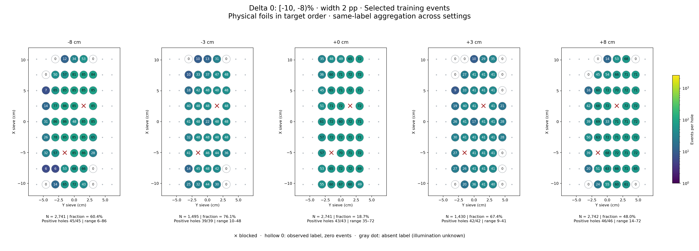
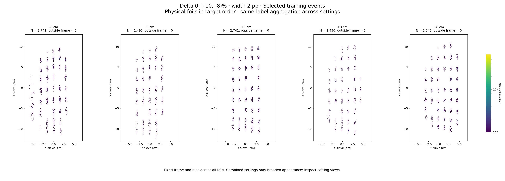

# Delta 0: [-10, -8)%

Width 2 percentage points. Counts per configured slice, without width weighting.

| zfoil | available | q_delta | delta_cap | hole_capacity | capacity | quota | actual_selected | selected_fraction | surplus |
|---|---|---|---|---|---|---|---|---|---|
| -8 | 4538 | 9001 | 13501 | 2794 | 2794 | 2741 | 2741 | 0.604 | 1797 |
| -3 | 1965 | 3433 | 5149 | 1495 | 1495 | 1495 | 1495 | 0.7608 | 470 |
| 0 | 14667 | 2.781e+04 | 41709 | 10338 | 10338 | 2741 | 2741 | 0.1869 | 11926 |
| 3 | 2123 | 3611 | 5416 | 1430 | 1430 | 1430 | 1430 | 0.6736 | 693 |
| 8 | 5712 | 6719 | 10078 | 4001 | 4001 | 2742 | 2742 | 0.48 | 2970 |

- [-8 cm: full comparison and settings](foil_-8_delta0.md)
- [-3 cm: full comparison and settings](foil_-3_delta0.md)
- [+0 cm: full comparison and settings](foil_0_delta0.md)
- [+3 cm: full comparison and settings](foil_3_delta0.md)
- [+8 cm: full comparison and settings](foil_8_delta0.md)
