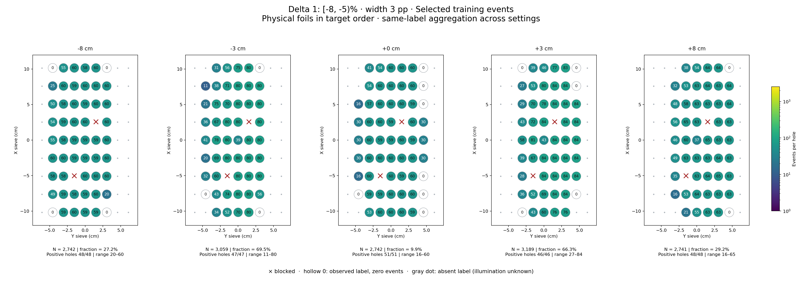
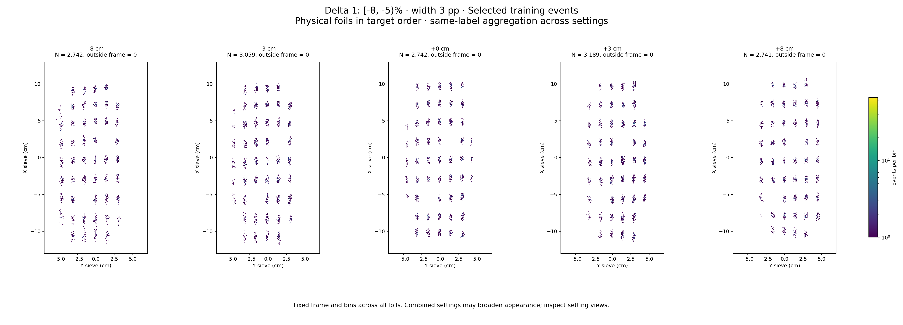

# Delta 1: [-8, -5)%

Width 3 percentage points. Counts per configured slice, without width weighting.

| zfoil | available | q_delta | delta_cap | hole_capacity | capacity | quota | actual_selected | selected_fraction | surplus |
|---|---|---|---|---|---|---|---|---|---|
| -8 | 10089 | 9001 | 13501 | 6679 | 6679 | 2742 | 2742 | 0.2718 | 7347 |
| -3 | 4402 | 3433 | 5149 | 3059 | 3059 | 3059 | 3059 | 0.6949 | 1343 |
| 0 | 27806 | 2.781e+04 | 41709 | 17066 | 17066 | 2742 | 2742 | 0.09861 | 25064 |
| 3 | 4812 | 3611 | 5416 | 3189 | 3189 | 3189 | 3189 | 0.6627 | 1623 |
| 8 | 9371 | 6719 | 10078 | 5650 | 5650 | 2741 | 2741 | 0.2925 | 6630 |

- [-8 cm: full comparison and settings](foil_-8_delta1.md)
- [-3 cm: full comparison and settings](foil_-3_delta1.md)
- [+0 cm: full comparison and settings](foil_0_delta1.md)
- [+3 cm: full comparison and settings](foil_3_delta1.md)
- [+8 cm: full comparison and settings](foil_8_delta1.md)
