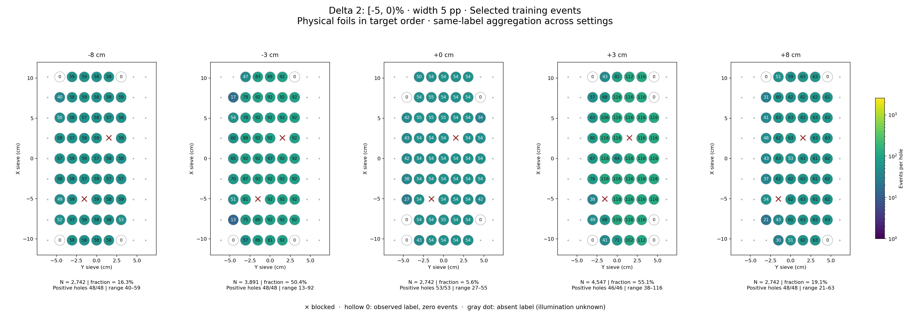
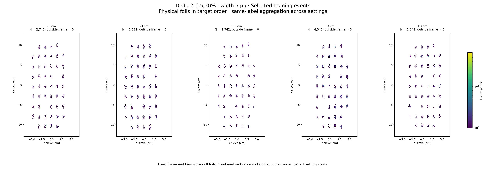

# Delta 2: [-5, 0)%

Width 5 percentage points. Counts per configured slice, without width weighting.

| zfoil | available | q_delta | delta_cap | hole_capacity | capacity | quota | actual_selected | selected_fraction | surplus |
|---|---|---|---|---|---|---|---|---|---|
| -8 | 16793 | 9001 | 13501 | 10769 | 10769 | 2742 | 2742 | 0.1633 | 14051 |
| -3 | 7723 | 3433 | 5149 | 4659 | 4659 | 3891 | 3891 | 0.5038 | 3832 |
| 0 | 48671 | 2.781e+04 | 41709 | 28967 | 28967 | 2742 | 2742 | 0.05634 | 45929 |
| 3 | 8254 | 3611 | 5416 | 4547 | 4547 | 4547 | 4547 | 0.5509 | 3707 |
| 8 | 14367 | 6719 | 10078 | 7442 | 7442 | 2742 | 2742 | 0.1909 | 11625 |

- [-8 cm: full comparison and settings](foil_-8_delta2.md)
- [-3 cm: full comparison and settings](foil_-3_delta2.md)
- [+0 cm: full comparison and settings](foil_0_delta2.md)
- [+3 cm: full comparison and settings](foil_3_delta2.md)
- [+8 cm: full comparison and settings](foil_8_delta2.md)
