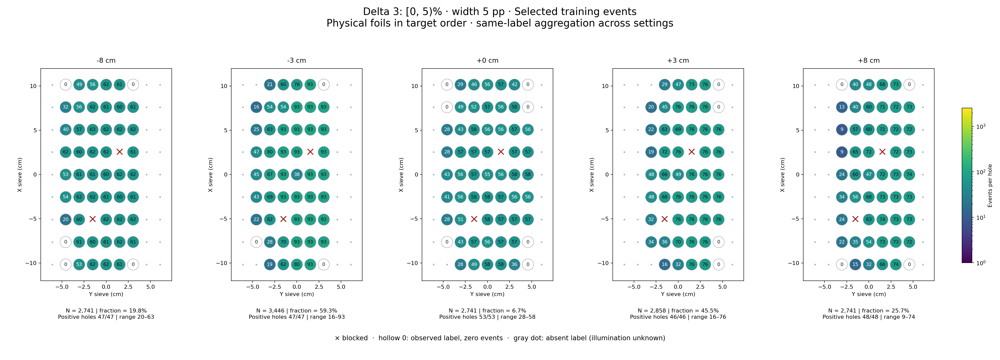
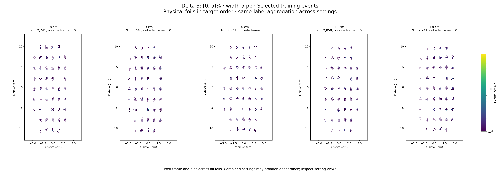

# Delta 3: [0, 5)%

Width 5 percentage points. Counts per configured slice, without width weighting.

| zfoil | available | q_delta | delta_cap | hole_capacity | capacity | quota | actual_selected | selected_fraction | surplus |
|---|---|---|---|---|---|---|---|---|---|
| -8 | 13878 | 9001 | 13501 | 8278 | 8278 | 2741 | 2741 | 0.1975 | 11137 |
| -3 | 5816 | 3433 | 5149 | 3446 | 3446 | 3446 | 3446 | 0.5925 | 2370 |
| 0 | 41049 | 2.781e+04 | 41709 | 23120 | 23120 | 2741 | 2741 | 0.06677 | 38308 |
| 3 | 6288 | 3611 | 5416 | 2858 | 2858 | 2858 | 2858 | 0.4545 | 3430 |
| 8 | 10667 | 6719 | 10078 | 4888 | 4888 | 2741 | 2741 | 0.257 | 7926 |

- [-8 cm: full comparison and settings](foil_-8_delta3.md)
- [-3 cm: full comparison and settings](foil_-3_delta3.md)
- [+0 cm: full comparison and settings](foil_0_delta3.md)
- [+3 cm: full comparison and settings](foil_3_delta3.md)
- [+8 cm: full comparison and settings](foil_8_delta3.md)
