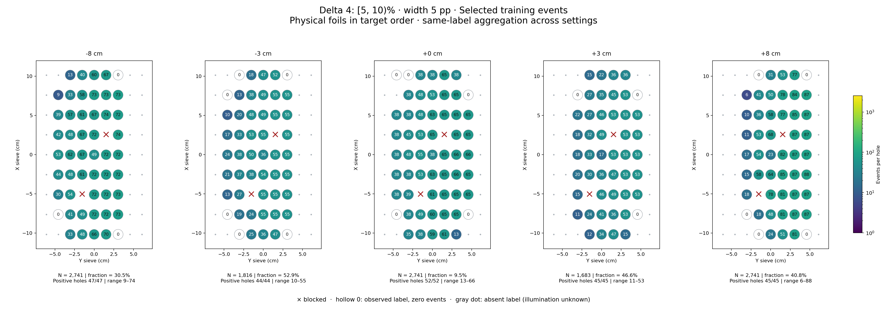
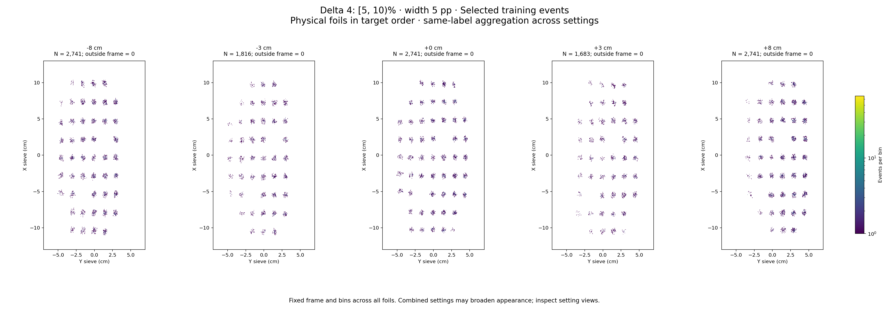

# Delta 4: [5, 10)%

Width 5 percentage points. Counts per configured slice, without width weighting.

| zfoil | available | q_delta | delta_cap | hole_capacity | capacity | quota | actual_selected | selected_fraction | surplus |
|---|---|---|---|---|---|---|---|---|---|
| -8 | 9001 | 9001 | 13501 | 4774 | 4774 | 2741 | 2741 | 0.3045 | 6260 |
| -3 | 3433 | 3433 | 5149 | 1816 | 1816 | 1816 | 1816 | 0.529 | 1617 |
| 0 | 28758 | 2.781e+04 | 41709 | 12697 | 12697 | 2741 | 2741 | 0.09531 | 26017 |
| 3 | 3611 | 3611 | 5416 | 1683 | 1683 | 1683 | 1683 | 0.4661 | 1928 |
| 8 | 6719 | 6719 | 10078 | 2881 | 2881 | 2741 | 2741 | 0.4079 | 3978 |

- [-8 cm: full comparison and settings](foil_-8_delta4.md)
- [-3 cm: full comparison and settings](foil_-3_delta4.md)
- [+0 cm: full comparison and settings](foil_0_delta4.md)
- [+3 cm: full comparison and settings](foil_3_delta4.md)
- [+8 cm: full comparison and settings](foil_8_delta4.md)
