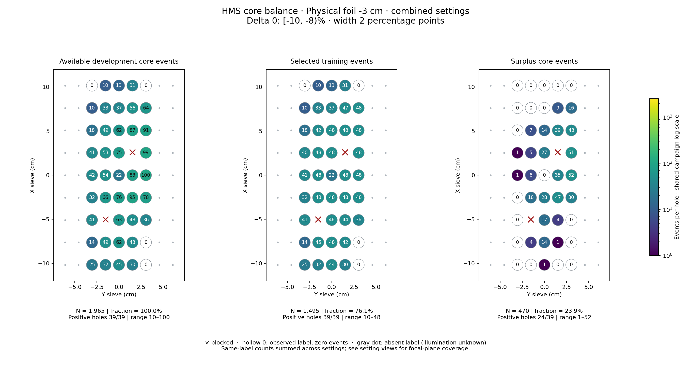
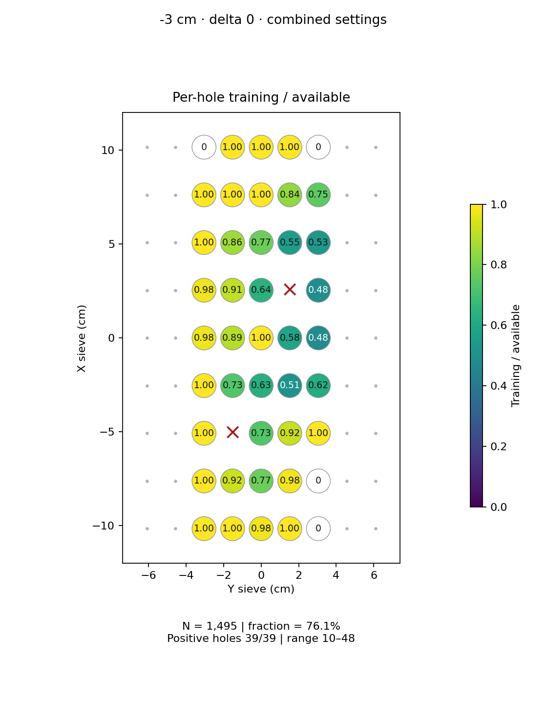
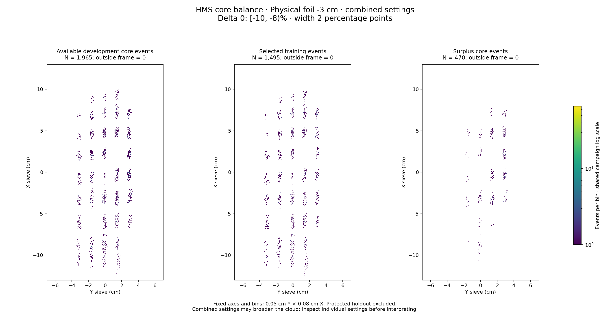

# Physical foil -3 cm · combined settings · delta 0

Interval [-10, -8)%, width 2 percentage points.

[Full-resolution training map](../plots/foil_-3_delta0_training.png) · [Full-resolution training cloud](../plots/foil_-3_delta0_training_cloud.png)

Same-label counts are summed across settings; this does not imply identical focal-plane coverage.

- [rg04_theta15p195_foilpm3, local foil 0](rg04_theta15p195_foilpm3_foil0_delta0.md)
- [rg05_theta12p495_foilpm3, local foil 0](rg05_theta12p495_foilpm3_foil0_delta0.md)

| rungroup | foil | xscol | yscol | available | q_hole | hole_cap | capacity | quota | actual_selected | surplus | qa_low | blocked |
|---|---|---|---|---|---|---|---|---|---|---|---|---|
| rg04_theta15p195_foilpm3 | 0 | 0 | 2 | 8 | 15 | 22 | 8 | 8 | 8 | 0 | True | False |
| rg04_theta15p195_foilpm3 | 0 | 0 | 3 | 16 | 15 | 22 | 16 | 16 | 16 | 0 | False | False |
| rg04_theta15p195_foilpm3 | 0 | 0 | 4 | 18 | 15 | 22 | 18 | 18 | 18 | 0 | False | False |
| rg04_theta15p195_foilpm3 | 0 | 0 | 5 | 13 | 15 | 22 | 13 | 13 | 13 | 0 | False | False |
| rg04_theta15p195_foilpm3 | 0 | 0 | 6 | 0 | 15 | 22 | 0 | 0 | 0 | 0 | False | False |
| rg04_theta15p195_foilpm3 | 0 | 1 | 2 | 0 | 15 | 22 | 0 | 0 | 0 | 0 | False | False |
| rg04_theta15p195_foilpm3 | 0 | 1 | 3 | 19 | 15 | 22 | 19 | 19 | 19 | 0 | False | False |
| rg04_theta15p195_foilpm3 | 0 | 1 | 4 | 24 | 15 | 22 | 22 | 22 | 22 | 2 | False | False |
| rg04_theta15p195_foilpm3 | 0 | 1 | 5 | 23 | 15 | 22 | 22 | 22 | 22 | 1 | False | False |
| rg04_theta15p195_foilpm3 | 0 | 1 | 6 | 0 | 15 | 22 | 0 | 0 | 0 | 0 | False | False |
| rg04_theta15p195_foilpm3 | 0 | 2 | 2 | 15 | 15 | 22 | 15 | 15 | 15 | 0 | False | False |
| rg04_theta15p195_foilpm3 | 0 | 2 | 3 | 0 | 15 | 22 | 0 | 0 | 0 | 0 | False | True |
| rg04_theta15p195_foilpm3 | 0 | 2 | 4 | 20 | 15 | 22 | 20 | 20 | 20 | 0 | False | False |
| rg04_theta15p195_foilpm3 | 0 | 2 | 5 | 18 | 15 | 22 | 18 | 18 | 18 | 0 | False | False |
| rg04_theta15p195_foilpm3 | 0 | 2 | 6 | 17 | 15 | 22 | 17 | 17 | 17 | 0 | False | False |
| rg04_theta15p195_foilpm3 | 0 | 3 | 2 | 15 | 15 | 22 | 15 | 15 | 15 | 0 | False | False |
| rg04_theta15p195_foilpm3 | 0 | 3 | 3 | 34 | 15 | 22 | 22 | 22 | 22 | 12 | False | False |
| rg04_theta15p195_foilpm3 | 0 | 3 | 4 | 34 | 15 | 22 | 22 | 22 | 22 | 12 | False | False |
| rg04_theta15p195_foilpm3 | 0 | 3 | 5 | 31 | 15 | 22 | 22 | 22 | 22 | 9 | False | False |
| rg04_theta15p195_foilpm3 | 0 | 3 | 6 | 36 | 15 | 22 | 22 | 22 | 22 | 14 | False | False |
| rg04_theta15p195_foilpm3 | 0 | 4 | 2 | 15 | 15 | 22 | 15 | 15 | 15 | 0 | False | False |
| rg04_theta15p195_foilpm3 | 0 | 4 | 3 | 22 | 15 | 22 | 22 | 22 | 22 | 0 | False | False |
| rg04_theta15p195_foilpm3 | 0 | 4 | 4 | 9 | 15 | 22 | 9 | 9 | 9 | 0 | True | False |
| rg04_theta15p195_foilpm3 | 0 | 4 | 5 | 38 | 15 | 22 | 22 | 22 | 22 | 16 | False | False |
| rg04_theta15p195_foilpm3 | 0 | 4 | 6 | 45 | 15 | 22 | 22 | 22 | 22 | 23 | False | False |
| rg04_theta15p195_foilpm3 | 0 | 5 | 2 | 23 | 15 | 22 | 22 | 22 | 22 | 1 | False | False |
| rg04_theta15p195_foilpm3 | 0 | 5 | 3 | 22 | 15 | 22 | 22 | 22 | 22 | 0 | False | False |
| rg04_theta15p195_foilpm3 | 0 | 5 | 4 | 36 | 15 | 22 | 22 | 22 | 22 | 14 | False | False |
| rg04_theta15p195_foilpm3 | 0 | 5 | 5 | 0 | 15 | 22 | 0 | 0 | 0 | 0 | False | True |
| rg04_theta15p195_foilpm3 | 0 | 5 | 6 | 35 | 15 | 22 | 22 | 22 | 22 | 13 | False | False |
| rg04_theta15p195_foilpm3 | 0 | 6 | 2 | 7 | 15 | 22 | 7 | 7 | 7 | 0 | True | False |
| rg04_theta15p195_foilpm3 | 0 | 6 | 3 | 16 | 15 | 22 | 16 | 16 | 16 | 0 | False | False |
| rg04_theta15p195_foilpm3 | 0 | 6 | 4 | 23 | 15 | 22 | 22 | 22 | 22 | 1 | False | False |
| rg04_theta15p195_foilpm3 | 0 | 6 | 5 | 41 | 15 | 22 | 22 | 22 | 22 | 19 | False | False |
| rg04_theta15p195_foilpm3 | 0 | 6 | 6 | 41 | 15 | 22 | 22 | 22 | 22 | 19 | False | False |
| rg04_theta15p195_foilpm3 | 0 | 7 | 2 | 0 | 15 | 22 | 0 | 0 | 0 | 0 | False | False |
| rg04_theta15p195_foilpm3 | 0 | 7 | 3 | 13 | 15 | 22 | 13 | 13 | 13 | 0 | False | False |
| rg04_theta15p195_foilpm3 | 0 | 7 | 4 | 14 | 15 | 22 | 14 | 14 | 14 | 0 | False | False |
| rg04_theta15p195_foilpm3 | 0 | 7 | 5 | 31 | 15 | 22 | 22 | 22 | 22 | 9 | False | False |
| rg04_theta15p195_foilpm3 | 0 | 7 | 6 | 31 | 15 | 22 | 22 | 22 | 22 | 9 | False | False |
| rg04_theta15p195_foilpm3 | 0 | 8 | 2 | 0 | 15 | 22 | 0 | 0 | 0 | 0 | False | False |
| rg04_theta15p195_foilpm3 | 0 | 8 | 3 | 0 | 15 | 22 | 0 | 0 | 0 | 0 | False | False |
| rg04_theta15p195_foilpm3 | 0 | 8 | 4 | 0 | 15 | 22 | 0 | 0 | 0 | 0 | False | False |
| rg04_theta15p195_foilpm3 | 0 | 8 | 5 | 11 | 15 | 22 | 11 | 11 | 11 | 0 | False | False |
| rg05_theta12p495_foilpm3 | 0 | 0 | 2 | 17 | 17.5 | 26 | 17 | 17 | 17 | 0 | False | False |
| rg05_theta12p495_foilpm3 | 0 | 0 | 3 | 16 | 17.5 | 26 | 16 | 16 | 16 | 0 | False | False |
| rg05_theta12p495_foilpm3 | 0 | 0 | 4 | 27 | 17.5 | 26 | 26 | 26 | 26 | 1 | False | False |
| rg05_theta12p495_foilpm3 | 0 | 0 | 5 | 17 | 17.5 | 26 | 17 | 17 | 17 | 0 | False | False |
| rg05_theta12p495_foilpm3 | 0 | 0 | 6 | 0 | 17.5 | 26 | 0 | 0 | 0 | 0 | False | False |
| rg05_theta12p495_foilpm3 | 0 | 1 | 2 | 14 | 17.5 | 26 | 14 | 14 | 14 | 0 | False | False |
| rg05_theta12p495_foilpm3 | 0 | 1 | 3 | 30 | 17.5 | 26 | 26 | 26 | 26 | 4 | False | False |
| rg05_theta12p495_foilpm3 | 0 | 1 | 4 | 38 | 17.5 | 26 | 26 | 26 | 26 | 12 | False | False |
| rg05_theta12p495_foilpm3 | 0 | 1 | 5 | 20 | 17.5 | 26 | 20 | 20 | 20 | 0 | False | False |
| rg05_theta12p495_foilpm3 | 0 | 1 | 6 | 0 | 17.5 | 26 | 0 | 0 | 0 | 0 | False | False |
| rg05_theta12p495_foilpm3 | 0 | 2 | 2 | 26 | 17.5 | 26 | 26 | 26 | 26 | 0 | False | False |
| rg05_theta12p495_foilpm3 | 0 | 2 | 3 | 0 | 17.5 | 26 | 0 | 0 | 0 | 0 | False | True |
| rg05_theta12p495_foilpm3 | 0 | 2 | 4 | 43 | 17.5 | 26 | 26 | 26 | 26 | 17 | False | False |
| rg05_theta12p495_foilpm3 | 0 | 2 | 5 | 30 | 17.5 | 26 | 26 | 26 | 26 | 4 | False | False |
| rg05_theta12p495_foilpm3 | 0 | 2 | 6 | 19 | 17.5 | 26 | 19 | 19 | 19 | 0 | False | False |
| rg05_theta12p495_foilpm3 | 0 | 3 | 2 | 17 | 17.5 | 26 | 17 | 17 | 17 | 0 | False | False |
| rg05_theta12p495_foilpm3 | 0 | 3 | 3 | 32 | 17.5 | 26 | 26 | 26 | 26 | 6 | False | False |
| rg05_theta12p495_foilpm3 | 0 | 3 | 4 | 42 | 17.5 | 26 | 26 | 26 | 26 | 16 | False | False |
| rg05_theta12p495_foilpm3 | 0 | 3 | 5 | 64 | 17.5 | 26 | 26 | 26 | 26 | 38 | False | False |
| rg05_theta12p495_foilpm3 | 0 | 3 | 6 | 42 | 17.5 | 26 | 26 | 26 | 26 | 16 | False | False |
| rg05_theta12p495_foilpm3 | 0 | 4 | 2 | 27 | 17.5 | 26 | 26 | 26 | 26 | 1 | False | False |
| rg05_theta12p495_foilpm3 | 0 | 4 | 3 | 32 | 17.5 | 26 | 26 | 26 | 26 | 6 | False | False |
| rg05_theta12p495_foilpm3 | 0 | 4 | 4 | 13 | 17.5 | 26 | 13 | 13 | 13 | 0 | False | False |
| rg05_theta12p495_foilpm3 | 0 | 4 | 5 | 45 | 17.5 | 26 | 26 | 26 | 26 | 19 | False | False |
| rg05_theta12p495_foilpm3 | 0 | 4 | 6 | 55 | 17.5 | 26 | 26 | 26 | 26 | 29 | False | False |
| rg05_theta12p495_foilpm3 | 0 | 5 | 2 | 18 | 17.5 | 26 | 18 | 18 | 18 | 0 | False | False |
| rg05_theta12p495_foilpm3 | 0 | 5 | 3 | 31 | 17.5 | 26 | 26 | 26 | 26 | 5 | False | False |
| rg05_theta12p495_foilpm3 | 0 | 5 | 4 | 39 | 17.5 | 26 | 26 | 26 | 26 | 13 | False | False |
| rg05_theta12p495_foilpm3 | 0 | 5 | 5 | 0 | 17.5 | 26 | 0 | 0 | 0 | 0 | False | True |
| rg05_theta12p495_foilpm3 | 0 | 5 | 6 | 64 | 17.5 | 26 | 26 | 26 | 26 | 38 | False | False |
| rg05_theta12p495_foilpm3 | 0 | 6 | 2 | 11 | 17.5 | 26 | 11 | 11 | 11 | 0 | False | False |
| rg05_theta12p495_foilpm3 | 0 | 6 | 3 | 33 | 17.5 | 26 | 26 | 26 | 26 | 7 | False | False |
| rg05_theta12p495_foilpm3 | 0 | 6 | 4 | 39 | 17.5 | 26 | 26 | 26 | 26 | 13 | False | False |
| rg05_theta12p495_foilpm3 | 0 | 6 | 5 | 46 | 17.5 | 26 | 26 | 26 | 26 | 20 | False | False |
| rg05_theta12p495_foilpm3 | 0 | 6 | 6 | 50 | 17.5 | 26 | 26 | 26 | 26 | 24 | False | False |
| rg05_theta12p495_foilpm3 | 0 | 7 | 2 | 10 | 17.5 | 26 | 10 | 10 | 10 | 0 | False | False |
| rg05_theta12p495_foilpm3 | 0 | 7 | 3 | 20 | 17.5 | 26 | 20 | 20 | 20 | 0 | False | False |
| rg05_theta12p495_foilpm3 | 0 | 7 | 4 | 23 | 17.5 | 26 | 23 | 23 | 23 | 0 | False | False |
| rg05_theta12p495_foilpm3 | 0 | 7 | 5 | 25 | 17.5 | 26 | 25 | 25 | 25 | 0 | False | False |
| rg05_theta12p495_foilpm3 | 0 | 7 | 6 | 33 | 17.5 | 26 | 26 | 26 | 26 | 7 | False | False |
| rg05_theta12p495_foilpm3 | 0 | 8 | 2 | 0 | 17.5 | 26 | 0 | 0 | 0 | 0 | False | False |
| rg05_theta12p495_foilpm3 | 0 | 8 | 3 | 10 | 17.5 | 26 | 10 | 10 | 10 | 0 | False | False |
| rg05_theta12p495_foilpm3 | 0 | 8 | 4 | 13 | 17.5 | 26 | 13 | 13 | 13 | 0 | False | False |
| rg05_theta12p495_foilpm3 | 0 | 8 | 5 | 20 | 17.5 | 26 | 20 | 20 | 20 | 0 | False | False |
| rg05_theta12p495_foilpm3 | 0 | 8 | 6 | 0 | 17.5 | 26 | 0 | 0 | 0 | 0 | False | False |
