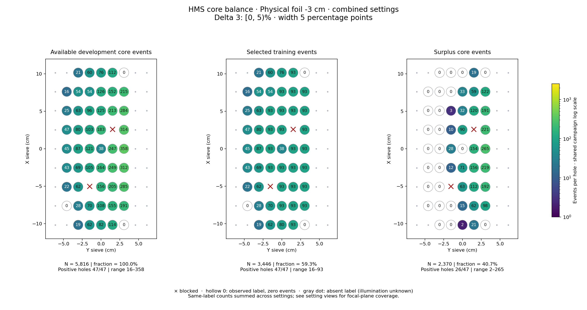
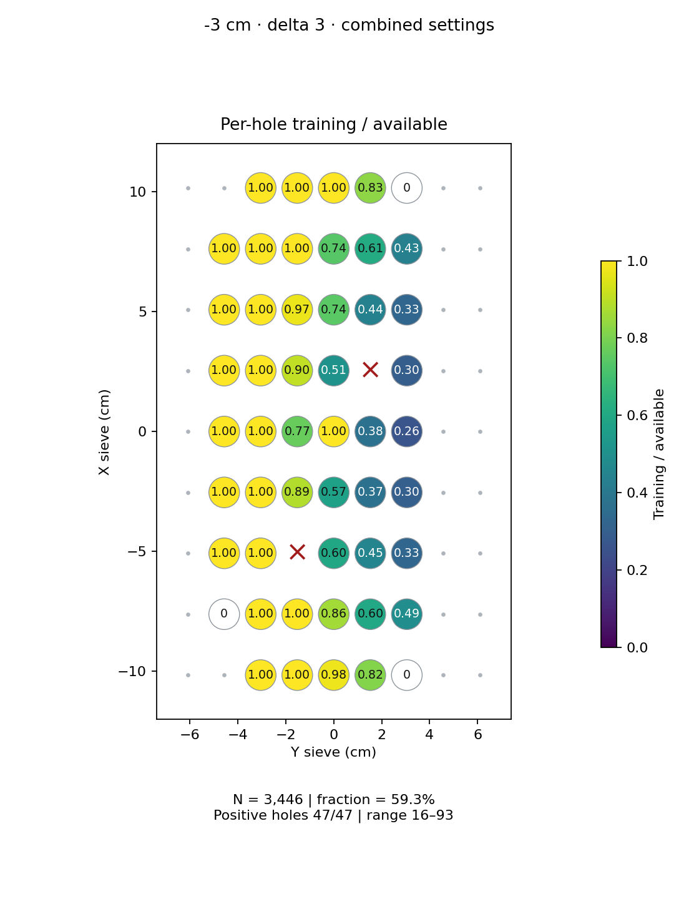
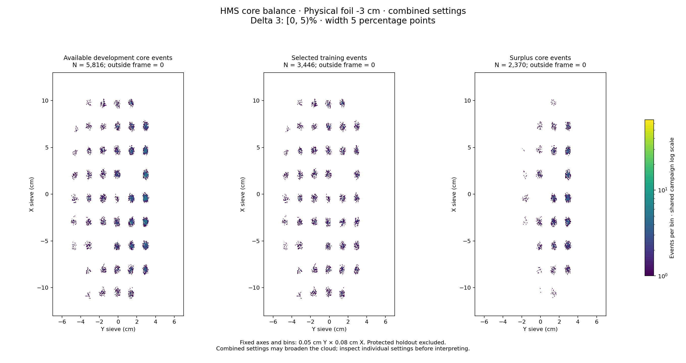

# Physical foil -3 cm · combined settings · delta 3

Interval [0, 5)%, width 5 percentage points.

[Full-resolution training map](../plots/foil_-3_delta3_training.png) · [Full-resolution training cloud](../plots/foil_-3_delta3_training_cloud.png)

Same-label counts are summed across settings; this does not imply identical focal-plane coverage.

- [rg04_theta15p195_foilpm3, local foil 0](rg04_theta15p195_foilpm3_foil0_delta3.md)
- [rg05_theta12p495_foilpm3, local foil 0](rg05_theta12p495_foilpm3_foil0_delta3.md)

| rungroup | foil | xscol | yscol | available | q_hole | hole_cap | capacity | quota | actual_selected | surplus | qa_low | blocked |
|---|---|---|---|---|---|---|---|---|---|---|---|---|
| rg04_theta15p195_foilpm3 | 0 | 0 | 2 | 0 | 16 | 24 | 0 | 0 | 0 | 0 | False | False |
| rg04_theta15p195_foilpm3 | 0 | 0 | 3 | 12 | 16 | 24 | 12 | 12 | 12 | 0 | False | False |
| rg04_theta15p195_foilpm3 | 0 | 0 | 4 | 26 | 16 | 24 | 24 | 24 | 24 | 2 | False | False |
| rg04_theta15p195_foilpm3 | 0 | 0 | 5 | 37 | 16 | 24 | 24 | 24 | 24 | 13 | False | False |
| rg04_theta15p195_foilpm3 | 0 | 0 | 6 | 0 | 16 | 24 | 0 | 0 | 0 | 0 | False | False |
| rg04_theta15p195_foilpm3 | 0 | 1 | 1 | 0 | 16 | 24 | 0 | 0 | 0 | 0 | False | False |
| rg04_theta15p195_foilpm3 | 0 | 1 | 2 | 0 | 16 | 24 | 0 | 0 | 0 | 0 | False | False |
| rg04_theta15p195_foilpm3 | 0 | 1 | 3 | 12 | 16 | 24 | 12 | 12 | 12 | 0 | False | False |
| rg04_theta15p195_foilpm3 | 0 | 1 | 4 | 24 | 16 | 24 | 24 | 24 | 24 | 0 | False | False |
| rg04_theta15p195_foilpm3 | 0 | 1 | 5 | 43 | 16 | 24 | 24 | 24 | 24 | 19 | False | False |
| rg04_theta15p195_foilpm3 | 0 | 1 | 6 | 61 | 16 | 24 | 24 | 24 | 24 | 37 | False | False |
| rg04_theta15p195_foilpm3 | 0 | 2 | 1 | 0 | 16 | 24 | 0 | 0 | 0 | 0 | False | False |
| rg04_theta15p195_foilpm3 | 0 | 2 | 2 | 16 | 16 | 24 | 16 | 16 | 16 | 0 | False | False |
| rg04_theta15p195_foilpm3 | 0 | 2 | 3 | 0 | 16 | 24 | 0 | 0 | 0 | 0 | False | True |
| rg04_theta15p195_foilpm3 | 0 | 2 | 4 | 37 | 16 | 24 | 24 | 24 | 24 | 13 | False | False |
| rg04_theta15p195_foilpm3 | 0 | 2 | 5 | 65 | 16 | 24 | 24 | 24 | 24 | 41 | False | False |
| rg04_theta15p195_foilpm3 | 0 | 2 | 6 | 86 | 16 | 24 | 24 | 24 | 24 | 62 | False | False |
| rg04_theta15p195_foilpm3 | 0 | 3 | 1 | 9 | 16 | 24 | 9 | 9 | 9 | 0 | True | False |
| rg04_theta15p195_foilpm3 | 0 | 3 | 2 | 16 | 16 | 24 | 16 | 16 | 16 | 0 | False | False |
| rg04_theta15p195_foilpm3 | 0 | 3 | 3 | 31 | 16 | 24 | 24 | 24 | 24 | 7 | False | False |
| rg04_theta15p195_foilpm3 | 0 | 3 | 4 | 47 | 16 | 24 | 24 | 24 | 24 | 23 | False | False |
| rg04_theta15p195_foilpm3 | 0 | 3 | 5 | 90 | 16 | 24 | 24 | 24 | 24 | 66 | False | False |
| rg04_theta15p195_foilpm3 | 0 | 3 | 6 | 120 | 16 | 24 | 24 | 24 | 24 | 96 | False | False |
| rg04_theta15p195_foilpm3 | 0 | 4 | 1 | 12 | 16 | 24 | 12 | 12 | 12 | 0 | False | False |
| rg04_theta15p195_foilpm3 | 0 | 4 | 2 | 21 | 16 | 24 | 21 | 21 | 21 | 0 | False | False |
| rg04_theta15p195_foilpm3 | 0 | 4 | 3 | 26 | 16 | 24 | 24 | 24 | 24 | 2 | False | False |
| rg04_theta15p195_foilpm3 | 0 | 4 | 4 | 9 | 16 | 24 | 9 | 9 | 9 | 0 | True | False |
| rg04_theta15p195_foilpm3 | 0 | 4 | 5 | 60 | 16 | 24 | 24 | 24 | 24 | 36 | False | False |
| rg04_theta15p195_foilpm3 | 0 | 4 | 6 | 109 | 16 | 24 | 24 | 24 | 24 | 85 | False | False |
| rg04_theta15p195_foilpm3 | 0 | 5 | 1 | 10 | 16 | 24 | 10 | 10 | 10 | 0 | False | False |
| rg04_theta15p195_foilpm3 | 0 | 5 | 2 | 19 | 16 | 24 | 19 | 19 | 19 | 0 | False | False |
| rg04_theta15p195_foilpm3 | 0 | 5 | 3 | 27 | 16 | 24 | 24 | 24 | 24 | 3 | False | False |
| rg04_theta15p195_foilpm3 | 0 | 5 | 4 | 42 | 16 | 24 | 24 | 24 | 24 | 18 | False | False |
| rg04_theta15p195_foilpm3 | 0 | 5 | 5 | 0 | 16 | 24 | 0 | 0 | 0 | 0 | False | True |
| rg04_theta15p195_foilpm3 | 0 | 5 | 6 | 99 | 16 | 24 | 24 | 24 | 24 | 75 | False | False |
| rg04_theta15p195_foilpm3 | 0 | 6 | 1 | 0 | 16 | 24 | 0 | 0 | 0 | 0 | False | False |
| rg04_theta15p195_foilpm3 | 0 | 6 | 2 | 8 | 16 | 24 | 8 | 8 | 8 | 0 | True | False |
| rg04_theta15p195_foilpm3 | 0 | 6 | 3 | 26 | 16 | 24 | 24 | 24 | 24 | 2 | False | False |
| rg04_theta15p195_foilpm3 | 0 | 6 | 4 | 39 | 16 | 24 | 24 | 24 | 24 | 15 | False | False |
| rg04_theta15p195_foilpm3 | 0 | 6 | 5 | 61 | 16 | 24 | 24 | 24 | 24 | 37 | False | False |
| rg04_theta15p195_foilpm3 | 0 | 6 | 6 | 91 | 16 | 24 | 24 | 24 | 24 | 67 | False | False |
| rg04_theta15p195_foilpm3 | 0 | 7 | 1 | 0 | 16 | 24 | 0 | 0 | 0 | 0 | False | False |
| rg04_theta15p195_foilpm3 | 0 | 7 | 2 | 8 | 16 | 24 | 8 | 8 | 8 | 0 | True | False |
| rg04_theta15p195_foilpm3 | 0 | 7 | 3 | 12 | 16 | 24 | 12 | 12 | 12 | 0 | False | False |
| rg04_theta15p195_foilpm3 | 0 | 7 | 4 | 34 | 16 | 24 | 24 | 24 | 24 | 10 | False | False |
| rg04_theta15p195_foilpm3 | 0 | 7 | 5 | 43 | 16 | 24 | 24 | 24 | 24 | 19 | False | False |
| rg04_theta15p195_foilpm3 | 0 | 7 | 6 | 63 | 16 | 24 | 24 | 24 | 24 | 39 | False | False |
| rg04_theta15p195_foilpm3 | 0 | 8 | 2 | 0 | 16 | 24 | 0 | 0 | 0 | 0 | False | False |
| rg04_theta15p195_foilpm3 | 0 | 8 | 3 | 14 | 16 | 24 | 14 | 14 | 14 | 0 | False | False |
| rg04_theta15p195_foilpm3 | 0 | 8 | 4 | 21 | 16 | 24 | 21 | 21 | 21 | 0 | False | False |
| rg04_theta15p195_foilpm3 | 0 | 8 | 5 | 36 | 16 | 24 | 24 | 24 | 24 | 12 | False | False |
| rg05_theta12p495_foilpm3 | 0 | 0 | 2 | 19 | 46 | 69 | 19 | 19 | 19 | 0 | False | False |
| rg05_theta12p495_foilpm3 | 0 | 0 | 3 | 50 | 46 | 69 | 50 | 50 | 50 | 0 | False | False |
| rg05_theta12p495_foilpm3 | 0 | 0 | 4 | 56 | 46 | 69 | 56 | 56 | 56 | 0 | False | False |
| rg05_theta12p495_foilpm3 | 0 | 0 | 5 | 77 | 46 | 69 | 69 | 69 | 69 | 8 | False | False |
| rg05_theta12p495_foilpm3 | 0 | 0 | 6 | 0 | 46 | 69 | 0 | 0 | 0 | 0 | False | False |
| rg05_theta12p495_foilpm3 | 0 | 1 | 1 | 0 | 46 | 69 | 0 | 0 | 0 | 0 | False | False |
| rg05_theta12p495_foilpm3 | 0 | 1 | 2 | 28 | 46 | 69 | 28 | 28 | 28 | 0 | False | False |
| rg05_theta12p495_foilpm3 | 0 | 1 | 3 | 58 | 46 | 69 | 58 | 58 | 58 | 0 | False | False |
| rg05_theta12p495_foilpm3 | 0 | 1 | 4 | 84 | 46 | 69 | 69 | 69 | 69 | 15 | False | False |
| rg05_theta12p495_foilpm3 | 0 | 1 | 5 | 112 | 46 | 69 | 69 | 69 | 69 | 43 | False | False |
| rg05_theta12p495_foilpm3 | 0 | 1 | 6 | 130 | 46 | 69 | 69 | 69 | 69 | 61 | False | False |
| rg05_theta12p495_foilpm3 | 0 | 2 | 1 | 22 | 46 | 69 | 22 | 22 | 22 | 0 | False | False |
| rg05_theta12p495_foilpm3 | 0 | 2 | 2 | 46 | 46 | 69 | 46 | 46 | 46 | 0 | False | False |
| rg05_theta12p495_foilpm3 | 0 | 2 | 3 | 0 | 46 | 69 | 0 | 0 | 0 | 0 | False | True |
| rg05_theta12p495_foilpm3 | 0 | 2 | 4 | 119 | 46 | 69 | 69 | 69 | 69 | 50 | False | False |
| rg05_theta12p495_foilpm3 | 0 | 2 | 5 | 140 | 46 | 69 | 69 | 69 | 69 | 71 | False | False |
| rg05_theta12p495_foilpm3 | 0 | 2 | 6 | 199 | 46 | 69 | 69 | 69 | 69 | 130 | False | False |
| rg05_theta12p495_foilpm3 | 0 | 3 | 1 | 34 | 46 | 69 | 34 | 34 | 34 | 0 | False | False |
| rg05_theta12p495_foilpm3 | 0 | 3 | 2 | 53 | 46 | 69 | 53 | 53 | 53 | 0 | False | False |
| rg05_theta12p495_foilpm3 | 0 | 3 | 3 | 74 | 46 | 69 | 69 | 69 | 69 | 5 | False | False |
| rg05_theta12p495_foilpm3 | 0 | 3 | 4 | 117 | 46 | 69 | 69 | 69 | 69 | 48 | False | False |
| rg05_theta12p495_foilpm3 | 0 | 3 | 5 | 159 | 46 | 69 | 69 | 69 | 69 | 90 | False | False |
| rg05_theta12p495_foilpm3 | 0 | 3 | 6 | 192 | 46 | 69 | 69 | 69 | 69 | 123 | False | False |
| rg05_theta12p495_foilpm3 | 0 | 4 | 1 | 33 | 46 | 69 | 33 | 33 | 33 | 0 | False | False |
| rg05_theta12p495_foilpm3 | 0 | 4 | 2 | 66 | 46 | 69 | 66 | 66 | 66 | 0 | False | False |
| rg05_theta12p495_foilpm3 | 0 | 4 | 3 | 95 | 46 | 69 | 69 | 69 | 69 | 26 | False | False |
| rg05_theta12p495_foilpm3 | 0 | 4 | 4 | 29 | 46 | 69 | 29 | 29 | 29 | 0 | False | False |
| rg05_theta12p495_foilpm3 | 0 | 4 | 5 | 187 | 46 | 69 | 69 | 69 | 69 | 118 | False | False |
| rg05_theta12p495_foilpm3 | 0 | 4 | 6 | 249 | 46 | 69 | 69 | 69 | 69 | 180 | False | False |
| rg05_theta12p495_foilpm3 | 0 | 5 | 1 | 37 | 46 | 69 | 37 | 37 | 37 | 0 | False | False |
| rg05_theta12p495_foilpm3 | 0 | 5 | 2 | 61 | 46 | 69 | 61 | 61 | 61 | 0 | False | False |
| rg05_theta12p495_foilpm3 | 0 | 5 | 3 | 76 | 46 | 69 | 69 | 69 | 69 | 7 | False | False |
| rg05_theta12p495_foilpm3 | 0 | 5 | 4 | 141 | 46 | 69 | 69 | 69 | 69 | 72 | False | False |
| rg05_theta12p495_foilpm3 | 0 | 5 | 5 | 0 | 46 | 69 | 0 | 0 | 0 | 0 | False | True |
| rg05_theta12p495_foilpm3 | 0 | 5 | 6 | 215 | 46 | 69 | 69 | 69 | 69 | 146 | False | False |
| rg05_theta12p495_foilpm3 | 0 | 6 | 1 | 25 | 46 | 69 | 25 | 25 | 25 | 0 | False | False |
| rg05_theta12p495_foilpm3 | 0 | 6 | 2 | 55 | 46 | 69 | 55 | 55 | 55 | 0 | False | False |
| rg05_theta12p495_foilpm3 | 0 | 6 | 3 | 70 | 46 | 69 | 69 | 69 | 69 | 1 | False | False |
| rg05_theta12p495_foilpm3 | 0 | 6 | 4 | 86 | 46 | 69 | 69 | 69 | 69 | 17 | False | False |
| rg05_theta12p495_foilpm3 | 0 | 6 | 5 | 152 | 46 | 69 | 69 | 69 | 69 | 83 | False | False |
| rg05_theta12p495_foilpm3 | 0 | 6 | 6 | 193 | 46 | 69 | 69 | 69 | 69 | 124 | False | False |
| rg05_theta12p495_foilpm3 | 0 | 7 | 1 | 16 | 46 | 69 | 16 | 16 | 16 | 0 | False | False |
| rg05_theta12p495_foilpm3 | 0 | 7 | 2 | 46 | 46 | 69 | 46 | 46 | 46 | 0 | False | False |
| rg05_theta12p495_foilpm3 | 0 | 7 | 3 | 42 | 46 | 69 | 42 | 42 | 42 | 0 | False | False |
| rg05_theta12p495_foilpm3 | 0 | 7 | 4 | 92 | 46 | 69 | 69 | 69 | 69 | 23 | False | False |
| rg05_theta12p495_foilpm3 | 0 | 7 | 5 | 109 | 46 | 69 | 69 | 69 | 69 | 40 | False | False |
| rg05_theta12p495_foilpm3 | 0 | 7 | 6 | 152 | 46 | 69 | 69 | 69 | 69 | 83 | False | False |
| rg05_theta12p495_foilpm3 | 0 | 8 | 2 | 21 | 46 | 69 | 21 | 21 | 21 | 0 | False | False |
| rg05_theta12p495_foilpm3 | 0 | 8 | 3 | 46 | 46 | 69 | 46 | 46 | 46 | 0 | False | False |
| rg05_theta12p495_foilpm3 | 0 | 8 | 4 | 55 | 46 | 69 | 55 | 55 | 55 | 0 | False | False |
| rg05_theta12p495_foilpm3 | 0 | 8 | 5 | 76 | 46 | 69 | 69 | 69 | 69 | 7 | False | False |
| rg05_theta12p495_foilpm3 | 0 | 8 | 6 | 0 | 46 | 69 | 0 | 0 | 0 | 0 | False | False |
