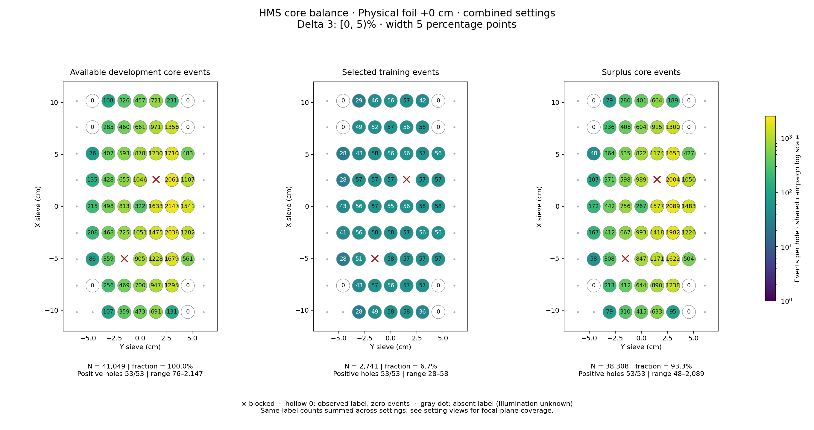
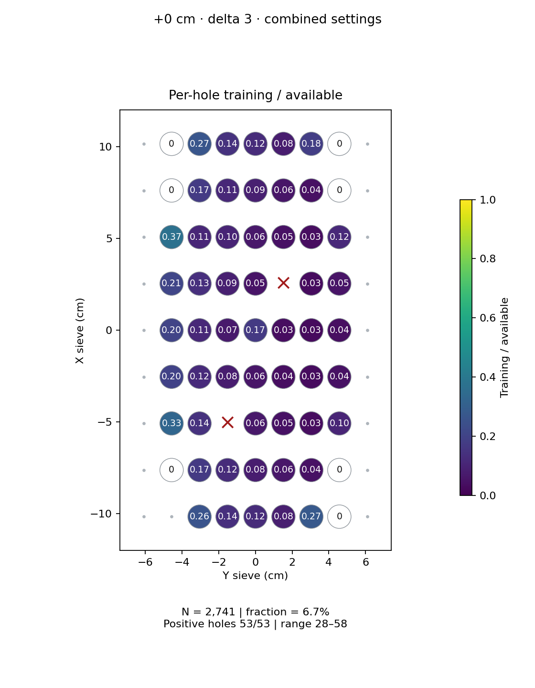
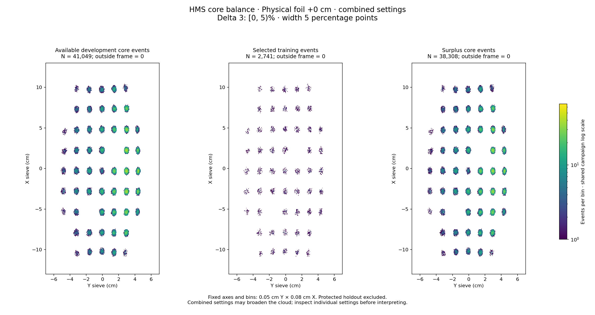

# Physical foil +0 cm · combined settings · delta 3

Interval [0, 5)%, width 5 percentage points.

[Full-resolution training map](../plots/foil_0_delta3_training.png) · [Full-resolution training cloud](../plots/foil_0_delta3_training_cloud.png)

Same-label counts are summed across settings; this does not imply identical focal-plane coverage.

- [rg01_theta12p490_foil0, local foil 0](rg01_theta12p490_foil0_foil0_delta3.md)
- [rg02_theta15p195_foil0, local foil 0](rg02_theta15p195_foil0_foil0_delta3.md)

| rungroup | foil | xscol | yscol | available | q_hole | hole_cap | capacity | quota | actual_selected | surplus | qa_low | blocked |
|---|---|---|---|---|---|---|---|---|---|---|---|---|
| rg01_theta12p490_foil0 | 0 | 0 | 2 | 107 | 336 | 504 | 107 | 28 | 28 | 79 | False | False |
| rg01_theta12p490_foil0 | 0 | 0 | 3 | 338 | 336 | 504 | 338 | 28 | 28 | 310 | False | False |
| rg01_theta12p490_foil0 | 0 | 0 | 4 | 440 | 336 | 504 | 440 | 29 | 29 | 411 | False | False |
| rg01_theta12p490_foil0 | 0 | 0 | 5 | 630 | 336 | 504 | 504 | 29 | 29 | 601 | False | False |
| rg01_theta12p490_foil0 | 0 | 0 | 6 | 124 | 336 | 504 | 124 | 29 | 29 | 95 | False | False |
| rg01_theta12p490_foil0 | 0 | 0 | 7 | 0 | 336 | 504 | 0 | 0 | 0 | 0 | False | False |
| rg01_theta12p490_foil0 | 0 | 1 | 1 | 0 | 336 | 504 | 0 | 0 | 0 | 0 | False | False |
| rg01_theta12p490_foil0 | 0 | 1 | 2 | 242 | 336 | 504 | 242 | 29 | 29 | 213 | False | False |
| rg01_theta12p490_foil0 | 0 | 1 | 3 | 441 | 336 | 504 | 441 | 29 | 29 | 412 | False | False |
| rg01_theta12p490_foil0 | 0 | 1 | 4 | 646 | 336 | 504 | 504 | 28 | 28 | 618 | False | False |
| rg01_theta12p490_foil0 | 0 | 1 | 5 | 877 | 336 | 504 | 504 | 28 | 28 | 849 | False | False |
| rg01_theta12p490_foil0 | 0 | 1 | 6 | 1166 | 336 | 504 | 504 | 29 | 29 | 1137 | False | False |
| rg01_theta12p490_foil0 | 0 | 1 | 7 | 0 | 336 | 504 | 0 | 0 | 0 | 0 | False | False |
| rg01_theta12p490_foil0 | 0 | 2 | 1 | 86 | 336 | 504 | 86 | 28 | 28 | 58 | False | False |
| rg01_theta12p490_foil0 | 0 | 2 | 2 | 336 | 336 | 504 | 336 | 28 | 28 | 308 | False | False |
| rg01_theta12p490_foil0 | 0 | 2 | 3 | 0 | 336 | 504 | 0 | 0 | 0 | 0 | False | True |
| rg01_theta12p490_foil0 | 0 | 2 | 4 | 841 | 336 | 504 | 504 | 29 | 29 | 812 | False | False |
| rg01_theta12p490_foil0 | 0 | 2 | 5 | 1122 | 336 | 504 | 504 | 29 | 29 | 1093 | False | False |
| rg01_theta12p490_foil0 | 0 | 2 | 6 | 1507 | 336 | 504 | 504 | 29 | 29 | 1478 | False | False |
| rg01_theta12p490_foil0 | 0 | 2 | 7 | 508 | 336 | 504 | 504 | 28 | 28 | 480 | False | False |
| rg01_theta12p490_foil0 | 0 | 3 | 1 | 196 | 336 | 504 | 196 | 29 | 29 | 167 | False | False |
| rg01_theta12p490_foil0 | 0 | 3 | 2 | 435 | 336 | 504 | 435 | 28 | 28 | 407 | False | False |
| rg01_theta12p490_foil0 | 0 | 3 | 3 | 666 | 336 | 504 | 504 | 29 | 29 | 637 | False | False |
| rg01_theta12p490_foil0 | 0 | 3 | 4 | 975 | 336 | 504 | 504 | 29 | 29 | 946 | False | False |
| rg01_theta12p490_foil0 | 0 | 3 | 5 | 1352 | 336 | 504 | 504 | 28 | 28 | 1324 | False | False |
| rg01_theta12p490_foil0 | 0 | 3 | 6 | 1855 | 336 | 504 | 504 | 28 | 28 | 1827 | False | False |
| rg01_theta12p490_foil0 | 0 | 3 | 7 | 1163 | 336 | 504 | 504 | 28 | 28 | 1135 | False | False |
| rg01_theta12p490_foil0 | 0 | 4 | 1 | 201 | 336 | 504 | 201 | 29 | 29 | 172 | False | False |
| rg01_theta12p490_foil0 | 0 | 4 | 2 | 471 | 336 | 504 | 471 | 29 | 29 | 442 | False | False |
| rg01_theta12p490_foil0 | 0 | 4 | 3 | 751 | 336 | 504 | 504 | 29 | 29 | 722 | False | False |
| rg01_theta12p490_foil0 | 0 | 4 | 4 | 295 | 336 | 504 | 295 | 28 | 28 | 267 | False | False |
| rg01_theta12p490_foil0 | 0 | 4 | 5 | 1492 | 336 | 504 | 504 | 28 | 28 | 1464 | False | False |
| rg01_theta12p490_foil0 | 0 | 4 | 6 | 1935 | 336 | 504 | 504 | 29 | 29 | 1906 | False | False |
| rg01_theta12p490_foil0 | 0 | 4 | 7 | 1397 | 336 | 504 | 504 | 29 | 29 | 1368 | False | False |
| rg01_theta12p490_foil0 | 0 | 5 | 1 | 135 | 336 | 504 | 135 | 28 | 28 | 107 | False | False |
| rg01_theta12p490_foil0 | 0 | 5 | 2 | 400 | 336 | 504 | 400 | 29 | 29 | 371 | False | False |
| rg01_theta12p490_foil0 | 0 | 5 | 3 | 604 | 336 | 504 | 504 | 29 | 29 | 575 | False | False |
| rg01_theta12p490_foil0 | 0 | 5 | 4 | 965 | 336 | 504 | 504 | 29 | 29 | 936 | False | False |
| rg01_theta12p490_foil0 | 0 | 5 | 5 | 0 | 336 | 504 | 0 | 0 | 0 | 0 | False | True |
| rg01_theta12p490_foil0 | 0 | 5 | 6 | 1889 | 336 | 504 | 504 | 29 | 29 | 1860 | False | False |
| rg01_theta12p490_foil0 | 0 | 5 | 7 | 1006 | 336 | 504 | 504 | 29 | 29 | 977 | False | False |
| rg01_theta12p490_foil0 | 0 | 6 | 1 | 76 | 336 | 504 | 76 | 28 | 28 | 48 | False | False |
| rg01_theta12p490_foil0 | 0 | 6 | 2 | 392 | 336 | 504 | 392 | 28 | 28 | 364 | False | False |
| rg01_theta12p490_foil0 | 0 | 6 | 3 | 556 | 336 | 504 | 504 | 29 | 29 | 527 | False | False |
| rg01_theta12p490_foil0 | 0 | 6 | 4 | 818 | 336 | 504 | 504 | 28 | 28 | 790 | False | False |
| rg01_theta12p490_foil0 | 0 | 6 | 5 | 1120 | 336 | 504 | 504 | 28 | 28 | 1092 | False | False |
| rg01_theta12p490_foil0 | 0 | 6 | 6 | 1531 | 336 | 504 | 504 | 28 | 28 | 1503 | False | False |
| rg01_theta12p490_foil0 | 0 | 6 | 7 | 447 | 336 | 504 | 447 | 28 | 28 | 419 | False | False |
| rg01_theta12p490_foil0 | 0 | 7 | 1 | 0 | 336 | 504 | 0 | 0 | 0 | 0 | False | False |
| rg01_theta12p490_foil0 | 0 | 7 | 2 | 264 | 336 | 504 | 264 | 28 | 28 | 236 | False | False |
| rg01_theta12p490_foil0 | 0 | 7 | 3 | 437 | 336 | 504 | 437 | 29 | 29 | 408 | False | False |
| rg01_theta12p490_foil0 | 0 | 7 | 4 | 613 | 336 | 504 | 504 | 29 | 29 | 584 | False | False |
| rg01_theta12p490_foil0 | 0 | 7 | 5 | 891 | 336 | 504 | 504 | 28 | 28 | 863 | False | False |
| rg01_theta12p490_foil0 | 0 | 7 | 6 | 1239 | 336 | 504 | 504 | 29 | 29 | 1210 | False | False |
| rg01_theta12p490_foil0 | 0 | 7 | 7 | 0 | 336 | 504 | 0 | 0 | 0 | 0 | False | False |
| rg01_theta12p490_foil0 | 0 | 8 | 1 | 0 | 336 | 504 | 0 | 0 | 0 | 0 | False | False |
| rg01_theta12p490_foil0 | 0 | 8 | 2 | 108 | 336 | 504 | 108 | 29 | 29 | 79 | False | False |
| rg01_theta12p490_foil0 | 0 | 8 | 3 | 308 | 336 | 504 | 308 | 28 | 28 | 280 | False | False |
| rg01_theta12p490_foil0 | 0 | 8 | 4 | 425 | 336 | 504 | 425 | 28 | 28 | 397 | False | False |
| rg01_theta12p490_foil0 | 0 | 8 | 5 | 650 | 336 | 504 | 504 | 28 | 28 | 622 | False | False |
| rg01_theta12p490_foil0 | 0 | 8 | 6 | 218 | 336 | 504 | 218 | 29 | 29 | 189 | False | False |
| rg01_theta12p490_foil0 | 0 | 8 | 7 | 0 | 336 | 504 | 0 | 0 | 0 | 0 | False | False |
| rg02_theta15p195_foil0 | 0 | 0 | 2 | 0 | 27 | 40 | 0 | 0 | 0 | 0 | False | False |
| rg02_theta15p195_foil0 | 0 | 0 | 3 | 21 | 27 | 40 | 21 | 21 | 21 | 0 | False | False |
| rg02_theta15p195_foil0 | 0 | 0 | 4 | 33 | 27 | 40 | 33 | 29 | 29 | 4 | False | False |
| rg02_theta15p195_foil0 | 0 | 0 | 5 | 61 | 27 | 40 | 40 | 29 | 29 | 32 | False | False |
| rg02_theta15p195_foil0 | 0 | 0 | 6 | 7 | 27 | 40 | 7 | 7 | 7 | 0 | True | False |
| rg02_theta15p195_foil0 | 0 | 0 | 7 | 0 | 27 | 40 | 0 | 0 | 0 | 0 | False | False |
| rg02_theta15p195_foil0 | 0 | 1 | 2 | 14 | 27 | 40 | 14 | 14 | 14 | 0 | False | False |
| rg02_theta15p195_foil0 | 0 | 1 | 3 | 28 | 27 | 40 | 28 | 28 | 28 | 0 | False | False |
| rg02_theta15p195_foil0 | 0 | 1 | 4 | 54 | 27 | 40 | 40 | 28 | 28 | 26 | False | False |
| rg02_theta15p195_foil0 | 0 | 1 | 5 | 70 | 27 | 40 | 40 | 29 | 29 | 41 | False | False |
| rg02_theta15p195_foil0 | 0 | 1 | 6 | 129 | 27 | 40 | 40 | 28 | 28 | 101 | False | False |
| rg02_theta15p195_foil0 | 0 | 1 | 7 | 0 | 27 | 40 | 0 | 0 | 0 | 0 | False | False |
| rg02_theta15p195_foil0 | 0 | 2 | 1 | 0 | 27 | 40 | 0 | 0 | 0 | 0 | False | False |
| rg02_theta15p195_foil0 | 0 | 2 | 2 | 23 | 27 | 40 | 23 | 23 | 23 | 0 | False | False |
| rg02_theta15p195_foil0 | 0 | 2 | 3 | 0 | 27 | 40 | 0 | 0 | 0 | 0 | False | True |
| rg02_theta15p195_foil0 | 0 | 2 | 4 | 64 | 27 | 40 | 40 | 29 | 29 | 35 | False | False |
| rg02_theta15p195_foil0 | 0 | 2 | 5 | 106 | 27 | 40 | 40 | 28 | 28 | 78 | False | False |
| rg02_theta15p195_foil0 | 0 | 2 | 6 | 172 | 27 | 40 | 40 | 28 | 28 | 144 | False | False |
| rg02_theta15p195_foil0 | 0 | 2 | 7 | 53 | 27 | 40 | 40 | 29 | 29 | 24 | False | False |
| rg02_theta15p195_foil0 | 0 | 3 | 1 | 12 | 27 | 40 | 12 | 12 | 12 | 0 | False | False |
| rg02_theta15p195_foil0 | 0 | 3 | 2 | 33 | 27 | 40 | 33 | 28 | 28 | 5 | False | False |
| rg02_theta15p195_foil0 | 0 | 3 | 3 | 59 | 27 | 40 | 40 | 29 | 29 | 30 | False | False |
| rg02_theta15p195_foil0 | 0 | 3 | 4 | 76 | 27 | 40 | 40 | 29 | 29 | 47 | False | False |
| rg02_theta15p195_foil0 | 0 | 3 | 5 | 123 | 27 | 40 | 40 | 29 | 29 | 94 | False | False |
| rg02_theta15p195_foil0 | 0 | 3 | 6 | 183 | 27 | 40 | 40 | 28 | 28 | 155 | False | False |
| rg02_theta15p195_foil0 | 0 | 3 | 7 | 119 | 27 | 40 | 40 | 28 | 28 | 91 | False | False |
| rg02_theta15p195_foil0 | 0 | 4 | 1 | 14 | 27 | 40 | 14 | 14 | 14 | 0 | False | False |
| rg02_theta15p195_foil0 | 0 | 4 | 2 | 27 | 27 | 40 | 27 | 27 | 27 | 0 | False | False |
| rg02_theta15p195_foil0 | 0 | 4 | 3 | 62 | 27 | 40 | 40 | 28 | 28 | 34 | False | False |
| rg02_theta15p195_foil0 | 0 | 4 | 4 | 27 | 27 | 40 | 27 | 27 | 27 | 0 | False | False |
| rg02_theta15p195_foil0 | 0 | 4 | 5 | 141 | 27 | 40 | 40 | 28 | 28 | 113 | False | False |
| rg02_theta15p195_foil0 | 0 | 4 | 6 | 212 | 27 | 40 | 40 | 29 | 29 | 183 | False | False |
| rg02_theta15p195_foil0 | 0 | 4 | 7 | 144 | 27 | 40 | 40 | 29 | 29 | 115 | False | False |
| rg02_theta15p195_foil0 | 0 | 5 | 1 | 0 | 27 | 40 | 0 | 0 | 0 | 0 | False | False |
| rg02_theta15p195_foil0 | 0 | 5 | 2 | 28 | 27 | 40 | 28 | 28 | 28 | 0 | False | False |
| rg02_theta15p195_foil0 | 0 | 5 | 3 | 51 | 27 | 40 | 40 | 28 | 28 | 23 | False | False |
| rg02_theta15p195_foil0 | 0 | 5 | 4 | 81 | 27 | 40 | 40 | 28 | 28 | 53 | False | False |
| rg02_theta15p195_foil0 | 0 | 5 | 5 | 0 | 27 | 40 | 0 | 0 | 0 | 0 | False | True |
| rg02_theta15p195_foil0 | 0 | 5 | 6 | 172 | 27 | 40 | 40 | 28 | 28 | 144 | False | False |
| rg02_theta15p195_foil0 | 0 | 5 | 7 | 101 | 27 | 40 | 40 | 28 | 28 | 73 | False | False |
| rg02_theta15p195_foil0 | 0 | 6 | 1 | 0 | 27 | 40 | 0 | 0 | 0 | 0 | False | False |
| rg02_theta15p195_foil0 | 0 | 6 | 2 | 15 | 27 | 40 | 15 | 15 | 15 | 0 | False | False |
| rg02_theta15p195_foil0 | 0 | 6 | 3 | 37 | 27 | 40 | 37 | 29 | 29 | 8 | False | False |
| rg02_theta15p195_foil0 | 0 | 6 | 4 | 60 | 27 | 40 | 40 | 28 | 28 | 32 | False | False |
| rg02_theta15p195_foil0 | 0 | 6 | 5 | 110 | 27 | 40 | 40 | 28 | 28 | 82 | False | False |
| rg02_theta15p195_foil0 | 0 | 6 | 6 | 179 | 27 | 40 | 40 | 29 | 29 | 150 | False | False |
| rg02_theta15p195_foil0 | 0 | 6 | 7 | 36 | 27 | 40 | 36 | 28 | 28 | 8 | False | False |
| rg02_theta15p195_foil0 | 0 | 7 | 2 | 21 | 27 | 40 | 21 | 21 | 21 | 0 | False | False |
| rg02_theta15p195_foil0 | 0 | 7 | 3 | 23 | 27 | 40 | 23 | 23 | 23 | 0 | False | False |
| rg02_theta15p195_foil0 | 0 | 7 | 4 | 48 | 27 | 40 | 40 | 28 | 28 | 20 | False | False |
| rg02_theta15p195_foil0 | 0 | 7 | 5 | 80 | 27 | 40 | 40 | 28 | 28 | 52 | False | False |
| rg02_theta15p195_foil0 | 0 | 7 | 6 | 119 | 27 | 40 | 40 | 29 | 29 | 90 | False | False |
| rg02_theta15p195_foil0 | 0 | 7 | 7 | 0 | 27 | 40 | 0 | 0 | 0 | 0 | False | False |
| rg02_theta15p195_foil0 | 0 | 8 | 2 | 0 | 27 | 40 | 0 | 0 | 0 | 0 | False | False |
| rg02_theta15p195_foil0 | 0 | 8 | 3 | 18 | 27 | 40 | 18 | 18 | 18 | 0 | False | False |
| rg02_theta15p195_foil0 | 0 | 8 | 4 | 32 | 27 | 40 | 32 | 28 | 28 | 4 | False | False |
| rg02_theta15p195_foil0 | 0 | 8 | 5 | 71 | 27 | 40 | 40 | 29 | 29 | 42 | False | False |
| rg02_theta15p195_foil0 | 0 | 8 | 6 | 13 | 27 | 40 | 13 | 13 | 13 | 0 | False | False |
