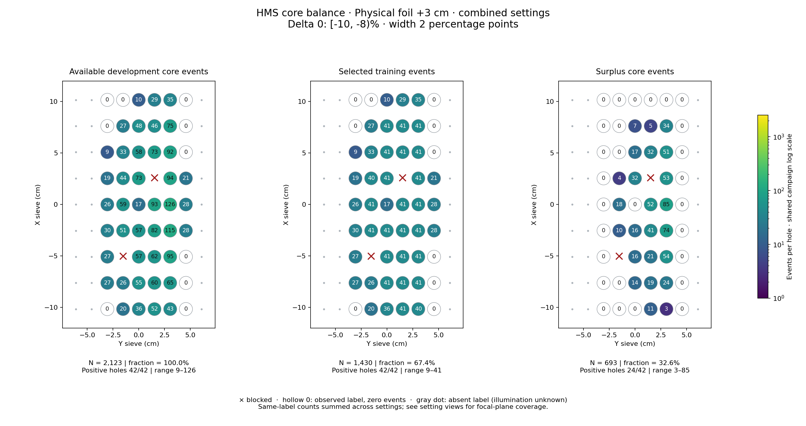
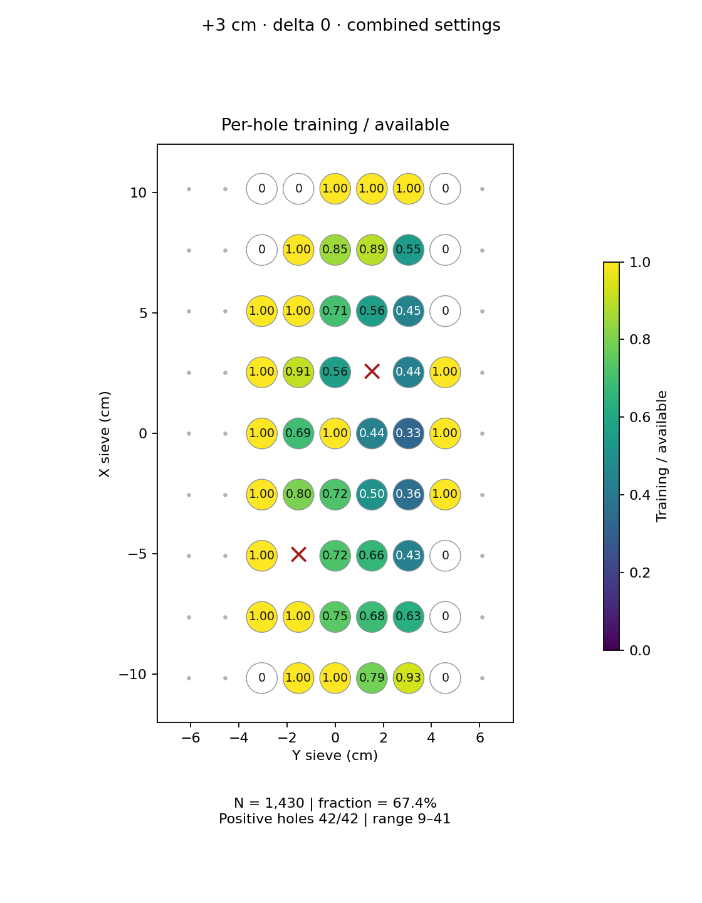
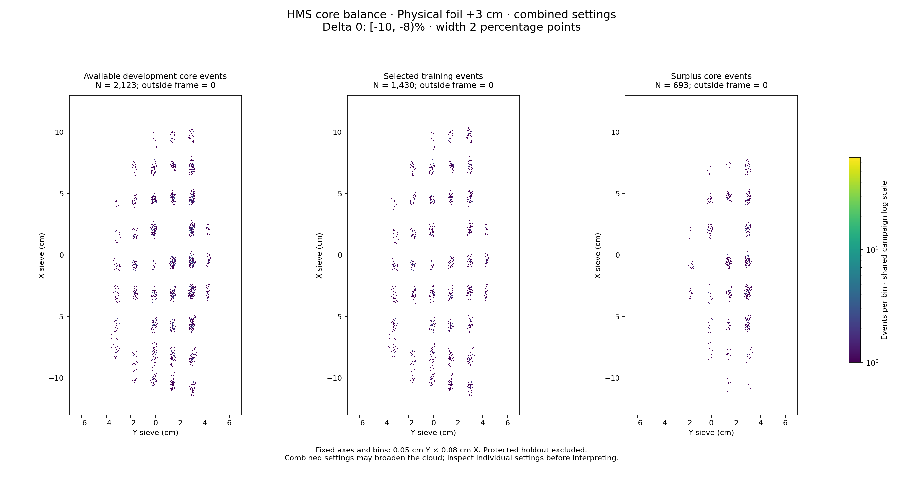

# Physical foil +3 cm · combined settings · delta 0

Interval [-10, -8)%, width 2 percentage points.

[Full-resolution training map](../plots/foil_3_delta0_training.png) · [Full-resolution training cloud](../plots/foil_3_delta0_training_cloud.png)

Same-label counts are summed across settings; this does not imply identical focal-plane coverage.

- [rg04_theta15p195_foilpm3, local foil 1](rg04_theta15p195_foilpm3_foil1_delta0.md)
- [rg05_theta12p495_foilpm3, local foil 1](rg05_theta12p495_foilpm3_foil1_delta0.md)

| rungroup | foil | xscol | yscol | available | q_hole | hole_cap | capacity | quota | actual_selected | surplus | qa_low | blocked |
|---|---|---|---|---|---|---|---|---|---|---|---|---|
| rg04_theta15p195_foilpm3 | 1 | 0 | 2 | 0 | 11 | 16 | 0 | 0 | 0 | 0 | False | False |
| rg04_theta15p195_foilpm3 | 1 | 0 | 3 | 11 | 11 | 16 | 11 | 11 | 11 | 0 | False | False |
| rg04_theta15p195_foilpm3 | 1 | 0 | 4 | 11 | 11 | 16 | 11 | 11 | 11 | 0 | False | False |
| rg04_theta15p195_foilpm3 | 1 | 0 | 5 | 22 | 11 | 16 | 16 | 16 | 16 | 6 | False | False |
| rg04_theta15p195_foilpm3 | 1 | 0 | 6 | 19 | 11 | 16 | 16 | 16 | 16 | 3 | False | False |
| rg04_theta15p195_foilpm3 | 1 | 0 | 7 | 0 | 11 | 16 | 0 | 0 | 0 | 0 | False | False |
| rg04_theta15p195_foilpm3 | 1 | 1 | 2 | 12 | 11 | 16 | 12 | 12 | 12 | 0 | False | False |
| rg04_theta15p195_foilpm3 | 1 | 1 | 3 | 8 | 11 | 16 | 8 | 8 | 8 | 0 | True | False |
| rg04_theta15p195_foilpm3 | 1 | 1 | 4 | 25 | 11 | 16 | 16 | 16 | 16 | 9 | False | False |
| rg04_theta15p195_foilpm3 | 1 | 1 | 5 | 28 | 11 | 16 | 16 | 16 | 16 | 12 | False | False |
| rg04_theta15p195_foilpm3 | 1 | 1 | 6 | 32 | 11 | 16 | 16 | 16 | 16 | 16 | False | False |
| rg04_theta15p195_foilpm3 | 1 | 2 | 2 | 10 | 11 | 16 | 10 | 10 | 10 | 0 | False | False |
| rg04_theta15p195_foilpm3 | 1 | 2 | 3 | 0 | 11 | 16 | 0 | 0 | 0 | 0 | False | True |
| rg04_theta15p195_foilpm3 | 1 | 2 | 4 | 25 | 11 | 16 | 16 | 16 | 16 | 9 | False | False |
| rg04_theta15p195_foilpm3 | 1 | 2 | 5 | 30 | 11 | 16 | 16 | 16 | 16 | 14 | False | False |
| rg04_theta15p195_foilpm3 | 1 | 2 | 6 | 46 | 11 | 16 | 16 | 16 | 16 | 30 | False | False |
| rg04_theta15p195_foilpm3 | 1 | 2 | 7 | 0 | 11 | 16 | 0 | 0 | 0 | 0 | False | False |
| rg04_theta15p195_foilpm3 | 1 | 3 | 2 | 11 | 11 | 16 | 11 | 11 | 11 | 0 | False | False |
| rg04_theta15p195_foilpm3 | 1 | 3 | 3 | 23 | 11 | 16 | 16 | 16 | 16 | 7 | False | False |
| rg04_theta15p195_foilpm3 | 1 | 3 | 4 | 21 | 11 | 16 | 16 | 16 | 16 | 5 | False | False |
| rg04_theta15p195_foilpm3 | 1 | 3 | 5 | 40 | 11 | 16 | 16 | 16 | 16 | 24 | False | False |
| rg04_theta15p195_foilpm3 | 1 | 3 | 6 | 60 | 11 | 16 | 16 | 16 | 16 | 44 | False | False |
| rg04_theta15p195_foilpm3 | 1 | 3 | 7 | 11 | 11 | 16 | 11 | 11 | 11 | 0 | False | False |
| rg04_theta15p195_foilpm3 | 1 | 4 | 2 | 11 | 11 | 16 | 11 | 11 | 11 | 0 | False | False |
| rg04_theta15p195_foilpm3 | 1 | 4 | 3 | 20 | 11 | 16 | 16 | 16 | 16 | 4 | False | False |
| rg04_theta15p195_foilpm3 | 1 | 4 | 4 | 0 | 11 | 16 | 0 | 0 | 0 | 0 | False | False |
| rg04_theta15p195_foilpm3 | 1 | 4 | 5 | 44 | 11 | 16 | 16 | 16 | 16 | 28 | False | False |
| rg04_theta15p195_foilpm3 | 1 | 4 | 6 | 53 | 11 | 16 | 16 | 16 | 16 | 37 | False | False |
| rg04_theta15p195_foilpm3 | 1 | 4 | 7 | 13 | 11 | 16 | 13 | 13 | 13 | 0 | False | False |
| rg04_theta15p195_foilpm3 | 1 | 5 | 2 | 0 | 11 | 16 | 0 | 0 | 0 | 0 | False | False |
| rg04_theta15p195_foilpm3 | 1 | 5 | 3 | 15 | 11 | 16 | 15 | 15 | 15 | 0 | False | False |
| rg04_theta15p195_foilpm3 | 1 | 5 | 4 | 28 | 11 | 16 | 16 | 16 | 16 | 12 | False | False |
| rg04_theta15p195_foilpm3 | 1 | 5 | 6 | 37 | 11 | 16 | 16 | 16 | 16 | 21 | False | False |
| rg04_theta15p195_foilpm3 | 1 | 5 | 7 | 10 | 11 | 16 | 10 | 10 | 10 | 0 | False | False |
| rg04_theta15p195_foilpm3 | 1 | 6 | 2 | 0 | 11 | 16 | 0 | 0 | 0 | 0 | False | False |
| rg04_theta15p195_foilpm3 | 1 | 6 | 3 | 10 | 11 | 16 | 10 | 10 | 10 | 0 | False | False |
| rg04_theta15p195_foilpm3 | 1 | 6 | 4 | 25 | 11 | 16 | 16 | 16 | 16 | 9 | False | False |
| rg04_theta15p195_foilpm3 | 1 | 6 | 5 | 25 | 11 | 16 | 16 | 16 | 16 | 9 | False | False |
| rg04_theta15p195_foilpm3 | 1 | 6 | 6 | 44 | 11 | 16 | 16 | 16 | 16 | 28 | False | False |
| rg04_theta15p195_foilpm3 | 1 | 6 | 7 | 0 | 11 | 16 | 0 | 0 | 0 | 0 | False | False |
| rg04_theta15p195_foilpm3 | 1 | 7 | 2 | 0 | 11 | 16 | 0 | 0 | 0 | 0 | False | False |
| rg04_theta15p195_foilpm3 | 1 | 7 | 3 | 11 | 11 | 16 | 11 | 11 | 11 | 0 | False | False |
| rg04_theta15p195_foilpm3 | 1 | 7 | 4 | 17 | 11 | 16 | 16 | 16 | 16 | 1 | False | False |
| rg04_theta15p195_foilpm3 | 1 | 7 | 5 | 16 | 11 | 16 | 16 | 16 | 16 | 0 | False | False |
| rg04_theta15p195_foilpm3 | 1 | 7 | 6 | 25 | 11 | 16 | 16 | 16 | 16 | 9 | False | False |
| rg04_theta15p195_foilpm3 | 1 | 7 | 7 | 0 | 11 | 16 | 0 | 0 | 0 | 0 | False | False |
| rg04_theta15p195_foilpm3 | 1 | 8 | 3 | 0 | 11 | 16 | 0 | 0 | 0 | 0 | False | False |
| rg04_theta15p195_foilpm3 | 1 | 8 | 4 | 0 | 11 | 16 | 0 | 0 | 0 | 0 | False | False |
| rg04_theta15p195_foilpm3 | 1 | 8 | 5 | 10 | 11 | 16 | 10 | 10 | 10 | 0 | False | False |
| rg04_theta15p195_foilpm3 | 1 | 8 | 6 | 12 | 11 | 16 | 12 | 12 | 12 | 0 | False | False |
| rg05_theta12p495_foilpm3 | 1 | 0 | 2 | 0 | 17.25 | 25 | 0 | 0 | 0 | 0 | False | False |
| rg05_theta12p495_foilpm3 | 1 | 0 | 3 | 9 | 17.25 | 25 | 9 | 9 | 9 | 0 | True | False |
| rg05_theta12p495_foilpm3 | 1 | 0 | 4 | 25 | 17.25 | 25 | 25 | 25 | 25 | 0 | False | False |
| rg05_theta12p495_foilpm3 | 1 | 0 | 5 | 30 | 17.25 | 25 | 25 | 25 | 25 | 5 | False | False |
| rg05_theta12p495_foilpm3 | 1 | 0 | 6 | 24 | 17.25 | 25 | 24 | 24 | 24 | 0 | False | False |
| rg05_theta12p495_foilpm3 | 1 | 1 | 2 | 15 | 17.25 | 25 | 15 | 15 | 15 | 0 | False | False |
| rg05_theta12p495_foilpm3 | 1 | 1 | 3 | 18 | 17.25 | 25 | 18 | 18 | 18 | 0 | False | False |
| rg05_theta12p495_foilpm3 | 1 | 1 | 4 | 30 | 17.25 | 25 | 25 | 25 | 25 | 5 | False | False |
| rg05_theta12p495_foilpm3 | 1 | 1 | 5 | 32 | 17.25 | 25 | 25 | 25 | 25 | 7 | False | False |
| rg05_theta12p495_foilpm3 | 1 | 1 | 6 | 33 | 17.25 | 25 | 25 | 25 | 25 | 8 | False | False |
| rg05_theta12p495_foilpm3 | 1 | 1 | 7 | 0 | 17.25 | 25 | 0 | 0 | 0 | 0 | False | False |
| rg05_theta12p495_foilpm3 | 1 | 2 | 2 | 17 | 17.25 | 25 | 17 | 17 | 17 | 0 | False | False |
| rg05_theta12p495_foilpm3 | 1 | 2 | 3 | 0 | 17.25 | 25 | 0 | 0 | 0 | 0 | False | True |
| rg05_theta12p495_foilpm3 | 1 | 2 | 4 | 32 | 17.25 | 25 | 25 | 25 | 25 | 7 | False | False |
| rg05_theta12p495_foilpm3 | 1 | 2 | 5 | 32 | 17.25 | 25 | 25 | 25 | 25 | 7 | False | False |
| rg05_theta12p495_foilpm3 | 1 | 2 | 6 | 49 | 17.25 | 25 | 25 | 25 | 25 | 24 | False | False |
| rg05_theta12p495_foilpm3 | 1 | 2 | 7 | 0 | 17.25 | 25 | 0 | 0 | 0 | 0 | False | False |
| rg05_theta12p495_foilpm3 | 1 | 3 | 2 | 19 | 17.25 | 25 | 19 | 19 | 19 | 0 | False | False |
| rg05_theta12p495_foilpm3 | 1 | 3 | 3 | 28 | 17.25 | 25 | 25 | 25 | 25 | 3 | False | False |
| rg05_theta12p495_foilpm3 | 1 | 3 | 4 | 36 | 17.25 | 25 | 25 | 25 | 25 | 11 | False | False |
| rg05_theta12p495_foilpm3 | 1 | 3 | 5 | 42 | 17.25 | 25 | 25 | 25 | 25 | 17 | False | False |
| rg05_theta12p495_foilpm3 | 1 | 3 | 6 | 55 | 17.25 | 25 | 25 | 25 | 25 | 30 | False | False |
| rg05_theta12p495_foilpm3 | 1 | 3 | 7 | 17 | 17.25 | 25 | 17 | 17 | 17 | 0 | False | False |
| rg05_theta12p495_foilpm3 | 1 | 4 | 2 | 15 | 17.25 | 25 | 15 | 15 | 15 | 0 | False | False |
| rg05_theta12p495_foilpm3 | 1 | 4 | 3 | 39 | 17.25 | 25 | 25 | 25 | 25 | 14 | False | False |
| rg05_theta12p495_foilpm3 | 1 | 4 | 4 | 17 | 17.25 | 25 | 17 | 17 | 17 | 0 | False | False |
| rg05_theta12p495_foilpm3 | 1 | 4 | 5 | 49 | 17.25 | 25 | 25 | 25 | 25 | 24 | False | False |
| rg05_theta12p495_foilpm3 | 1 | 4 | 6 | 73 | 17.25 | 25 | 25 | 25 | 25 | 48 | False | False |
| rg05_theta12p495_foilpm3 | 1 | 4 | 7 | 15 | 17.25 | 25 | 15 | 15 | 15 | 0 | False | False |
| rg05_theta12p495_foilpm3 | 1 | 5 | 2 | 19 | 17.25 | 25 | 19 | 19 | 19 | 0 | False | False |
| rg05_theta12p495_foilpm3 | 1 | 5 | 3 | 29 | 17.25 | 25 | 25 | 25 | 25 | 4 | False | False |
| rg05_theta12p495_foilpm3 | 1 | 5 | 4 | 45 | 17.25 | 25 | 25 | 25 | 25 | 20 | False | False |
| rg05_theta12p495_foilpm3 | 1 | 5 | 5 | 0 | 17.25 | 25 | 0 | 0 | 0 | 0 | False | True |
| rg05_theta12p495_foilpm3 | 1 | 5 | 6 | 57 | 17.25 | 25 | 25 | 25 | 25 | 32 | False | False |
| rg05_theta12p495_foilpm3 | 1 | 5 | 7 | 11 | 17.25 | 25 | 11 | 11 | 11 | 0 | False | False |
| rg05_theta12p495_foilpm3 | 1 | 6 | 2 | 9 | 17.25 | 25 | 9 | 9 | 9 | 0 | True | False |
| rg05_theta12p495_foilpm3 | 1 | 6 | 3 | 23 | 17.25 | 25 | 23 | 23 | 23 | 0 | False | False |
| rg05_theta12p495_foilpm3 | 1 | 6 | 4 | 33 | 17.25 | 25 | 25 | 25 | 25 | 8 | False | False |
| rg05_theta12p495_foilpm3 | 1 | 6 | 5 | 48 | 17.25 | 25 | 25 | 25 | 25 | 23 | False | False |
| rg05_theta12p495_foilpm3 | 1 | 6 | 6 | 48 | 17.25 | 25 | 25 | 25 | 25 | 23 | False | False |
| rg05_theta12p495_foilpm3 | 1 | 6 | 7 | 0 | 17.25 | 25 | 0 | 0 | 0 | 0 | False | False |
| rg05_theta12p495_foilpm3 | 1 | 7 | 2 | 0 | 17.25 | 25 | 0 | 0 | 0 | 0 | False | False |
| rg05_theta12p495_foilpm3 | 1 | 7 | 3 | 16 | 17.25 | 25 | 16 | 16 | 16 | 0 | False | False |
| rg05_theta12p495_foilpm3 | 1 | 7 | 4 | 31 | 17.25 | 25 | 25 | 25 | 25 | 6 | False | False |
| rg05_theta12p495_foilpm3 | 1 | 7 | 5 | 30 | 17.25 | 25 | 25 | 25 | 25 | 5 | False | False |
| rg05_theta12p495_foilpm3 | 1 | 7 | 6 | 50 | 17.25 | 25 | 25 | 25 | 25 | 25 | False | False |
| rg05_theta12p495_foilpm3 | 1 | 7 | 7 | 0 | 17.25 | 25 | 0 | 0 | 0 | 0 | False | False |
| rg05_theta12p495_foilpm3 | 1 | 8 | 2 | 0 | 17.25 | 25 | 0 | 0 | 0 | 0 | False | False |
| rg05_theta12p495_foilpm3 | 1 | 8 | 3 | 0 | 17.25 | 25 | 0 | 0 | 0 | 0 | False | False |
| rg05_theta12p495_foilpm3 | 1 | 8 | 4 | 10 | 17.25 | 25 | 10 | 10 | 10 | 0 | False | False |
| rg05_theta12p495_foilpm3 | 1 | 8 | 5 | 19 | 17.25 | 25 | 19 | 19 | 19 | 0 | False | False |
| rg05_theta12p495_foilpm3 | 1 | 8 | 6 | 23 | 17.25 | 25 | 23 | 23 | 23 | 0 | False | False |
| rg05_theta12p495_foilpm3 | 1 | 8 | 7 | 0 | 17.25 | 25 | 0 | 0 | 0 | 0 | False | False |
