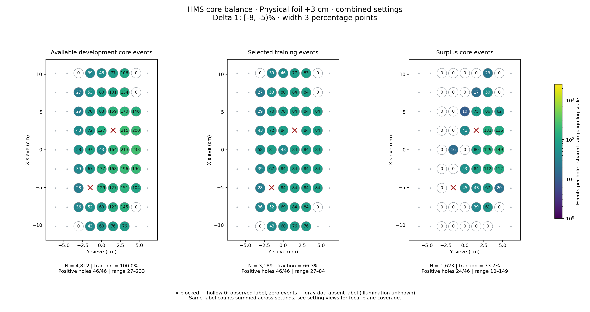
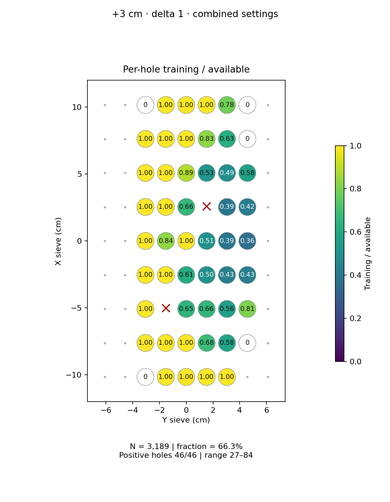
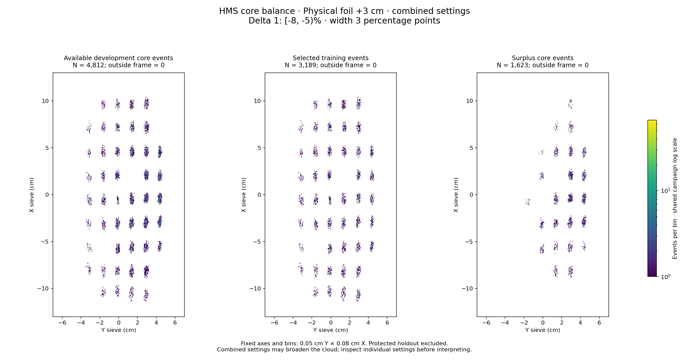

# Physical foil +3 cm · combined settings · delta 1

Interval [-8, -5)%, width 3 percentage points.

[Full-resolution training map](../plots/foil_3_delta1_training.png) · [Full-resolution training cloud](../plots/foil_3_delta1_training_cloud.png)

Same-label counts are summed across settings; this does not imply identical focal-plane coverage.

- [rg04_theta15p195_foilpm3, local foil 1](rg04_theta15p195_foilpm3_foil1_delta1.md)
- [rg05_theta12p495_foilpm3, local foil 1](rg05_theta12p495_foilpm3_foil1_delta1.md)

| rungroup | foil | xscol | yscol | available | q_hole | hole_cap | capacity | quota | actual_selected | surplus | qa_low | blocked |
|---|---|---|---|---|---|---|---|---|---|---|---|---|
| rg04_theta15p195_foilpm3 | 1 | 0 | 2 | 0 | 22 | 33 | 0 | 0 | 0 | 0 | False | False |
| rg04_theta15p195_foilpm3 | 1 | 0 | 3 | 15 | 22 | 33 | 15 | 15 | 15 | 0 | False | False |
| rg04_theta15p195_foilpm3 | 1 | 0 | 4 | 24 | 22 | 33 | 24 | 24 | 24 | 0 | False | False |
| rg04_theta15p195_foilpm3 | 1 | 0 | 5 | 29 | 22 | 33 | 29 | 29 | 29 | 0 | False | False |
| rg04_theta15p195_foilpm3 | 1 | 0 | 6 | 25 | 22 | 33 | 25 | 25 | 25 | 0 | False | False |
| rg04_theta15p195_foilpm3 | 1 | 1 | 2 | 14 | 22 | 33 | 14 | 14 | 14 | 0 | False | False |
| rg04_theta15p195_foilpm3 | 1 | 1 | 3 | 21 | 22 | 33 | 21 | 21 | 21 | 0 | False | False |
| rg04_theta15p195_foilpm3 | 1 | 1 | 4 | 28 | 22 | 33 | 28 | 28 | 28 | 0 | False | False |
| rg04_theta15p195_foilpm3 | 1 | 1 | 5 | 49 | 22 | 33 | 33 | 33 | 33 | 16 | False | False |
| rg04_theta15p195_foilpm3 | 1 | 1 | 6 | 55 | 22 | 33 | 33 | 33 | 33 | 22 | False | False |
| rg04_theta15p195_foilpm3 | 1 | 1 | 7 | 0 | 22 | 33 | 0 | 0 | 0 | 0 | False | False |
| rg04_theta15p195_foilpm3 | 1 | 2 | 2 | 0 | 22 | 33 | 0 | 0 | 0 | 0 | False | False |
| rg04_theta15p195_foilpm3 | 1 | 2 | 3 | 0 | 22 | 33 | 0 | 0 | 0 | 0 | False | True |
| rg04_theta15p195_foilpm3 | 1 | 2 | 4 | 42 | 22 | 33 | 33 | 33 | 33 | 9 | False | False |
| rg04_theta15p195_foilpm3 | 1 | 2 | 5 | 54 | 22 | 33 | 33 | 33 | 33 | 21 | False | False |
| rg04_theta15p195_foilpm3 | 1 | 2 | 6 | 54 | 22 | 33 | 33 | 33 | 33 | 21 | False | False |
| rg04_theta15p195_foilpm3 | 1 | 2 | 7 | 41 | 22 | 33 | 33 | 33 | 33 | 8 | False | False |
| rg04_theta15p195_foilpm3 | 1 | 3 | 2 | 18 | 22 | 33 | 18 | 18 | 18 | 0 | False | False |
| rg04_theta15p195_foilpm3 | 1 | 3 | 3 | 22 | 22 | 33 | 22 | 22 | 22 | 0 | False | False |
| rg04_theta15p195_foilpm3 | 1 | 3 | 4 | 45 | 22 | 33 | 33 | 33 | 33 | 12 | False | False |
| rg04_theta15p195_foilpm3 | 1 | 3 | 5 | 63 | 22 | 33 | 33 | 33 | 33 | 30 | False | False |
| rg04_theta15p195_foilpm3 | 1 | 3 | 6 | 74 | 22 | 33 | 33 | 33 | 33 | 41 | False | False |
| rg04_theta15p195_foilpm3 | 1 | 3 | 7 | 71 | 22 | 33 | 33 | 33 | 33 | 38 | False | False |
| rg04_theta15p195_foilpm3 | 1 | 4 | 2 | 27 | 22 | 33 | 27 | 27 | 27 | 0 | False | False |
| rg04_theta15p195_foilpm3 | 1 | 4 | 3 | 30 | 22 | 33 | 30 | 30 | 30 | 0 | False | False |
| rg04_theta15p195_foilpm3 | 1 | 4 | 4 | 13 | 22 | 33 | 13 | 13 | 13 | 0 | False | False |
| rg04_theta15p195_foilpm3 | 1 | 4 | 5 | 56 | 22 | 33 | 33 | 33 | 33 | 23 | False | False |
| rg04_theta15p195_foilpm3 | 1 | 4 | 6 | 86 | 22 | 33 | 33 | 33 | 33 | 53 | False | False |
| rg04_theta15p195_foilpm3 | 1 | 4 | 7 | 94 | 22 | 33 | 33 | 33 | 33 | 61 | False | False |
| rg04_theta15p195_foilpm3 | 1 | 5 | 2 | 9 | 22 | 33 | 9 | 9 | 9 | 0 | True | False |
| rg04_theta15p195_foilpm3 | 1 | 5 | 3 | 31 | 22 | 33 | 31 | 31 | 31 | 0 | False | False |
| rg04_theta15p195_foilpm3 | 1 | 5 | 4 | 42 | 22 | 33 | 33 | 33 | 33 | 9 | False | False |
| rg04_theta15p195_foilpm3 | 1 | 5 | 5 | 0 | 22 | 33 | 0 | 0 | 0 | 0 | False | True |
| rg04_theta15p195_foilpm3 | 1 | 5 | 6 | 71 | 22 | 33 | 33 | 33 | 33 | 38 | False | False |
| rg04_theta15p195_foilpm3 | 1 | 5 | 7 | 74 | 22 | 33 | 33 | 33 | 33 | 41 | False | False |
| rg04_theta15p195_foilpm3 | 1 | 6 | 2 | 10 | 22 | 33 | 10 | 10 | 10 | 0 | False | False |
| rg04_theta15p195_foilpm3 | 1 | 6 | 3 | 25 | 22 | 33 | 25 | 25 | 25 | 0 | False | False |
| rg04_theta15p195_foilpm3 | 1 | 6 | 4 | 27 | 22 | 33 | 27 | 27 | 27 | 0 | False | False |
| rg04_theta15p195_foilpm3 | 1 | 6 | 5 | 52 | 22 | 33 | 33 | 33 | 33 | 19 | False | False |
| rg04_theta15p195_foilpm3 | 1 | 6 | 6 | 61 | 22 | 33 | 33 | 33 | 33 | 28 | False | False |
| rg04_theta15p195_foilpm3 | 1 | 6 | 7 | 56 | 22 | 33 | 33 | 33 | 33 | 23 | False | False |
| rg04_theta15p195_foilpm3 | 1 | 7 | 2 | 9 | 22 | 33 | 9 | 9 | 9 | 0 | True | False |
| rg04_theta15p195_foilpm3 | 1 | 7 | 3 | 18 | 22 | 33 | 18 | 18 | 18 | 0 | False | False |
| rg04_theta15p195_foilpm3 | 1 | 7 | 4 | 31 | 22 | 33 | 31 | 31 | 31 | 0 | False | False |
| rg04_theta15p195_foilpm3 | 1 | 7 | 5 | 41 | 22 | 33 | 33 | 33 | 33 | 8 | False | False |
| rg04_theta15p195_foilpm3 | 1 | 7 | 6 | 53 | 22 | 33 | 33 | 33 | 33 | 20 | False | False |
| rg04_theta15p195_foilpm3 | 1 | 7 | 7 | 0 | 22 | 33 | 0 | 0 | 0 | 0 | False | False |
| rg04_theta15p195_foilpm3 | 1 | 8 | 3 | 16 | 22 | 33 | 16 | 16 | 16 | 0 | False | False |
| rg04_theta15p195_foilpm3 | 1 | 8 | 4 | 12 | 22 | 33 | 12 | 12 | 12 | 0 | False | False |
| rg04_theta15p195_foilpm3 | 1 | 8 | 5 | 32 | 22 | 33 | 32 | 32 | 32 | 0 | False | False |
| rg04_theta15p195_foilpm3 | 1 | 8 | 6 | 32 | 22 | 33 | 32 | 32 | 32 | 0 | False | False |
| rg05_theta12p495_foilpm3 | 1 | 0 | 2 | 0 | 34.25 | 51 | 0 | 0 | 0 | 0 | False | False |
| rg05_theta12p495_foilpm3 | 1 | 0 | 3 | 28 | 34.25 | 51 | 28 | 28 | 28 | 0 | False | False |
| rg05_theta12p495_foilpm3 | 1 | 0 | 4 | 36 | 34.25 | 51 | 36 | 36 | 36 | 0 | False | False |
| rg05_theta12p495_foilpm3 | 1 | 0 | 5 | 47 | 34.25 | 51 | 47 | 47 | 47 | 0 | False | False |
| rg05_theta12p495_foilpm3 | 1 | 0 | 6 | 51 | 34.25 | 51 | 51 | 51 | 51 | 0 | False | False |
| rg05_theta12p495_foilpm3 | 1 | 1 | 2 | 22 | 34.25 | 51 | 22 | 22 | 22 | 0 | False | False |
| rg05_theta12p495_foilpm3 | 1 | 1 | 3 | 31 | 34.25 | 51 | 31 | 31 | 31 | 0 | False | False |
| rg05_theta12p495_foilpm3 | 1 | 1 | 4 | 41 | 34.25 | 51 | 41 | 41 | 41 | 0 | False | False |
| rg05_theta12p495_foilpm3 | 1 | 1 | 5 | 74 | 34.25 | 51 | 51 | 51 | 51 | 23 | False | False |
| rg05_theta12p495_foilpm3 | 1 | 1 | 6 | 90 | 34.25 | 51 | 51 | 51 | 51 | 39 | False | False |
| rg05_theta12p495_foilpm3 | 1 | 1 | 7 | 0 | 34.25 | 51 | 0 | 0 | 0 | 0 | False | False |
| rg05_theta12p495_foilpm3 | 1 | 2 | 2 | 28 | 34.25 | 51 | 28 | 28 | 28 | 0 | False | False |
| rg05_theta12p495_foilpm3 | 1 | 2 | 3 | 0 | 34.25 | 51 | 0 | 0 | 0 | 0 | False | True |
| rg05_theta12p495_foilpm3 | 1 | 2 | 4 | 87 | 34.25 | 51 | 51 | 51 | 51 | 36 | False | False |
| rg05_theta12p495_foilpm3 | 1 | 2 | 5 | 73 | 34.25 | 51 | 51 | 51 | 51 | 22 | False | False |
| rg05_theta12p495_foilpm3 | 1 | 2 | 6 | 97 | 34.25 | 51 | 51 | 51 | 51 | 46 | False | False |
| rg05_theta12p495_foilpm3 | 1 | 2 | 7 | 63 | 34.25 | 51 | 51 | 51 | 51 | 12 | False | False |
| rg05_theta12p495_foilpm3 | 1 | 3 | 2 | 21 | 34.25 | 51 | 21 | 21 | 21 | 0 | False | False |
| rg05_theta12p495_foilpm3 | 1 | 3 | 3 | 45 | 34.25 | 51 | 45 | 45 | 45 | 0 | False | False |
| rg05_theta12p495_foilpm3 | 1 | 3 | 4 | 92 | 34.25 | 51 | 51 | 51 | 51 | 41 | False | False |
| rg05_theta12p495_foilpm3 | 1 | 3 | 5 | 105 | 34.25 | 51 | 51 | 51 | 51 | 54 | False | False |
| rg05_theta12p495_foilpm3 | 1 | 3 | 6 | 122 | 34.25 | 51 | 51 | 51 | 51 | 71 | False | False |
| rg05_theta12p495_foilpm3 | 1 | 3 | 7 | 125 | 34.25 | 51 | 51 | 51 | 51 | 74 | False | False |
| rg05_theta12p495_foilpm3 | 1 | 4 | 2 | 31 | 34.25 | 51 | 31 | 31 | 31 | 0 | False | False |
| rg05_theta12p495_foilpm3 | 1 | 4 | 3 | 67 | 34.25 | 51 | 51 | 51 | 51 | 16 | False | False |
| rg05_theta12p495_foilpm3 | 1 | 4 | 4 | 30 | 34.25 | 51 | 30 | 30 | 30 | 0 | False | False |
| rg05_theta12p495_foilpm3 | 1 | 4 | 5 | 108 | 34.25 | 51 | 51 | 51 | 51 | 57 | False | False |
| rg05_theta12p495_foilpm3 | 1 | 4 | 6 | 127 | 34.25 | 51 | 51 | 51 | 51 | 76 | False | False |
| rg05_theta12p495_foilpm3 | 1 | 4 | 7 | 139 | 34.25 | 51 | 51 | 51 | 51 | 88 | False | False |
| rg05_theta12p495_foilpm3 | 1 | 5 | 2 | 34 | 34.25 | 51 | 34 | 34 | 34 | 0 | False | False |
| rg05_theta12p495_foilpm3 | 1 | 5 | 3 | 41 | 34.25 | 51 | 41 | 41 | 41 | 0 | False | False |
| rg05_theta12p495_foilpm3 | 1 | 5 | 4 | 85 | 34.25 | 51 | 51 | 51 | 51 | 34 | False | False |
| rg05_theta12p495_foilpm3 | 1 | 5 | 5 | 0 | 34.25 | 51 | 0 | 0 | 0 | 0 | False | True |
| rg05_theta12p495_foilpm3 | 1 | 5 | 6 | 144 | 34.25 | 51 | 51 | 51 | 51 | 93 | False | False |
| rg05_theta12p495_foilpm3 | 1 | 5 | 7 | 126 | 34.25 | 51 | 51 | 51 | 51 | 75 | False | False |
| rg05_theta12p495_foilpm3 | 1 | 6 | 2 | 19 | 34.25 | 51 | 19 | 19 | 19 | 0 | False | False |
| rg05_theta12p495_foilpm3 | 1 | 6 | 3 | 45 | 34.25 | 51 | 45 | 45 | 45 | 0 | False | False |
| rg05_theta12p495_foilpm3 | 1 | 6 | 4 | 61 | 34.25 | 51 | 51 | 51 | 51 | 10 | False | False |
| rg05_theta12p495_foilpm3 | 1 | 6 | 5 | 107 | 34.25 | 51 | 51 | 51 | 51 | 56 | False | False |
| rg05_theta12p495_foilpm3 | 1 | 6 | 6 | 109 | 34.25 | 51 | 51 | 51 | 51 | 58 | False | False |
| rg05_theta12p495_foilpm3 | 1 | 6 | 7 | 90 | 34.25 | 51 | 51 | 51 | 51 | 39 | False | False |
| rg05_theta12p495_foilpm3 | 1 | 7 | 2 | 18 | 34.25 | 51 | 18 | 18 | 18 | 0 | False | False |
| rg05_theta12p495_foilpm3 | 1 | 7 | 3 | 35 | 34.25 | 51 | 35 | 35 | 35 | 0 | False | False |
| rg05_theta12p495_foilpm3 | 1 | 7 | 4 | 49 | 34.25 | 51 | 49 | 49 | 49 | 0 | False | False |
| rg05_theta12p495_foilpm3 | 1 | 7 | 5 | 60 | 34.25 | 51 | 51 | 51 | 51 | 9 | False | False |
| rg05_theta12p495_foilpm3 | 1 | 7 | 6 | 81 | 34.25 | 51 | 51 | 51 | 51 | 30 | False | False |
| rg05_theta12p495_foilpm3 | 1 | 7 | 7 | 0 | 34.25 | 51 | 0 | 0 | 0 | 0 | False | False |
| rg05_theta12p495_foilpm3 | 1 | 8 | 2 | 0 | 34.25 | 51 | 0 | 0 | 0 | 0 | False | False |
| rg05_theta12p495_foilpm3 | 1 | 8 | 3 | 23 | 34.25 | 51 | 23 | 23 | 23 | 0 | False | False |
| rg05_theta12p495_foilpm3 | 1 | 8 | 4 | 34 | 34.25 | 51 | 34 | 34 | 34 | 0 | False | False |
| rg05_theta12p495_foilpm3 | 1 | 8 | 5 | 45 | 34.25 | 51 | 45 | 45 | 45 | 0 | False | False |
| rg05_theta12p495_foilpm3 | 1 | 8 | 6 | 74 | 34.25 | 51 | 51 | 51 | 51 | 23 | False | False |
| rg05_theta12p495_foilpm3 | 1 | 8 | 7 | 0 | 34.25 | 51 | 0 | 0 | 0 | 0 | False | False |
