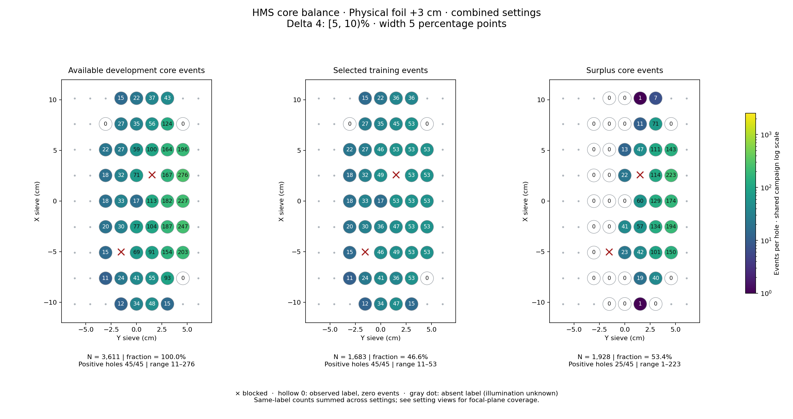
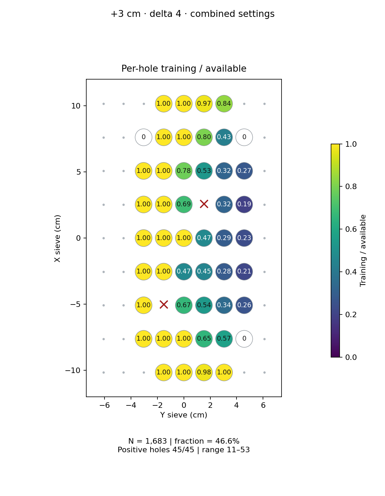
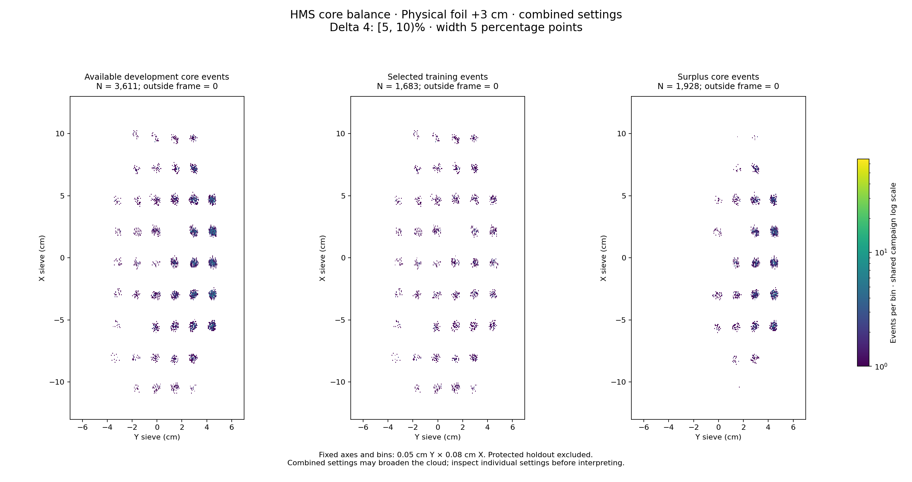

# Physical foil +3 cm · combined settings · delta 4

Interval [5, 10)%, width 5 percentage points.

[Full-resolution training map](../plots/foil_3_delta4_training.png) · [Full-resolution training cloud](../plots/foil_3_delta4_training_cloud.png)

Same-label counts are summed across settings; this does not imply identical focal-plane coverage.

- [rg04_theta15p195_foilpm3, local foil 1](rg04_theta15p195_foilpm3_foil1_delta4.md)
- [rg05_theta12p495_foilpm3, local foil 1](rg05_theta12p495_foilpm3_foil1_delta4.md)

| rungroup | foil | xscol | yscol | available | q_hole | hole_cap | capacity | quota | actual_selected | surplus | qa_low | blocked |
|---|---|---|---|---|---|---|---|---|---|---|---|---|
| rg04_theta15p195_foilpm3 | 1 | 0 | 3 | 0 | 11.5 | 17 | 0 | 0 | 0 | 0 | False | False |
| rg04_theta15p195_foilpm3 | 1 | 0 | 4 | 0 | 11.5 | 17 | 0 | 0 | 0 | 0 | False | False |
| rg04_theta15p195_foilpm3 | 1 | 0 | 5 | 11 | 11.5 | 17 | 11 | 11 | 11 | 0 | False | False |
| rg04_theta15p195_foilpm3 | 1 | 0 | 6 | 0 | 11.5 | 17 | 0 | 0 | 0 | 0 | False | False |
| rg04_theta15p195_foilpm3 | 1 | 1 | 3 | 0 | 11.5 | 17 | 0 | 0 | 0 | 0 | False | False |
| rg04_theta15p195_foilpm3 | 1 | 1 | 4 | 10 | 11.5 | 17 | 10 | 10 | 10 | 0 | False | False |
| rg04_theta15p195_foilpm3 | 1 | 1 | 5 | 0 | 11.5 | 17 | 0 | 0 | 0 | 0 | False | False |
| rg04_theta15p195_foilpm3 | 1 | 1 | 6 | 23 | 11.5 | 17 | 17 | 17 | 17 | 6 | False | False |
| rg04_theta15p195_foilpm3 | 1 | 2 | 4 | 10 | 11.5 | 17 | 10 | 10 | 10 | 0 | False | False |
| rg04_theta15p195_foilpm3 | 1 | 2 | 5 | 13 | 11.5 | 17 | 13 | 13 | 13 | 0 | False | False |
| rg04_theta15p195_foilpm3 | 1 | 2 | 6 | 32 | 11.5 | 17 | 17 | 17 | 17 | 15 | False | False |
| rg04_theta15p195_foilpm3 | 1 | 2 | 7 | 51 | 11.5 | 17 | 17 | 17 | 17 | 34 | False | False |
| rg04_theta15p195_foilpm3 | 1 | 3 | 3 | 0 | 11.5 | 17 | 0 | 0 | 0 | 0 | False | False |
| rg04_theta15p195_foilpm3 | 1 | 3 | 4 | 0 | 11.5 | 17 | 0 | 0 | 0 | 0 | False | False |
| rg04_theta15p195_foilpm3 | 1 | 3 | 5 | 11 | 11.5 | 17 | 11 | 11 | 11 | 0 | False | False |
| rg04_theta15p195_foilpm3 | 1 | 3 | 6 | 39 | 11.5 | 17 | 17 | 17 | 17 | 22 | False | False |
| rg04_theta15p195_foilpm3 | 1 | 3 | 7 | 74 | 11.5 | 17 | 17 | 17 | 17 | 57 | False | False |
| rg04_theta15p195_foilpm3 | 1 | 4 | 3 | 0 | 11.5 | 17 | 0 | 0 | 0 | 0 | False | False |
| rg04_theta15p195_foilpm3 | 1 | 4 | 4 | 0 | 11.5 | 17 | 0 | 0 | 0 | 0 | False | False |
| rg04_theta15p195_foilpm3 | 1 | 4 | 5 | 19 | 11.5 | 17 | 17 | 17 | 17 | 2 | False | False |
| rg04_theta15p195_foilpm3 | 1 | 4 | 6 | 39 | 11.5 | 17 | 17 | 17 | 17 | 22 | False | False |
| rg04_theta15p195_foilpm3 | 1 | 4 | 7 | 49 | 11.5 | 17 | 17 | 17 | 17 | 32 | False | False |
| rg04_theta15p195_foilpm3 | 1 | 5 | 3 | 0 | 11.5 | 17 | 0 | 0 | 0 | 0 | False | False |
| rg04_theta15p195_foilpm3 | 1 | 5 | 4 | 13 | 11.5 | 17 | 13 | 13 | 13 | 0 | False | False |
| rg04_theta15p195_foilpm3 | 1 | 5 | 5 | 0 | 11.5 | 17 | 0 | 0 | 0 | 0 | False | True |
| rg04_theta15p195_foilpm3 | 1 | 5 | 6 | 40 | 11.5 | 17 | 17 | 17 | 17 | 23 | False | False |
| rg04_theta15p195_foilpm3 | 1 | 5 | 7 | 65 | 11.5 | 17 | 17 | 17 | 17 | 48 | False | False |
| rg04_theta15p195_foilpm3 | 1 | 6 | 3 | 0 | 11.5 | 17 | 0 | 0 | 0 | 0 | False | False |
| rg04_theta15p195_foilpm3 | 1 | 6 | 4 | 10 | 11.5 | 17 | 10 | 10 | 10 | 0 | False | False |
| rg04_theta15p195_foilpm3 | 1 | 6 | 5 | 18 | 11.5 | 17 | 17 | 17 | 17 | 1 | False | False |
| rg04_theta15p195_foilpm3 | 1 | 6 | 6 | 30 | 11.5 | 17 | 17 | 17 | 17 | 13 | False | False |
| rg04_theta15p195_foilpm3 | 1 | 6 | 7 | 37 | 11.5 | 17 | 17 | 17 | 17 | 20 | False | False |
| rg04_theta15p195_foilpm3 | 1 | 7 | 3 | 0 | 11.5 | 17 | 0 | 0 | 0 | 0 | False | False |
| rg04_theta15p195_foilpm3 | 1 | 7 | 4 | 0 | 11.5 | 17 | 0 | 0 | 0 | 0 | False | False |
| rg04_theta15p195_foilpm3 | 1 | 7 | 5 | 9 | 11.5 | 17 | 9 | 9 | 9 | 0 | True | False |
| rg04_theta15p195_foilpm3 | 1 | 7 | 6 | 29 | 11.5 | 17 | 17 | 17 | 17 | 12 | False | False |
| rg04_theta15p195_foilpm3 | 1 | 7 | 7 | 0 | 11.5 | 17 | 0 | 0 | 0 | 0 | False | False |
| rg04_theta15p195_foilpm3 | 1 | 8 | 3 | 0 | 11.5 | 17 | 0 | 0 | 0 | 0 | False | False |
| rg04_theta15p195_foilpm3 | 1 | 8 | 4 | 0 | 11.5 | 17 | 0 | 0 | 0 | 0 | False | False |
| rg04_theta15p195_foilpm3 | 1 | 8 | 5 | 0 | 11.5 | 17 | 0 | 0 | 0 | 0 | False | False |
| rg04_theta15p195_foilpm3 | 1 | 8 | 6 | 0 | 11.5 | 17 | 0 | 0 | 0 | 0 | False | False |
| rg05_theta12p495_foilpm3 | 1 | 0 | 3 | 12 | 24 | 36 | 12 | 12 | 12 | 0 | False | False |
| rg05_theta12p495_foilpm3 | 1 | 0 | 4 | 34 | 24 | 36 | 34 | 34 | 34 | 0 | False | False |
| rg05_theta12p495_foilpm3 | 1 | 0 | 5 | 37 | 24 | 36 | 36 | 36 | 36 | 1 | False | False |
| rg05_theta12p495_foilpm3 | 1 | 0 | 6 | 15 | 24 | 36 | 15 | 15 | 15 | 0 | False | False |
| rg05_theta12p495_foilpm3 | 1 | 1 | 2 | 11 | 24 | 36 | 11 | 11 | 11 | 0 | False | False |
| rg05_theta12p495_foilpm3 | 1 | 1 | 3 | 24 | 24 | 36 | 24 | 24 | 24 | 0 | False | False |
| rg05_theta12p495_foilpm3 | 1 | 1 | 4 | 31 | 24 | 36 | 31 | 31 | 31 | 0 | False | False |
| rg05_theta12p495_foilpm3 | 1 | 1 | 5 | 55 | 24 | 36 | 36 | 36 | 36 | 19 | False | False |
| rg05_theta12p495_foilpm3 | 1 | 1 | 6 | 70 | 24 | 36 | 36 | 36 | 36 | 34 | False | False |
| rg05_theta12p495_foilpm3 | 1 | 1 | 7 | 0 | 24 | 36 | 0 | 0 | 0 | 0 | False | False |
| rg05_theta12p495_foilpm3 | 1 | 2 | 2 | 15 | 24 | 36 | 15 | 15 | 15 | 0 | False | False |
| rg05_theta12p495_foilpm3 | 1 | 2 | 3 | 0 | 24 | 36 | 0 | 0 | 0 | 0 | False | True |
| rg05_theta12p495_foilpm3 | 1 | 2 | 4 | 59 | 24 | 36 | 36 | 36 | 36 | 23 | False | False |
| rg05_theta12p495_foilpm3 | 1 | 2 | 5 | 78 | 24 | 36 | 36 | 36 | 36 | 42 | False | False |
| rg05_theta12p495_foilpm3 | 1 | 2 | 6 | 122 | 24 | 36 | 36 | 36 | 36 | 86 | False | False |
| rg05_theta12p495_foilpm3 | 1 | 2 | 7 | 152 | 24 | 36 | 36 | 36 | 36 | 116 | False | False |
| rg05_theta12p495_foilpm3 | 1 | 3 | 2 | 20 | 24 | 36 | 20 | 20 | 20 | 0 | False | False |
| rg05_theta12p495_foilpm3 | 1 | 3 | 3 | 30 | 24 | 36 | 30 | 30 | 30 | 0 | False | False |
| rg05_theta12p495_foilpm3 | 1 | 3 | 4 | 77 | 24 | 36 | 36 | 36 | 36 | 41 | False | False |
| rg05_theta12p495_foilpm3 | 1 | 3 | 5 | 93 | 24 | 36 | 36 | 36 | 36 | 57 | False | False |
| rg05_theta12p495_foilpm3 | 1 | 3 | 6 | 148 | 24 | 36 | 36 | 36 | 36 | 112 | False | False |
| rg05_theta12p495_foilpm3 | 1 | 3 | 7 | 173 | 24 | 36 | 36 | 36 | 36 | 137 | False | False |
| rg05_theta12p495_foilpm3 | 1 | 4 | 2 | 18 | 24 | 36 | 18 | 18 | 18 | 0 | False | False |
| rg05_theta12p495_foilpm3 | 1 | 4 | 3 | 33 | 24 | 36 | 33 | 33 | 33 | 0 | False | False |
| rg05_theta12p495_foilpm3 | 1 | 4 | 4 | 17 | 24 | 36 | 17 | 17 | 17 | 0 | False | False |
| rg05_theta12p495_foilpm3 | 1 | 4 | 5 | 94 | 24 | 36 | 36 | 36 | 36 | 58 | False | False |
| rg05_theta12p495_foilpm3 | 1 | 4 | 6 | 143 | 24 | 36 | 36 | 36 | 36 | 107 | False | False |
| rg05_theta12p495_foilpm3 | 1 | 4 | 7 | 178 | 24 | 36 | 36 | 36 | 36 | 142 | False | False |
| rg05_theta12p495_foilpm3 | 1 | 5 | 2 | 18 | 24 | 36 | 18 | 18 | 18 | 0 | False | False |
| rg05_theta12p495_foilpm3 | 1 | 5 | 3 | 32 | 24 | 36 | 32 | 32 | 32 | 0 | False | False |
| rg05_theta12p495_foilpm3 | 1 | 5 | 4 | 58 | 24 | 36 | 36 | 36 | 36 | 22 | False | False |
| rg05_theta12p495_foilpm3 | 1 | 5 | 5 | 0 | 24 | 36 | 0 | 0 | 0 | 0 | False | True |
| rg05_theta12p495_foilpm3 | 1 | 5 | 6 | 127 | 24 | 36 | 36 | 36 | 36 | 91 | False | False |
| rg05_theta12p495_foilpm3 | 1 | 5 | 7 | 211 | 24 | 36 | 36 | 36 | 36 | 175 | False | False |
| rg05_theta12p495_foilpm3 | 1 | 6 | 2 | 22 | 24 | 36 | 22 | 22 | 22 | 0 | False | False |
| rg05_theta12p495_foilpm3 | 1 | 6 | 3 | 27 | 24 | 36 | 27 | 27 | 27 | 0 | False | False |
| rg05_theta12p495_foilpm3 | 1 | 6 | 4 | 49 | 24 | 36 | 36 | 36 | 36 | 13 | False | False |
| rg05_theta12p495_foilpm3 | 1 | 6 | 5 | 82 | 24 | 36 | 36 | 36 | 36 | 46 | False | False |
| rg05_theta12p495_foilpm3 | 1 | 6 | 6 | 134 | 24 | 36 | 36 | 36 | 36 | 98 | False | False |
| rg05_theta12p495_foilpm3 | 1 | 6 | 7 | 159 | 24 | 36 | 36 | 36 | 36 | 123 | False | False |
| rg05_theta12p495_foilpm3 | 1 | 7 | 2 | 0 | 24 | 36 | 0 | 0 | 0 | 0 | False | False |
| rg05_theta12p495_foilpm3 | 1 | 7 | 3 | 27 | 24 | 36 | 27 | 27 | 27 | 0 | False | False |
| rg05_theta12p495_foilpm3 | 1 | 7 | 4 | 35 | 24 | 36 | 35 | 35 | 35 | 0 | False | False |
| rg05_theta12p495_foilpm3 | 1 | 7 | 5 | 47 | 24 | 36 | 36 | 36 | 36 | 11 | False | False |
| rg05_theta12p495_foilpm3 | 1 | 7 | 6 | 95 | 24 | 36 | 36 | 36 | 36 | 59 | False | False |
| rg05_theta12p495_foilpm3 | 1 | 7 | 7 | 0 | 24 | 36 | 0 | 0 | 0 | 0 | False | False |
| rg05_theta12p495_foilpm3 | 1 | 8 | 3 | 15 | 24 | 36 | 15 | 15 | 15 | 0 | False | False |
| rg05_theta12p495_foilpm3 | 1 | 8 | 4 | 22 | 24 | 36 | 22 | 22 | 22 | 0 | False | False |
| rg05_theta12p495_foilpm3 | 1 | 8 | 5 | 37 | 24 | 36 | 36 | 36 | 36 | 1 | False | False |
| rg05_theta12p495_foilpm3 | 1 | 8 | 6 | 43 | 24 | 36 | 36 | 36 | 36 | 7 | False | False |
