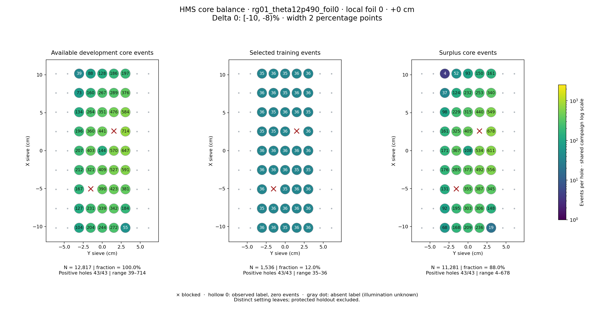
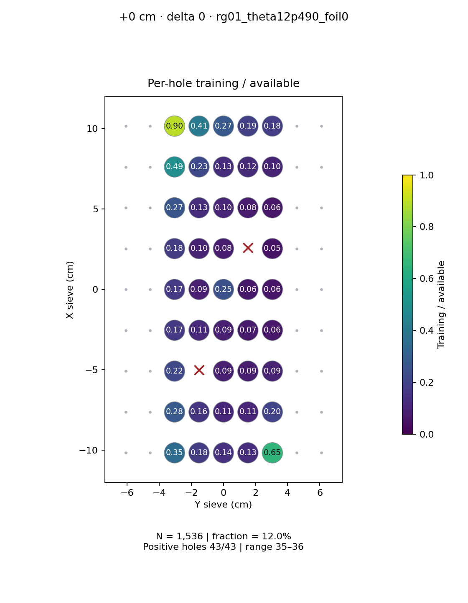
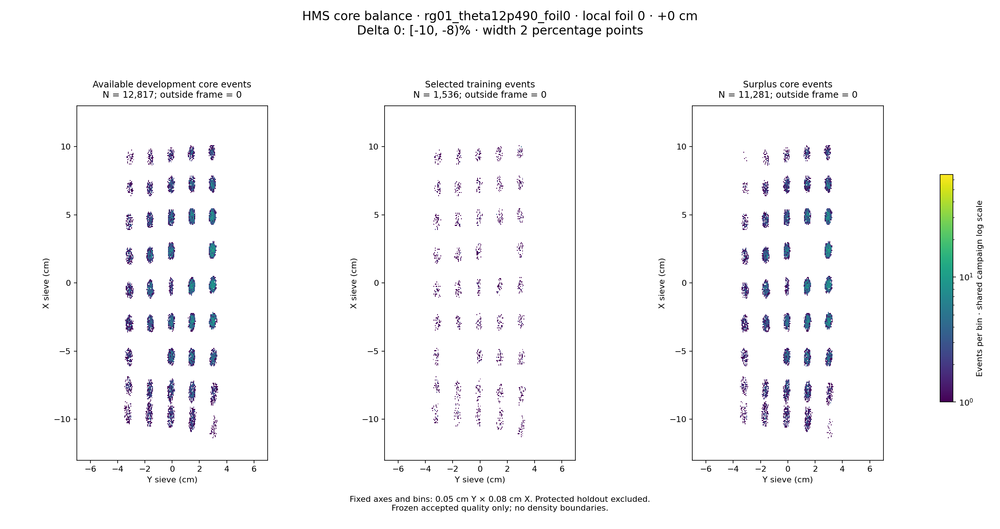

# rg01_theta12p490_foil0 · local foil 0 · +0 cm · delta 0

Interval [-10, -8)%, width 2 percentage points.

[Full-resolution training map](../plots/rg01_theta12p490_foil0_foil0_delta0_training.png) · [Full-resolution training cloud](../plots/rg01_theta12p490_foil0_foil0_delta0_training_cloud.png)

| rungroup | foil | xscol | yscol | available | q_hole | hole_cap | capacity | quota | actual_selected | surplus | qa_low | blocked |
|---|---|---|---|---|---|---|---|---|---|---|---|---|
| rg01_theta12p490_foil0 | 0 | 0 | 2 | 104 | 175.5 | 263 | 104 | 36 | 36 | 68 | False | False |
| rg01_theta12p490_foil0 | 0 | 0 | 3 | 204 | 175.5 | 263 | 204 | 36 | 36 | 168 | False | False |
| rg01_theta12p490_foil0 | 0 | 0 | 4 | 244 | 175.5 | 263 | 244 | 35 | 35 | 209 | False | False |
| rg01_theta12p490_foil0 | 0 | 0 | 5 | 272 | 175.5 | 263 | 263 | 36 | 36 | 236 | False | False |
| rg01_theta12p490_foil0 | 0 | 0 | 6 | 55 | 175.5 | 263 | 55 | 36 | 36 | 19 | False | False |
| rg01_theta12p490_foil0 | 0 | 1 | 2 | 127 | 175.5 | 263 | 127 | 35 | 35 | 92 | False | False |
| rg01_theta12p490_foil0 | 0 | 1 | 3 | 231 | 175.5 | 263 | 231 | 36 | 36 | 195 | False | False |
| rg01_theta12p490_foil0 | 0 | 1 | 4 | 339 | 175.5 | 263 | 263 | 36 | 36 | 303 | False | False |
| rg01_theta12p490_foil0 | 0 | 1 | 5 | 342 | 175.5 | 263 | 263 | 36 | 36 | 306 | False | False |
| rg01_theta12p490_foil0 | 0 | 1 | 6 | 184 | 175.5 | 263 | 184 | 36 | 36 | 148 | False | False |
| rg01_theta12p490_foil0 | 0 | 2 | 2 | 167 | 175.5 | 263 | 167 | 36 | 36 | 131 | False | False |
| rg01_theta12p490_foil0 | 0 | 2 | 3 | 0 | 175.5 | 263 | 0 | 0 | 0 | 0 | False | True |
| rg01_theta12p490_foil0 | 0 | 2 | 4 | 390 | 175.5 | 263 | 263 | 35 | 35 | 355 | False | False |
| rg01_theta12p490_foil0 | 0 | 2 | 5 | 423 | 175.5 | 263 | 263 | 36 | 36 | 387 | False | False |
| rg01_theta12p490_foil0 | 0 | 2 | 6 | 381 | 175.5 | 263 | 263 | 36 | 36 | 345 | False | False |
| rg01_theta12p490_foil0 | 0 | 3 | 2 | 212 | 175.5 | 263 | 212 | 36 | 36 | 176 | False | False |
| rg01_theta12p490_foil0 | 0 | 3 | 3 | 321 | 175.5 | 263 | 263 | 36 | 36 | 285 | False | False |
| rg01_theta12p490_foil0 | 0 | 3 | 4 | 409 | 175.5 | 263 | 263 | 36 | 36 | 373 | False | False |
| rg01_theta12p490_foil0 | 0 | 3 | 5 | 527 | 175.5 | 263 | 263 | 35 | 35 | 492 | False | False |
| rg01_theta12p490_foil0 | 0 | 3 | 6 | 591 | 175.5 | 263 | 263 | 35 | 35 | 556 | False | False |
| rg01_theta12p490_foil0 | 0 | 4 | 2 | 207 | 175.5 | 263 | 207 | 36 | 36 | 171 | False | False |
| rg01_theta12p490_foil0 | 0 | 4 | 3 | 403 | 175.5 | 263 | 263 | 36 | 36 | 367 | False | False |
| rg01_theta12p490_foil0 | 0 | 4 | 4 | 144 | 175.5 | 263 | 144 | 36 | 36 | 108 | False | False |
| rg01_theta12p490_foil0 | 0 | 4 | 5 | 570 | 175.5 | 263 | 263 | 36 | 36 | 534 | False | False |
| rg01_theta12p490_foil0 | 0 | 4 | 6 | 647 | 175.5 | 263 | 263 | 36 | 36 | 611 | False | False |
| rg01_theta12p490_foil0 | 0 | 5 | 2 | 196 | 175.5 | 263 | 196 | 35 | 35 | 161 | False | False |
| rg01_theta12p490_foil0 | 0 | 5 | 3 | 360 | 175.5 | 263 | 263 | 35 | 35 | 325 | False | False |
| rg01_theta12p490_foil0 | 0 | 5 | 4 | 441 | 175.5 | 263 | 263 | 36 | 36 | 405 | False | False |
| rg01_theta12p490_foil0 | 0 | 5 | 5 | 0 | 175.5 | 263 | 0 | 0 | 0 | 0 | False | True |
| rg01_theta12p490_foil0 | 0 | 5 | 6 | 714 | 175.5 | 263 | 263 | 36 | 36 | 678 | False | False |
| rg01_theta12p490_foil0 | 0 | 6 | 2 | 134 | 175.5 | 263 | 134 | 36 | 36 | 98 | False | False |
| rg01_theta12p490_foil0 | 0 | 6 | 3 | 264 | 175.5 | 263 | 263 | 35 | 35 | 229 | False | False |
| rg01_theta12p490_foil0 | 0 | 6 | 4 | 351 | 175.5 | 263 | 263 | 36 | 36 | 315 | False | False |
| rg01_theta12p490_foil0 | 0 | 6 | 5 | 476 | 175.5 | 263 | 263 | 36 | 36 | 440 | False | False |
| rg01_theta12p490_foil0 | 0 | 6 | 6 | 584 | 175.5 | 263 | 263 | 35 | 35 | 549 | False | False |
| rg01_theta12p490_foil0 | 0 | 7 | 2 | 73 | 175.5 | 263 | 73 | 36 | 36 | 37 | False | False |
| rg01_theta12p490_foil0 | 0 | 7 | 3 | 160 | 175.5 | 263 | 160 | 36 | 36 | 124 | False | False |
| rg01_theta12p490_foil0 | 0 | 7 | 4 | 267 | 175.5 | 263 | 263 | 35 | 35 | 232 | False | False |
| rg01_theta12p490_foil0 | 0 | 7 | 5 | 289 | 175.5 | 263 | 263 | 36 | 36 | 253 | False | False |
| rg01_theta12p490_foil0 | 0 | 7 | 6 | 376 | 175.5 | 263 | 263 | 36 | 36 | 340 | False | False |
| rg01_theta12p490_foil0 | 0 | 8 | 2 | 39 | 175.5 | 263 | 39 | 35 | 35 | 4 | False | False |
| rg01_theta12p490_foil0 | 0 | 8 | 3 | 88 | 175.5 | 263 | 88 | 36 | 36 | 52 | False | False |
| rg01_theta12p490_foil0 | 0 | 8 | 4 | 128 | 175.5 | 263 | 128 | 35 | 35 | 93 | False | False |
| rg01_theta12p490_foil0 | 0 | 8 | 5 | 186 | 175.5 | 263 | 186 | 36 | 36 | 150 | False | False |
| rg01_theta12p490_foil0 | 0 | 8 | 6 | 197 | 175.5 | 263 | 197 | 36 | 36 | 161 | False | False |
