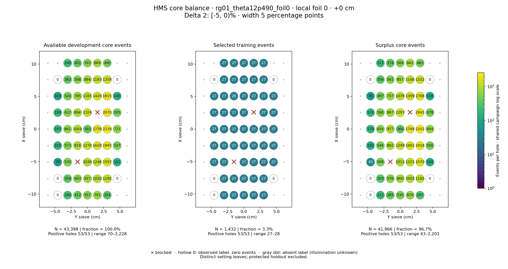
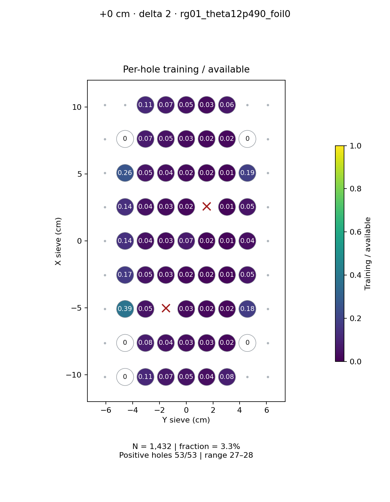
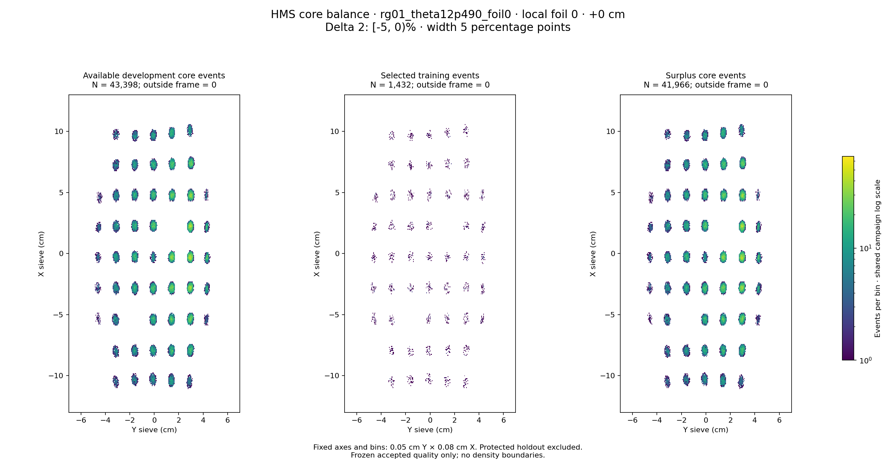

# rg01_theta12p490_foil0 · local foil 0 · +0 cm · delta 2

Interval [-5, 0)%, width 5 percentage points.

[Full-resolution training map](../plots/rg01_theta12p490_foil0_foil0_delta2_training.png) · [Full-resolution training cloud](../plots/rg01_theta12p490_foil0_foil0_delta2_training_cloud.png)

| rungroup | foil | xscol | yscol | available | q_hole | hole_cap | capacity | quota | actual_selected | surplus | qa_low | blocked |
|---|---|---|---|---|---|---|---|---|---|---|---|---|
| rg01_theta12p490_foil0 | 0 | 0 | 1 | 0 | 401 | 601 | 0 | 0 | 0 | 0 | False | False |
| rg01_theta12p490_foil0 | 0 | 0 | 2 | 240 | 401 | 601 | 240 | 27 | 27 | 213 | False | False |
| rg01_theta12p490_foil0 | 0 | 0 | 3 | 412 | 401 | 601 | 412 | 27 | 27 | 385 | False | False |
| rg01_theta12p490_foil0 | 0 | 0 | 4 | 557 | 401 | 601 | 557 | 27 | 27 | 530 | False | False |
| rg01_theta12p490_foil0 | 0 | 0 | 5 | 701 | 401 | 601 | 601 | 27 | 27 | 674 | False | False |
| rg01_theta12p490_foil0 | 0 | 0 | 6 | 324 | 401 | 601 | 324 | 27 | 27 | 297 | False | False |
| rg01_theta12p490_foil0 | 0 | 1 | 1 | 0 | 401 | 601 | 0 | 0 | 0 | 0 | False | False |
| rg01_theta12p490_foil0 | 0 | 1 | 2 | 356 | 401 | 601 | 356 | 27 | 27 | 329 | False | False |
| rg01_theta12p490_foil0 | 0 | 1 | 3 | 603 | 401 | 601 | 601 | 27 | 27 | 576 | False | False |
| rg01_theta12p490_foil0 | 0 | 1 | 4 | 827 | 401 | 601 | 601 | 27 | 27 | 800 | False | False |
| rg01_theta12p490_foil0 | 0 | 1 | 5 | 1030 | 401 | 601 | 601 | 27 | 27 | 1003 | False | False |
| rg01_theta12p490_foil0 | 0 | 1 | 6 | 1192 | 401 | 601 | 601 | 27 | 27 | 1165 | False | False |
| rg01_theta12p490_foil0 | 0 | 1 | 7 | 0 | 401 | 601 | 0 | 0 | 0 | 0 | False | False |
| rg01_theta12p490_foil0 | 0 | 2 | 1 | 70 | 401 | 601 | 70 | 27 | 27 | 43 | False | False |
| rg01_theta12p490_foil0 | 0 | 2 | 2 | 535 | 401 | 601 | 535 | 27 | 27 | 508 | False | False |
| rg01_theta12p490_foil0 | 0 | 2 | 3 | 0 | 401 | 601 | 0 | 0 | 0 | 0 | False | True |
| rg01_theta12p490_foil0 | 0 | 2 | 4 | 1038 | 401 | 601 | 601 | 27 | 27 | 1011 | False | False |
| rg01_theta12p490_foil0 | 0 | 2 | 5 | 1248 | 401 | 601 | 601 | 27 | 27 | 1221 | False | False |
| rg01_theta12p490_foil0 | 0 | 2 | 6 | 1597 | 401 | 601 | 601 | 27 | 27 | 1570 | False | False |
| rg01_theta12p490_foil0 | 0 | 2 | 7 | 151 | 401 | 601 | 151 | 27 | 27 | 124 | False | False |
| rg01_theta12p490_foil0 | 0 | 3 | 1 | 159 | 401 | 601 | 159 | 27 | 27 | 132 | False | False |
| rg01_theta12p490_foil0 | 0 | 3 | 2 | 573 | 401 | 601 | 573 | 27 | 27 | 546 | False | False |
| rg01_theta12p490_foil0 | 0 | 3 | 3 | 919 | 401 | 601 | 601 | 27 | 27 | 892 | False | False |
| rg01_theta12p490_foil0 | 0 | 3 | 4 | 1276 | 401 | 601 | 601 | 27 | 27 | 1249 | False | False |
| rg01_theta12p490_foil0 | 0 | 3 | 5 | 1628 | 401 | 601 | 601 | 27 | 27 | 1601 | False | False |
| rg01_theta12p490_foil0 | 0 | 3 | 6 | 1945 | 401 | 601 | 601 | 27 | 27 | 1918 | False | False |
| rg01_theta12p490_foil0 | 0 | 3 | 7 | 527 | 401 | 601 | 527 | 27 | 27 | 500 | False | False |
| rg01_theta12p490_foil0 | 0 | 4 | 1 | 197 | 401 | 601 | 197 | 27 | 27 | 170 | False | False |
| rg01_theta12p490_foil0 | 0 | 4 | 2 | 661 | 401 | 601 | 601 | 27 | 27 | 634 | False | False |
| rg01_theta12p490_foil0 | 0 | 4 | 3 | 1004 | 401 | 601 | 601 | 27 | 27 | 977 | False | False |
| rg01_theta12p490_foil0 | 0 | 4 | 4 | 393 | 401 | 601 | 393 | 27 | 27 | 366 | False | False |
| rg01_theta12p490_foil0 | 0 | 4 | 5 | 1776 | 401 | 601 | 601 | 27 | 27 | 1749 | False | False |
| rg01_theta12p490_foil0 | 0 | 4 | 6 | 2228 | 401 | 601 | 601 | 27 | 27 | 2201 | False | False |
| rg01_theta12p490_foil0 | 0 | 4 | 7 | 721 | 401 | 601 | 601 | 27 | 27 | 694 | False | False |
| rg01_theta12p490_foil0 | 0 | 5 | 1 | 199 | 401 | 601 | 199 | 27 | 27 | 172 | False | False |
| rg01_theta12p490_foil0 | 0 | 5 | 2 | 617 | 401 | 601 | 601 | 27 | 27 | 590 | False | False |
| rg01_theta12p490_foil0 | 0 | 5 | 3 | 894 | 401 | 601 | 601 | 27 | 27 | 867 | False | False |
| rg01_theta12p490_foil0 | 0 | 5 | 4 | 1324 | 401 | 601 | 601 | 27 | 27 | 1297 | False | False |
| rg01_theta12p490_foil0 | 0 | 5 | 5 | 0 | 401 | 601 | 0 | 0 | 0 | 0 | False | True |
| rg01_theta12p490_foil0 | 0 | 5 | 6 | 2070 | 401 | 601 | 601 | 27 | 27 | 2043 | False | False |
| rg01_theta12p490_foil0 | 0 | 5 | 7 | 505 | 401 | 601 | 505 | 27 | 27 | 478 | False | False |
| rg01_theta12p490_foil0 | 0 | 6 | 1 | 103 | 401 | 601 | 103 | 27 | 27 | 76 | False | False |
| rg01_theta12p490_foil0 | 0 | 6 | 2 | 524 | 401 | 601 | 524 | 27 | 27 | 497 | False | False |
| rg01_theta12p490_foil0 | 0 | 6 | 3 | 785 | 401 | 601 | 601 | 28 | 28 | 757 | False | False |
| rg01_theta12p490_foil0 | 0 | 6 | 4 | 1105 | 401 | 601 | 601 | 27 | 27 | 1078 | False | False |
| rg01_theta12p490_foil0 | 0 | 6 | 5 | 1426 | 401 | 601 | 601 | 27 | 27 | 1399 | False | False |
| rg01_theta12p490_foil0 | 0 | 6 | 6 | 1815 | 401 | 601 | 601 | 27 | 27 | 1788 | False | False |
| rg01_theta12p490_foil0 | 0 | 6 | 7 | 145 | 401 | 601 | 145 | 27 | 27 | 118 | False | False |
| rg01_theta12p490_foil0 | 0 | 7 | 1 | 0 | 401 | 601 | 0 | 0 | 0 | 0 | False | False |
| rg01_theta12p490_foil0 | 0 | 7 | 2 | 383 | 401 | 601 | 383 | 27 | 27 | 356 | False | False |
| rg01_theta12p490_foil0 | 0 | 7 | 3 | 588 | 401 | 601 | 588 | 27 | 27 | 561 | False | False |
| rg01_theta12p490_foil0 | 0 | 7 | 4 | 884 | 401 | 601 | 601 | 27 | 27 | 857 | False | False |
| rg01_theta12p490_foil0 | 0 | 7 | 5 | 1193 | 401 | 601 | 601 | 27 | 27 | 1166 | False | False |
| rg01_theta12p490_foil0 | 0 | 7 | 6 | 1359 | 401 | 601 | 601 | 27 | 27 | 1332 | False | False |
| rg01_theta12p490_foil0 | 0 | 7 | 7 | 0 | 401 | 601 | 0 | 0 | 0 | 0 | False | False |
| rg01_theta12p490_foil0 | 0 | 8 | 2 | 240 | 401 | 601 | 240 | 27 | 27 | 213 | False | False |
| rg01_theta12p490_foil0 | 0 | 8 | 3 | 401 | 401 | 601 | 401 | 27 | 27 | 374 | False | False |
| rg01_theta12p490_foil0 | 0 | 8 | 4 | 591 | 401 | 601 | 591 | 27 | 27 | 564 | False | False |
| rg01_theta12p490_foil0 | 0 | 8 | 5 | 869 | 401 | 601 | 601 | 27 | 27 | 842 | False | False |
| rg01_theta12p490_foil0 | 0 | 8 | 6 | 490 | 401 | 601 | 490 | 27 | 27 | 463 | False | False |
