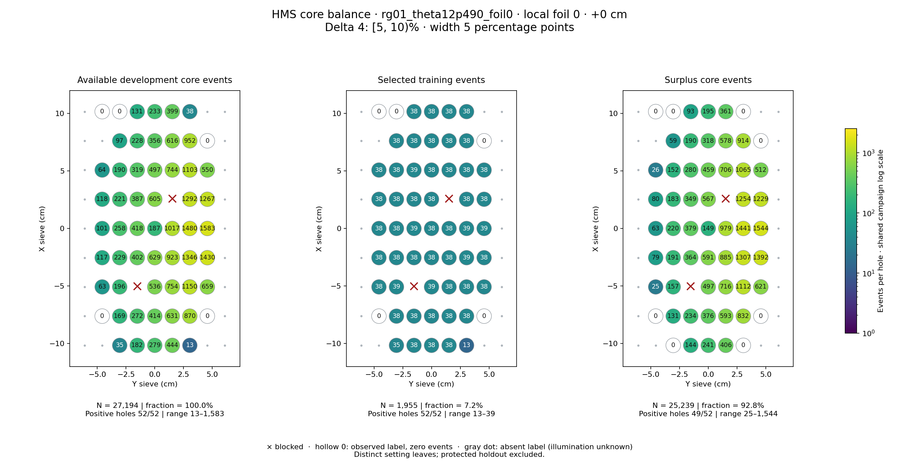
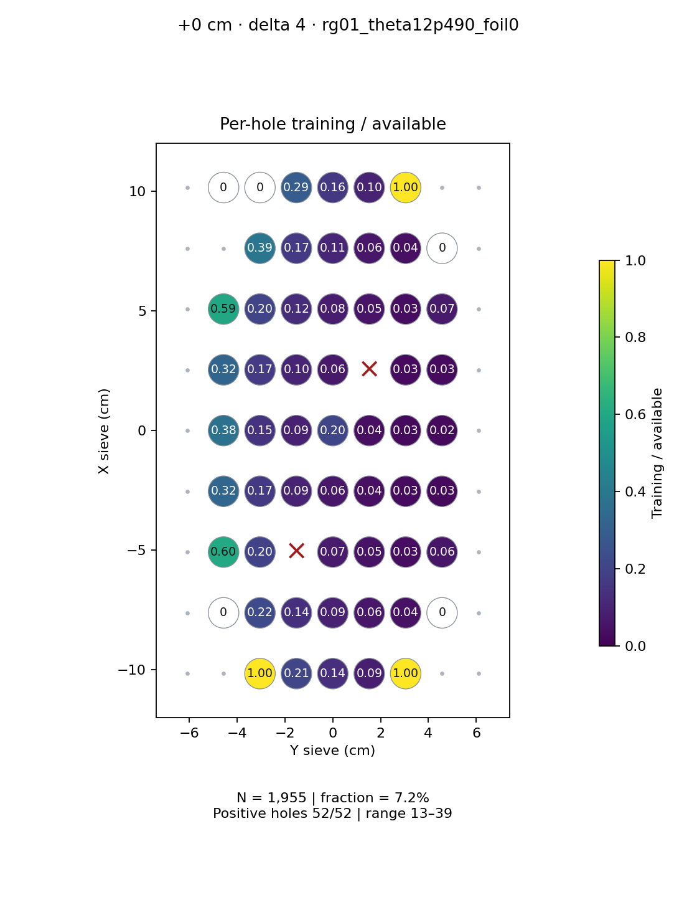
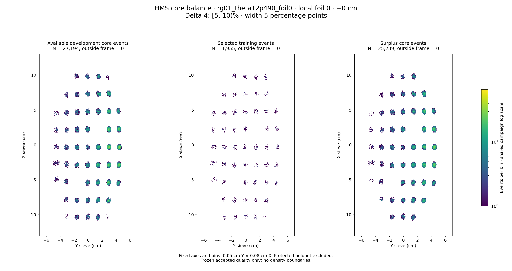

# rg01_theta12p490_foil0 · local foil 0 · +0 cm · delta 4

Interval [5, 10)%, width 5 percentage points.

[Full-resolution training map](../plots/rg01_theta12p490_foil0_foil0_delta4_training.png) · [Full-resolution training cloud](../plots/rg01_theta12p490_foil0_foil0_delta4_training_cloud.png)

| rungroup | foil | xscol | yscol | available | q_hole | hole_cap | capacity | quota | actual_selected | surplus | qa_low | blocked |
|---|---|---|---|---|---|---|---|---|---|---|---|---|
| rg01_theta12p490_foil0 | 0 | 0 | 2 | 35 | 189.2 | 283 | 35 | 35 | 35 | 0 | False | False |
| rg01_theta12p490_foil0 | 0 | 0 | 3 | 182 | 189.2 | 283 | 182 | 38 | 38 | 144 | False | False |
| rg01_theta12p490_foil0 | 0 | 0 | 4 | 279 | 189.2 | 283 | 279 | 38 | 38 | 241 | False | False |
| rg01_theta12p490_foil0 | 0 | 0 | 5 | 444 | 189.2 | 283 | 283 | 38 | 38 | 406 | False | False |
| rg01_theta12p490_foil0 | 0 | 0 | 6 | 13 | 189.2 | 283 | 13 | 13 | 13 | 0 | False | False |
| rg01_theta12p490_foil0 | 0 | 1 | 1 | 0 | 189.2 | 283 | 0 | 0 | 0 | 0 | False | False |
| rg01_theta12p490_foil0 | 0 | 1 | 2 | 169 | 189.2 | 283 | 169 | 38 | 38 | 131 | False | False |
| rg01_theta12p490_foil0 | 0 | 1 | 3 | 272 | 189.2 | 283 | 272 | 38 | 38 | 234 | False | False |
| rg01_theta12p490_foil0 | 0 | 1 | 4 | 414 | 189.2 | 283 | 283 | 38 | 38 | 376 | False | False |
| rg01_theta12p490_foil0 | 0 | 1 | 5 | 631 | 189.2 | 283 | 283 | 38 | 38 | 593 | False | False |
| rg01_theta12p490_foil0 | 0 | 1 | 6 | 870 | 189.2 | 283 | 283 | 38 | 38 | 832 | False | False |
| rg01_theta12p490_foil0 | 0 | 1 | 7 | 0 | 189.2 | 283 | 0 | 0 | 0 | 0 | False | False |
| rg01_theta12p490_foil0 | 0 | 2 | 1 | 63 | 189.2 | 283 | 63 | 38 | 38 | 25 | False | False |
| rg01_theta12p490_foil0 | 0 | 2 | 2 | 196 | 189.2 | 283 | 196 | 39 | 39 | 157 | False | False |
| rg01_theta12p490_foil0 | 0 | 2 | 3 | 0 | 189.2 | 283 | 0 | 0 | 0 | 0 | False | True |
| rg01_theta12p490_foil0 | 0 | 2 | 4 | 536 | 189.2 | 283 | 283 | 39 | 39 | 497 | False | False |
| rg01_theta12p490_foil0 | 0 | 2 | 5 | 754 | 189.2 | 283 | 283 | 38 | 38 | 716 | False | False |
| rg01_theta12p490_foil0 | 0 | 2 | 6 | 1150 | 189.2 | 283 | 283 | 38 | 38 | 1112 | False | False |
| rg01_theta12p490_foil0 | 0 | 2 | 7 | 659 | 189.2 | 283 | 283 | 38 | 38 | 621 | False | False |
| rg01_theta12p490_foil0 | 0 | 3 | 1 | 117 | 189.2 | 283 | 117 | 38 | 38 | 79 | False | False |
| rg01_theta12p490_foil0 | 0 | 3 | 2 | 229 | 189.2 | 283 | 229 | 38 | 38 | 191 | False | False |
| rg01_theta12p490_foil0 | 0 | 3 | 3 | 402 | 189.2 | 283 | 283 | 38 | 38 | 364 | False | False |
| rg01_theta12p490_foil0 | 0 | 3 | 4 | 629 | 189.2 | 283 | 283 | 38 | 38 | 591 | False | False |
| rg01_theta12p490_foil0 | 0 | 3 | 5 | 923 | 189.2 | 283 | 283 | 38 | 38 | 885 | False | False |
| rg01_theta12p490_foil0 | 0 | 3 | 6 | 1346 | 189.2 | 283 | 283 | 39 | 39 | 1307 | False | False |
| rg01_theta12p490_foil0 | 0 | 3 | 7 | 1430 | 189.2 | 283 | 283 | 38 | 38 | 1392 | False | False |
| rg01_theta12p490_foil0 | 0 | 4 | 1 | 101 | 189.2 | 283 | 101 | 38 | 38 | 63 | False | False |
| rg01_theta12p490_foil0 | 0 | 4 | 2 | 258 | 189.2 | 283 | 258 | 38 | 38 | 220 | False | False |
| rg01_theta12p490_foil0 | 0 | 4 | 3 | 418 | 189.2 | 283 | 283 | 39 | 39 | 379 | False | False |
| rg01_theta12p490_foil0 | 0 | 4 | 4 | 187 | 189.2 | 283 | 187 | 38 | 38 | 149 | False | False |
| rg01_theta12p490_foil0 | 0 | 4 | 5 | 1017 | 189.2 | 283 | 283 | 38 | 38 | 979 | False | False |
| rg01_theta12p490_foil0 | 0 | 4 | 6 | 1480 | 189.2 | 283 | 283 | 39 | 39 | 1441 | False | False |
| rg01_theta12p490_foil0 | 0 | 4 | 7 | 1583 | 189.2 | 283 | 283 | 39 | 39 | 1544 | False | False |
| rg01_theta12p490_foil0 | 0 | 5 | 1 | 118 | 189.2 | 283 | 118 | 38 | 38 | 80 | False | False |
| rg01_theta12p490_foil0 | 0 | 5 | 2 | 221 | 189.2 | 283 | 221 | 38 | 38 | 183 | False | False |
| rg01_theta12p490_foil0 | 0 | 5 | 3 | 387 | 189.2 | 283 | 283 | 38 | 38 | 349 | False | False |
| rg01_theta12p490_foil0 | 0 | 5 | 4 | 605 | 189.2 | 283 | 283 | 38 | 38 | 567 | False | False |
| rg01_theta12p490_foil0 | 0 | 5 | 5 | 0 | 189.2 | 283 | 0 | 0 | 0 | 0 | False | True |
| rg01_theta12p490_foil0 | 0 | 5 | 6 | 1292 | 189.2 | 283 | 283 | 38 | 38 | 1254 | False | False |
| rg01_theta12p490_foil0 | 0 | 5 | 7 | 1267 | 189.2 | 283 | 283 | 38 | 38 | 1229 | False | False |
| rg01_theta12p490_foil0 | 0 | 6 | 1 | 64 | 189.2 | 283 | 64 | 38 | 38 | 26 | False | False |
| rg01_theta12p490_foil0 | 0 | 6 | 2 | 190 | 189.2 | 283 | 190 | 38 | 38 | 152 | False | False |
| rg01_theta12p490_foil0 | 0 | 6 | 3 | 319 | 189.2 | 283 | 283 | 39 | 39 | 280 | False | False |
| rg01_theta12p490_foil0 | 0 | 6 | 4 | 497 | 189.2 | 283 | 283 | 38 | 38 | 459 | False | False |
| rg01_theta12p490_foil0 | 0 | 6 | 5 | 744 | 189.2 | 283 | 283 | 38 | 38 | 706 | False | False |
| rg01_theta12p490_foil0 | 0 | 6 | 6 | 1103 | 189.2 | 283 | 283 | 38 | 38 | 1065 | False | False |
| rg01_theta12p490_foil0 | 0 | 6 | 7 | 550 | 189.2 | 283 | 283 | 38 | 38 | 512 | False | False |
| rg01_theta12p490_foil0 | 0 | 7 | 2 | 97 | 189.2 | 283 | 97 | 38 | 38 | 59 | False | False |
| rg01_theta12p490_foil0 | 0 | 7 | 3 | 228 | 189.2 | 283 | 228 | 38 | 38 | 190 | False | False |
| rg01_theta12p490_foil0 | 0 | 7 | 4 | 356 | 189.2 | 283 | 283 | 38 | 38 | 318 | False | False |
| rg01_theta12p490_foil0 | 0 | 7 | 5 | 616 | 189.2 | 283 | 283 | 38 | 38 | 578 | False | False |
| rg01_theta12p490_foil0 | 0 | 7 | 6 | 952 | 189.2 | 283 | 283 | 38 | 38 | 914 | False | False |
| rg01_theta12p490_foil0 | 0 | 7 | 7 | 0 | 189.2 | 283 | 0 | 0 | 0 | 0 | False | False |
| rg01_theta12p490_foil0 | 0 | 8 | 1 | 0 | 189.2 | 283 | 0 | 0 | 0 | 0 | False | False |
| rg01_theta12p490_foil0 | 0 | 8 | 2 | 0 | 189.2 | 283 | 0 | 0 | 0 | 0 | False | False |
| rg01_theta12p490_foil0 | 0 | 8 | 3 | 131 | 189.2 | 283 | 131 | 38 | 38 | 93 | False | False |
| rg01_theta12p490_foil0 | 0 | 8 | 4 | 233 | 189.2 | 283 | 233 | 38 | 38 | 195 | False | False |
| rg01_theta12p490_foil0 | 0 | 8 | 5 | 399 | 189.2 | 283 | 283 | 38 | 38 | 361 | False | False |
| rg01_theta12p490_foil0 | 0 | 8 | 6 | 38 | 189.2 | 283 | 38 | 38 | 38 | 0 | False | False |
