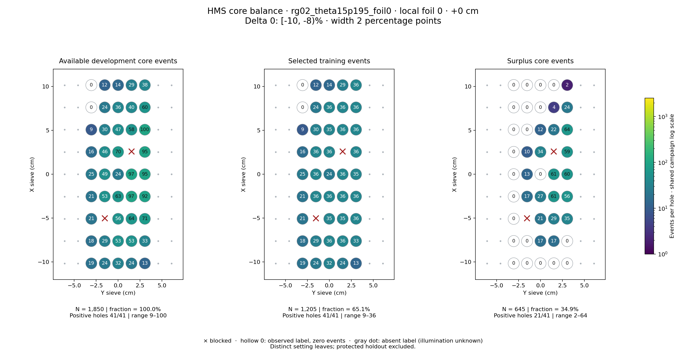
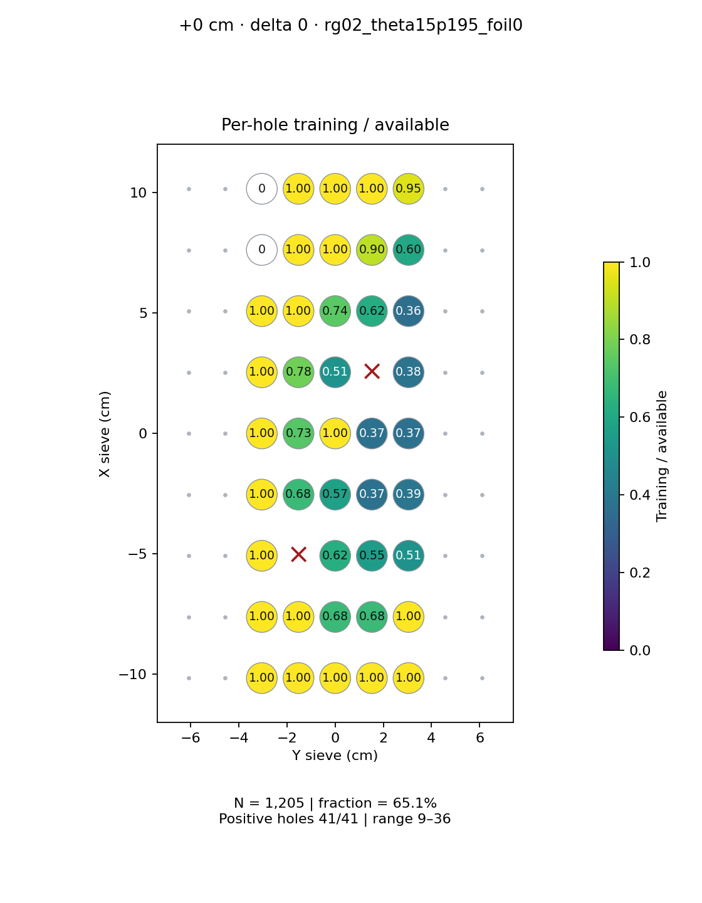
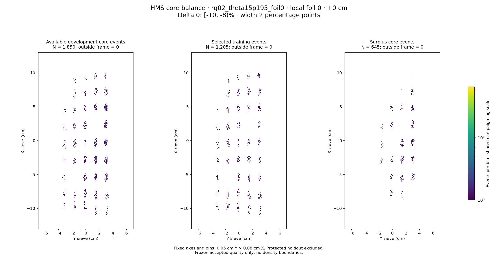

# rg02_theta15p195_foil0 · local foil 0 · +0 cm · delta 0

Interval [-10, -8)%, width 2 percentage points.

[Full-resolution training map](../plots/rg02_theta15p195_foil0_foil0_delta0_training.png) · [Full-resolution training cloud](../plots/rg02_theta15p195_foil0_foil0_delta0_training_cloud.png)

| rungroup | foil | xscol | yscol | available | q_hole | hole_cap | capacity | quota | actual_selected | surplus | qa_low | blocked |
|---|---|---|---|---|---|---|---|---|---|---|---|---|
| rg02_theta15p195_foil0 | 0 | 0 | 2 | 19 | 24 | 36 | 19 | 19 | 19 | 0 | False | False |
| rg02_theta15p195_foil0 | 0 | 0 | 3 | 24 | 24 | 36 | 24 | 24 | 24 | 0 | False | False |
| rg02_theta15p195_foil0 | 0 | 0 | 4 | 32 | 24 | 36 | 32 | 32 | 32 | 0 | False | False |
| rg02_theta15p195_foil0 | 0 | 0 | 5 | 24 | 24 | 36 | 24 | 24 | 24 | 0 | False | False |
| rg02_theta15p195_foil0 | 0 | 0 | 6 | 13 | 24 | 36 | 13 | 13 | 13 | 0 | False | False |
| rg02_theta15p195_foil0 | 0 | 1 | 2 | 18 | 24 | 36 | 18 | 18 | 18 | 0 | False | False |
| rg02_theta15p195_foil0 | 0 | 1 | 3 | 29 | 24 | 36 | 29 | 29 | 29 | 0 | False | False |
| rg02_theta15p195_foil0 | 0 | 1 | 4 | 53 | 24 | 36 | 36 | 36 | 36 | 17 | False | False |
| rg02_theta15p195_foil0 | 0 | 1 | 5 | 53 | 24 | 36 | 36 | 36 | 36 | 17 | False | False |
| rg02_theta15p195_foil0 | 0 | 1 | 6 | 33 | 24 | 36 | 33 | 33 | 33 | 0 | False | False |
| rg02_theta15p195_foil0 | 0 | 2 | 2 | 21 | 24 | 36 | 21 | 21 | 21 | 0 | False | False |
| rg02_theta15p195_foil0 | 0 | 2 | 3 | 0 | 24 | 36 | 0 | 0 | 0 | 0 | False | True |
| rg02_theta15p195_foil0 | 0 | 2 | 4 | 56 | 24 | 36 | 36 | 35 | 35 | 21 | False | False |
| rg02_theta15p195_foil0 | 0 | 2 | 5 | 64 | 24 | 36 | 36 | 35 | 35 | 29 | False | False |
| rg02_theta15p195_foil0 | 0 | 2 | 6 | 71 | 24 | 36 | 36 | 36 | 36 | 35 | False | False |
| rg02_theta15p195_foil0 | 0 | 3 | 2 | 21 | 24 | 36 | 21 | 21 | 21 | 0 | False | False |
| rg02_theta15p195_foil0 | 0 | 3 | 3 | 53 | 24 | 36 | 36 | 36 | 36 | 17 | False | False |
| rg02_theta15p195_foil0 | 0 | 3 | 4 | 63 | 24 | 36 | 36 | 36 | 36 | 27 | False | False |
| rg02_theta15p195_foil0 | 0 | 3 | 5 | 97 | 24 | 36 | 36 | 36 | 36 | 61 | False | False |
| rg02_theta15p195_foil0 | 0 | 3 | 6 | 92 | 24 | 36 | 36 | 36 | 36 | 56 | False | False |
| rg02_theta15p195_foil0 | 0 | 4 | 2 | 25 | 24 | 36 | 25 | 25 | 25 | 0 | False | False |
| rg02_theta15p195_foil0 | 0 | 4 | 3 | 49 | 24 | 36 | 36 | 36 | 36 | 13 | False | False |
| rg02_theta15p195_foil0 | 0 | 4 | 4 | 24 | 24 | 36 | 24 | 24 | 24 | 0 | False | False |
| rg02_theta15p195_foil0 | 0 | 4 | 5 | 97 | 24 | 36 | 36 | 36 | 36 | 61 | False | False |
| rg02_theta15p195_foil0 | 0 | 4 | 6 | 95 | 24 | 36 | 36 | 35 | 35 | 60 | False | False |
| rg02_theta15p195_foil0 | 0 | 5 | 2 | 16 | 24 | 36 | 16 | 16 | 16 | 0 | False | False |
| rg02_theta15p195_foil0 | 0 | 5 | 3 | 46 | 24 | 36 | 36 | 36 | 36 | 10 | False | False |
| rg02_theta15p195_foil0 | 0 | 5 | 4 | 70 | 24 | 36 | 36 | 36 | 36 | 34 | False | False |
| rg02_theta15p195_foil0 | 0 | 5 | 5 | 0 | 24 | 36 | 0 | 0 | 0 | 0 | False | True |
| rg02_theta15p195_foil0 | 0 | 5 | 6 | 95 | 24 | 36 | 36 | 36 | 36 | 59 | False | False |
| rg02_theta15p195_foil0 | 0 | 6 | 2 | 9 | 24 | 36 | 9 | 9 | 9 | 0 | True | False |
| rg02_theta15p195_foil0 | 0 | 6 | 3 | 30 | 24 | 36 | 30 | 30 | 30 | 0 | False | False |
| rg02_theta15p195_foil0 | 0 | 6 | 4 | 47 | 24 | 36 | 36 | 35 | 35 | 12 | False | False |
| rg02_theta15p195_foil0 | 0 | 6 | 5 | 58 | 24 | 36 | 36 | 36 | 36 | 22 | False | False |
| rg02_theta15p195_foil0 | 0 | 6 | 6 | 100 | 24 | 36 | 36 | 36 | 36 | 64 | False | False |
| rg02_theta15p195_foil0 | 0 | 7 | 2 | 0 | 24 | 36 | 0 | 0 | 0 | 0 | False | False |
| rg02_theta15p195_foil0 | 0 | 7 | 3 | 24 | 24 | 36 | 24 | 24 | 24 | 0 | False | False |
| rg02_theta15p195_foil0 | 0 | 7 | 4 | 36 | 24 | 36 | 36 | 36 | 36 | 0 | False | False |
| rg02_theta15p195_foil0 | 0 | 7 | 5 | 40 | 24 | 36 | 36 | 36 | 36 | 4 | False | False |
| rg02_theta15p195_foil0 | 0 | 7 | 6 | 60 | 24 | 36 | 36 | 36 | 36 | 24 | False | False |
| rg02_theta15p195_foil0 | 0 | 8 | 2 | 0 | 24 | 36 | 0 | 0 | 0 | 0 | False | False |
| rg02_theta15p195_foil0 | 0 | 8 | 3 | 12 | 24 | 36 | 12 | 12 | 12 | 0 | False | False |
| rg02_theta15p195_foil0 | 0 | 8 | 4 | 14 | 24 | 36 | 14 | 14 | 14 | 0 | False | False |
| rg02_theta15p195_foil0 | 0 | 8 | 5 | 29 | 24 | 36 | 29 | 29 | 29 | 0 | False | False |
| rg02_theta15p195_foil0 | 0 | 8 | 6 | 38 | 24 | 36 | 36 | 36 | 36 | 2 | False | False |
