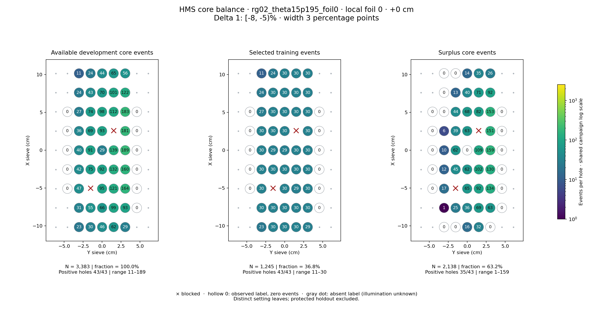
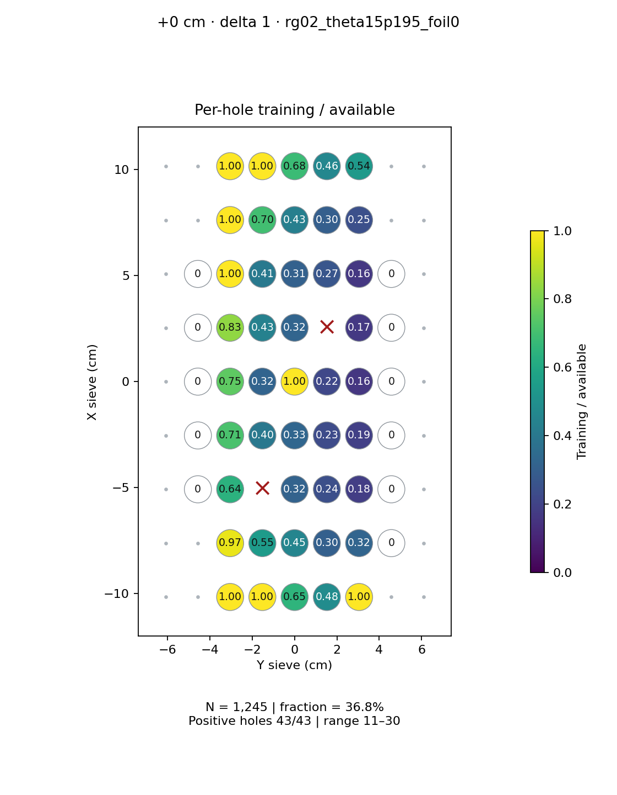
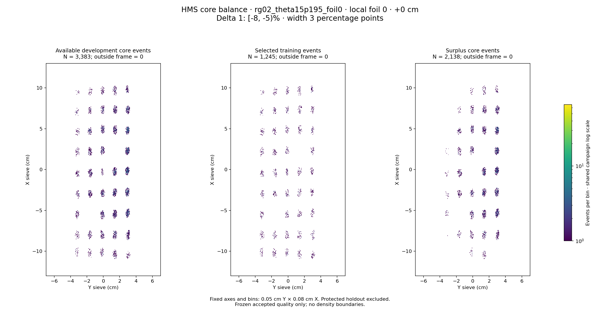

# rg02_theta15p195_foil0 · local foil 0 · +0 cm · delta 1

Interval [-8, -5)%, width 3 percentage points.

[Full-resolution training map](../plots/rg02_theta15p195_foil0_foil0_delta1_training.png) · [Full-resolution training cloud](../plots/rg02_theta15p195_foil0_foil0_delta1_training_cloud.png)

| rungroup | foil | xscol | yscol | available | q_hole | hole_cap | capacity | quota | actual_selected | surplus | qa_low | blocked |
|---|---|---|---|---|---|---|---|---|---|---|---|---|
| rg02_theta15p195_foil0 | 0 | 0 | 2 | 23 | 41 | 61 | 23 | 23 | 23 | 0 | False | False |
| rg02_theta15p195_foil0 | 0 | 0 | 3 | 30 | 41 | 61 | 30 | 30 | 30 | 0 | False | False |
| rg02_theta15p195_foil0 | 0 | 0 | 4 | 46 | 41 | 61 | 46 | 30 | 30 | 16 | False | False |
| rg02_theta15p195_foil0 | 0 | 0 | 5 | 62 | 41 | 61 | 61 | 30 | 30 | 32 | False | False |
| rg02_theta15p195_foil0 | 0 | 0 | 6 | 29 | 41 | 61 | 29 | 29 | 29 | 0 | False | False |
| rg02_theta15p195_foil0 | 0 | 1 | 2 | 31 | 41 | 61 | 31 | 30 | 30 | 1 | False | False |
| rg02_theta15p195_foil0 | 0 | 1 | 3 | 55 | 41 | 61 | 55 | 30 | 30 | 25 | False | False |
| rg02_theta15p195_foil0 | 0 | 1 | 4 | 66 | 41 | 61 | 61 | 30 | 30 | 36 | False | False |
| rg02_theta15p195_foil0 | 0 | 1 | 5 | 99 | 41 | 61 | 61 | 30 | 30 | 69 | False | False |
| rg02_theta15p195_foil0 | 0 | 1 | 6 | 93 | 41 | 61 | 61 | 30 | 30 | 63 | False | False |
| rg02_theta15p195_foil0 | 0 | 1 | 7 | 0 | 41 | 61 | 0 | 0 | 0 | 0 | False | False |
| rg02_theta15p195_foil0 | 0 | 2 | 1 | 0 | 41 | 61 | 0 | 0 | 0 | 0 | False | False |
| rg02_theta15p195_foil0 | 0 | 2 | 2 | 47 | 41 | 61 | 47 | 30 | 30 | 17 | False | False |
| rg02_theta15p195_foil0 | 0 | 2 | 3 | 0 | 41 | 61 | 0 | 0 | 0 | 0 | False | True |
| rg02_theta15p195_foil0 | 0 | 2 | 4 | 95 | 41 | 61 | 61 | 30 | 30 | 65 | False | False |
| rg02_theta15p195_foil0 | 0 | 2 | 5 | 121 | 41 | 61 | 61 | 29 | 29 | 92 | False | False |
| rg02_theta15p195_foil0 | 0 | 2 | 6 | 164 | 41 | 61 | 61 | 30 | 30 | 134 | False | False |
| rg02_theta15p195_foil0 | 0 | 2 | 7 | 0 | 41 | 61 | 0 | 0 | 0 | 0 | False | False |
| rg02_theta15p195_foil0 | 0 | 3 | 1 | 0 | 41 | 61 | 0 | 0 | 0 | 0 | False | False |
| rg02_theta15p195_foil0 | 0 | 3 | 2 | 42 | 41 | 61 | 42 | 30 | 30 | 12 | False | False |
| rg02_theta15p195_foil0 | 0 | 3 | 3 | 75 | 41 | 61 | 61 | 30 | 30 | 45 | False | False |
| rg02_theta15p195_foil0 | 0 | 3 | 4 | 92 | 41 | 61 | 61 | 30 | 30 | 62 | False | False |
| rg02_theta15p195_foil0 | 0 | 3 | 5 | 132 | 41 | 61 | 61 | 30 | 30 | 102 | False | False |
| rg02_theta15p195_foil0 | 0 | 3 | 6 | 160 | 41 | 61 | 61 | 30 | 30 | 130 | False | False |
| rg02_theta15p195_foil0 | 0 | 3 | 7 | 0 | 41 | 61 | 0 | 0 | 0 | 0 | False | False |
| rg02_theta15p195_foil0 | 0 | 4 | 1 | 0 | 41 | 61 | 0 | 0 | 0 | 0 | False | False |
| rg02_theta15p195_foil0 | 0 | 4 | 2 | 40 | 41 | 61 | 40 | 30 | 30 | 10 | False | False |
| rg02_theta15p195_foil0 | 0 | 4 | 3 | 91 | 41 | 61 | 61 | 29 | 29 | 62 | False | False |
| rg02_theta15p195_foil0 | 0 | 4 | 4 | 29 | 41 | 61 | 29 | 29 | 29 | 0 | False | False |
| rg02_theta15p195_foil0 | 0 | 4 | 5 | 139 | 41 | 61 | 61 | 30 | 30 | 109 | False | False |
| rg02_theta15p195_foil0 | 0 | 4 | 6 | 189 | 41 | 61 | 61 | 30 | 30 | 159 | False | False |
| rg02_theta15p195_foil0 | 0 | 4 | 7 | 0 | 41 | 61 | 0 | 0 | 0 | 0 | False | False |
| rg02_theta15p195_foil0 | 0 | 5 | 1 | 0 | 41 | 61 | 0 | 0 | 0 | 0 | False | False |
| rg02_theta15p195_foil0 | 0 | 5 | 2 | 36 | 41 | 61 | 36 | 30 | 30 | 6 | False | False |
| rg02_theta15p195_foil0 | 0 | 5 | 3 | 69 | 41 | 61 | 61 | 30 | 30 | 39 | False | False |
| rg02_theta15p195_foil0 | 0 | 5 | 4 | 93 | 41 | 61 | 61 | 30 | 30 | 63 | False | False |
| rg02_theta15p195_foil0 | 0 | 5 | 5 | 0 | 41 | 61 | 0 | 0 | 0 | 0 | False | True |
| rg02_theta15p195_foil0 | 0 | 5 | 6 | 181 | 41 | 61 | 61 | 30 | 30 | 151 | False | False |
| rg02_theta15p195_foil0 | 0 | 5 | 7 | 0 | 41 | 61 | 0 | 0 | 0 | 0 | False | False |
| rg02_theta15p195_foil0 | 0 | 6 | 1 | 0 | 41 | 61 | 0 | 0 | 0 | 0 | False | False |
| rg02_theta15p195_foil0 | 0 | 6 | 2 | 27 | 41 | 61 | 27 | 27 | 27 | 0 | False | False |
| rg02_theta15p195_foil0 | 0 | 6 | 3 | 74 | 41 | 61 | 61 | 30 | 30 | 44 | False | False |
| rg02_theta15p195_foil0 | 0 | 6 | 4 | 98 | 41 | 61 | 61 | 30 | 30 | 68 | False | False |
| rg02_theta15p195_foil0 | 0 | 6 | 5 | 112 | 41 | 61 | 61 | 30 | 30 | 82 | False | False |
| rg02_theta15p195_foil0 | 0 | 6 | 6 | 183 | 41 | 61 | 61 | 30 | 30 | 153 | False | False |
| rg02_theta15p195_foil0 | 0 | 6 | 7 | 0 | 41 | 61 | 0 | 0 | 0 | 0 | False | False |
| rg02_theta15p195_foil0 | 0 | 7 | 2 | 24 | 41 | 61 | 24 | 24 | 24 | 0 | False | False |
| rg02_theta15p195_foil0 | 0 | 7 | 3 | 43 | 41 | 61 | 43 | 30 | 30 | 13 | False | False |
| rg02_theta15p195_foil0 | 0 | 7 | 4 | 70 | 41 | 61 | 61 | 30 | 30 | 40 | False | False |
| rg02_theta15p195_foil0 | 0 | 7 | 5 | 101 | 41 | 61 | 61 | 30 | 30 | 71 | False | False |
| rg02_theta15p195_foil0 | 0 | 7 | 6 | 122 | 41 | 61 | 61 | 30 | 30 | 92 | False | False |
| rg02_theta15p195_foil0 | 0 | 8 | 2 | 11 | 41 | 61 | 11 | 11 | 11 | 0 | False | False |
| rg02_theta15p195_foil0 | 0 | 8 | 3 | 24 | 41 | 61 | 24 | 24 | 24 | 0 | False | False |
| rg02_theta15p195_foil0 | 0 | 8 | 4 | 44 | 41 | 61 | 44 | 30 | 30 | 14 | False | False |
| rg02_theta15p195_foil0 | 0 | 8 | 5 | 65 | 41 | 61 | 61 | 30 | 30 | 35 | False | False |
| rg02_theta15p195_foil0 | 0 | 8 | 6 | 56 | 41 | 61 | 56 | 30 | 30 | 26 | False | False |
