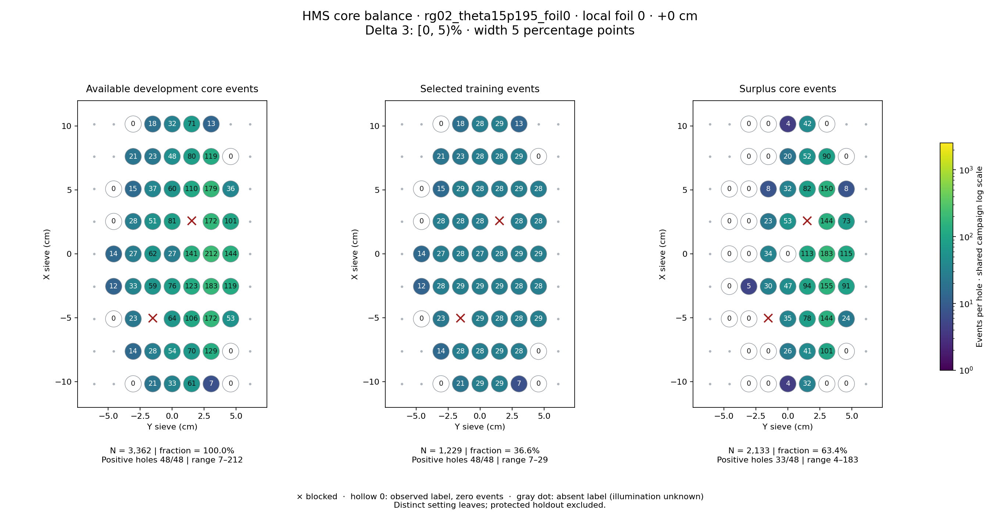
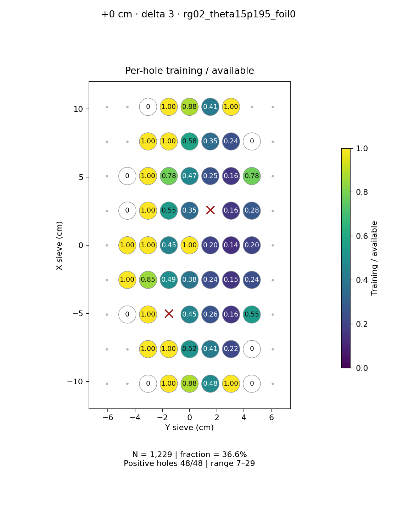
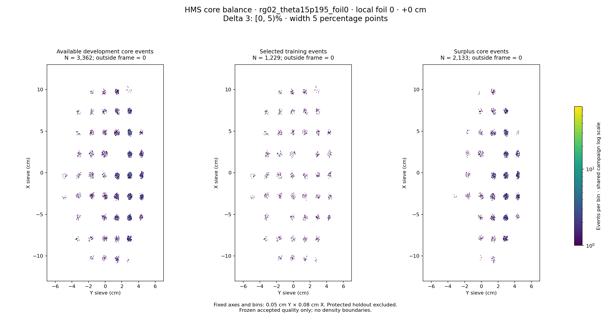

# rg02_theta15p195_foil0 · local foil 0 · +0 cm · delta 3

Interval [0, 5)%, width 5 percentage points.

[Full-resolution training map](../plots/rg02_theta15p195_foil0_foil0_delta3_training.png) · [Full-resolution training cloud](../plots/rg02_theta15p195_foil0_foil0_delta3_training_cloud.png)

| rungroup | foil | xscol | yscol | available | q_hole | hole_cap | capacity | quota | actual_selected | surplus | qa_low | blocked |
|---|---|---|---|---|---|---|---|---|---|---|---|---|
| rg02_theta15p195_foil0 | 0 | 0 | 2 | 0 | 27 | 40 | 0 | 0 | 0 | 0 | False | False |
| rg02_theta15p195_foil0 | 0 | 0 | 3 | 21 | 27 | 40 | 21 | 21 | 21 | 0 | False | False |
| rg02_theta15p195_foil0 | 0 | 0 | 4 | 33 | 27 | 40 | 33 | 29 | 29 | 4 | False | False |
| rg02_theta15p195_foil0 | 0 | 0 | 5 | 61 | 27 | 40 | 40 | 29 | 29 | 32 | False | False |
| rg02_theta15p195_foil0 | 0 | 0 | 6 | 7 | 27 | 40 | 7 | 7 | 7 | 0 | True | False |
| rg02_theta15p195_foil0 | 0 | 0 | 7 | 0 | 27 | 40 | 0 | 0 | 0 | 0 | False | False |
| rg02_theta15p195_foil0 | 0 | 1 | 2 | 14 | 27 | 40 | 14 | 14 | 14 | 0 | False | False |
| rg02_theta15p195_foil0 | 0 | 1 | 3 | 28 | 27 | 40 | 28 | 28 | 28 | 0 | False | False |
| rg02_theta15p195_foil0 | 0 | 1 | 4 | 54 | 27 | 40 | 40 | 28 | 28 | 26 | False | False |
| rg02_theta15p195_foil0 | 0 | 1 | 5 | 70 | 27 | 40 | 40 | 29 | 29 | 41 | False | False |
| rg02_theta15p195_foil0 | 0 | 1 | 6 | 129 | 27 | 40 | 40 | 28 | 28 | 101 | False | False |
| rg02_theta15p195_foil0 | 0 | 1 | 7 | 0 | 27 | 40 | 0 | 0 | 0 | 0 | False | False |
| rg02_theta15p195_foil0 | 0 | 2 | 1 | 0 | 27 | 40 | 0 | 0 | 0 | 0 | False | False |
| rg02_theta15p195_foil0 | 0 | 2 | 2 | 23 | 27 | 40 | 23 | 23 | 23 | 0 | False | False |
| rg02_theta15p195_foil0 | 0 | 2 | 3 | 0 | 27 | 40 | 0 | 0 | 0 | 0 | False | True |
| rg02_theta15p195_foil0 | 0 | 2 | 4 | 64 | 27 | 40 | 40 | 29 | 29 | 35 | False | False |
| rg02_theta15p195_foil0 | 0 | 2 | 5 | 106 | 27 | 40 | 40 | 28 | 28 | 78 | False | False |
| rg02_theta15p195_foil0 | 0 | 2 | 6 | 172 | 27 | 40 | 40 | 28 | 28 | 144 | False | False |
| rg02_theta15p195_foil0 | 0 | 2 | 7 | 53 | 27 | 40 | 40 | 29 | 29 | 24 | False | False |
| rg02_theta15p195_foil0 | 0 | 3 | 1 | 12 | 27 | 40 | 12 | 12 | 12 | 0 | False | False |
| rg02_theta15p195_foil0 | 0 | 3 | 2 | 33 | 27 | 40 | 33 | 28 | 28 | 5 | False | False |
| rg02_theta15p195_foil0 | 0 | 3 | 3 | 59 | 27 | 40 | 40 | 29 | 29 | 30 | False | False |
| rg02_theta15p195_foil0 | 0 | 3 | 4 | 76 | 27 | 40 | 40 | 29 | 29 | 47 | False | False |
| rg02_theta15p195_foil0 | 0 | 3 | 5 | 123 | 27 | 40 | 40 | 29 | 29 | 94 | False | False |
| rg02_theta15p195_foil0 | 0 | 3 | 6 | 183 | 27 | 40 | 40 | 28 | 28 | 155 | False | False |
| rg02_theta15p195_foil0 | 0 | 3 | 7 | 119 | 27 | 40 | 40 | 28 | 28 | 91 | False | False |
| rg02_theta15p195_foil0 | 0 | 4 | 1 | 14 | 27 | 40 | 14 | 14 | 14 | 0 | False | False |
| rg02_theta15p195_foil0 | 0 | 4 | 2 | 27 | 27 | 40 | 27 | 27 | 27 | 0 | False | False |
| rg02_theta15p195_foil0 | 0 | 4 | 3 | 62 | 27 | 40 | 40 | 28 | 28 | 34 | False | False |
| rg02_theta15p195_foil0 | 0 | 4 | 4 | 27 | 27 | 40 | 27 | 27 | 27 | 0 | False | False |
| rg02_theta15p195_foil0 | 0 | 4 | 5 | 141 | 27 | 40 | 40 | 28 | 28 | 113 | False | False |
| rg02_theta15p195_foil0 | 0 | 4 | 6 | 212 | 27 | 40 | 40 | 29 | 29 | 183 | False | False |
| rg02_theta15p195_foil0 | 0 | 4 | 7 | 144 | 27 | 40 | 40 | 29 | 29 | 115 | False | False |
| rg02_theta15p195_foil0 | 0 | 5 | 1 | 0 | 27 | 40 | 0 | 0 | 0 | 0 | False | False |
| rg02_theta15p195_foil0 | 0 | 5 | 2 | 28 | 27 | 40 | 28 | 28 | 28 | 0 | False | False |
| rg02_theta15p195_foil0 | 0 | 5 | 3 | 51 | 27 | 40 | 40 | 28 | 28 | 23 | False | False |
| rg02_theta15p195_foil0 | 0 | 5 | 4 | 81 | 27 | 40 | 40 | 28 | 28 | 53 | False | False |
| rg02_theta15p195_foil0 | 0 | 5 | 5 | 0 | 27 | 40 | 0 | 0 | 0 | 0 | False | True |
| rg02_theta15p195_foil0 | 0 | 5 | 6 | 172 | 27 | 40 | 40 | 28 | 28 | 144 | False | False |
| rg02_theta15p195_foil0 | 0 | 5 | 7 | 101 | 27 | 40 | 40 | 28 | 28 | 73 | False | False |
| rg02_theta15p195_foil0 | 0 | 6 | 1 | 0 | 27 | 40 | 0 | 0 | 0 | 0 | False | False |
| rg02_theta15p195_foil0 | 0 | 6 | 2 | 15 | 27 | 40 | 15 | 15 | 15 | 0 | False | False |
| rg02_theta15p195_foil0 | 0 | 6 | 3 | 37 | 27 | 40 | 37 | 29 | 29 | 8 | False | False |
| rg02_theta15p195_foil0 | 0 | 6 | 4 | 60 | 27 | 40 | 40 | 28 | 28 | 32 | False | False |
| rg02_theta15p195_foil0 | 0 | 6 | 5 | 110 | 27 | 40 | 40 | 28 | 28 | 82 | False | False |
| rg02_theta15p195_foil0 | 0 | 6 | 6 | 179 | 27 | 40 | 40 | 29 | 29 | 150 | False | False |
| rg02_theta15p195_foil0 | 0 | 6 | 7 | 36 | 27 | 40 | 36 | 28 | 28 | 8 | False | False |
| rg02_theta15p195_foil0 | 0 | 7 | 2 | 21 | 27 | 40 | 21 | 21 | 21 | 0 | False | False |
| rg02_theta15p195_foil0 | 0 | 7 | 3 | 23 | 27 | 40 | 23 | 23 | 23 | 0 | False | False |
| rg02_theta15p195_foil0 | 0 | 7 | 4 | 48 | 27 | 40 | 40 | 28 | 28 | 20 | False | False |
| rg02_theta15p195_foil0 | 0 | 7 | 5 | 80 | 27 | 40 | 40 | 28 | 28 | 52 | False | False |
| rg02_theta15p195_foil0 | 0 | 7 | 6 | 119 | 27 | 40 | 40 | 29 | 29 | 90 | False | False |
| rg02_theta15p195_foil0 | 0 | 7 | 7 | 0 | 27 | 40 | 0 | 0 | 0 | 0 | False | False |
| rg02_theta15p195_foil0 | 0 | 8 | 2 | 0 | 27 | 40 | 0 | 0 | 0 | 0 | False | False |
| rg02_theta15p195_foil0 | 0 | 8 | 3 | 18 | 27 | 40 | 18 | 18 | 18 | 0 | False | False |
| rg02_theta15p195_foil0 | 0 | 8 | 4 | 32 | 27 | 40 | 32 | 28 | 28 | 4 | False | False |
| rg02_theta15p195_foil0 | 0 | 8 | 5 | 71 | 27 | 40 | 40 | 29 | 29 | 42 | False | False |
| rg02_theta15p195_foil0 | 0 | 8 | 6 | 13 | 27 | 40 | 13 | 13 | 13 | 0 | False | False |
