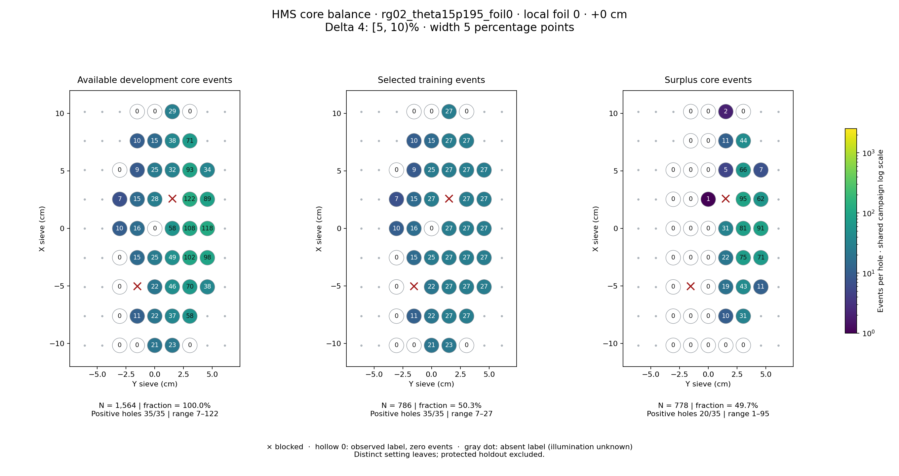
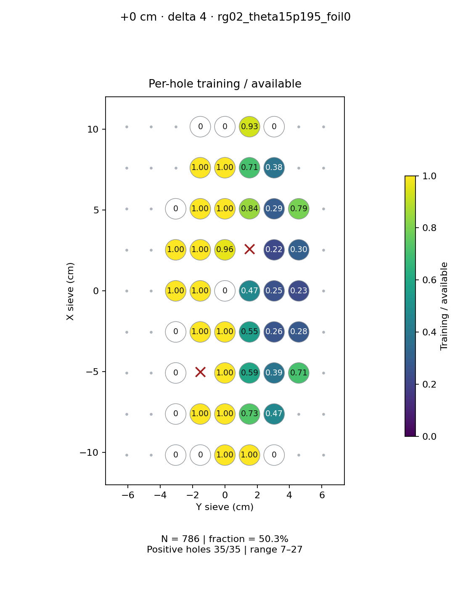
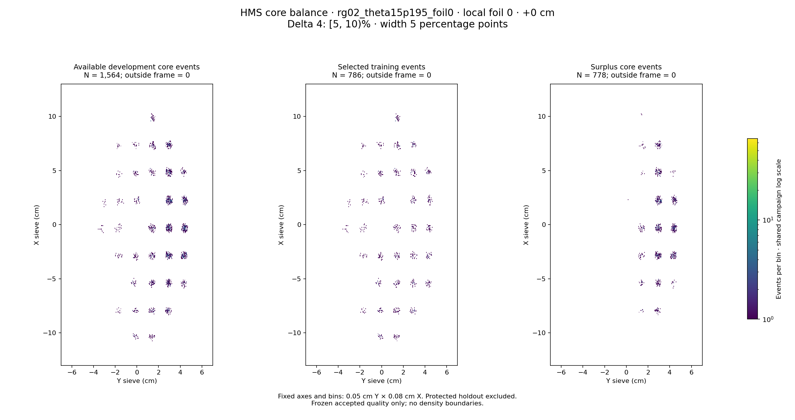

# rg02_theta15p195_foil0 · local foil 0 · +0 cm · delta 4

Interval [5, 10)%, width 5 percentage points.

[Full-resolution training map](../plots/rg02_theta15p195_foil0_foil0_delta4_training.png) · [Full-resolution training cloud](../plots/rg02_theta15p195_foil0_foil0_delta4_training_cloud.png)

| rungroup | foil | xscol | yscol | available | q_hole | hole_cap | capacity | quota | actual_selected | surplus | qa_low | blocked |
|---|---|---|---|---|---|---|---|---|---|---|---|---|
| rg02_theta15p195_foil0 | 0 | 0 | 2 | 0 | 18.5 | 27 | 0 | 0 | 0 | 0 | False | False |
| rg02_theta15p195_foil0 | 0 | 0 | 3 | 0 | 18.5 | 27 | 0 | 0 | 0 | 0 | False | False |
| rg02_theta15p195_foil0 | 0 | 0 | 4 | 21 | 18.5 | 27 | 21 | 21 | 21 | 0 | False | False |
| rg02_theta15p195_foil0 | 0 | 0 | 5 | 23 | 18.5 | 27 | 23 | 23 | 23 | 0 | False | False |
| rg02_theta15p195_foil0 | 0 | 0 | 6 | 0 | 18.5 | 27 | 0 | 0 | 0 | 0 | False | False |
| rg02_theta15p195_foil0 | 0 | 1 | 2 | 0 | 18.5 | 27 | 0 | 0 | 0 | 0 | False | False |
| rg02_theta15p195_foil0 | 0 | 1 | 3 | 11 | 18.5 | 27 | 11 | 11 | 11 | 0 | False | False |
| rg02_theta15p195_foil0 | 0 | 1 | 4 | 22 | 18.5 | 27 | 22 | 22 | 22 | 0 | False | False |
| rg02_theta15p195_foil0 | 0 | 1 | 5 | 37 | 18.5 | 27 | 27 | 27 | 27 | 10 | False | False |
| rg02_theta15p195_foil0 | 0 | 1 | 6 | 58 | 18.5 | 27 | 27 | 27 | 27 | 31 | False | False |
| rg02_theta15p195_foil0 | 0 | 2 | 2 | 0 | 18.5 | 27 | 0 | 0 | 0 | 0 | False | False |
| rg02_theta15p195_foil0 | 0 | 2 | 4 | 22 | 18.5 | 27 | 22 | 22 | 22 | 0 | False | False |
| rg02_theta15p195_foil0 | 0 | 2 | 5 | 46 | 18.5 | 27 | 27 | 27 | 27 | 19 | False | False |
| rg02_theta15p195_foil0 | 0 | 2 | 6 | 70 | 18.5 | 27 | 27 | 27 | 27 | 43 | False | False |
| rg02_theta15p195_foil0 | 0 | 2 | 7 | 38 | 18.5 | 27 | 27 | 27 | 27 | 11 | False | False |
| rg02_theta15p195_foil0 | 0 | 3 | 2 | 0 | 18.5 | 27 | 0 | 0 | 0 | 0 | False | False |
| rg02_theta15p195_foil0 | 0 | 3 | 3 | 15 | 18.5 | 27 | 15 | 15 | 15 | 0 | False | False |
| rg02_theta15p195_foil0 | 0 | 3 | 4 | 25 | 18.5 | 27 | 25 | 25 | 25 | 0 | False | False |
| rg02_theta15p195_foil0 | 0 | 3 | 5 | 49 | 18.5 | 27 | 27 | 27 | 27 | 22 | False | False |
| rg02_theta15p195_foil0 | 0 | 3 | 6 | 102 | 18.5 | 27 | 27 | 27 | 27 | 75 | False | False |
| rg02_theta15p195_foil0 | 0 | 3 | 7 | 98 | 18.5 | 27 | 27 | 27 | 27 | 71 | False | False |
| rg02_theta15p195_foil0 | 0 | 4 | 2 | 10 | 18.5 | 27 | 10 | 10 | 10 | 0 | False | False |
| rg02_theta15p195_foil0 | 0 | 4 | 3 | 16 | 18.5 | 27 | 16 | 16 | 16 | 0 | False | False |
| rg02_theta15p195_foil0 | 0 | 4 | 4 | 0 | 18.5 | 27 | 0 | 0 | 0 | 0 | False | False |
| rg02_theta15p195_foil0 | 0 | 4 | 5 | 58 | 18.5 | 27 | 27 | 27 | 27 | 31 | False | False |
| rg02_theta15p195_foil0 | 0 | 4 | 6 | 108 | 18.5 | 27 | 27 | 27 | 27 | 81 | False | False |
| rg02_theta15p195_foil0 | 0 | 4 | 7 | 118 | 18.5 | 27 | 27 | 27 | 27 | 91 | False | False |
| rg02_theta15p195_foil0 | 0 | 5 | 2 | 7 | 18.5 | 27 | 7 | 7 | 7 | 0 | True | False |
| rg02_theta15p195_foil0 | 0 | 5 | 3 | 15 | 18.5 | 27 | 15 | 15 | 15 | 0 | False | False |
| rg02_theta15p195_foil0 | 0 | 5 | 4 | 28 | 18.5 | 27 | 27 | 27 | 27 | 1 | False | False |
| rg02_theta15p195_foil0 | 0 | 5 | 6 | 122 | 18.5 | 27 | 27 | 27 | 27 | 95 | False | False |
| rg02_theta15p195_foil0 | 0 | 5 | 7 | 89 | 18.5 | 27 | 27 | 27 | 27 | 62 | False | False |
| rg02_theta15p195_foil0 | 0 | 6 | 2 | 0 | 18.5 | 27 | 0 | 0 | 0 | 0 | False | False |
| rg02_theta15p195_foil0 | 0 | 6 | 3 | 9 | 18.5 | 27 | 9 | 9 | 9 | 0 | True | False |
| rg02_theta15p195_foil0 | 0 | 6 | 4 | 25 | 18.5 | 27 | 25 | 25 | 25 | 0 | False | False |
| rg02_theta15p195_foil0 | 0 | 6 | 5 | 32 | 18.5 | 27 | 27 | 27 | 27 | 5 | False | False |
| rg02_theta15p195_foil0 | 0 | 6 | 6 | 93 | 18.5 | 27 | 27 | 27 | 27 | 66 | False | False |
| rg02_theta15p195_foil0 | 0 | 6 | 7 | 34 | 18.5 | 27 | 27 | 27 | 27 | 7 | False | False |
| rg02_theta15p195_foil0 | 0 | 7 | 3 | 10 | 18.5 | 27 | 10 | 10 | 10 | 0 | False | False |
| rg02_theta15p195_foil0 | 0 | 7 | 4 | 15 | 18.5 | 27 | 15 | 15 | 15 | 0 | False | False |
| rg02_theta15p195_foil0 | 0 | 7 | 5 | 38 | 18.5 | 27 | 27 | 27 | 27 | 11 | False | False |
| rg02_theta15p195_foil0 | 0 | 7 | 6 | 71 | 18.5 | 27 | 27 | 27 | 27 | 44 | False | False |
| rg02_theta15p195_foil0 | 0 | 8 | 3 | 0 | 18.5 | 27 | 0 | 0 | 0 | 0 | False | False |
| rg02_theta15p195_foil0 | 0 | 8 | 4 | 0 | 18.5 | 27 | 0 | 0 | 0 | 0 | False | False |
| rg02_theta15p195_foil0 | 0 | 8 | 5 | 29 | 18.5 | 27 | 27 | 27 | 27 | 2 | False | False |
| rg02_theta15p195_foil0 | 0 | 8 | 6 | 0 | 18.5 | 27 | 0 | 0 | 0 | 0 | False | False |
