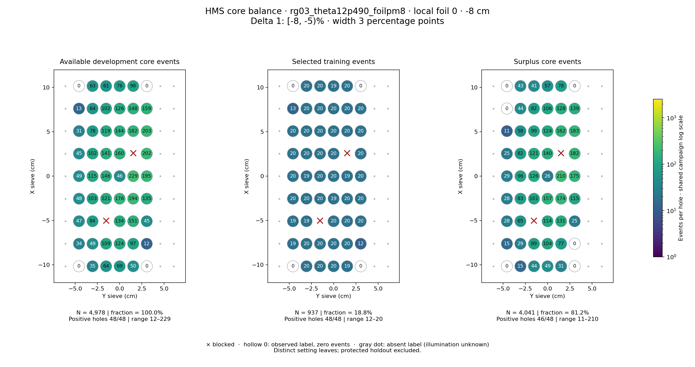
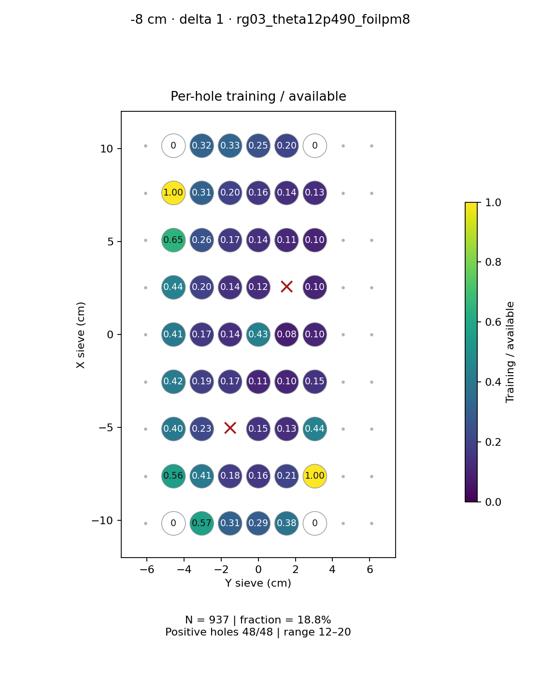
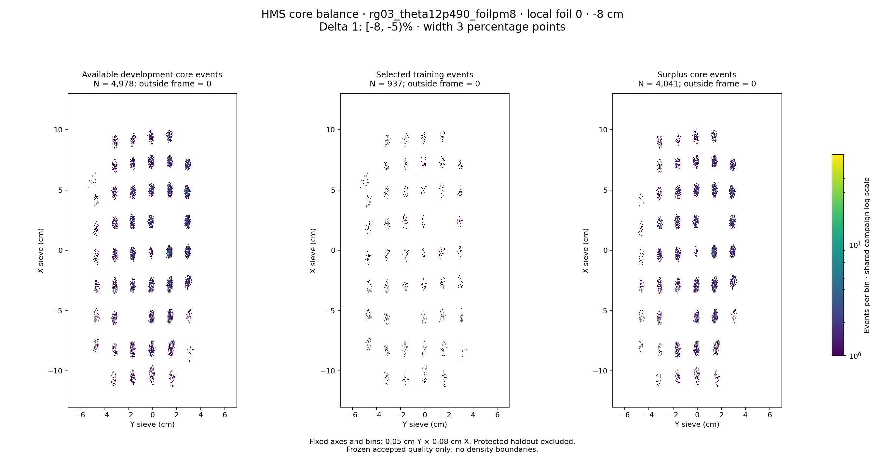

# rg03_theta12p490_foilpm8 · local foil 0 · -8 cm · delta 1

Interval [-8, -5)%, width 3 percentage points.

[Full-resolution training map](../plots/rg03_theta12p490_foilpm8_foil0_delta1_training.png) · [Full-resolution training cloud](../plots/rg03_theta12p490_foilpm8_foil0_delta1_training_cloud.png)

| rungroup | foil | xscol | yscol | available | q_hole | hole_cap | capacity | quota | actual_selected | surplus | qa_low | blocked |
|---|---|---|---|---|---|---|---|---|---|---|---|---|
| rg03_theta12p490_foilpm8 | 0 | 0 | 1 | 0 | 49.75 | 74 | 0 | 0 | 0 | 0 | False | False |
| rg03_theta12p490_foilpm8 | 0 | 0 | 2 | 35 | 49.75 | 74 | 35 | 20 | 20 | 15 | False | False |
| rg03_theta12p490_foilpm8 | 0 | 0 | 3 | 64 | 49.75 | 74 | 64 | 20 | 20 | 44 | False | False |
| rg03_theta12p490_foilpm8 | 0 | 0 | 4 | 69 | 49.75 | 74 | 69 | 20 | 20 | 49 | False | False |
| rg03_theta12p490_foilpm8 | 0 | 0 | 5 | 50 | 49.75 | 74 | 50 | 19 | 19 | 31 | False | False |
| rg03_theta12p490_foilpm8 | 0 | 0 | 6 | 0 | 49.75 | 74 | 0 | 0 | 0 | 0 | False | False |
| rg03_theta12p490_foilpm8 | 0 | 1 | 1 | 34 | 49.75 | 74 | 34 | 19 | 19 | 15 | False | False |
| rg03_theta12p490_foilpm8 | 0 | 1 | 2 | 49 | 49.75 | 74 | 49 | 20 | 20 | 29 | False | False |
| rg03_theta12p490_foilpm8 | 0 | 1 | 3 | 109 | 49.75 | 74 | 74 | 20 | 20 | 89 | False | False |
| rg03_theta12p490_foilpm8 | 0 | 1 | 4 | 124 | 49.75 | 74 | 74 | 20 | 20 | 104 | False | False |
| rg03_theta12p490_foilpm8 | 0 | 1 | 5 | 97 | 49.75 | 74 | 74 | 20 | 20 | 77 | False | False |
| rg03_theta12p490_foilpm8 | 0 | 1 | 6 | 12 | 49.75 | 74 | 12 | 12 | 12 | 0 | False | False |
| rg03_theta12p490_foilpm8 | 0 | 2 | 1 | 47 | 49.75 | 74 | 47 | 19 | 19 | 28 | False | False |
| rg03_theta12p490_foilpm8 | 0 | 2 | 2 | 84 | 49.75 | 74 | 74 | 19 | 19 | 65 | False | False |
| rg03_theta12p490_foilpm8 | 0 | 2 | 3 | 0 | 49.75 | 74 | 0 | 0 | 0 | 0 | False | True |
| rg03_theta12p490_foilpm8 | 0 | 2 | 4 | 134 | 49.75 | 74 | 74 | 20 | 20 | 114 | False | False |
| rg03_theta12p490_foilpm8 | 0 | 2 | 5 | 151 | 49.75 | 74 | 74 | 20 | 20 | 131 | False | False |
| rg03_theta12p490_foilpm8 | 0 | 2 | 6 | 45 | 49.75 | 74 | 45 | 20 | 20 | 25 | False | False |
| rg03_theta12p490_foilpm8 | 0 | 3 | 1 | 48 | 49.75 | 74 | 48 | 20 | 20 | 28 | False | False |
| rg03_theta12p490_foilpm8 | 0 | 3 | 2 | 103 | 49.75 | 74 | 74 | 20 | 20 | 83 | False | False |
| rg03_theta12p490_foilpm8 | 0 | 3 | 3 | 121 | 49.75 | 74 | 74 | 20 | 20 | 101 | False | False |
| rg03_theta12p490_foilpm8 | 0 | 3 | 4 | 176 | 49.75 | 74 | 74 | 19 | 19 | 157 | False | False |
| rg03_theta12p490_foilpm8 | 0 | 3 | 5 | 194 | 49.75 | 74 | 74 | 20 | 20 | 174 | False | False |
| rg03_theta12p490_foilpm8 | 0 | 3 | 6 | 135 | 49.75 | 74 | 74 | 20 | 20 | 115 | False | False |
| rg03_theta12p490_foilpm8 | 0 | 4 | 1 | 49 | 49.75 | 74 | 49 | 20 | 20 | 29 | False | False |
| rg03_theta12p490_foilpm8 | 0 | 4 | 2 | 115 | 49.75 | 74 | 74 | 19 | 19 | 96 | False | False |
| rg03_theta12p490_foilpm8 | 0 | 4 | 3 | 146 | 49.75 | 74 | 74 | 20 | 20 | 126 | False | False |
| rg03_theta12p490_foilpm8 | 0 | 4 | 4 | 46 | 49.75 | 74 | 46 | 20 | 20 | 26 | False | False |
| rg03_theta12p490_foilpm8 | 0 | 4 | 5 | 229 | 49.75 | 74 | 74 | 19 | 19 | 210 | False | False |
| rg03_theta12p490_foilpm8 | 0 | 4 | 6 | 195 | 49.75 | 74 | 74 | 20 | 20 | 175 | False | False |
| rg03_theta12p490_foilpm8 | 0 | 5 | 1 | 45 | 49.75 | 74 | 45 | 20 | 20 | 25 | False | False |
| rg03_theta12p490_foilpm8 | 0 | 5 | 2 | 102 | 49.75 | 74 | 74 | 20 | 20 | 82 | False | False |
| rg03_theta12p490_foilpm8 | 0 | 5 | 3 | 141 | 49.75 | 74 | 74 | 20 | 20 | 121 | False | False |
| rg03_theta12p490_foilpm8 | 0 | 5 | 4 | 160 | 49.75 | 74 | 74 | 20 | 20 | 140 | False | False |
| rg03_theta12p490_foilpm8 | 0 | 5 | 5 | 0 | 49.75 | 74 | 0 | 0 | 0 | 0 | False | True |
| rg03_theta12p490_foilpm8 | 0 | 5 | 6 | 202 | 49.75 | 74 | 74 | 20 | 20 | 182 | False | False |
| rg03_theta12p490_foilpm8 | 0 | 6 | 1 | 31 | 49.75 | 74 | 31 | 20 | 20 | 11 | False | False |
| rg03_theta12p490_foilpm8 | 0 | 6 | 2 | 78 | 49.75 | 74 | 74 | 20 | 20 | 58 | False | False |
| rg03_theta12p490_foilpm8 | 0 | 6 | 3 | 119 | 49.75 | 74 | 74 | 20 | 20 | 99 | False | False |
| rg03_theta12p490_foilpm8 | 0 | 6 | 4 | 144 | 49.75 | 74 | 74 | 20 | 20 | 124 | False | False |
| rg03_theta12p490_foilpm8 | 0 | 6 | 5 | 182 | 49.75 | 74 | 74 | 20 | 20 | 162 | False | False |
| rg03_theta12p490_foilpm8 | 0 | 6 | 6 | 203 | 49.75 | 74 | 74 | 20 | 20 | 183 | False | False |
| rg03_theta12p490_foilpm8 | 0 | 7 | 1 | 13 | 49.75 | 74 | 13 | 13 | 13 | 0 | False | False |
| rg03_theta12p490_foilpm8 | 0 | 7 | 2 | 64 | 49.75 | 74 | 64 | 20 | 20 | 44 | False | False |
| rg03_theta12p490_foilpm8 | 0 | 7 | 3 | 102 | 49.75 | 74 | 74 | 20 | 20 | 82 | False | False |
| rg03_theta12p490_foilpm8 | 0 | 7 | 4 | 126 | 49.75 | 74 | 74 | 20 | 20 | 106 | False | False |
| rg03_theta12p490_foilpm8 | 0 | 7 | 5 | 148 | 49.75 | 74 | 74 | 20 | 20 | 128 | False | False |
| rg03_theta12p490_foilpm8 | 0 | 7 | 6 | 159 | 49.75 | 74 | 74 | 20 | 20 | 139 | False | False |
| rg03_theta12p490_foilpm8 | 0 | 8 | 1 | 0 | 49.75 | 74 | 0 | 0 | 0 | 0 | False | False |
| rg03_theta12p490_foilpm8 | 0 | 8 | 2 | 63 | 49.75 | 74 | 63 | 20 | 20 | 43 | False | False |
| rg03_theta12p490_foilpm8 | 0 | 8 | 3 | 61 | 49.75 | 74 | 61 | 20 | 20 | 41 | False | False |
| rg03_theta12p490_foilpm8 | 0 | 8 | 4 | 76 | 49.75 | 74 | 74 | 19 | 19 | 57 | False | False |
| rg03_theta12p490_foilpm8 | 0 | 8 | 5 | 98 | 49.75 | 74 | 74 | 20 | 20 | 78 | False | False |
| rg03_theta12p490_foilpm8 | 0 | 8 | 6 | 0 | 49.75 | 74 | 0 | 0 | 0 | 0 | False | False |
