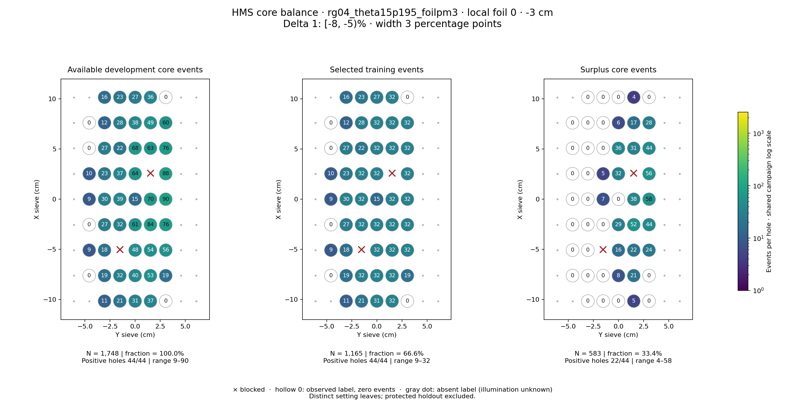
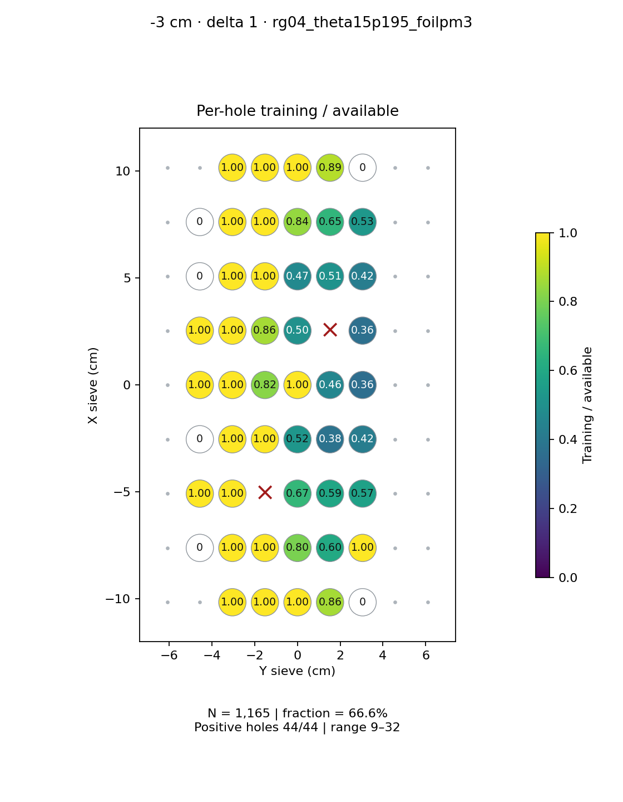
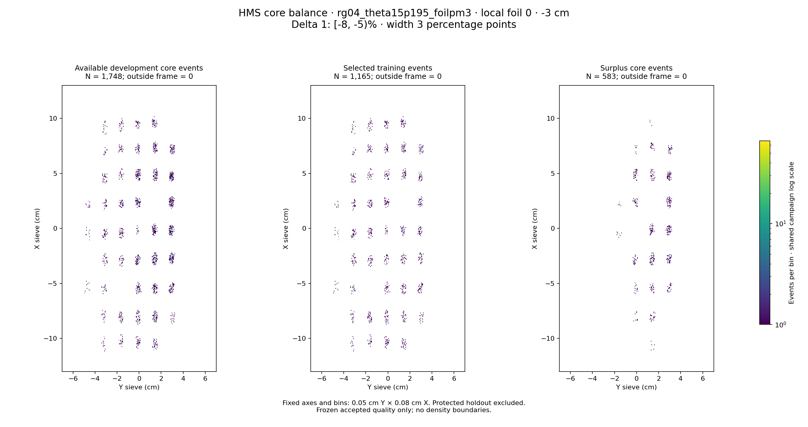

# rg04_theta15p195_foilpm3 · local foil 0 · -3 cm · delta 1

Interval [-8, -5)%, width 3 percentage points.

[Full-resolution training map](../plots/rg04_theta15p195_foilpm3_foil0_delta1_training.png) · [Full-resolution training cloud](../plots/rg04_theta15p195_foilpm3_foil0_delta1_training_cloud.png)

| rungroup | foil | xscol | yscol | available | q_hole | hole_cap | capacity | quota | actual_selected | surplus | qa_low | blocked |
|---|---|---|---|---|---|---|---|---|---|---|---|---|
| rg04_theta15p195_foilpm3 | 0 | 0 | 2 | 11 | 21.75 | 32 | 11 | 11 | 11 | 0 | False | False |
| rg04_theta15p195_foilpm3 | 0 | 0 | 3 | 21 | 21.75 | 32 | 21 | 21 | 21 | 0 | False | False |
| rg04_theta15p195_foilpm3 | 0 | 0 | 4 | 31 | 21.75 | 32 | 31 | 31 | 31 | 0 | False | False |
| rg04_theta15p195_foilpm3 | 0 | 0 | 5 | 37 | 21.75 | 32 | 32 | 32 | 32 | 5 | False | False |
| rg04_theta15p195_foilpm3 | 0 | 0 | 6 | 0 | 21.75 | 32 | 0 | 0 | 0 | 0 | False | False |
| rg04_theta15p195_foilpm3 | 0 | 1 | 1 | 0 | 21.75 | 32 | 0 | 0 | 0 | 0 | False | False |
| rg04_theta15p195_foilpm3 | 0 | 1 | 2 | 19 | 21.75 | 32 | 19 | 19 | 19 | 0 | False | False |
| rg04_theta15p195_foilpm3 | 0 | 1 | 3 | 32 | 21.75 | 32 | 32 | 32 | 32 | 0 | False | False |
| rg04_theta15p195_foilpm3 | 0 | 1 | 4 | 40 | 21.75 | 32 | 32 | 32 | 32 | 8 | False | False |
| rg04_theta15p195_foilpm3 | 0 | 1 | 5 | 53 | 21.75 | 32 | 32 | 32 | 32 | 21 | False | False |
| rg04_theta15p195_foilpm3 | 0 | 1 | 6 | 19 | 21.75 | 32 | 19 | 19 | 19 | 0 | False | False |
| rg04_theta15p195_foilpm3 | 0 | 2 | 1 | 9 | 21.75 | 32 | 9 | 9 | 9 | 0 | True | False |
| rg04_theta15p195_foilpm3 | 0 | 2 | 2 | 18 | 21.75 | 32 | 18 | 18 | 18 | 0 | False | False |
| rg04_theta15p195_foilpm3 | 0 | 2 | 3 | 0 | 21.75 | 32 | 0 | 0 | 0 | 0 | False | True |
| rg04_theta15p195_foilpm3 | 0 | 2 | 4 | 48 | 21.75 | 32 | 32 | 32 | 32 | 16 | False | False |
| rg04_theta15p195_foilpm3 | 0 | 2 | 5 | 54 | 21.75 | 32 | 32 | 32 | 32 | 22 | False | False |
| rg04_theta15p195_foilpm3 | 0 | 2 | 6 | 56 | 21.75 | 32 | 32 | 32 | 32 | 24 | False | False |
| rg04_theta15p195_foilpm3 | 0 | 3 | 1 | 0 | 21.75 | 32 | 0 | 0 | 0 | 0 | False | False |
| rg04_theta15p195_foilpm3 | 0 | 3 | 2 | 27 | 21.75 | 32 | 27 | 27 | 27 | 0 | False | False |
| rg04_theta15p195_foilpm3 | 0 | 3 | 3 | 32 | 21.75 | 32 | 32 | 32 | 32 | 0 | False | False |
| rg04_theta15p195_foilpm3 | 0 | 3 | 4 | 61 | 21.75 | 32 | 32 | 32 | 32 | 29 | False | False |
| rg04_theta15p195_foilpm3 | 0 | 3 | 5 | 84 | 21.75 | 32 | 32 | 32 | 32 | 52 | False | False |
| rg04_theta15p195_foilpm3 | 0 | 3 | 6 | 76 | 21.75 | 32 | 32 | 32 | 32 | 44 | False | False |
| rg04_theta15p195_foilpm3 | 0 | 4 | 1 | 9 | 21.75 | 32 | 9 | 9 | 9 | 0 | True | False |
| rg04_theta15p195_foilpm3 | 0 | 4 | 2 | 30 | 21.75 | 32 | 30 | 30 | 30 | 0 | False | False |
| rg04_theta15p195_foilpm3 | 0 | 4 | 3 | 39 | 21.75 | 32 | 32 | 32 | 32 | 7 | False | False |
| rg04_theta15p195_foilpm3 | 0 | 4 | 4 | 15 | 21.75 | 32 | 15 | 15 | 15 | 0 | False | False |
| rg04_theta15p195_foilpm3 | 0 | 4 | 5 | 70 | 21.75 | 32 | 32 | 32 | 32 | 38 | False | False |
| rg04_theta15p195_foilpm3 | 0 | 4 | 6 | 90 | 21.75 | 32 | 32 | 32 | 32 | 58 | False | False |
| rg04_theta15p195_foilpm3 | 0 | 5 | 1 | 10 | 21.75 | 32 | 10 | 10 | 10 | 0 | False | False |
| rg04_theta15p195_foilpm3 | 0 | 5 | 2 | 23 | 21.75 | 32 | 23 | 23 | 23 | 0 | False | False |
| rg04_theta15p195_foilpm3 | 0 | 5 | 3 | 37 | 21.75 | 32 | 32 | 32 | 32 | 5 | False | False |
| rg04_theta15p195_foilpm3 | 0 | 5 | 4 | 64 | 21.75 | 32 | 32 | 32 | 32 | 32 | False | False |
| rg04_theta15p195_foilpm3 | 0 | 5 | 5 | 0 | 21.75 | 32 | 0 | 0 | 0 | 0 | False | True |
| rg04_theta15p195_foilpm3 | 0 | 5 | 6 | 88 | 21.75 | 32 | 32 | 32 | 32 | 56 | False | False |
| rg04_theta15p195_foilpm3 | 0 | 6 | 1 | 0 | 21.75 | 32 | 0 | 0 | 0 | 0 | False | False |
| rg04_theta15p195_foilpm3 | 0 | 6 | 2 | 27 | 21.75 | 32 | 27 | 27 | 27 | 0 | False | False |
| rg04_theta15p195_foilpm3 | 0 | 6 | 3 | 22 | 21.75 | 32 | 22 | 22 | 22 | 0 | False | False |
| rg04_theta15p195_foilpm3 | 0 | 6 | 4 | 68 | 21.75 | 32 | 32 | 32 | 32 | 36 | False | False |
| rg04_theta15p195_foilpm3 | 0 | 6 | 5 | 63 | 21.75 | 32 | 32 | 32 | 32 | 31 | False | False |
| rg04_theta15p195_foilpm3 | 0 | 6 | 6 | 76 | 21.75 | 32 | 32 | 32 | 32 | 44 | False | False |
| rg04_theta15p195_foilpm3 | 0 | 7 | 1 | 0 | 21.75 | 32 | 0 | 0 | 0 | 0 | False | False |
| rg04_theta15p195_foilpm3 | 0 | 7 | 2 | 12 | 21.75 | 32 | 12 | 12 | 12 | 0 | False | False |
| rg04_theta15p195_foilpm3 | 0 | 7 | 3 | 28 | 21.75 | 32 | 28 | 28 | 28 | 0 | False | False |
| rg04_theta15p195_foilpm3 | 0 | 7 | 4 | 38 | 21.75 | 32 | 32 | 32 | 32 | 6 | False | False |
| rg04_theta15p195_foilpm3 | 0 | 7 | 5 | 49 | 21.75 | 32 | 32 | 32 | 32 | 17 | False | False |
| rg04_theta15p195_foilpm3 | 0 | 7 | 6 | 60 | 21.75 | 32 | 32 | 32 | 32 | 28 | False | False |
| rg04_theta15p195_foilpm3 | 0 | 8 | 2 | 16 | 21.75 | 32 | 16 | 16 | 16 | 0 | False | False |
| rg04_theta15p195_foilpm3 | 0 | 8 | 3 | 23 | 21.75 | 32 | 23 | 23 | 23 | 0 | False | False |
| rg04_theta15p195_foilpm3 | 0 | 8 | 4 | 27 | 21.75 | 32 | 27 | 27 | 27 | 0 | False | False |
| rg04_theta15p195_foilpm3 | 0 | 8 | 5 | 36 | 21.75 | 32 | 32 | 32 | 32 | 4 | False | False |
| rg04_theta15p195_foilpm3 | 0 | 8 | 6 | 0 | 21.75 | 32 | 0 | 0 | 0 | 0 | False | False |
