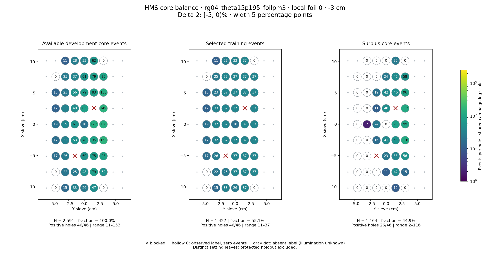
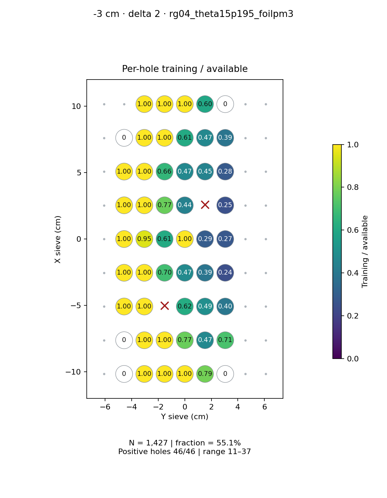
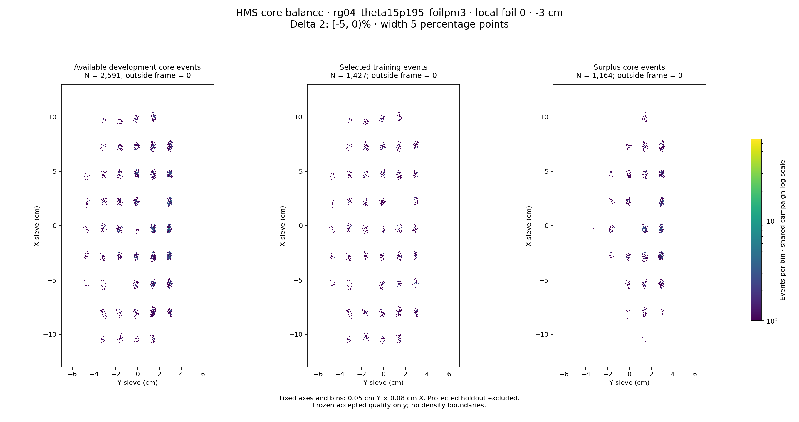

# rg04_theta15p195_foilpm3 · local foil 0 · -3 cm · delta 2

Interval [-5, 0)%, width 5 percentage points.

[Full-resolution training map](../plots/rg04_theta15p195_foilpm3_foil0_delta2_training.png) · [Full-resolution training cloud](../plots/rg04_theta15p195_foilpm3_foil0_delta2_training_cloud.png)

| rungroup | foil | xscol | yscol | available | q_hole | hole_cap | capacity | quota | actual_selected | surplus | qa_low | blocked |
|---|---|---|---|---|---|---|---|---|---|---|---|---|
| rg04_theta15p195_foilpm3 | 0 | 0 | 1 | 0 | 25.25 | 37 | 0 | 0 | 0 | 0 | False | False |
| rg04_theta15p195_foilpm3 | 0 | 0 | 2 | 15 | 25.25 | 37 | 15 | 15 | 15 | 0 | False | False |
| rg04_theta15p195_foilpm3 | 0 | 0 | 3 | 33 | 25.25 | 37 | 33 | 33 | 33 | 0 | False | False |
| rg04_theta15p195_foilpm3 | 0 | 0 | 4 | 26 | 25.25 | 37 | 26 | 26 | 26 | 0 | False | False |
| rg04_theta15p195_foilpm3 | 0 | 0 | 5 | 47 | 25.25 | 37 | 37 | 37 | 37 | 10 | False | False |
| rg04_theta15p195_foilpm3 | 0 | 0 | 6 | 0 | 25.25 | 37 | 0 | 0 | 0 | 0 | False | False |
| rg04_theta15p195_foilpm3 | 0 | 1 | 1 | 0 | 25.25 | 37 | 0 | 0 | 0 | 0 | False | False |
| rg04_theta15p195_foilpm3 | 0 | 1 | 2 | 22 | 25.25 | 37 | 22 | 22 | 22 | 0 | False | False |
| rg04_theta15p195_foilpm3 | 0 | 1 | 3 | 25 | 25.25 | 37 | 25 | 25 | 25 | 0 | False | False |
| rg04_theta15p195_foilpm3 | 0 | 1 | 4 | 48 | 25.25 | 37 | 37 | 37 | 37 | 11 | False | False |
| rg04_theta15p195_foilpm3 | 0 | 1 | 5 | 79 | 25.25 | 37 | 37 | 37 | 37 | 42 | False | False |
| rg04_theta15p195_foilpm3 | 0 | 1 | 6 | 52 | 25.25 | 37 | 37 | 37 | 37 | 15 | False | False |
| rg04_theta15p195_foilpm3 | 0 | 2 | 1 | 17 | 25.25 | 37 | 17 | 17 | 17 | 0 | False | False |
| rg04_theta15p195_foilpm3 | 0 | 2 | 2 | 26 | 25.25 | 37 | 26 | 26 | 26 | 0 | False | False |
| rg04_theta15p195_foilpm3 | 0 | 2 | 3 | 0 | 25.25 | 37 | 0 | 0 | 0 | 0 | False | True |
| rg04_theta15p195_foilpm3 | 0 | 2 | 4 | 60 | 25.25 | 37 | 37 | 37 | 37 | 23 | False | False |
| rg04_theta15p195_foilpm3 | 0 | 2 | 5 | 75 | 25.25 | 37 | 37 | 37 | 37 | 38 | False | False |
| rg04_theta15p195_foilpm3 | 0 | 2 | 6 | 93 | 25.25 | 37 | 37 | 37 | 37 | 56 | False | False |
| rg04_theta15p195_foilpm3 | 0 | 3 | 1 | 17 | 25.25 | 37 | 17 | 17 | 17 | 0 | False | False |
| rg04_theta15p195_foilpm3 | 0 | 3 | 2 | 32 | 25.25 | 37 | 32 | 32 | 32 | 0 | False | False |
| rg04_theta15p195_foilpm3 | 0 | 3 | 3 | 53 | 25.25 | 37 | 37 | 37 | 37 | 16 | False | False |
| rg04_theta15p195_foilpm3 | 0 | 3 | 4 | 78 | 25.25 | 37 | 37 | 37 | 37 | 41 | False | False |
| rg04_theta15p195_foilpm3 | 0 | 3 | 5 | 95 | 25.25 | 37 | 37 | 37 | 37 | 58 | False | False |
| rg04_theta15p195_foilpm3 | 0 | 3 | 6 | 153 | 25.25 | 37 | 37 | 37 | 37 | 116 | False | False |
| rg04_theta15p195_foilpm3 | 0 | 4 | 1 | 19 | 25.25 | 37 | 19 | 19 | 19 | 0 | False | False |
| rg04_theta15p195_foilpm3 | 0 | 4 | 2 | 39 | 25.25 | 37 | 37 | 37 | 37 | 2 | False | False |
| rg04_theta15p195_foilpm3 | 0 | 4 | 3 | 61 | 25.25 | 37 | 37 | 37 | 37 | 24 | False | False |
| rg04_theta15p195_foilpm3 | 0 | 4 | 4 | 18 | 25.25 | 37 | 18 | 18 | 18 | 0 | False | False |
| rg04_theta15p195_foilpm3 | 0 | 4 | 5 | 127 | 25.25 | 37 | 37 | 37 | 37 | 90 | False | False |
| rg04_theta15p195_foilpm3 | 0 | 4 | 6 | 136 | 25.25 | 37 | 37 | 37 | 37 | 99 | False | False |
| rg04_theta15p195_foilpm3 | 0 | 5 | 1 | 12 | 25.25 | 37 | 12 | 12 | 12 | 0 | False | False |
| rg04_theta15p195_foilpm3 | 0 | 5 | 2 | 33 | 25.25 | 37 | 33 | 33 | 33 | 0 | False | False |
| rg04_theta15p195_foilpm3 | 0 | 5 | 3 | 48 | 25.25 | 37 | 37 | 37 | 37 | 11 | False | False |
| rg04_theta15p195_foilpm3 | 0 | 5 | 4 | 85 | 25.25 | 37 | 37 | 37 | 37 | 48 | False | False |
| rg04_theta15p195_foilpm3 | 0 | 5 | 5 | 0 | 25.25 | 37 | 0 | 0 | 0 | 0 | False | True |
| rg04_theta15p195_foilpm3 | 0 | 5 | 6 | 149 | 25.25 | 37 | 37 | 37 | 37 | 112 | False | False |
| rg04_theta15p195_foilpm3 | 0 | 6 | 1 | 13 | 25.25 | 37 | 13 | 13 | 13 | 0 | False | False |
| rg04_theta15p195_foilpm3 | 0 | 6 | 2 | 23 | 25.25 | 37 | 23 | 23 | 23 | 0 | False | False |
| rg04_theta15p195_foilpm3 | 0 | 6 | 3 | 56 | 25.25 | 37 | 37 | 37 | 37 | 19 | False | False |
| rg04_theta15p195_foilpm3 | 0 | 6 | 4 | 79 | 25.25 | 37 | 37 | 37 | 37 | 42 | False | False |
| rg04_theta15p195_foilpm3 | 0 | 6 | 5 | 83 | 25.25 | 37 | 37 | 37 | 37 | 46 | False | False |
| rg04_theta15p195_foilpm3 | 0 | 6 | 6 | 133 | 25.25 | 37 | 37 | 37 | 37 | 96 | False | False |
| rg04_theta15p195_foilpm3 | 0 | 7 | 1 | 0 | 25.25 | 37 | 0 | 0 | 0 | 0 | False | False |
| rg04_theta15p195_foilpm3 | 0 | 7 | 2 | 25 | 25.25 | 37 | 25 | 25 | 25 | 0 | False | False |
| rg04_theta15p195_foilpm3 | 0 | 7 | 3 | 37 | 25.25 | 37 | 37 | 37 | 37 | 0 | False | False |
| rg04_theta15p195_foilpm3 | 0 | 7 | 4 | 61 | 25.25 | 37 | 37 | 37 | 37 | 24 | False | False |
| rg04_theta15p195_foilpm3 | 0 | 7 | 5 | 79 | 25.25 | 37 | 37 | 37 | 37 | 42 | False | False |
| rg04_theta15p195_foilpm3 | 0 | 7 | 6 | 95 | 25.25 | 37 | 37 | 37 | 37 | 58 | False | False |
| rg04_theta15p195_foilpm3 | 0 | 8 | 2 | 11 | 25.25 | 37 | 11 | 11 | 11 | 0 | False | False |
| rg04_theta15p195_foilpm3 | 0 | 8 | 3 | 28 | 25.25 | 37 | 28 | 28 | 28 | 0 | False | False |
| rg04_theta15p195_foilpm3 | 0 | 8 | 4 | 33 | 25.25 | 37 | 33 | 33 | 33 | 0 | False | False |
| rg04_theta15p195_foilpm3 | 0 | 8 | 5 | 62 | 25.25 | 37 | 37 | 37 | 37 | 25 | False | False |
| rg04_theta15p195_foilpm3 | 0 | 8 | 6 | 0 | 25.25 | 37 | 0 | 0 | 0 | 0 | False | False |
