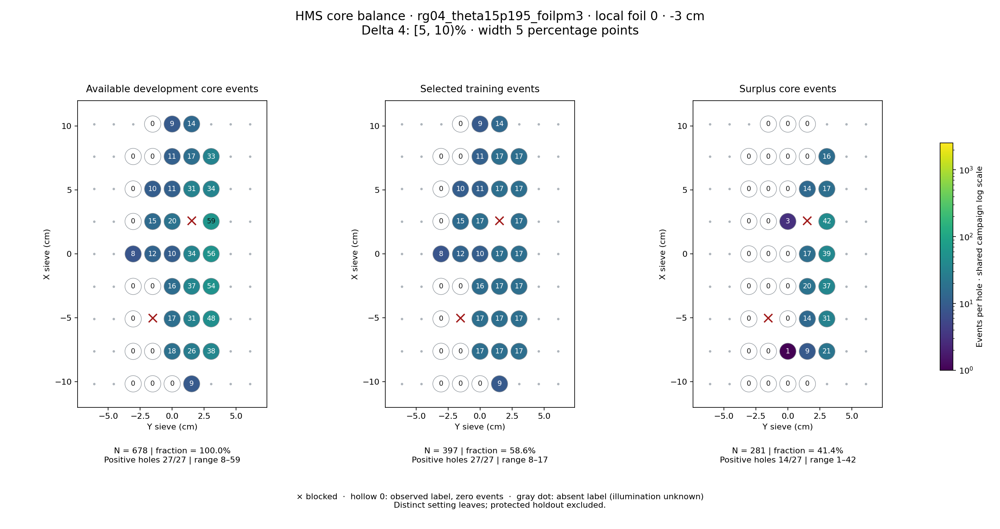
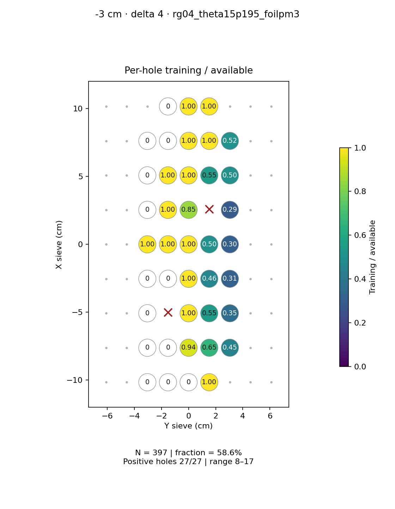
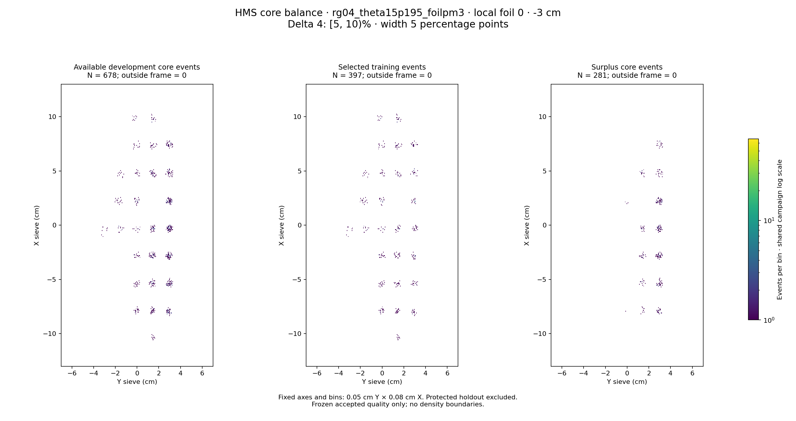

# rg04_theta15p195_foilpm3 · local foil 0 · -3 cm · delta 4

Interval [5, 10)%, width 5 percentage points.

[Full-resolution training map](../plots/rg04_theta15p195_foilpm3_foil0_delta4_training.png) · [Full-resolution training cloud](../plots/rg04_theta15p195_foilpm3_foil0_delta4_training_cloud.png)

| rungroup | foil | xscol | yscol | available | q_hole | hole_cap | capacity | quota | actual_selected | surplus | qa_low | blocked |
|---|---|---|---|---|---|---|---|---|---|---|---|---|
| rg04_theta15p195_foilpm3 | 0 | 0 | 2 | 0 | 11.5 | 17 | 0 | 0 | 0 | 0 | False | False |
| rg04_theta15p195_foilpm3 | 0 | 0 | 3 | 0 | 11.5 | 17 | 0 | 0 | 0 | 0 | False | False |
| rg04_theta15p195_foilpm3 | 0 | 0 | 4 | 0 | 11.5 | 17 | 0 | 0 | 0 | 0 | False | False |
| rg04_theta15p195_foilpm3 | 0 | 0 | 5 | 9 | 11.5 | 17 | 9 | 9 | 9 | 0 | True | False |
| rg04_theta15p195_foilpm3 | 0 | 1 | 2 | 0 | 11.5 | 17 | 0 | 0 | 0 | 0 | False | False |
| rg04_theta15p195_foilpm3 | 0 | 1 | 3 | 0 | 11.5 | 17 | 0 | 0 | 0 | 0 | False | False |
| rg04_theta15p195_foilpm3 | 0 | 1 | 4 | 18 | 11.5 | 17 | 17 | 17 | 17 | 1 | False | False |
| rg04_theta15p195_foilpm3 | 0 | 1 | 5 | 26 | 11.5 | 17 | 17 | 17 | 17 | 9 | False | False |
| rg04_theta15p195_foilpm3 | 0 | 1 | 6 | 38 | 11.5 | 17 | 17 | 17 | 17 | 21 | False | False |
| rg04_theta15p195_foilpm3 | 0 | 2 | 2 | 0 | 11.5 | 17 | 0 | 0 | 0 | 0 | False | False |
| rg04_theta15p195_foilpm3 | 0 | 2 | 4 | 17 | 11.5 | 17 | 17 | 17 | 17 | 0 | False | False |
| rg04_theta15p195_foilpm3 | 0 | 2 | 5 | 31 | 11.5 | 17 | 17 | 17 | 17 | 14 | False | False |
| rg04_theta15p195_foilpm3 | 0 | 2 | 6 | 48 | 11.5 | 17 | 17 | 17 | 17 | 31 | False | False |
| rg04_theta15p195_foilpm3 | 0 | 3 | 2 | 0 | 11.5 | 17 | 0 | 0 | 0 | 0 | False | False |
| rg04_theta15p195_foilpm3 | 0 | 3 | 3 | 0 | 11.5 | 17 | 0 | 0 | 0 | 0 | False | False |
| rg04_theta15p195_foilpm3 | 0 | 3 | 4 | 16 | 11.5 | 17 | 16 | 16 | 16 | 0 | False | False |
| rg04_theta15p195_foilpm3 | 0 | 3 | 5 | 37 | 11.5 | 17 | 17 | 17 | 17 | 20 | False | False |
| rg04_theta15p195_foilpm3 | 0 | 3 | 6 | 54 | 11.5 | 17 | 17 | 17 | 17 | 37 | False | False |
| rg04_theta15p195_foilpm3 | 0 | 4 | 2 | 8 | 11.5 | 17 | 8 | 8 | 8 | 0 | True | False |
| rg04_theta15p195_foilpm3 | 0 | 4 | 3 | 12 | 11.5 | 17 | 12 | 12 | 12 | 0 | False | False |
| rg04_theta15p195_foilpm3 | 0 | 4 | 4 | 10 | 11.5 | 17 | 10 | 10 | 10 | 0 | False | False |
| rg04_theta15p195_foilpm3 | 0 | 4 | 5 | 34 | 11.5 | 17 | 17 | 17 | 17 | 17 | False | False |
| rg04_theta15p195_foilpm3 | 0 | 4 | 6 | 56 | 11.5 | 17 | 17 | 17 | 17 | 39 | False | False |
| rg04_theta15p195_foilpm3 | 0 | 5 | 2 | 0 | 11.5 | 17 | 0 | 0 | 0 | 0 | False | False |
| rg04_theta15p195_foilpm3 | 0 | 5 | 3 | 15 | 11.5 | 17 | 15 | 15 | 15 | 0 | False | False |
| rg04_theta15p195_foilpm3 | 0 | 5 | 4 | 20 | 11.5 | 17 | 17 | 17 | 17 | 3 | False | False |
| rg04_theta15p195_foilpm3 | 0 | 5 | 5 | 0 | 11.5 | 17 | 0 | 0 | 0 | 0 | False | True |
| rg04_theta15p195_foilpm3 | 0 | 5 | 6 | 59 | 11.5 | 17 | 17 | 17 | 17 | 42 | False | False |
| rg04_theta15p195_foilpm3 | 0 | 6 | 2 | 0 | 11.5 | 17 | 0 | 0 | 0 | 0 | False | False |
| rg04_theta15p195_foilpm3 | 0 | 6 | 3 | 10 | 11.5 | 17 | 10 | 10 | 10 | 0 | False | False |
| rg04_theta15p195_foilpm3 | 0 | 6 | 4 | 11 | 11.5 | 17 | 11 | 11 | 11 | 0 | False | False |
| rg04_theta15p195_foilpm3 | 0 | 6 | 5 | 31 | 11.5 | 17 | 17 | 17 | 17 | 14 | False | False |
| rg04_theta15p195_foilpm3 | 0 | 6 | 6 | 34 | 11.5 | 17 | 17 | 17 | 17 | 17 | False | False |
| rg04_theta15p195_foilpm3 | 0 | 7 | 2 | 0 | 11.5 | 17 | 0 | 0 | 0 | 0 | False | False |
| rg04_theta15p195_foilpm3 | 0 | 7 | 3 | 0 | 11.5 | 17 | 0 | 0 | 0 | 0 | False | False |
| rg04_theta15p195_foilpm3 | 0 | 7 | 4 | 11 | 11.5 | 17 | 11 | 11 | 11 | 0 | False | False |
| rg04_theta15p195_foilpm3 | 0 | 7 | 5 | 17 | 11.5 | 17 | 17 | 17 | 17 | 0 | False | False |
| rg04_theta15p195_foilpm3 | 0 | 7 | 6 | 33 | 11.5 | 17 | 17 | 17 | 17 | 16 | False | False |
| rg04_theta15p195_foilpm3 | 0 | 8 | 3 | 0 | 11.5 | 17 | 0 | 0 | 0 | 0 | False | False |
| rg04_theta15p195_foilpm3 | 0 | 8 | 4 | 9 | 11.5 | 17 | 9 | 9 | 9 | 0 | True | False |
| rg04_theta15p195_foilpm3 | 0 | 8 | 5 | 14 | 11.5 | 17 | 14 | 14 | 14 | 0 | False | False |
