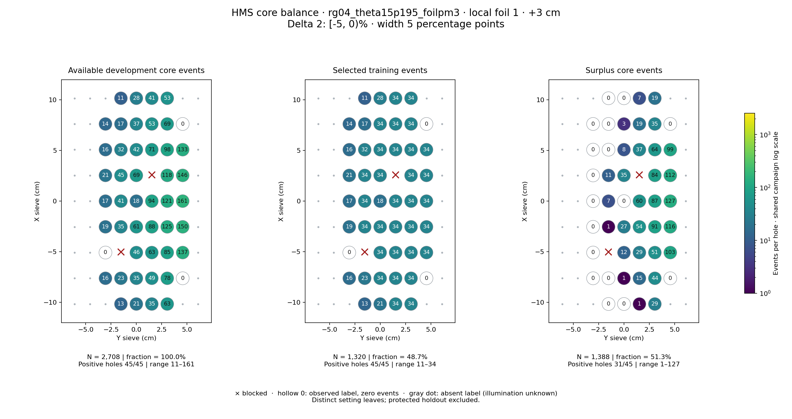
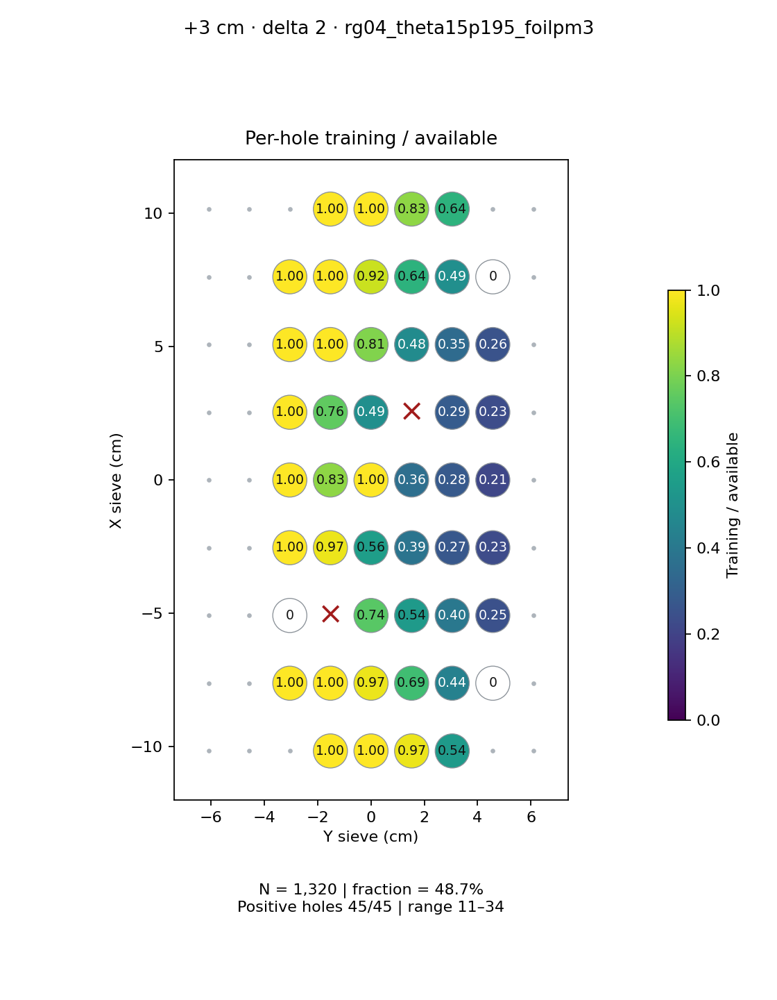
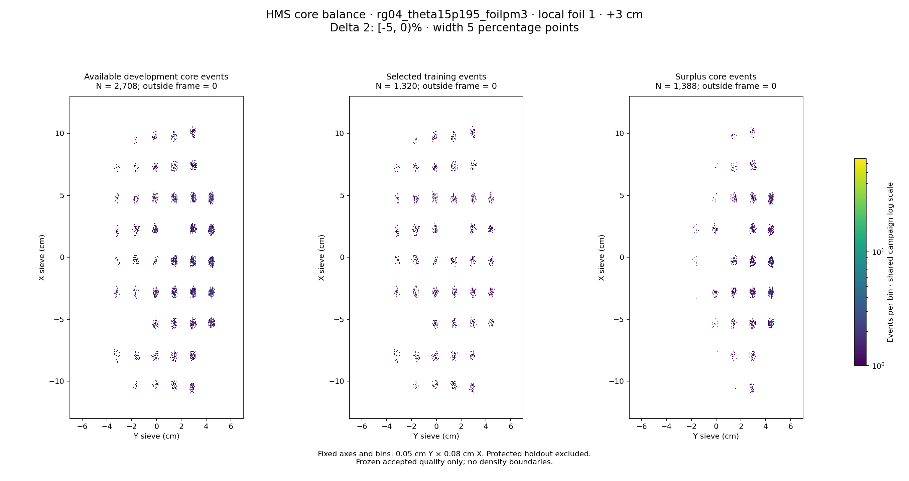

# rg04_theta15p195_foilpm3 · local foil 1 · +3 cm · delta 2

Interval [-5, 0)%, width 5 percentage points.

[Full-resolution training map](../plots/rg04_theta15p195_foilpm3_foil1_delta2_training.png) · [Full-resolution training cloud](../plots/rg04_theta15p195_foilpm3_foil1_delta2_training_cloud.png)

| rungroup | foil | xscol | yscol | available | q_hole | hole_cap | capacity | quota | actual_selected | surplus | qa_low | blocked |
|---|---|---|---|---|---|---|---|---|---|---|---|---|
| rg04_theta15p195_foilpm3 | 1 | 0 | 3 | 13 | 23 | 34 | 13 | 13 | 13 | 0 | False | False |
| rg04_theta15p195_foilpm3 | 1 | 0 | 4 | 21 | 23 | 34 | 21 | 21 | 21 | 0 | False | False |
| rg04_theta15p195_foilpm3 | 1 | 0 | 5 | 35 | 23 | 34 | 34 | 34 | 34 | 1 | False | False |
| rg04_theta15p195_foilpm3 | 1 | 0 | 6 | 63 | 23 | 34 | 34 | 34 | 34 | 29 | False | False |
| rg04_theta15p195_foilpm3 | 1 | 1 | 2 | 16 | 23 | 34 | 16 | 16 | 16 | 0 | False | False |
| rg04_theta15p195_foilpm3 | 1 | 1 | 3 | 23 | 23 | 34 | 23 | 23 | 23 | 0 | False | False |
| rg04_theta15p195_foilpm3 | 1 | 1 | 4 | 35 | 23 | 34 | 34 | 34 | 34 | 1 | False | False |
| rg04_theta15p195_foilpm3 | 1 | 1 | 5 | 49 | 23 | 34 | 34 | 34 | 34 | 15 | False | False |
| rg04_theta15p195_foilpm3 | 1 | 1 | 6 | 78 | 23 | 34 | 34 | 34 | 34 | 44 | False | False |
| rg04_theta15p195_foilpm3 | 1 | 1 | 7 | 0 | 23 | 34 | 0 | 0 | 0 | 0 | False | False |
| rg04_theta15p195_foilpm3 | 1 | 2 | 2 | 0 | 23 | 34 | 0 | 0 | 0 | 0 | False | False |
| rg04_theta15p195_foilpm3 | 1 | 2 | 3 | 0 | 23 | 34 | 0 | 0 | 0 | 0 | False | True |
| rg04_theta15p195_foilpm3 | 1 | 2 | 4 | 46 | 23 | 34 | 34 | 34 | 34 | 12 | False | False |
| rg04_theta15p195_foilpm3 | 1 | 2 | 5 | 63 | 23 | 34 | 34 | 34 | 34 | 29 | False | False |
| rg04_theta15p195_foilpm3 | 1 | 2 | 6 | 85 | 23 | 34 | 34 | 34 | 34 | 51 | False | False |
| rg04_theta15p195_foilpm3 | 1 | 2 | 7 | 137 | 23 | 34 | 34 | 34 | 34 | 103 | False | False |
| rg04_theta15p195_foilpm3 | 1 | 3 | 2 | 19 | 23 | 34 | 19 | 19 | 19 | 0 | False | False |
| rg04_theta15p195_foilpm3 | 1 | 3 | 3 | 35 | 23 | 34 | 34 | 34 | 34 | 1 | False | False |
| rg04_theta15p195_foilpm3 | 1 | 3 | 4 | 61 | 23 | 34 | 34 | 34 | 34 | 27 | False | False |
| rg04_theta15p195_foilpm3 | 1 | 3 | 5 | 88 | 23 | 34 | 34 | 34 | 34 | 54 | False | False |
| rg04_theta15p195_foilpm3 | 1 | 3 | 6 | 125 | 23 | 34 | 34 | 34 | 34 | 91 | False | False |
| rg04_theta15p195_foilpm3 | 1 | 3 | 7 | 150 | 23 | 34 | 34 | 34 | 34 | 116 | False | False |
| rg04_theta15p195_foilpm3 | 1 | 4 | 2 | 17 | 23 | 34 | 17 | 17 | 17 | 0 | False | False |
| rg04_theta15p195_foilpm3 | 1 | 4 | 3 | 41 | 23 | 34 | 34 | 34 | 34 | 7 | False | False |
| rg04_theta15p195_foilpm3 | 1 | 4 | 4 | 18 | 23 | 34 | 18 | 18 | 18 | 0 | False | False |
| rg04_theta15p195_foilpm3 | 1 | 4 | 5 | 94 | 23 | 34 | 34 | 34 | 34 | 60 | False | False |
| rg04_theta15p195_foilpm3 | 1 | 4 | 6 | 121 | 23 | 34 | 34 | 34 | 34 | 87 | False | False |
| rg04_theta15p195_foilpm3 | 1 | 4 | 7 | 161 | 23 | 34 | 34 | 34 | 34 | 127 | False | False |
| rg04_theta15p195_foilpm3 | 1 | 5 | 2 | 21 | 23 | 34 | 21 | 21 | 21 | 0 | False | False |
| rg04_theta15p195_foilpm3 | 1 | 5 | 3 | 45 | 23 | 34 | 34 | 34 | 34 | 11 | False | False |
| rg04_theta15p195_foilpm3 | 1 | 5 | 4 | 69 | 23 | 34 | 34 | 34 | 34 | 35 | False | False |
| rg04_theta15p195_foilpm3 | 1 | 5 | 6 | 118 | 23 | 34 | 34 | 34 | 34 | 84 | False | False |
| rg04_theta15p195_foilpm3 | 1 | 5 | 7 | 146 | 23 | 34 | 34 | 34 | 34 | 112 | False | False |
| rg04_theta15p195_foilpm3 | 1 | 6 | 2 | 16 | 23 | 34 | 16 | 16 | 16 | 0 | False | False |
| rg04_theta15p195_foilpm3 | 1 | 6 | 3 | 32 | 23 | 34 | 32 | 32 | 32 | 0 | False | False |
| rg04_theta15p195_foilpm3 | 1 | 6 | 4 | 42 | 23 | 34 | 34 | 34 | 34 | 8 | False | False |
| rg04_theta15p195_foilpm3 | 1 | 6 | 5 | 71 | 23 | 34 | 34 | 34 | 34 | 37 | False | False |
| rg04_theta15p195_foilpm3 | 1 | 6 | 6 | 98 | 23 | 34 | 34 | 34 | 34 | 64 | False | False |
| rg04_theta15p195_foilpm3 | 1 | 6 | 7 | 133 | 23 | 34 | 34 | 34 | 34 | 99 | False | False |
| rg04_theta15p195_foilpm3 | 1 | 7 | 2 | 14 | 23 | 34 | 14 | 14 | 14 | 0 | False | False |
| rg04_theta15p195_foilpm3 | 1 | 7 | 3 | 17 | 23 | 34 | 17 | 17 | 17 | 0 | False | False |
| rg04_theta15p195_foilpm3 | 1 | 7 | 4 | 37 | 23 | 34 | 34 | 34 | 34 | 3 | False | False |
| rg04_theta15p195_foilpm3 | 1 | 7 | 5 | 53 | 23 | 34 | 34 | 34 | 34 | 19 | False | False |
| rg04_theta15p195_foilpm3 | 1 | 7 | 6 | 69 | 23 | 34 | 34 | 34 | 34 | 35 | False | False |
| rg04_theta15p195_foilpm3 | 1 | 7 | 7 | 0 | 23 | 34 | 0 | 0 | 0 | 0 | False | False |
| rg04_theta15p195_foilpm3 | 1 | 8 | 3 | 11 | 23 | 34 | 11 | 11 | 11 | 0 | False | False |
| rg04_theta15p195_foilpm3 | 1 | 8 | 4 | 28 | 23 | 34 | 28 | 28 | 28 | 0 | False | False |
| rg04_theta15p195_foilpm3 | 1 | 8 | 5 | 41 | 23 | 34 | 34 | 34 | 34 | 7 | False | False |
| rg04_theta15p195_foilpm3 | 1 | 8 | 6 | 53 | 23 | 34 | 34 | 34 | 34 | 19 | False | False |
