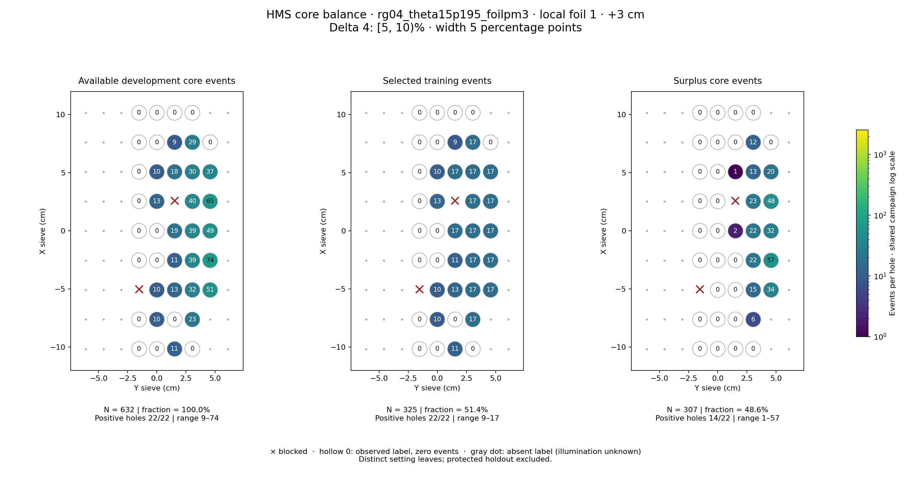
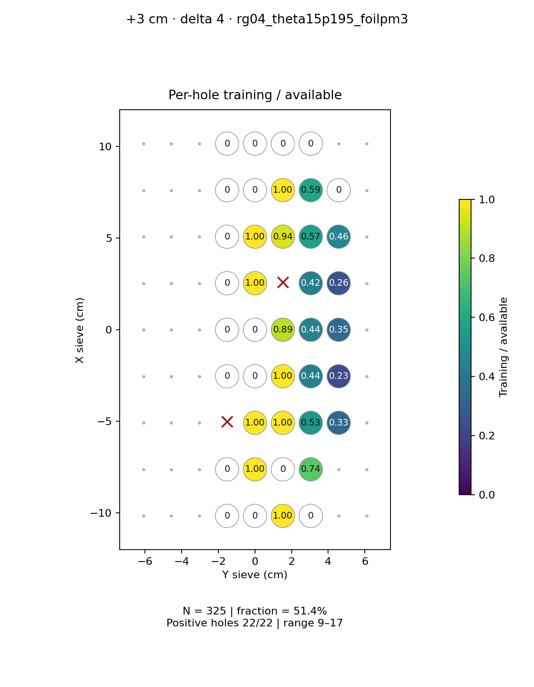
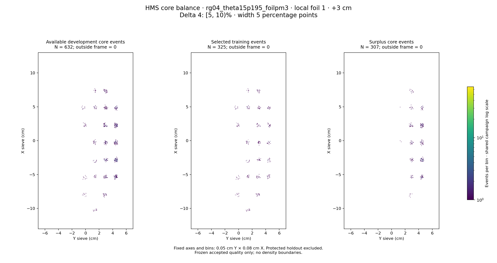

# rg04_theta15p195_foilpm3 · local foil 1 · +3 cm · delta 4

Interval [5, 10)%, width 5 percentage points.

[Full-resolution training map](../plots/rg04_theta15p195_foilpm3_foil1_delta4_training.png) · [Full-resolution training cloud](../plots/rg04_theta15p195_foilpm3_foil1_delta4_training_cloud.png)

| rungroup | foil | xscol | yscol | available | q_hole | hole_cap | capacity | quota | actual_selected | surplus | qa_low | blocked |
|---|---|---|---|---|---|---|---|---|---|---|---|---|
| rg04_theta15p195_foilpm3 | 1 | 0 | 3 | 0 | 11.5 | 17 | 0 | 0 | 0 | 0 | False | False |
| rg04_theta15p195_foilpm3 | 1 | 0 | 4 | 0 | 11.5 | 17 | 0 | 0 | 0 | 0 | False | False |
| rg04_theta15p195_foilpm3 | 1 | 0 | 5 | 11 | 11.5 | 17 | 11 | 11 | 11 | 0 | False | False |
| rg04_theta15p195_foilpm3 | 1 | 0 | 6 | 0 | 11.5 | 17 | 0 | 0 | 0 | 0 | False | False |
| rg04_theta15p195_foilpm3 | 1 | 1 | 3 | 0 | 11.5 | 17 | 0 | 0 | 0 | 0 | False | False |
| rg04_theta15p195_foilpm3 | 1 | 1 | 4 | 10 | 11.5 | 17 | 10 | 10 | 10 | 0 | False | False |
| rg04_theta15p195_foilpm3 | 1 | 1 | 5 | 0 | 11.5 | 17 | 0 | 0 | 0 | 0 | False | False |
| rg04_theta15p195_foilpm3 | 1 | 1 | 6 | 23 | 11.5 | 17 | 17 | 17 | 17 | 6 | False | False |
| rg04_theta15p195_foilpm3 | 1 | 2 | 4 | 10 | 11.5 | 17 | 10 | 10 | 10 | 0 | False | False |
| rg04_theta15p195_foilpm3 | 1 | 2 | 5 | 13 | 11.5 | 17 | 13 | 13 | 13 | 0 | False | False |
| rg04_theta15p195_foilpm3 | 1 | 2 | 6 | 32 | 11.5 | 17 | 17 | 17 | 17 | 15 | False | False |
| rg04_theta15p195_foilpm3 | 1 | 2 | 7 | 51 | 11.5 | 17 | 17 | 17 | 17 | 34 | False | False |
| rg04_theta15p195_foilpm3 | 1 | 3 | 3 | 0 | 11.5 | 17 | 0 | 0 | 0 | 0 | False | False |
| rg04_theta15p195_foilpm3 | 1 | 3 | 4 | 0 | 11.5 | 17 | 0 | 0 | 0 | 0 | False | False |
| rg04_theta15p195_foilpm3 | 1 | 3 | 5 | 11 | 11.5 | 17 | 11 | 11 | 11 | 0 | False | False |
| rg04_theta15p195_foilpm3 | 1 | 3 | 6 | 39 | 11.5 | 17 | 17 | 17 | 17 | 22 | False | False |
| rg04_theta15p195_foilpm3 | 1 | 3 | 7 | 74 | 11.5 | 17 | 17 | 17 | 17 | 57 | False | False |
| rg04_theta15p195_foilpm3 | 1 | 4 | 3 | 0 | 11.5 | 17 | 0 | 0 | 0 | 0 | False | False |
| rg04_theta15p195_foilpm3 | 1 | 4 | 4 | 0 | 11.5 | 17 | 0 | 0 | 0 | 0 | False | False |
| rg04_theta15p195_foilpm3 | 1 | 4 | 5 | 19 | 11.5 | 17 | 17 | 17 | 17 | 2 | False | False |
| rg04_theta15p195_foilpm3 | 1 | 4 | 6 | 39 | 11.5 | 17 | 17 | 17 | 17 | 22 | False | False |
| rg04_theta15p195_foilpm3 | 1 | 4 | 7 | 49 | 11.5 | 17 | 17 | 17 | 17 | 32 | False | False |
| rg04_theta15p195_foilpm3 | 1 | 5 | 3 | 0 | 11.5 | 17 | 0 | 0 | 0 | 0 | False | False |
| rg04_theta15p195_foilpm3 | 1 | 5 | 4 | 13 | 11.5 | 17 | 13 | 13 | 13 | 0 | False | False |
| rg04_theta15p195_foilpm3 | 1 | 5 | 5 | 0 | 11.5 | 17 | 0 | 0 | 0 | 0 | False | True |
| rg04_theta15p195_foilpm3 | 1 | 5 | 6 | 40 | 11.5 | 17 | 17 | 17 | 17 | 23 | False | False |
| rg04_theta15p195_foilpm3 | 1 | 5 | 7 | 65 | 11.5 | 17 | 17 | 17 | 17 | 48 | False | False |
| rg04_theta15p195_foilpm3 | 1 | 6 | 3 | 0 | 11.5 | 17 | 0 | 0 | 0 | 0 | False | False |
| rg04_theta15p195_foilpm3 | 1 | 6 | 4 | 10 | 11.5 | 17 | 10 | 10 | 10 | 0 | False | False |
| rg04_theta15p195_foilpm3 | 1 | 6 | 5 | 18 | 11.5 | 17 | 17 | 17 | 17 | 1 | False | False |
| rg04_theta15p195_foilpm3 | 1 | 6 | 6 | 30 | 11.5 | 17 | 17 | 17 | 17 | 13 | False | False |
| rg04_theta15p195_foilpm3 | 1 | 6 | 7 | 37 | 11.5 | 17 | 17 | 17 | 17 | 20 | False | False |
| rg04_theta15p195_foilpm3 | 1 | 7 | 3 | 0 | 11.5 | 17 | 0 | 0 | 0 | 0 | False | False |
| rg04_theta15p195_foilpm3 | 1 | 7 | 4 | 0 | 11.5 | 17 | 0 | 0 | 0 | 0 | False | False |
| rg04_theta15p195_foilpm3 | 1 | 7 | 5 | 9 | 11.5 | 17 | 9 | 9 | 9 | 0 | True | False |
| rg04_theta15p195_foilpm3 | 1 | 7 | 6 | 29 | 11.5 | 17 | 17 | 17 | 17 | 12 | False | False |
| rg04_theta15p195_foilpm3 | 1 | 7 | 7 | 0 | 11.5 | 17 | 0 | 0 | 0 | 0 | False | False |
| rg04_theta15p195_foilpm3 | 1 | 8 | 3 | 0 | 11.5 | 17 | 0 | 0 | 0 | 0 | False | False |
| rg04_theta15p195_foilpm3 | 1 | 8 | 4 | 0 | 11.5 | 17 | 0 | 0 | 0 | 0 | False | False |
| rg04_theta15p195_foilpm3 | 1 | 8 | 5 | 0 | 11.5 | 17 | 0 | 0 | 0 | 0 | False | False |
| rg04_theta15p195_foilpm3 | 1 | 8 | 6 | 0 | 11.5 | 17 | 0 | 0 | 0 | 0 | False | False |
