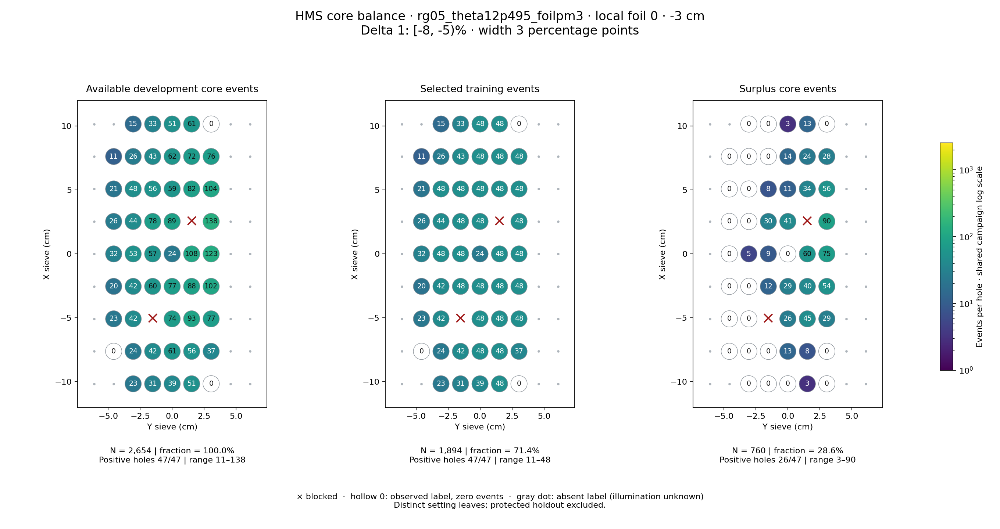
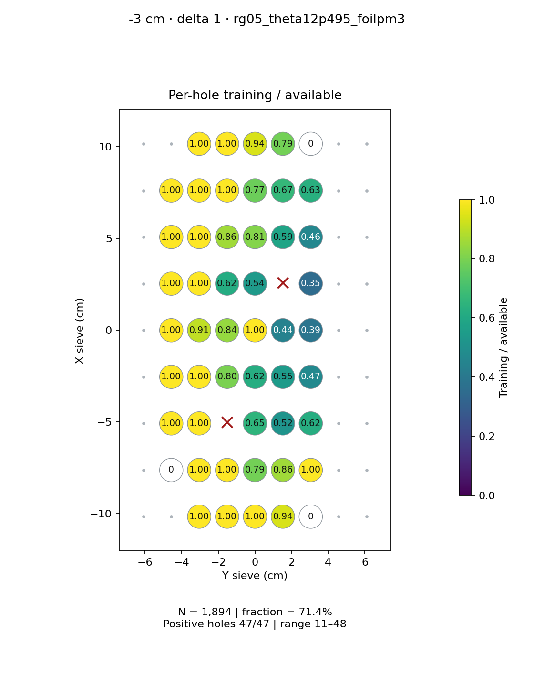
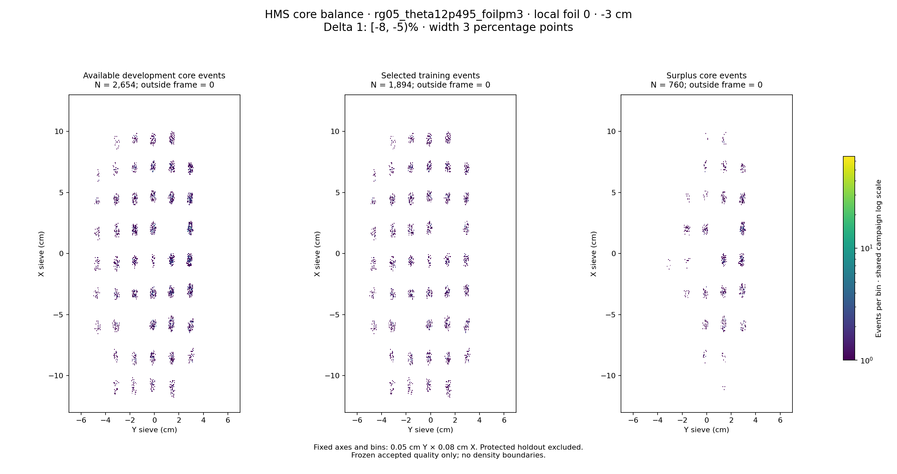

# rg05_theta12p495_foilpm3 · local foil 0 · -3 cm · delta 1

Interval [-8, -5)%, width 3 percentage points.

[Full-resolution training map](../plots/rg05_theta12p495_foilpm3_foil0_delta1_training.png) · [Full-resolution training cloud](../plots/rg05_theta12p495_foilpm3_foil0_delta1_training_cloud.png)

| rungroup | foil | xscol | yscol | available | q_hole | hole_cap | capacity | quota | actual_selected | surplus | qa_low | blocked |
|---|---|---|---|---|---|---|---|---|---|---|---|---|
| rg05_theta12p495_foilpm3 | 0 | 0 | 2 | 23 | 32.5 | 48 | 23 | 23 | 23 | 0 | False | False |
| rg05_theta12p495_foilpm3 | 0 | 0 | 3 | 31 | 32.5 | 48 | 31 | 31 | 31 | 0 | False | False |
| rg05_theta12p495_foilpm3 | 0 | 0 | 4 | 39 | 32.5 | 48 | 39 | 39 | 39 | 0 | False | False |
| rg05_theta12p495_foilpm3 | 0 | 0 | 5 | 51 | 32.5 | 48 | 48 | 48 | 48 | 3 | False | False |
| rg05_theta12p495_foilpm3 | 0 | 0 | 6 | 0 | 32.5 | 48 | 0 | 0 | 0 | 0 | False | False |
| rg05_theta12p495_foilpm3 | 0 | 1 | 1 | 0 | 32.5 | 48 | 0 | 0 | 0 | 0 | False | False |
| rg05_theta12p495_foilpm3 | 0 | 1 | 2 | 24 | 32.5 | 48 | 24 | 24 | 24 | 0 | False | False |
| rg05_theta12p495_foilpm3 | 0 | 1 | 3 | 42 | 32.5 | 48 | 42 | 42 | 42 | 0 | False | False |
| rg05_theta12p495_foilpm3 | 0 | 1 | 4 | 61 | 32.5 | 48 | 48 | 48 | 48 | 13 | False | False |
| rg05_theta12p495_foilpm3 | 0 | 1 | 5 | 56 | 32.5 | 48 | 48 | 48 | 48 | 8 | False | False |
| rg05_theta12p495_foilpm3 | 0 | 1 | 6 | 37 | 32.5 | 48 | 37 | 37 | 37 | 0 | False | False |
| rg05_theta12p495_foilpm3 | 0 | 2 | 1 | 23 | 32.5 | 48 | 23 | 23 | 23 | 0 | False | False |
| rg05_theta12p495_foilpm3 | 0 | 2 | 2 | 42 | 32.5 | 48 | 42 | 42 | 42 | 0 | False | False |
| rg05_theta12p495_foilpm3 | 0 | 2 | 3 | 0 | 32.5 | 48 | 0 | 0 | 0 | 0 | False | True |
| rg05_theta12p495_foilpm3 | 0 | 2 | 4 | 74 | 32.5 | 48 | 48 | 48 | 48 | 26 | False | False |
| rg05_theta12p495_foilpm3 | 0 | 2 | 5 | 93 | 32.5 | 48 | 48 | 48 | 48 | 45 | False | False |
| rg05_theta12p495_foilpm3 | 0 | 2 | 6 | 77 | 32.5 | 48 | 48 | 48 | 48 | 29 | False | False |
| rg05_theta12p495_foilpm3 | 0 | 3 | 1 | 20 | 32.5 | 48 | 20 | 20 | 20 | 0 | False | False |
| rg05_theta12p495_foilpm3 | 0 | 3 | 2 | 42 | 32.5 | 48 | 42 | 42 | 42 | 0 | False | False |
| rg05_theta12p495_foilpm3 | 0 | 3 | 3 | 60 | 32.5 | 48 | 48 | 48 | 48 | 12 | False | False |
| rg05_theta12p495_foilpm3 | 0 | 3 | 4 | 77 | 32.5 | 48 | 48 | 48 | 48 | 29 | False | False |
| rg05_theta12p495_foilpm3 | 0 | 3 | 5 | 88 | 32.5 | 48 | 48 | 48 | 48 | 40 | False | False |
| rg05_theta12p495_foilpm3 | 0 | 3 | 6 | 102 | 32.5 | 48 | 48 | 48 | 48 | 54 | False | False |
| rg05_theta12p495_foilpm3 | 0 | 4 | 1 | 32 | 32.5 | 48 | 32 | 32 | 32 | 0 | False | False |
| rg05_theta12p495_foilpm3 | 0 | 4 | 2 | 53 | 32.5 | 48 | 48 | 48 | 48 | 5 | False | False |
| rg05_theta12p495_foilpm3 | 0 | 4 | 3 | 57 | 32.5 | 48 | 48 | 48 | 48 | 9 | False | False |
| rg05_theta12p495_foilpm3 | 0 | 4 | 4 | 24 | 32.5 | 48 | 24 | 24 | 24 | 0 | False | False |
| rg05_theta12p495_foilpm3 | 0 | 4 | 5 | 108 | 32.5 | 48 | 48 | 48 | 48 | 60 | False | False |
| rg05_theta12p495_foilpm3 | 0 | 4 | 6 | 123 | 32.5 | 48 | 48 | 48 | 48 | 75 | False | False |
| rg05_theta12p495_foilpm3 | 0 | 5 | 1 | 26 | 32.5 | 48 | 26 | 26 | 26 | 0 | False | False |
| rg05_theta12p495_foilpm3 | 0 | 5 | 2 | 44 | 32.5 | 48 | 44 | 44 | 44 | 0 | False | False |
| rg05_theta12p495_foilpm3 | 0 | 5 | 3 | 78 | 32.5 | 48 | 48 | 48 | 48 | 30 | False | False |
| rg05_theta12p495_foilpm3 | 0 | 5 | 4 | 89 | 32.5 | 48 | 48 | 48 | 48 | 41 | False | False |
| rg05_theta12p495_foilpm3 | 0 | 5 | 5 | 0 | 32.5 | 48 | 0 | 0 | 0 | 0 | False | True |
| rg05_theta12p495_foilpm3 | 0 | 5 | 6 | 138 | 32.5 | 48 | 48 | 48 | 48 | 90 | False | False |
| rg05_theta12p495_foilpm3 | 0 | 6 | 1 | 21 | 32.5 | 48 | 21 | 21 | 21 | 0 | False | False |
| rg05_theta12p495_foilpm3 | 0 | 6 | 2 | 48 | 32.5 | 48 | 48 | 48 | 48 | 0 | False | False |
| rg05_theta12p495_foilpm3 | 0 | 6 | 3 | 56 | 32.5 | 48 | 48 | 48 | 48 | 8 | False | False |
| rg05_theta12p495_foilpm3 | 0 | 6 | 4 | 59 | 32.5 | 48 | 48 | 48 | 48 | 11 | False | False |
| rg05_theta12p495_foilpm3 | 0 | 6 | 5 | 82 | 32.5 | 48 | 48 | 48 | 48 | 34 | False | False |
| rg05_theta12p495_foilpm3 | 0 | 6 | 6 | 104 | 32.5 | 48 | 48 | 48 | 48 | 56 | False | False |
| rg05_theta12p495_foilpm3 | 0 | 7 | 1 | 11 | 32.5 | 48 | 11 | 11 | 11 | 0 | False | False |
| rg05_theta12p495_foilpm3 | 0 | 7 | 2 | 26 | 32.5 | 48 | 26 | 26 | 26 | 0 | False | False |
| rg05_theta12p495_foilpm3 | 0 | 7 | 3 | 43 | 32.5 | 48 | 43 | 43 | 43 | 0 | False | False |
| rg05_theta12p495_foilpm3 | 0 | 7 | 4 | 62 | 32.5 | 48 | 48 | 48 | 48 | 14 | False | False |
| rg05_theta12p495_foilpm3 | 0 | 7 | 5 | 72 | 32.5 | 48 | 48 | 48 | 48 | 24 | False | False |
| rg05_theta12p495_foilpm3 | 0 | 7 | 6 | 76 | 32.5 | 48 | 48 | 48 | 48 | 28 | False | False |
| rg05_theta12p495_foilpm3 | 0 | 8 | 2 | 15 | 32.5 | 48 | 15 | 15 | 15 | 0 | False | False |
| rg05_theta12p495_foilpm3 | 0 | 8 | 3 | 33 | 32.5 | 48 | 33 | 33 | 33 | 0 | False | False |
| rg05_theta12p495_foilpm3 | 0 | 8 | 4 | 51 | 32.5 | 48 | 48 | 48 | 48 | 3 | False | False |
| rg05_theta12p495_foilpm3 | 0 | 8 | 5 | 61 | 32.5 | 48 | 48 | 48 | 48 | 13 | False | False |
| rg05_theta12p495_foilpm3 | 0 | 8 | 6 | 0 | 32.5 | 48 | 0 | 0 | 0 | 0 | False | False |
