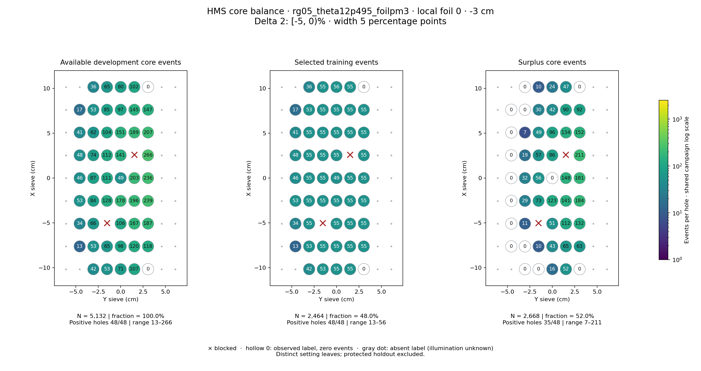
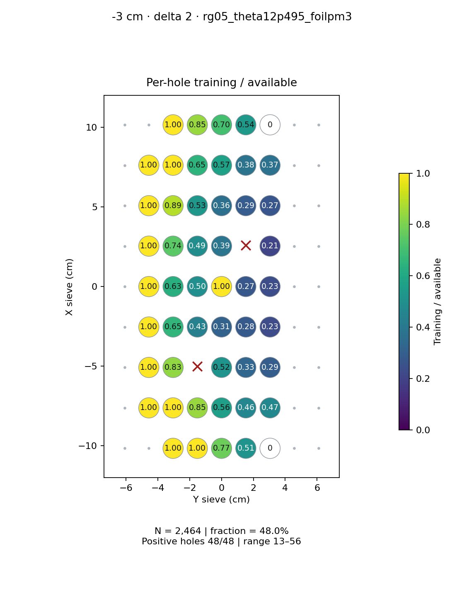
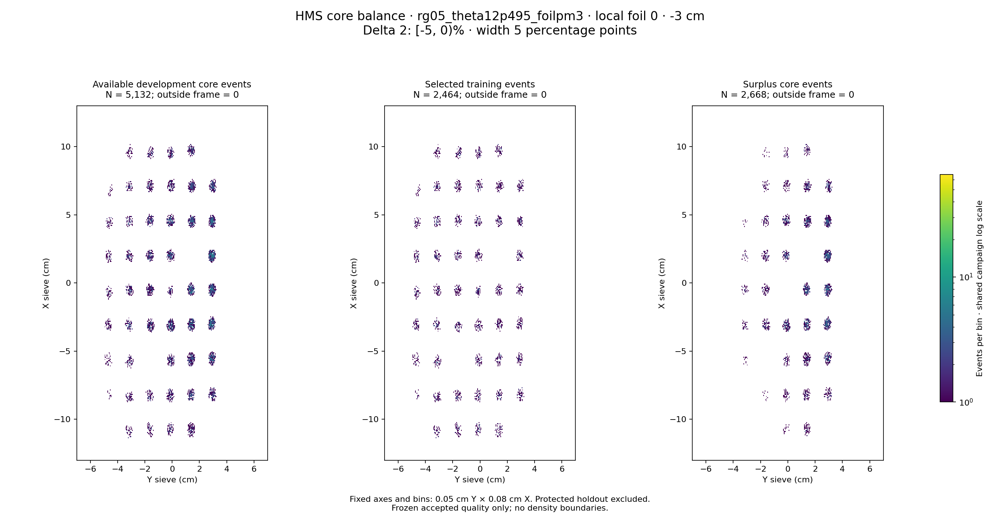

# rg05_theta12p495_foilpm3 · local foil 0 · -3 cm · delta 2

Interval [-5, 0)%, width 5 percentage points.

[Full-resolution training map](../plots/rg05_theta12p495_foilpm3_foil0_delta2_training.png) · [Full-resolution training cloud](../plots/rg05_theta12p495_foilpm3_foil0_delta2_training_cloud.png)

| rungroup | foil | xscol | yscol | available | q_hole | hole_cap | capacity | quota | actual_selected | surplus | qa_low | blocked |
|---|---|---|---|---|---|---|---|---|---|---|---|---|
| rg05_theta12p495_foilpm3 | 0 | 0 | 2 | 42 | 53 | 79 | 42 | 42 | 42 | 0 | False | False |
| rg05_theta12p495_foilpm3 | 0 | 0 | 3 | 53 | 53 | 79 | 53 | 53 | 53 | 0 | False | False |
| rg05_theta12p495_foilpm3 | 0 | 0 | 4 | 71 | 53 | 79 | 71 | 55 | 55 | 16 | False | False |
| rg05_theta12p495_foilpm3 | 0 | 0 | 5 | 107 | 53 | 79 | 79 | 55 | 55 | 52 | False | False |
| rg05_theta12p495_foilpm3 | 0 | 0 | 6 | 0 | 53 | 79 | 0 | 0 | 0 | 0 | False | False |
| rg05_theta12p495_foilpm3 | 0 | 1 | 1 | 13 | 53 | 79 | 13 | 13 | 13 | 0 | False | False |
| rg05_theta12p495_foilpm3 | 0 | 1 | 2 | 53 | 53 | 79 | 53 | 53 | 53 | 0 | False | False |
| rg05_theta12p495_foilpm3 | 0 | 1 | 3 | 65 | 53 | 79 | 65 | 55 | 55 | 10 | False | False |
| rg05_theta12p495_foilpm3 | 0 | 1 | 4 | 98 | 53 | 79 | 79 | 55 | 55 | 43 | False | False |
| rg05_theta12p495_foilpm3 | 0 | 1 | 5 | 120 | 53 | 79 | 79 | 55 | 55 | 65 | False | False |
| rg05_theta12p495_foilpm3 | 0 | 1 | 6 | 118 | 53 | 79 | 79 | 55 | 55 | 63 | False | False |
| rg05_theta12p495_foilpm3 | 0 | 2 | 1 | 34 | 53 | 79 | 34 | 34 | 34 | 0 | False | False |
| rg05_theta12p495_foilpm3 | 0 | 2 | 2 | 66 | 53 | 79 | 66 | 55 | 55 | 11 | False | False |
| rg05_theta12p495_foilpm3 | 0 | 2 | 3 | 0 | 53 | 79 | 0 | 0 | 0 | 0 | False | True |
| rg05_theta12p495_foilpm3 | 0 | 2 | 4 | 106 | 53 | 79 | 79 | 55 | 55 | 51 | False | False |
| rg05_theta12p495_foilpm3 | 0 | 2 | 5 | 167 | 53 | 79 | 79 | 55 | 55 | 112 | False | False |
| rg05_theta12p495_foilpm3 | 0 | 2 | 6 | 187 | 53 | 79 | 79 | 55 | 55 | 132 | False | False |
| rg05_theta12p495_foilpm3 | 0 | 3 | 1 | 53 | 53 | 79 | 53 | 53 | 53 | 0 | False | False |
| rg05_theta12p495_foilpm3 | 0 | 3 | 2 | 84 | 53 | 79 | 79 | 55 | 55 | 29 | False | False |
| rg05_theta12p495_foilpm3 | 0 | 3 | 3 | 128 | 53 | 79 | 79 | 55 | 55 | 73 | False | False |
| rg05_theta12p495_foilpm3 | 0 | 3 | 4 | 178 | 53 | 79 | 79 | 55 | 55 | 123 | False | False |
| rg05_theta12p495_foilpm3 | 0 | 3 | 5 | 196 | 53 | 79 | 79 | 55 | 55 | 141 | False | False |
| rg05_theta12p495_foilpm3 | 0 | 3 | 6 | 239 | 53 | 79 | 79 | 55 | 55 | 184 | False | False |
| rg05_theta12p495_foilpm3 | 0 | 4 | 1 | 46 | 53 | 79 | 46 | 46 | 46 | 0 | False | False |
| rg05_theta12p495_foilpm3 | 0 | 4 | 2 | 87 | 53 | 79 | 79 | 55 | 55 | 32 | False | False |
| rg05_theta12p495_foilpm3 | 0 | 4 | 3 | 111 | 53 | 79 | 79 | 55 | 55 | 56 | False | False |
| rg05_theta12p495_foilpm3 | 0 | 4 | 4 | 49 | 53 | 79 | 49 | 49 | 49 | 0 | False | False |
| rg05_theta12p495_foilpm3 | 0 | 4 | 5 | 203 | 53 | 79 | 79 | 55 | 55 | 148 | False | False |
| rg05_theta12p495_foilpm3 | 0 | 4 | 6 | 236 | 53 | 79 | 79 | 55 | 55 | 181 | False | False |
| rg05_theta12p495_foilpm3 | 0 | 5 | 1 | 48 | 53 | 79 | 48 | 48 | 48 | 0 | False | False |
| rg05_theta12p495_foilpm3 | 0 | 5 | 2 | 74 | 53 | 79 | 74 | 55 | 55 | 19 | False | False |
| rg05_theta12p495_foilpm3 | 0 | 5 | 3 | 112 | 53 | 79 | 79 | 55 | 55 | 57 | False | False |
| rg05_theta12p495_foilpm3 | 0 | 5 | 4 | 141 | 53 | 79 | 79 | 55 | 55 | 86 | False | False |
| rg05_theta12p495_foilpm3 | 0 | 5 | 5 | 0 | 53 | 79 | 0 | 0 | 0 | 0 | False | True |
| rg05_theta12p495_foilpm3 | 0 | 5 | 6 | 266 | 53 | 79 | 79 | 55 | 55 | 211 | False | False |
| rg05_theta12p495_foilpm3 | 0 | 6 | 1 | 41 | 53 | 79 | 41 | 41 | 41 | 0 | False | False |
| rg05_theta12p495_foilpm3 | 0 | 6 | 2 | 62 | 53 | 79 | 62 | 55 | 55 | 7 | False | False |
| rg05_theta12p495_foilpm3 | 0 | 6 | 3 | 104 | 53 | 79 | 79 | 55 | 55 | 49 | False | False |
| rg05_theta12p495_foilpm3 | 0 | 6 | 4 | 151 | 53 | 79 | 79 | 55 | 55 | 96 | False | False |
| rg05_theta12p495_foilpm3 | 0 | 6 | 5 | 189 | 53 | 79 | 79 | 55 | 55 | 134 | False | False |
| rg05_theta12p495_foilpm3 | 0 | 6 | 6 | 207 | 53 | 79 | 79 | 55 | 55 | 152 | False | False |
| rg05_theta12p495_foilpm3 | 0 | 7 | 1 | 17 | 53 | 79 | 17 | 17 | 17 | 0 | False | False |
| rg05_theta12p495_foilpm3 | 0 | 7 | 2 | 53 | 53 | 79 | 53 | 53 | 53 | 0 | False | False |
| rg05_theta12p495_foilpm3 | 0 | 7 | 3 | 85 | 53 | 79 | 79 | 55 | 55 | 30 | False | False |
| rg05_theta12p495_foilpm3 | 0 | 7 | 4 | 97 | 53 | 79 | 79 | 55 | 55 | 42 | False | False |
| rg05_theta12p495_foilpm3 | 0 | 7 | 5 | 145 | 53 | 79 | 79 | 55 | 55 | 90 | False | False |
| rg05_theta12p495_foilpm3 | 0 | 7 | 6 | 147 | 53 | 79 | 79 | 55 | 55 | 92 | False | False |
| rg05_theta12p495_foilpm3 | 0 | 8 | 2 | 36 | 53 | 79 | 36 | 36 | 36 | 0 | False | False |
| rg05_theta12p495_foilpm3 | 0 | 8 | 3 | 65 | 53 | 79 | 65 | 55 | 55 | 10 | False | False |
| rg05_theta12p495_foilpm3 | 0 | 8 | 4 | 80 | 53 | 79 | 79 | 56 | 56 | 24 | False | False |
| rg05_theta12p495_foilpm3 | 0 | 8 | 5 | 102 | 53 | 79 | 79 | 55 | 55 | 47 | False | False |
| rg05_theta12p495_foilpm3 | 0 | 8 | 6 | 0 | 53 | 79 | 0 | 0 | 0 | 0 | False | False |
