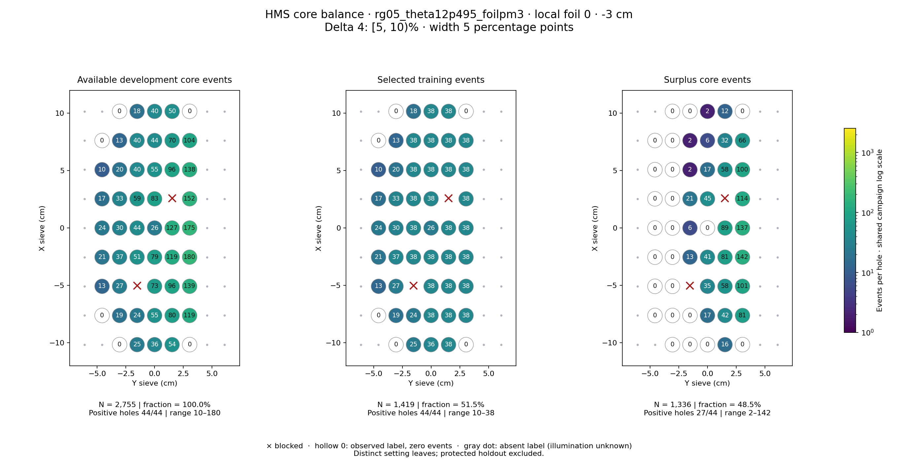
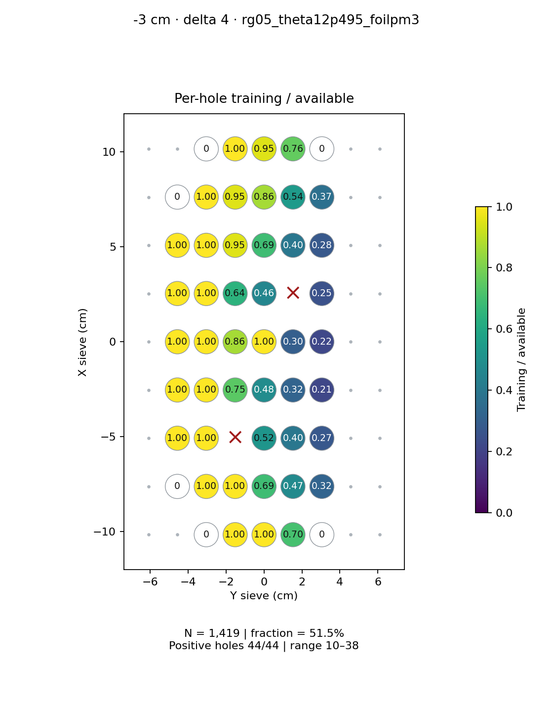
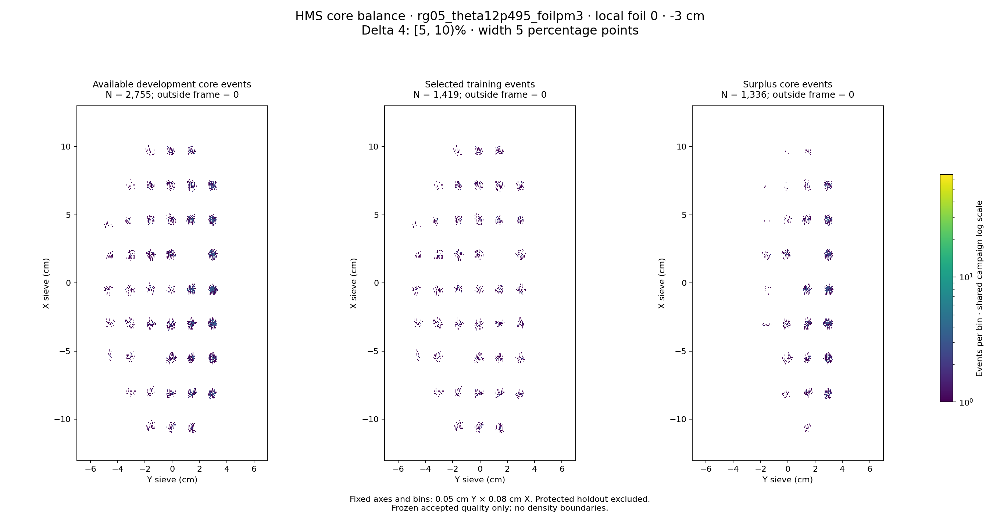

# rg05_theta12p495_foilpm3 · local foil 0 · -3 cm · delta 4

Interval [5, 10)%, width 5 percentage points.

[Full-resolution training map](../plots/rg05_theta12p495_foilpm3_foil0_delta4_training.png) · [Full-resolution training cloud](../plots/rg05_theta12p495_foilpm3_foil0_delta4_training_cloud.png)

| rungroup | foil | xscol | yscol | available | q_hole | hole_cap | capacity | quota | actual_selected | surplus | qa_low | blocked |
|---|---|---|---|---|---|---|---|---|---|---|---|---|
| rg05_theta12p495_foilpm3 | 0 | 0 | 2 | 0 | 25.75 | 38 | 0 | 0 | 0 | 0 | False | False |
| rg05_theta12p495_foilpm3 | 0 | 0 | 3 | 25 | 25.75 | 38 | 25 | 25 | 25 | 0 | False | False |
| rg05_theta12p495_foilpm3 | 0 | 0 | 4 | 36 | 25.75 | 38 | 36 | 36 | 36 | 0 | False | False |
| rg05_theta12p495_foilpm3 | 0 | 0 | 5 | 54 | 25.75 | 38 | 38 | 38 | 38 | 16 | False | False |
| rg05_theta12p495_foilpm3 | 0 | 0 | 6 | 0 | 25.75 | 38 | 0 | 0 | 0 | 0 | False | False |
| rg05_theta12p495_foilpm3 | 0 | 1 | 1 | 0 | 25.75 | 38 | 0 | 0 | 0 | 0 | False | False |
| rg05_theta12p495_foilpm3 | 0 | 1 | 2 | 19 | 25.75 | 38 | 19 | 19 | 19 | 0 | False | False |
| rg05_theta12p495_foilpm3 | 0 | 1 | 3 | 24 | 25.75 | 38 | 24 | 24 | 24 | 0 | False | False |
| rg05_theta12p495_foilpm3 | 0 | 1 | 4 | 55 | 25.75 | 38 | 38 | 38 | 38 | 17 | False | False |
| rg05_theta12p495_foilpm3 | 0 | 1 | 5 | 80 | 25.75 | 38 | 38 | 38 | 38 | 42 | False | False |
| rg05_theta12p495_foilpm3 | 0 | 1 | 6 | 119 | 25.75 | 38 | 38 | 38 | 38 | 81 | False | False |
| rg05_theta12p495_foilpm3 | 0 | 2 | 1 | 13 | 25.75 | 38 | 13 | 13 | 13 | 0 | False | False |
| rg05_theta12p495_foilpm3 | 0 | 2 | 2 | 27 | 25.75 | 38 | 27 | 27 | 27 | 0 | False | False |
| rg05_theta12p495_foilpm3 | 0 | 2 | 4 | 73 | 25.75 | 38 | 38 | 38 | 38 | 35 | False | False |
| rg05_theta12p495_foilpm3 | 0 | 2 | 5 | 96 | 25.75 | 38 | 38 | 38 | 38 | 58 | False | False |
| rg05_theta12p495_foilpm3 | 0 | 2 | 6 | 139 | 25.75 | 38 | 38 | 38 | 38 | 101 | False | False |
| rg05_theta12p495_foilpm3 | 0 | 3 | 1 | 21 | 25.75 | 38 | 21 | 21 | 21 | 0 | False | False |
| rg05_theta12p495_foilpm3 | 0 | 3 | 2 | 37 | 25.75 | 38 | 37 | 37 | 37 | 0 | False | False |
| rg05_theta12p495_foilpm3 | 0 | 3 | 3 | 51 | 25.75 | 38 | 38 | 38 | 38 | 13 | False | False |
| rg05_theta12p495_foilpm3 | 0 | 3 | 4 | 79 | 25.75 | 38 | 38 | 38 | 38 | 41 | False | False |
| rg05_theta12p495_foilpm3 | 0 | 3 | 5 | 119 | 25.75 | 38 | 38 | 38 | 38 | 81 | False | False |
| rg05_theta12p495_foilpm3 | 0 | 3 | 6 | 180 | 25.75 | 38 | 38 | 38 | 38 | 142 | False | False |
| rg05_theta12p495_foilpm3 | 0 | 4 | 1 | 24 | 25.75 | 38 | 24 | 24 | 24 | 0 | False | False |
| rg05_theta12p495_foilpm3 | 0 | 4 | 2 | 30 | 25.75 | 38 | 30 | 30 | 30 | 0 | False | False |
| rg05_theta12p495_foilpm3 | 0 | 4 | 3 | 44 | 25.75 | 38 | 38 | 38 | 38 | 6 | False | False |
| rg05_theta12p495_foilpm3 | 0 | 4 | 4 | 26 | 25.75 | 38 | 26 | 26 | 26 | 0 | False | False |
| rg05_theta12p495_foilpm3 | 0 | 4 | 5 | 127 | 25.75 | 38 | 38 | 38 | 38 | 89 | False | False |
| rg05_theta12p495_foilpm3 | 0 | 4 | 6 | 175 | 25.75 | 38 | 38 | 38 | 38 | 137 | False | False |
| rg05_theta12p495_foilpm3 | 0 | 5 | 1 | 17 | 25.75 | 38 | 17 | 17 | 17 | 0 | False | False |
| rg05_theta12p495_foilpm3 | 0 | 5 | 2 | 33 | 25.75 | 38 | 33 | 33 | 33 | 0 | False | False |
| rg05_theta12p495_foilpm3 | 0 | 5 | 3 | 59 | 25.75 | 38 | 38 | 38 | 38 | 21 | False | False |
| rg05_theta12p495_foilpm3 | 0 | 5 | 4 | 83 | 25.75 | 38 | 38 | 38 | 38 | 45 | False | False |
| rg05_theta12p495_foilpm3 | 0 | 5 | 5 | 0 | 25.75 | 38 | 0 | 0 | 0 | 0 | False | True |
| rg05_theta12p495_foilpm3 | 0 | 5 | 6 | 152 | 25.75 | 38 | 38 | 38 | 38 | 114 | False | False |
| rg05_theta12p495_foilpm3 | 0 | 6 | 1 | 10 | 25.75 | 38 | 10 | 10 | 10 | 0 | False | False |
| rg05_theta12p495_foilpm3 | 0 | 6 | 2 | 20 | 25.75 | 38 | 20 | 20 | 20 | 0 | False | False |
| rg05_theta12p495_foilpm3 | 0 | 6 | 3 | 40 | 25.75 | 38 | 38 | 38 | 38 | 2 | False | False |
| rg05_theta12p495_foilpm3 | 0 | 6 | 4 | 55 | 25.75 | 38 | 38 | 38 | 38 | 17 | False | False |
| rg05_theta12p495_foilpm3 | 0 | 6 | 5 | 96 | 25.75 | 38 | 38 | 38 | 38 | 58 | False | False |
| rg05_theta12p495_foilpm3 | 0 | 6 | 6 | 138 | 25.75 | 38 | 38 | 38 | 38 | 100 | False | False |
| rg05_theta12p495_foilpm3 | 0 | 7 | 1 | 0 | 25.75 | 38 | 0 | 0 | 0 | 0 | False | False |
| rg05_theta12p495_foilpm3 | 0 | 7 | 2 | 13 | 25.75 | 38 | 13 | 13 | 13 | 0 | False | False |
| rg05_theta12p495_foilpm3 | 0 | 7 | 3 | 40 | 25.75 | 38 | 38 | 38 | 38 | 2 | False | False |
| rg05_theta12p495_foilpm3 | 0 | 7 | 4 | 44 | 25.75 | 38 | 38 | 38 | 38 | 6 | False | False |
| rg05_theta12p495_foilpm3 | 0 | 7 | 5 | 70 | 25.75 | 38 | 38 | 38 | 38 | 32 | False | False |
| rg05_theta12p495_foilpm3 | 0 | 7 | 6 | 104 | 25.75 | 38 | 38 | 38 | 38 | 66 | False | False |
| rg05_theta12p495_foilpm3 | 0 | 8 | 2 | 0 | 25.75 | 38 | 0 | 0 | 0 | 0 | False | False |
| rg05_theta12p495_foilpm3 | 0 | 8 | 3 | 18 | 25.75 | 38 | 18 | 18 | 18 | 0 | False | False |
| rg05_theta12p495_foilpm3 | 0 | 8 | 4 | 40 | 25.75 | 38 | 38 | 38 | 38 | 2 | False | False |
| rg05_theta12p495_foilpm3 | 0 | 8 | 5 | 50 | 25.75 | 38 | 38 | 38 | 38 | 12 | False | False |
| rg05_theta12p495_foilpm3 | 0 | 8 | 6 | 0 | 25.75 | 38 | 0 | 0 | 0 | 0 | False | False |
