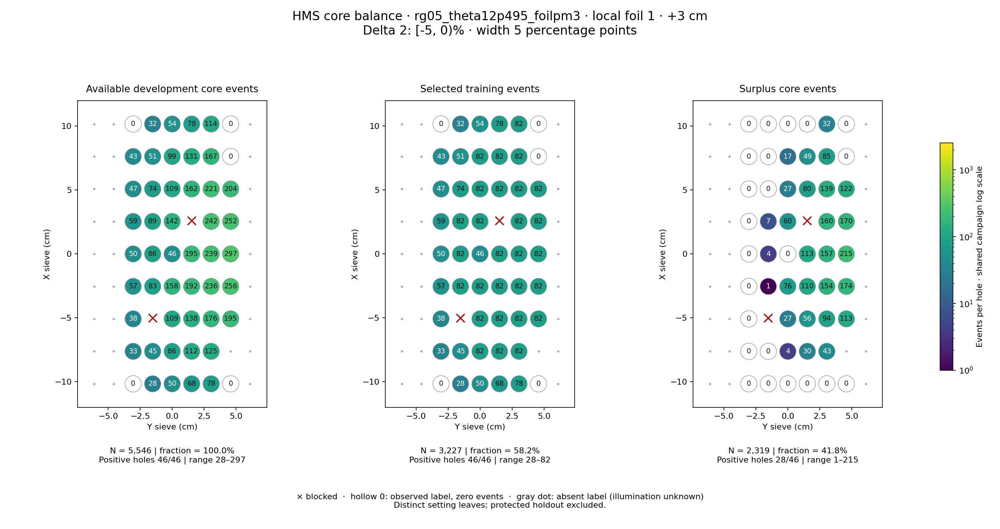
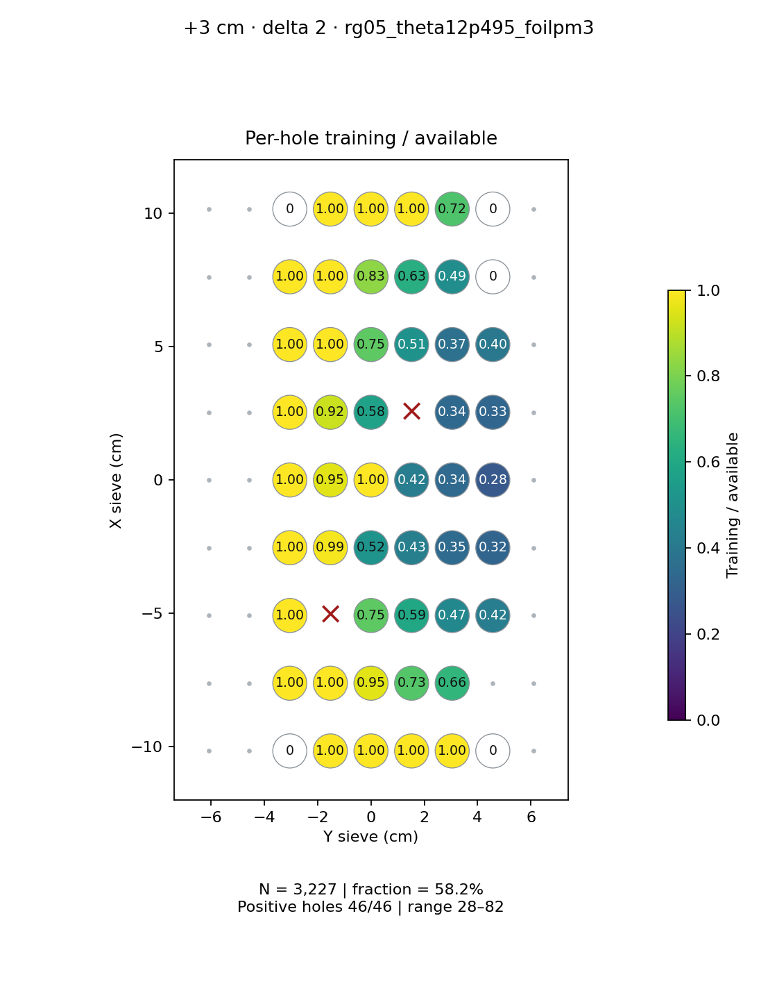
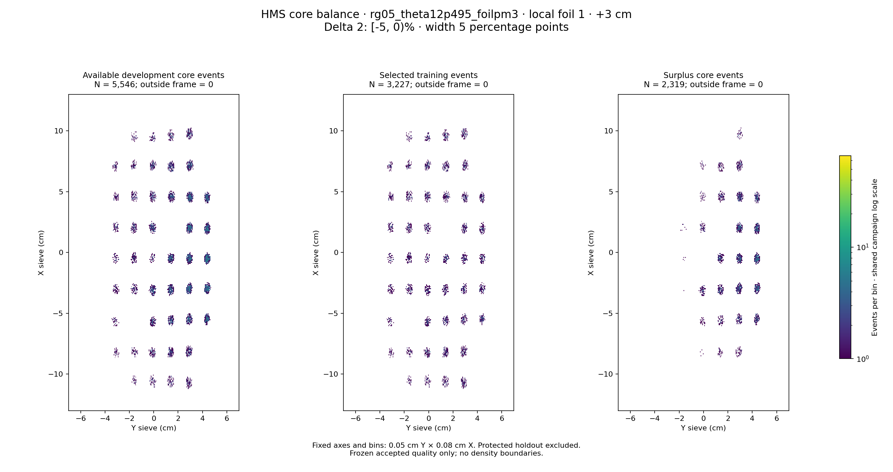

# rg05_theta12p495_foilpm3 · local foil 1 · +3 cm · delta 2

Interval [-5, 0)%, width 5 percentage points.

[Full-resolution training map](../plots/rg05_theta12p495_foilpm3_foil1_delta2_training.png) · [Full-resolution training cloud](../plots/rg05_theta12p495_foilpm3_foil1_delta2_training_cloud.png)

| rungroup | foil | xscol | yscol | available | q_hole | hole_cap | capacity | quota | actual_selected | surplus | qa_low | blocked |
|---|---|---|---|---|---|---|---|---|---|---|---|---|
| rg05_theta12p495_foilpm3 | 1 | 0 | 2 | 0 | 54.75 | 82 | 0 | 0 | 0 | 0 | False | False |
| rg05_theta12p495_foilpm3 | 1 | 0 | 3 | 28 | 54.75 | 82 | 28 | 28 | 28 | 0 | False | False |
| rg05_theta12p495_foilpm3 | 1 | 0 | 4 | 50 | 54.75 | 82 | 50 | 50 | 50 | 0 | False | False |
| rg05_theta12p495_foilpm3 | 1 | 0 | 5 | 68 | 54.75 | 82 | 68 | 68 | 68 | 0 | False | False |
| rg05_theta12p495_foilpm3 | 1 | 0 | 6 | 78 | 54.75 | 82 | 78 | 78 | 78 | 0 | False | False |
| rg05_theta12p495_foilpm3 | 1 | 0 | 7 | 0 | 54.75 | 82 | 0 | 0 | 0 | 0 | False | False |
| rg05_theta12p495_foilpm3 | 1 | 1 | 2 | 33 | 54.75 | 82 | 33 | 33 | 33 | 0 | False | False |
| rg05_theta12p495_foilpm3 | 1 | 1 | 3 | 45 | 54.75 | 82 | 45 | 45 | 45 | 0 | False | False |
| rg05_theta12p495_foilpm3 | 1 | 1 | 4 | 86 | 54.75 | 82 | 82 | 82 | 82 | 4 | False | False |
| rg05_theta12p495_foilpm3 | 1 | 1 | 5 | 112 | 54.75 | 82 | 82 | 82 | 82 | 30 | False | False |
| rg05_theta12p495_foilpm3 | 1 | 1 | 6 | 125 | 54.75 | 82 | 82 | 82 | 82 | 43 | False | False |
| rg05_theta12p495_foilpm3 | 1 | 2 | 2 | 38 | 54.75 | 82 | 38 | 38 | 38 | 0 | False | False |
| rg05_theta12p495_foilpm3 | 1 | 2 | 3 | 0 | 54.75 | 82 | 0 | 0 | 0 | 0 | False | True |
| rg05_theta12p495_foilpm3 | 1 | 2 | 4 | 109 | 54.75 | 82 | 82 | 82 | 82 | 27 | False | False |
| rg05_theta12p495_foilpm3 | 1 | 2 | 5 | 138 | 54.75 | 82 | 82 | 82 | 82 | 56 | False | False |
| rg05_theta12p495_foilpm3 | 1 | 2 | 6 | 176 | 54.75 | 82 | 82 | 82 | 82 | 94 | False | False |
| rg05_theta12p495_foilpm3 | 1 | 2 | 7 | 195 | 54.75 | 82 | 82 | 82 | 82 | 113 | False | False |
| rg05_theta12p495_foilpm3 | 1 | 3 | 2 | 57 | 54.75 | 82 | 57 | 57 | 57 | 0 | False | False |
| rg05_theta12p495_foilpm3 | 1 | 3 | 3 | 83 | 54.75 | 82 | 82 | 82 | 82 | 1 | False | False |
| rg05_theta12p495_foilpm3 | 1 | 3 | 4 | 158 | 54.75 | 82 | 82 | 82 | 82 | 76 | False | False |
| rg05_theta12p495_foilpm3 | 1 | 3 | 5 | 192 | 54.75 | 82 | 82 | 82 | 82 | 110 | False | False |
| rg05_theta12p495_foilpm3 | 1 | 3 | 6 | 236 | 54.75 | 82 | 82 | 82 | 82 | 154 | False | False |
| rg05_theta12p495_foilpm3 | 1 | 3 | 7 | 256 | 54.75 | 82 | 82 | 82 | 82 | 174 | False | False |
| rg05_theta12p495_foilpm3 | 1 | 4 | 2 | 50 | 54.75 | 82 | 50 | 50 | 50 | 0 | False | False |
| rg05_theta12p495_foilpm3 | 1 | 4 | 3 | 86 | 54.75 | 82 | 82 | 82 | 82 | 4 | False | False |
| rg05_theta12p495_foilpm3 | 1 | 4 | 4 | 46 | 54.75 | 82 | 46 | 46 | 46 | 0 | False | False |
| rg05_theta12p495_foilpm3 | 1 | 4 | 5 | 195 | 54.75 | 82 | 82 | 82 | 82 | 113 | False | False |
| rg05_theta12p495_foilpm3 | 1 | 4 | 6 | 239 | 54.75 | 82 | 82 | 82 | 82 | 157 | False | False |
| rg05_theta12p495_foilpm3 | 1 | 4 | 7 | 297 | 54.75 | 82 | 82 | 82 | 82 | 215 | False | False |
| rg05_theta12p495_foilpm3 | 1 | 5 | 2 | 59 | 54.75 | 82 | 59 | 59 | 59 | 0 | False | False |
| rg05_theta12p495_foilpm3 | 1 | 5 | 3 | 89 | 54.75 | 82 | 82 | 82 | 82 | 7 | False | False |
| rg05_theta12p495_foilpm3 | 1 | 5 | 4 | 142 | 54.75 | 82 | 82 | 82 | 82 | 60 | False | False |
| rg05_theta12p495_foilpm3 | 1 | 5 | 5 | 0 | 54.75 | 82 | 0 | 0 | 0 | 0 | False | True |
| rg05_theta12p495_foilpm3 | 1 | 5 | 6 | 242 | 54.75 | 82 | 82 | 82 | 82 | 160 | False | False |
| rg05_theta12p495_foilpm3 | 1 | 5 | 7 | 252 | 54.75 | 82 | 82 | 82 | 82 | 170 | False | False |
| rg05_theta12p495_foilpm3 | 1 | 6 | 2 | 47 | 54.75 | 82 | 47 | 47 | 47 | 0 | False | False |
| rg05_theta12p495_foilpm3 | 1 | 6 | 3 | 74 | 54.75 | 82 | 74 | 74 | 74 | 0 | False | False |
| rg05_theta12p495_foilpm3 | 1 | 6 | 4 | 109 | 54.75 | 82 | 82 | 82 | 82 | 27 | False | False |
| rg05_theta12p495_foilpm3 | 1 | 6 | 5 | 162 | 54.75 | 82 | 82 | 82 | 82 | 80 | False | False |
| rg05_theta12p495_foilpm3 | 1 | 6 | 6 | 221 | 54.75 | 82 | 82 | 82 | 82 | 139 | False | False |
| rg05_theta12p495_foilpm3 | 1 | 6 | 7 | 204 | 54.75 | 82 | 82 | 82 | 82 | 122 | False | False |
| rg05_theta12p495_foilpm3 | 1 | 7 | 2 | 43 | 54.75 | 82 | 43 | 43 | 43 | 0 | False | False |
| rg05_theta12p495_foilpm3 | 1 | 7 | 3 | 51 | 54.75 | 82 | 51 | 51 | 51 | 0 | False | False |
| rg05_theta12p495_foilpm3 | 1 | 7 | 4 | 99 | 54.75 | 82 | 82 | 82 | 82 | 17 | False | False |
| rg05_theta12p495_foilpm3 | 1 | 7 | 5 | 131 | 54.75 | 82 | 82 | 82 | 82 | 49 | False | False |
| rg05_theta12p495_foilpm3 | 1 | 7 | 6 | 167 | 54.75 | 82 | 82 | 82 | 82 | 85 | False | False |
| rg05_theta12p495_foilpm3 | 1 | 7 | 7 | 0 | 54.75 | 82 | 0 | 0 | 0 | 0 | False | False |
| rg05_theta12p495_foilpm3 | 1 | 8 | 2 | 0 | 54.75 | 82 | 0 | 0 | 0 | 0 | False | False |
| rg05_theta12p495_foilpm3 | 1 | 8 | 3 | 32 | 54.75 | 82 | 32 | 32 | 32 | 0 | False | False |
| rg05_theta12p495_foilpm3 | 1 | 8 | 4 | 54 | 54.75 | 82 | 54 | 54 | 54 | 0 | False | False |
| rg05_theta12p495_foilpm3 | 1 | 8 | 5 | 78 | 54.75 | 82 | 78 | 78 | 78 | 0 | False | False |
| rg05_theta12p495_foilpm3 | 1 | 8 | 6 | 114 | 54.75 | 82 | 82 | 82 | 82 | 32 | False | False |
| rg05_theta12p495_foilpm3 | 1 | 8 | 7 | 0 | 54.75 | 82 | 0 | 0 | 0 | 0 | False | False |
