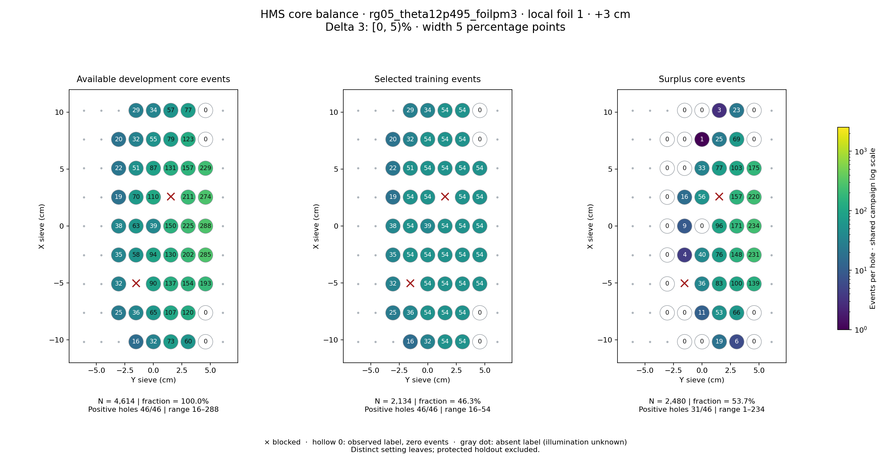
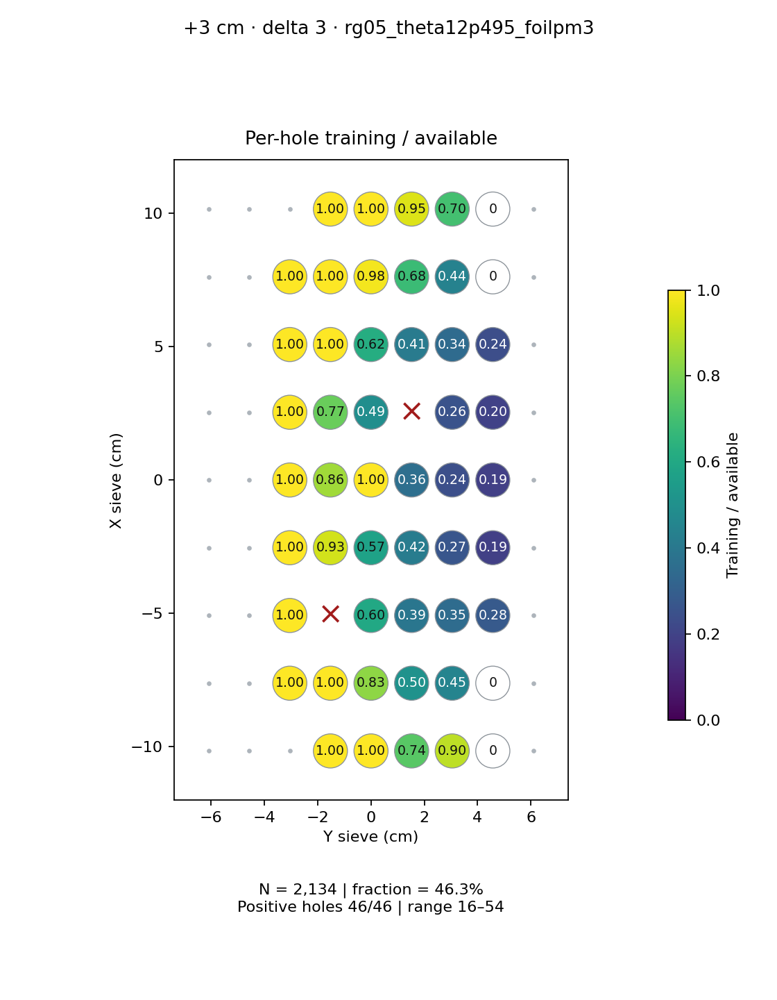
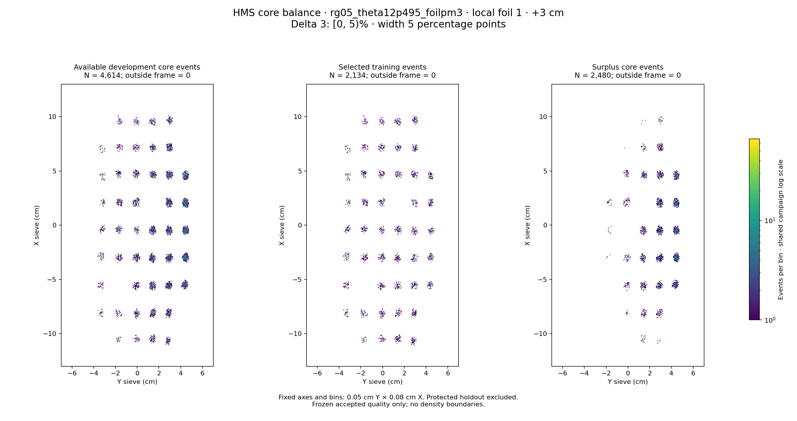

# rg05_theta12p495_foilpm3 · local foil 1 · +3 cm · delta 3

Interval [0, 5)%, width 5 percentage points.

[Full-resolution training map](../plots/rg05_theta12p495_foilpm3_foil1_delta3_training.png) · [Full-resolution training cloud](../plots/rg05_theta12p495_foilpm3_foil1_delta3_training_cloud.png)

| rungroup | foil | xscol | yscol | available | q_hole | hole_cap | capacity | quota | actual_selected | surplus | qa_low | blocked |
|---|---|---|---|---|---|---|---|---|---|---|---|---|
| rg05_theta12p495_foilpm3 | 1 | 0 | 3 | 16 | 36.5 | 54 | 16 | 16 | 16 | 0 | False | False |
| rg05_theta12p495_foilpm3 | 1 | 0 | 4 | 32 | 36.5 | 54 | 32 | 32 | 32 | 0 | False | False |
| rg05_theta12p495_foilpm3 | 1 | 0 | 5 | 73 | 36.5 | 54 | 54 | 54 | 54 | 19 | False | False |
| rg05_theta12p495_foilpm3 | 1 | 0 | 6 | 60 | 36.5 | 54 | 54 | 54 | 54 | 6 | False | False |
| rg05_theta12p495_foilpm3 | 1 | 0 | 7 | 0 | 36.5 | 54 | 0 | 0 | 0 | 0 | False | False |
| rg05_theta12p495_foilpm3 | 1 | 1 | 2 | 25 | 36.5 | 54 | 25 | 25 | 25 | 0 | False | False |
| rg05_theta12p495_foilpm3 | 1 | 1 | 3 | 36 | 36.5 | 54 | 36 | 36 | 36 | 0 | False | False |
| rg05_theta12p495_foilpm3 | 1 | 1 | 4 | 65 | 36.5 | 54 | 54 | 54 | 54 | 11 | False | False |
| rg05_theta12p495_foilpm3 | 1 | 1 | 5 | 107 | 36.5 | 54 | 54 | 54 | 54 | 53 | False | False |
| rg05_theta12p495_foilpm3 | 1 | 1 | 6 | 120 | 36.5 | 54 | 54 | 54 | 54 | 66 | False | False |
| rg05_theta12p495_foilpm3 | 1 | 1 | 7 | 0 | 36.5 | 54 | 0 | 0 | 0 | 0 | False | False |
| rg05_theta12p495_foilpm3 | 1 | 2 | 2 | 32 | 36.5 | 54 | 32 | 32 | 32 | 0 | False | False |
| rg05_theta12p495_foilpm3 | 1 | 2 | 3 | 0 | 36.5 | 54 | 0 | 0 | 0 | 0 | False | True |
| rg05_theta12p495_foilpm3 | 1 | 2 | 4 | 90 | 36.5 | 54 | 54 | 54 | 54 | 36 | False | False |
| rg05_theta12p495_foilpm3 | 1 | 2 | 5 | 137 | 36.5 | 54 | 54 | 54 | 54 | 83 | False | False |
| rg05_theta12p495_foilpm3 | 1 | 2 | 6 | 154 | 36.5 | 54 | 54 | 54 | 54 | 100 | False | False |
| rg05_theta12p495_foilpm3 | 1 | 2 | 7 | 193 | 36.5 | 54 | 54 | 54 | 54 | 139 | False | False |
| rg05_theta12p495_foilpm3 | 1 | 3 | 2 | 35 | 36.5 | 54 | 35 | 35 | 35 | 0 | False | False |
| rg05_theta12p495_foilpm3 | 1 | 3 | 3 | 58 | 36.5 | 54 | 54 | 54 | 54 | 4 | False | False |
| rg05_theta12p495_foilpm3 | 1 | 3 | 4 | 94 | 36.5 | 54 | 54 | 54 | 54 | 40 | False | False |
| rg05_theta12p495_foilpm3 | 1 | 3 | 5 | 130 | 36.5 | 54 | 54 | 54 | 54 | 76 | False | False |
| rg05_theta12p495_foilpm3 | 1 | 3 | 6 | 202 | 36.5 | 54 | 54 | 54 | 54 | 148 | False | False |
| rg05_theta12p495_foilpm3 | 1 | 3 | 7 | 285 | 36.5 | 54 | 54 | 54 | 54 | 231 | False | False |
| rg05_theta12p495_foilpm3 | 1 | 4 | 2 | 38 | 36.5 | 54 | 38 | 38 | 38 | 0 | False | False |
| rg05_theta12p495_foilpm3 | 1 | 4 | 3 | 63 | 36.5 | 54 | 54 | 54 | 54 | 9 | False | False |
| rg05_theta12p495_foilpm3 | 1 | 4 | 4 | 39 | 36.5 | 54 | 39 | 39 | 39 | 0 | False | False |
| rg05_theta12p495_foilpm3 | 1 | 4 | 5 | 150 | 36.5 | 54 | 54 | 54 | 54 | 96 | False | False |
| rg05_theta12p495_foilpm3 | 1 | 4 | 6 | 225 | 36.5 | 54 | 54 | 54 | 54 | 171 | False | False |
| rg05_theta12p495_foilpm3 | 1 | 4 | 7 | 288 | 36.5 | 54 | 54 | 54 | 54 | 234 | False | False |
| rg05_theta12p495_foilpm3 | 1 | 5 | 2 | 19 | 36.5 | 54 | 19 | 19 | 19 | 0 | False | False |
| rg05_theta12p495_foilpm3 | 1 | 5 | 3 | 70 | 36.5 | 54 | 54 | 54 | 54 | 16 | False | False |
| rg05_theta12p495_foilpm3 | 1 | 5 | 4 | 110 | 36.5 | 54 | 54 | 54 | 54 | 56 | False | False |
| rg05_theta12p495_foilpm3 | 1 | 5 | 5 | 0 | 36.5 | 54 | 0 | 0 | 0 | 0 | False | True |
| rg05_theta12p495_foilpm3 | 1 | 5 | 6 | 211 | 36.5 | 54 | 54 | 54 | 54 | 157 | False | False |
| rg05_theta12p495_foilpm3 | 1 | 5 | 7 | 274 | 36.5 | 54 | 54 | 54 | 54 | 220 | False | False |
| rg05_theta12p495_foilpm3 | 1 | 6 | 2 | 22 | 36.5 | 54 | 22 | 22 | 22 | 0 | False | False |
| rg05_theta12p495_foilpm3 | 1 | 6 | 3 | 51 | 36.5 | 54 | 51 | 51 | 51 | 0 | False | False |
| rg05_theta12p495_foilpm3 | 1 | 6 | 4 | 87 | 36.5 | 54 | 54 | 54 | 54 | 33 | False | False |
| rg05_theta12p495_foilpm3 | 1 | 6 | 5 | 131 | 36.5 | 54 | 54 | 54 | 54 | 77 | False | False |
| rg05_theta12p495_foilpm3 | 1 | 6 | 6 | 157 | 36.5 | 54 | 54 | 54 | 54 | 103 | False | False |
| rg05_theta12p495_foilpm3 | 1 | 6 | 7 | 229 | 36.5 | 54 | 54 | 54 | 54 | 175 | False | False |
| rg05_theta12p495_foilpm3 | 1 | 7 | 2 | 20 | 36.5 | 54 | 20 | 20 | 20 | 0 | False | False |
| rg05_theta12p495_foilpm3 | 1 | 7 | 3 | 32 | 36.5 | 54 | 32 | 32 | 32 | 0 | False | False |
| rg05_theta12p495_foilpm3 | 1 | 7 | 4 | 55 | 36.5 | 54 | 54 | 54 | 54 | 1 | False | False |
| rg05_theta12p495_foilpm3 | 1 | 7 | 5 | 79 | 36.5 | 54 | 54 | 54 | 54 | 25 | False | False |
| rg05_theta12p495_foilpm3 | 1 | 7 | 6 | 123 | 36.5 | 54 | 54 | 54 | 54 | 69 | False | False |
| rg05_theta12p495_foilpm3 | 1 | 7 | 7 | 0 | 36.5 | 54 | 0 | 0 | 0 | 0 | False | False |
| rg05_theta12p495_foilpm3 | 1 | 8 | 3 | 29 | 36.5 | 54 | 29 | 29 | 29 | 0 | False | False |
| rg05_theta12p495_foilpm3 | 1 | 8 | 4 | 34 | 36.5 | 54 | 34 | 34 | 34 | 0 | False | False |
| rg05_theta12p495_foilpm3 | 1 | 8 | 5 | 57 | 36.5 | 54 | 54 | 54 | 54 | 3 | False | False |
| rg05_theta12p495_foilpm3 | 1 | 8 | 6 | 77 | 36.5 | 54 | 54 | 54 | 54 | 23 | False | False |
| rg05_theta12p495_foilpm3 | 1 | 8 | 7 | 0 | 36.5 | 54 | 0 | 0 | 0 | 0 | False | False |
