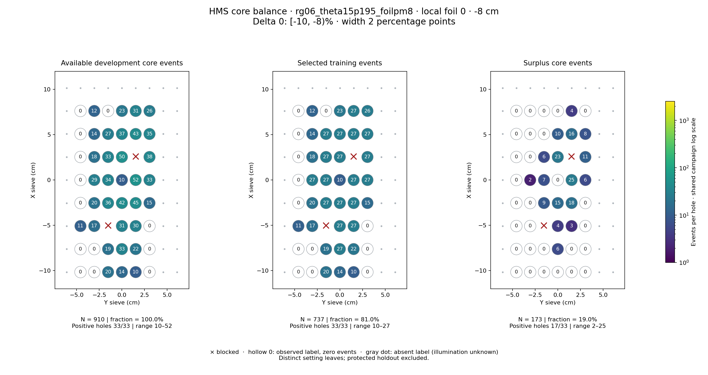
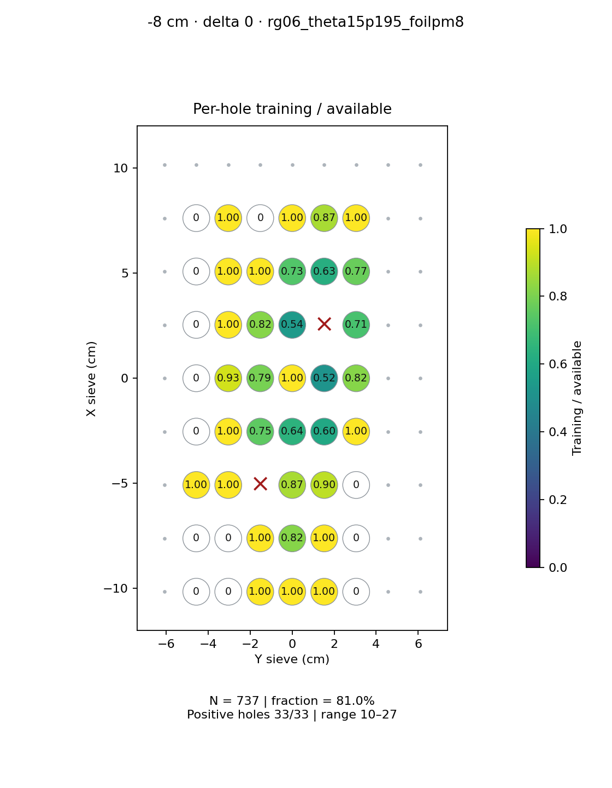
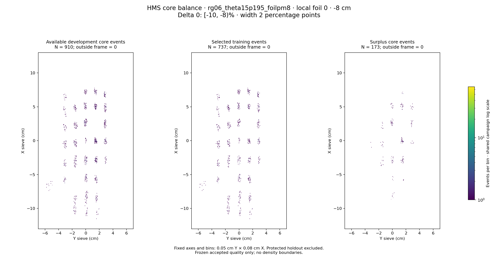

# rg06_theta15p195_foilpm8 · local foil 0 · -8 cm · delta 0

Interval [-10, -8)%, width 2 percentage points.

[Full-resolution training map](../plots/rg06_theta15p195_foilpm8_foil0_delta0_training.png) · [Full-resolution training cloud](../plots/rg06_theta15p195_foilpm8_foil0_delta0_training_cloud.png)

| rungroup | foil | xscol | yscol | available | q_hole | hole_cap | capacity | quota | actual_selected | surplus | qa_low | blocked |
|---|---|---|---|---|---|---|---|---|---|---|---|---|
| rg06_theta15p195_foilpm8 | 0 | 0 | 1 | 0 | 18 | 27 | 0 | 0 | 0 | 0 | False | False |
| rg06_theta15p195_foilpm8 | 0 | 0 | 2 | 0 | 18 | 27 | 0 | 0 | 0 | 0 | False | False |
| rg06_theta15p195_foilpm8 | 0 | 0 | 3 | 20 | 18 | 27 | 20 | 20 | 20 | 0 | False | False |
| rg06_theta15p195_foilpm8 | 0 | 0 | 4 | 14 | 18 | 27 | 14 | 14 | 14 | 0 | False | False |
| rg06_theta15p195_foilpm8 | 0 | 0 | 5 | 10 | 18 | 27 | 10 | 10 | 10 | 0 | False | False |
| rg06_theta15p195_foilpm8 | 0 | 0 | 6 | 0 | 18 | 27 | 0 | 0 | 0 | 0 | False | False |
| rg06_theta15p195_foilpm8 | 0 | 1 | 1 | 0 | 18 | 27 | 0 | 0 | 0 | 0 | False | False |
| rg06_theta15p195_foilpm8 | 0 | 1 | 2 | 0 | 18 | 27 | 0 | 0 | 0 | 0 | False | False |
| rg06_theta15p195_foilpm8 | 0 | 1 | 3 | 19 | 18 | 27 | 19 | 19 | 19 | 0 | False | False |
| rg06_theta15p195_foilpm8 | 0 | 1 | 4 | 33 | 18 | 27 | 27 | 27 | 27 | 6 | False | False |
| rg06_theta15p195_foilpm8 | 0 | 1 | 5 | 22 | 18 | 27 | 22 | 22 | 22 | 0 | False | False |
| rg06_theta15p195_foilpm8 | 0 | 1 | 6 | 0 | 18 | 27 | 0 | 0 | 0 | 0 | False | False |
| rg06_theta15p195_foilpm8 | 0 | 2 | 1 | 11 | 18 | 27 | 11 | 11 | 11 | 0 | False | False |
| rg06_theta15p195_foilpm8 | 0 | 2 | 2 | 17 | 18 | 27 | 17 | 17 | 17 | 0 | False | False |
| rg06_theta15p195_foilpm8 | 0 | 2 | 3 | 0 | 18 | 27 | 0 | 0 | 0 | 0 | False | True |
| rg06_theta15p195_foilpm8 | 0 | 2 | 4 | 31 | 18 | 27 | 27 | 27 | 27 | 4 | False | False |
| rg06_theta15p195_foilpm8 | 0 | 2 | 5 | 30 | 18 | 27 | 27 | 27 | 27 | 3 | False | False |
| rg06_theta15p195_foilpm8 | 0 | 2 | 6 | 0 | 18 | 27 | 0 | 0 | 0 | 0 | False | False |
| rg06_theta15p195_foilpm8 | 0 | 3 | 1 | 0 | 18 | 27 | 0 | 0 | 0 | 0 | False | False |
| rg06_theta15p195_foilpm8 | 0 | 3 | 2 | 20 | 18 | 27 | 20 | 20 | 20 | 0 | False | False |
| rg06_theta15p195_foilpm8 | 0 | 3 | 3 | 36 | 18 | 27 | 27 | 27 | 27 | 9 | False | False |
| rg06_theta15p195_foilpm8 | 0 | 3 | 4 | 42 | 18 | 27 | 27 | 27 | 27 | 15 | False | False |
| rg06_theta15p195_foilpm8 | 0 | 3 | 5 | 45 | 18 | 27 | 27 | 27 | 27 | 18 | False | False |
| rg06_theta15p195_foilpm8 | 0 | 3 | 6 | 15 | 18 | 27 | 15 | 15 | 15 | 0 | False | False |
| rg06_theta15p195_foilpm8 | 0 | 4 | 1 | 0 | 18 | 27 | 0 | 0 | 0 | 0 | False | False |
| rg06_theta15p195_foilpm8 | 0 | 4 | 2 | 29 | 18 | 27 | 27 | 27 | 27 | 2 | False | False |
| rg06_theta15p195_foilpm8 | 0 | 4 | 3 | 34 | 18 | 27 | 27 | 27 | 27 | 7 | False | False |
| rg06_theta15p195_foilpm8 | 0 | 4 | 4 | 10 | 18 | 27 | 10 | 10 | 10 | 0 | False | False |
| rg06_theta15p195_foilpm8 | 0 | 4 | 5 | 52 | 18 | 27 | 27 | 27 | 27 | 25 | False | False |
| rg06_theta15p195_foilpm8 | 0 | 4 | 6 | 33 | 18 | 27 | 27 | 27 | 27 | 6 | False | False |
| rg06_theta15p195_foilpm8 | 0 | 5 | 1 | 0 | 18 | 27 | 0 | 0 | 0 | 0 | False | False |
| rg06_theta15p195_foilpm8 | 0 | 5 | 2 | 18 | 18 | 27 | 18 | 18 | 18 | 0 | False | False |
| rg06_theta15p195_foilpm8 | 0 | 5 | 3 | 33 | 18 | 27 | 27 | 27 | 27 | 6 | False | False |
| rg06_theta15p195_foilpm8 | 0 | 5 | 4 | 50 | 18 | 27 | 27 | 27 | 27 | 23 | False | False |
| rg06_theta15p195_foilpm8 | 0 | 5 | 5 | 0 | 18 | 27 | 0 | 0 | 0 | 0 | False | True |
| rg06_theta15p195_foilpm8 | 0 | 5 | 6 | 38 | 18 | 27 | 27 | 27 | 27 | 11 | False | False |
| rg06_theta15p195_foilpm8 | 0 | 6 | 1 | 0 | 18 | 27 | 0 | 0 | 0 | 0 | False | False |
| rg06_theta15p195_foilpm8 | 0 | 6 | 2 | 14 | 18 | 27 | 14 | 14 | 14 | 0 | False | False |
| rg06_theta15p195_foilpm8 | 0 | 6 | 3 | 27 | 18 | 27 | 27 | 27 | 27 | 0 | False | False |
| rg06_theta15p195_foilpm8 | 0 | 6 | 4 | 37 | 18 | 27 | 27 | 27 | 27 | 10 | False | False |
| rg06_theta15p195_foilpm8 | 0 | 6 | 5 | 43 | 18 | 27 | 27 | 27 | 27 | 16 | False | False |
| rg06_theta15p195_foilpm8 | 0 | 6 | 6 | 35 | 18 | 27 | 27 | 27 | 27 | 8 | False | False |
| rg06_theta15p195_foilpm8 | 0 | 7 | 1 | 0 | 18 | 27 | 0 | 0 | 0 | 0 | False | False |
| rg06_theta15p195_foilpm8 | 0 | 7 | 2 | 12 | 18 | 27 | 12 | 12 | 12 | 0 | False | False |
| rg06_theta15p195_foilpm8 | 0 | 7 | 3 | 0 | 18 | 27 | 0 | 0 | 0 | 0 | False | False |
| rg06_theta15p195_foilpm8 | 0 | 7 | 4 | 23 | 18 | 27 | 23 | 23 | 23 | 0 | False | False |
| rg06_theta15p195_foilpm8 | 0 | 7 | 5 | 31 | 18 | 27 | 27 | 27 | 27 | 4 | False | False |
| rg06_theta15p195_foilpm8 | 0 | 7 | 6 | 26 | 18 | 27 | 26 | 26 | 26 | 0 | False | False |
