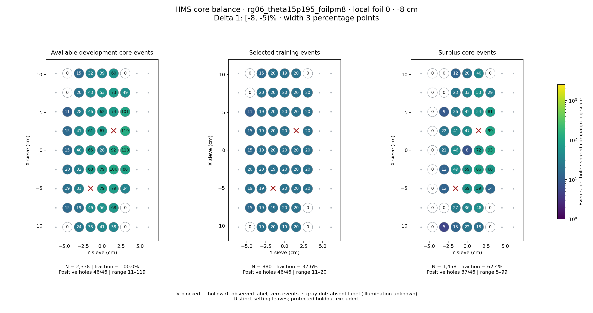
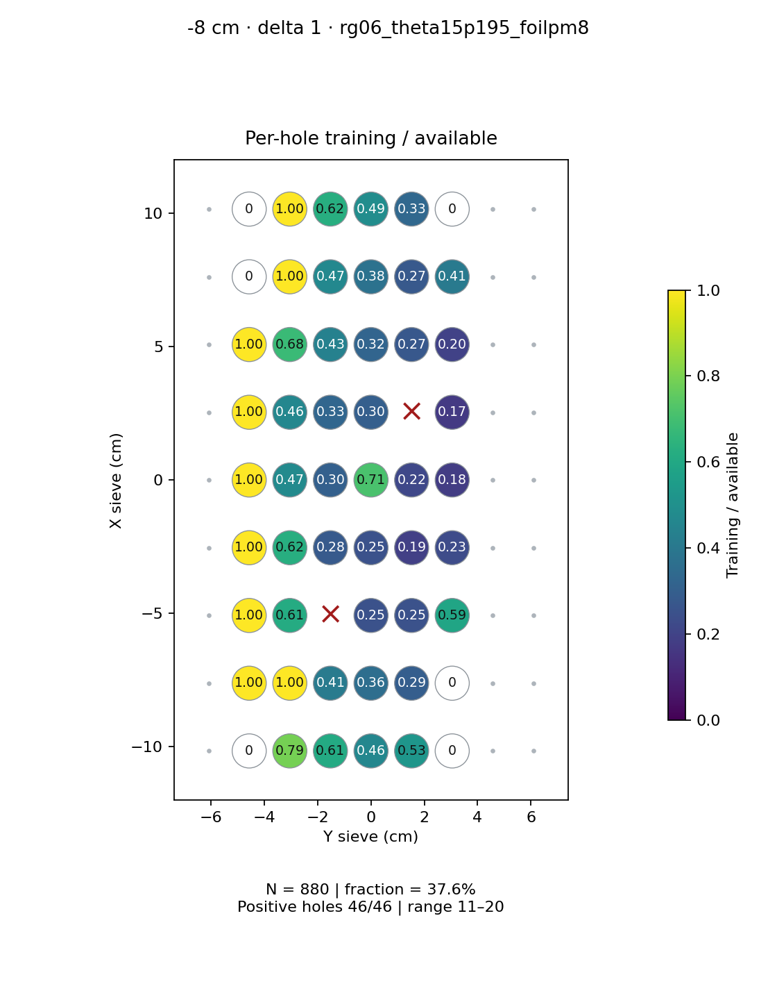
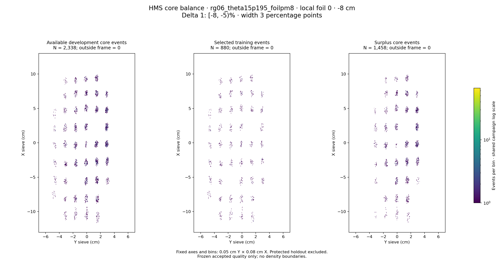

# rg06_theta15p195_foilpm8 · local foil 0 · -8 cm · delta 1

Interval [-8, -5)%, width 3 percentage points.

[Full-resolution training map](../plots/rg06_theta15p195_foilpm8_foil0_delta1_training.png) · [Full-resolution training cloud](../plots/rg06_theta15p195_foilpm8_foil0_delta1_training_cloud.png)

| rungroup | foil | xscol | yscol | available | q_hole | hole_cap | capacity | quota | actual_selected | surplus | qa_low | blocked |
|---|---|---|---|---|---|---|---|---|---|---|---|---|
| rg06_theta15p195_foilpm8 | 0 | 0 | 1 | 0 | 28.75 | 43 | 0 | 0 | 0 | 0 | False | False |
| rg06_theta15p195_foilpm8 | 0 | 0 | 2 | 24 | 28.75 | 43 | 24 | 19 | 19 | 5 | False | False |
| rg06_theta15p195_foilpm8 | 0 | 0 | 3 | 33 | 28.75 | 43 | 33 | 20 | 20 | 13 | False | False |
| rg06_theta15p195_foilpm8 | 0 | 0 | 4 | 41 | 28.75 | 43 | 41 | 19 | 19 | 22 | False | False |
| rg06_theta15p195_foilpm8 | 0 | 0 | 5 | 38 | 28.75 | 43 | 38 | 20 | 20 | 18 | False | False |
| rg06_theta15p195_foilpm8 | 0 | 0 | 6 | 0 | 28.75 | 43 | 0 | 0 | 0 | 0 | False | False |
| rg06_theta15p195_foilpm8 | 0 | 1 | 1 | 15 | 28.75 | 43 | 15 | 15 | 15 | 0 | False | False |
| rg06_theta15p195_foilpm8 | 0 | 1 | 2 | 19 | 28.75 | 43 | 19 | 19 | 19 | 0 | False | False |
| rg06_theta15p195_foilpm8 | 0 | 1 | 3 | 46 | 28.75 | 43 | 43 | 19 | 19 | 27 | False | False |
| rg06_theta15p195_foilpm8 | 0 | 1 | 4 | 56 | 28.75 | 43 | 43 | 20 | 20 | 36 | False | False |
| rg06_theta15p195_foilpm8 | 0 | 1 | 5 | 68 | 28.75 | 43 | 43 | 20 | 20 | 48 | False | False |
| rg06_theta15p195_foilpm8 | 0 | 1 | 6 | 0 | 28.75 | 43 | 0 | 0 | 0 | 0 | False | False |
| rg06_theta15p195_foilpm8 | 0 | 2 | 1 | 19 | 28.75 | 43 | 19 | 19 | 19 | 0 | False | False |
| rg06_theta15p195_foilpm8 | 0 | 2 | 2 | 31 | 28.75 | 43 | 31 | 19 | 19 | 12 | False | False |
| rg06_theta15p195_foilpm8 | 0 | 2 | 3 | 0 | 28.75 | 43 | 0 | 0 | 0 | 0 | False | True |
| rg06_theta15p195_foilpm8 | 0 | 2 | 4 | 79 | 28.75 | 43 | 43 | 20 | 20 | 59 | False | False |
| rg06_theta15p195_foilpm8 | 0 | 2 | 5 | 79 | 28.75 | 43 | 43 | 20 | 20 | 59 | False | False |
| rg06_theta15p195_foilpm8 | 0 | 2 | 6 | 34 | 28.75 | 43 | 34 | 20 | 20 | 14 | False | False |
| rg06_theta15p195_foilpm8 | 0 | 3 | 1 | 20 | 28.75 | 43 | 20 | 20 | 20 | 0 | False | False |
| rg06_theta15p195_foilpm8 | 0 | 3 | 2 | 32 | 28.75 | 43 | 32 | 20 | 20 | 12 | False | False |
| rg06_theta15p195_foilpm8 | 0 | 3 | 3 | 68 | 28.75 | 43 | 43 | 19 | 19 | 49 | False | False |
| rg06_theta15p195_foilpm8 | 0 | 3 | 4 | 79 | 28.75 | 43 | 43 | 20 | 20 | 59 | False | False |
| rg06_theta15p195_foilpm8 | 0 | 3 | 5 | 106 | 28.75 | 43 | 43 | 20 | 20 | 86 | False | False |
| rg06_theta15p195_foilpm8 | 0 | 3 | 6 | 88 | 28.75 | 43 | 43 | 20 | 20 | 68 | False | False |
| rg06_theta15p195_foilpm8 | 0 | 4 | 1 | 15 | 28.75 | 43 | 15 | 15 | 15 | 0 | False | False |
| rg06_theta15p195_foilpm8 | 0 | 4 | 2 | 40 | 28.75 | 43 | 40 | 19 | 19 | 21 | False | False |
| rg06_theta15p195_foilpm8 | 0 | 4 | 3 | 66 | 28.75 | 43 | 43 | 20 | 20 | 46 | False | False |
| rg06_theta15p195_foilpm8 | 0 | 4 | 4 | 28 | 28.75 | 43 | 28 | 20 | 20 | 8 | False | False |
| rg06_theta15p195_foilpm8 | 0 | 4 | 5 | 92 | 28.75 | 43 | 43 | 20 | 20 | 72 | False | False |
| rg06_theta15p195_foilpm8 | 0 | 4 | 6 | 113 | 28.75 | 43 | 43 | 20 | 20 | 93 | False | False |
| rg06_theta15p195_foilpm8 | 0 | 5 | 1 | 15 | 28.75 | 43 | 15 | 15 | 15 | 0 | False | False |
| rg06_theta15p195_foilpm8 | 0 | 5 | 2 | 41 | 28.75 | 43 | 41 | 19 | 19 | 22 | False | False |
| rg06_theta15p195_foilpm8 | 0 | 5 | 3 | 61 | 28.75 | 43 | 43 | 20 | 20 | 41 | False | False |
| rg06_theta15p195_foilpm8 | 0 | 5 | 4 | 67 | 28.75 | 43 | 43 | 20 | 20 | 47 | False | False |
| rg06_theta15p195_foilpm8 | 0 | 5 | 5 | 0 | 28.75 | 43 | 0 | 0 | 0 | 0 | False | True |
| rg06_theta15p195_foilpm8 | 0 | 5 | 6 | 119 | 28.75 | 43 | 43 | 20 | 20 | 99 | False | False |
| rg06_theta15p195_foilpm8 | 0 | 6 | 1 | 11 | 28.75 | 43 | 11 | 11 | 11 | 0 | False | False |
| rg06_theta15p195_foilpm8 | 0 | 6 | 2 | 28 | 28.75 | 43 | 28 | 19 | 19 | 9 | False | False |
| rg06_theta15p195_foilpm8 | 0 | 6 | 3 | 46 | 28.75 | 43 | 43 | 20 | 20 | 26 | False | False |
| rg06_theta15p195_foilpm8 | 0 | 6 | 4 | 62 | 28.75 | 43 | 43 | 20 | 20 | 42 | False | False |
| rg06_theta15p195_foilpm8 | 0 | 6 | 5 | 74 | 28.75 | 43 | 43 | 20 | 20 | 54 | False | False |
| rg06_theta15p195_foilpm8 | 0 | 6 | 6 | 101 | 28.75 | 43 | 43 | 20 | 20 | 81 | False | False |
| rg06_theta15p195_foilpm8 | 0 | 7 | 1 | 0 | 28.75 | 43 | 0 | 0 | 0 | 0 | False | False |
| rg06_theta15p195_foilpm8 | 0 | 7 | 2 | 20 | 28.75 | 43 | 20 | 20 | 20 | 0 | False | False |
| rg06_theta15p195_foilpm8 | 0 | 7 | 3 | 43 | 28.75 | 43 | 43 | 20 | 20 | 23 | False | False |
| rg06_theta15p195_foilpm8 | 0 | 7 | 4 | 53 | 28.75 | 43 | 43 | 20 | 20 | 33 | False | False |
| rg06_theta15p195_foilpm8 | 0 | 7 | 5 | 73 | 28.75 | 43 | 43 | 20 | 20 | 53 | False | False |
| rg06_theta15p195_foilpm8 | 0 | 7 | 6 | 49 | 28.75 | 43 | 43 | 20 | 20 | 29 | False | False |
| rg06_theta15p195_foilpm8 | 0 | 8 | 1 | 0 | 28.75 | 43 | 0 | 0 | 0 | 0 | False | False |
| rg06_theta15p195_foilpm8 | 0 | 8 | 2 | 15 | 28.75 | 43 | 15 | 15 | 15 | 0 | False | False |
| rg06_theta15p195_foilpm8 | 0 | 8 | 3 | 32 | 28.75 | 43 | 32 | 20 | 20 | 12 | False | False |
| rg06_theta15p195_foilpm8 | 0 | 8 | 4 | 39 | 28.75 | 43 | 39 | 19 | 19 | 20 | False | False |
| rg06_theta15p195_foilpm8 | 0 | 8 | 5 | 60 | 28.75 | 43 | 43 | 20 | 20 | 40 | False | False |
| rg06_theta15p195_foilpm8 | 0 | 8 | 6 | 0 | 28.75 | 43 | 0 | 0 | 0 | 0 | False | False |
