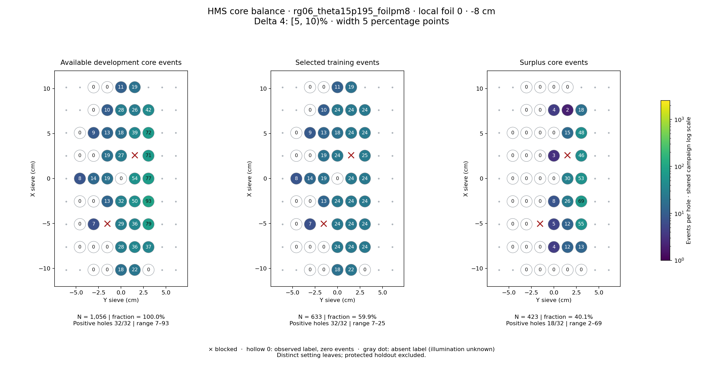
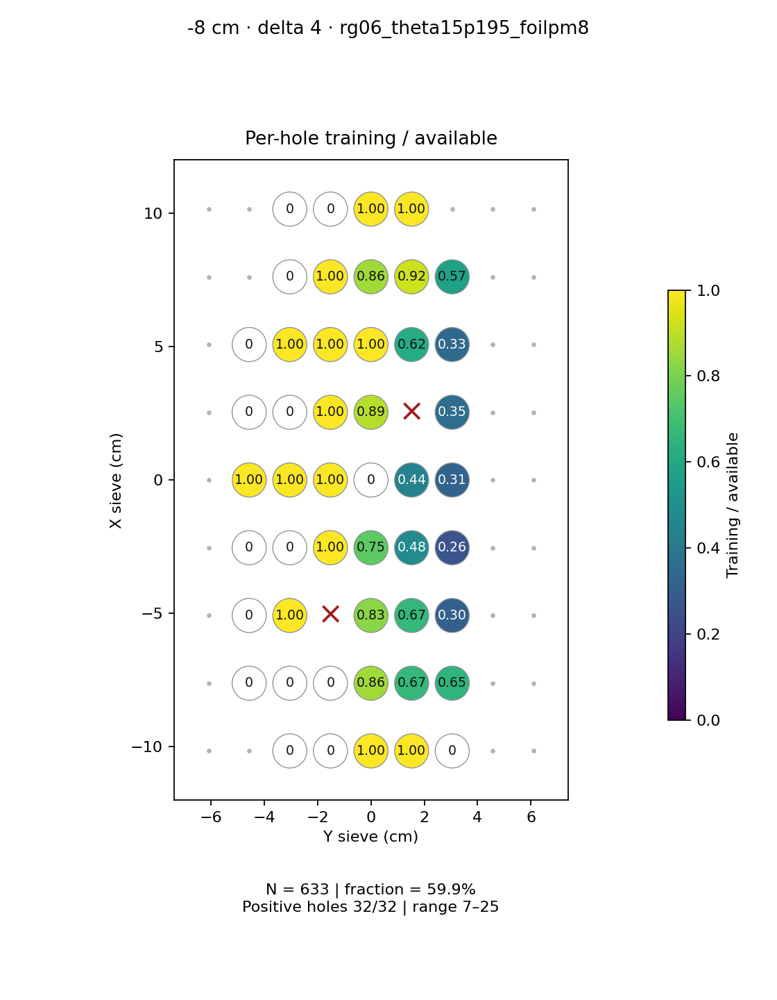
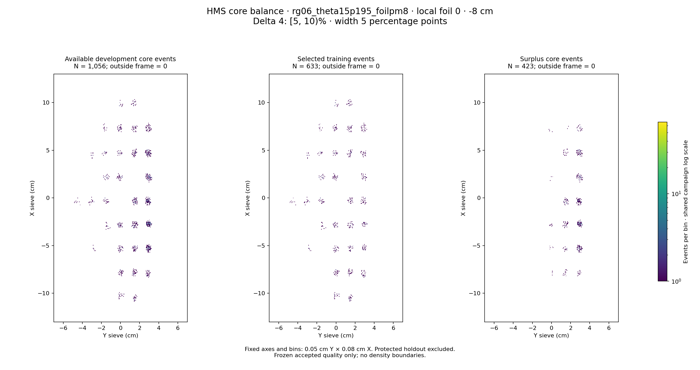

# rg06_theta15p195_foilpm8 · local foil 0 · -8 cm · delta 4

Interval [5, 10)%, width 5 percentage points.

[Full-resolution training map](../plots/rg06_theta15p195_foilpm8_foil0_delta4_training.png) · [Full-resolution training cloud](../plots/rg06_theta15p195_foilpm8_foil0_delta4_training_cloud.png)

| rungroup | foil | xscol | yscol | available | q_hole | hole_cap | capacity | quota | actual_selected | surplus | qa_low | blocked |
|---|---|---|---|---|---|---|---|---|---|---|---|---|
| rg06_theta15p195_foilpm8 | 0 | 0 | 2 | 0 | 17 | 25 | 0 | 0 | 0 | 0 | False | False |
| rg06_theta15p195_foilpm8 | 0 | 0 | 3 | 0 | 17 | 25 | 0 | 0 | 0 | 0 | False | False |
| rg06_theta15p195_foilpm8 | 0 | 0 | 4 | 18 | 17 | 25 | 18 | 18 | 18 | 0 | False | False |
| rg06_theta15p195_foilpm8 | 0 | 0 | 5 | 22 | 17 | 25 | 22 | 22 | 22 | 0 | False | False |
| rg06_theta15p195_foilpm8 | 0 | 0 | 6 | 0 | 17 | 25 | 0 | 0 | 0 | 0 | False | False |
| rg06_theta15p195_foilpm8 | 0 | 1 | 1 | 0 | 17 | 25 | 0 | 0 | 0 | 0 | False | False |
| rg06_theta15p195_foilpm8 | 0 | 1 | 2 | 0 | 17 | 25 | 0 | 0 | 0 | 0 | False | False |
| rg06_theta15p195_foilpm8 | 0 | 1 | 3 | 0 | 17 | 25 | 0 | 0 | 0 | 0 | False | False |
| rg06_theta15p195_foilpm8 | 0 | 1 | 4 | 28 | 17 | 25 | 25 | 24 | 24 | 4 | False | False |
| rg06_theta15p195_foilpm8 | 0 | 1 | 5 | 36 | 17 | 25 | 25 | 24 | 24 | 12 | False | False |
| rg06_theta15p195_foilpm8 | 0 | 1 | 6 | 37 | 17 | 25 | 25 | 24 | 24 | 13 | False | False |
| rg06_theta15p195_foilpm8 | 0 | 2 | 1 | 0 | 17 | 25 | 0 | 0 | 0 | 0 | False | False |
| rg06_theta15p195_foilpm8 | 0 | 2 | 2 | 7 | 17 | 25 | 7 | 7 | 7 | 0 | True | False |
| rg06_theta15p195_foilpm8 | 0 | 2 | 4 | 29 | 17 | 25 | 25 | 24 | 24 | 5 | False | False |
| rg06_theta15p195_foilpm8 | 0 | 2 | 5 | 36 | 17 | 25 | 25 | 24 | 24 | 12 | False | False |
| rg06_theta15p195_foilpm8 | 0 | 2 | 6 | 79 | 17 | 25 | 25 | 24 | 24 | 55 | False | False |
| rg06_theta15p195_foilpm8 | 0 | 3 | 1 | 0 | 17 | 25 | 0 | 0 | 0 | 0 | False | False |
| rg06_theta15p195_foilpm8 | 0 | 3 | 2 | 0 | 17 | 25 | 0 | 0 | 0 | 0 | False | False |
| rg06_theta15p195_foilpm8 | 0 | 3 | 3 | 13 | 17 | 25 | 13 | 13 | 13 | 0 | False | False |
| rg06_theta15p195_foilpm8 | 0 | 3 | 4 | 32 | 17 | 25 | 25 | 24 | 24 | 8 | False | False |
| rg06_theta15p195_foilpm8 | 0 | 3 | 5 | 50 | 17 | 25 | 25 | 24 | 24 | 26 | False | False |
| rg06_theta15p195_foilpm8 | 0 | 3 | 6 | 93 | 17 | 25 | 25 | 24 | 24 | 69 | False | False |
| rg06_theta15p195_foilpm8 | 0 | 4 | 1 | 8 | 17 | 25 | 8 | 8 | 8 | 0 | True | False |
| rg06_theta15p195_foilpm8 | 0 | 4 | 2 | 14 | 17 | 25 | 14 | 14 | 14 | 0 | False | False |
| rg06_theta15p195_foilpm8 | 0 | 4 | 3 | 19 | 17 | 25 | 19 | 19 | 19 | 0 | False | False |
| rg06_theta15p195_foilpm8 | 0 | 4 | 4 | 0 | 17 | 25 | 0 | 0 | 0 | 0 | False | False |
| rg06_theta15p195_foilpm8 | 0 | 4 | 5 | 54 | 17 | 25 | 25 | 24 | 24 | 30 | False | False |
| rg06_theta15p195_foilpm8 | 0 | 4 | 6 | 77 | 17 | 25 | 25 | 24 | 24 | 53 | False | False |
| rg06_theta15p195_foilpm8 | 0 | 5 | 1 | 0 | 17 | 25 | 0 | 0 | 0 | 0 | False | False |
| rg06_theta15p195_foilpm8 | 0 | 5 | 2 | 0 | 17 | 25 | 0 | 0 | 0 | 0 | False | False |
| rg06_theta15p195_foilpm8 | 0 | 5 | 3 | 19 | 17 | 25 | 19 | 19 | 19 | 0 | False | False |
| rg06_theta15p195_foilpm8 | 0 | 5 | 4 | 27 | 17 | 25 | 25 | 24 | 24 | 3 | False | False |
| rg06_theta15p195_foilpm8 | 0 | 5 | 5 | 0 | 17 | 25 | 0 | 0 | 0 | 0 | False | True |
| rg06_theta15p195_foilpm8 | 0 | 5 | 6 | 71 | 17 | 25 | 25 | 25 | 25 | 46 | False | False |
| rg06_theta15p195_foilpm8 | 0 | 6 | 1 | 0 | 17 | 25 | 0 | 0 | 0 | 0 | False | False |
| rg06_theta15p195_foilpm8 | 0 | 6 | 2 | 9 | 17 | 25 | 9 | 9 | 9 | 0 | True | False |
| rg06_theta15p195_foilpm8 | 0 | 6 | 3 | 13 | 17 | 25 | 13 | 13 | 13 | 0 | False | False |
| rg06_theta15p195_foilpm8 | 0 | 6 | 4 | 18 | 17 | 25 | 18 | 18 | 18 | 0 | False | False |
| rg06_theta15p195_foilpm8 | 0 | 6 | 5 | 39 | 17 | 25 | 25 | 24 | 24 | 15 | False | False |
| rg06_theta15p195_foilpm8 | 0 | 6 | 6 | 72 | 17 | 25 | 25 | 24 | 24 | 48 | False | False |
| rg06_theta15p195_foilpm8 | 0 | 7 | 2 | 0 | 17 | 25 | 0 | 0 | 0 | 0 | False | False |
| rg06_theta15p195_foilpm8 | 0 | 7 | 3 | 10 | 17 | 25 | 10 | 10 | 10 | 0 | False | False |
| rg06_theta15p195_foilpm8 | 0 | 7 | 4 | 28 | 17 | 25 | 25 | 24 | 24 | 4 | False | False |
| rg06_theta15p195_foilpm8 | 0 | 7 | 5 | 26 | 17 | 25 | 25 | 24 | 24 | 2 | False | False |
| rg06_theta15p195_foilpm8 | 0 | 7 | 6 | 42 | 17 | 25 | 25 | 24 | 24 | 18 | False | False |
| rg06_theta15p195_foilpm8 | 0 | 8 | 2 | 0 | 17 | 25 | 0 | 0 | 0 | 0 | False | False |
| rg06_theta15p195_foilpm8 | 0 | 8 | 3 | 0 | 17 | 25 | 0 | 0 | 0 | 0 | False | False |
| rg06_theta15p195_foilpm8 | 0 | 8 | 4 | 11 | 17 | 25 | 11 | 11 | 11 | 0 | False | False |
| rg06_theta15p195_foilpm8 | 0 | 8 | 5 | 19 | 17 | 25 | 19 | 19 | 19 | 0 | False | False |
