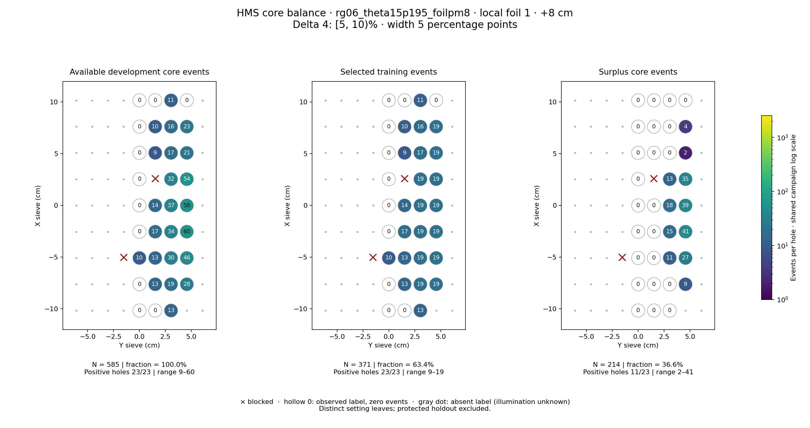
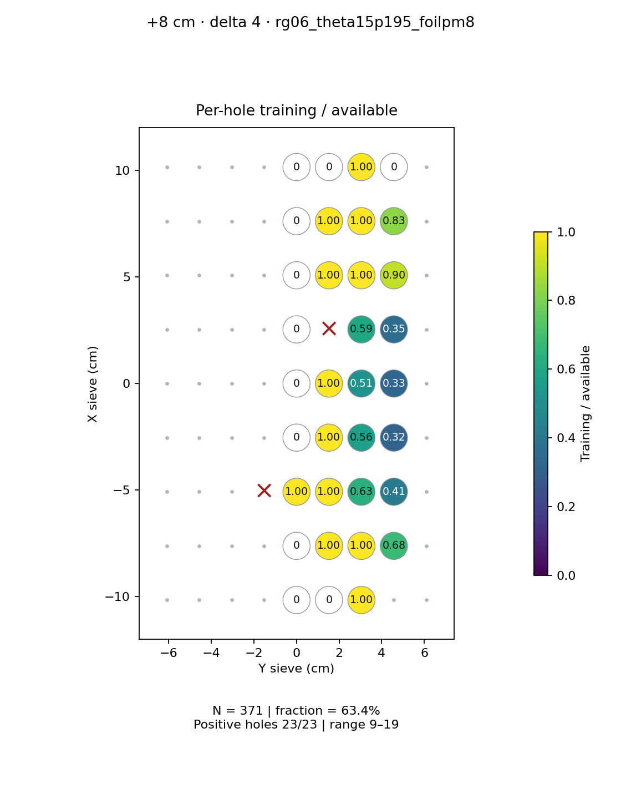
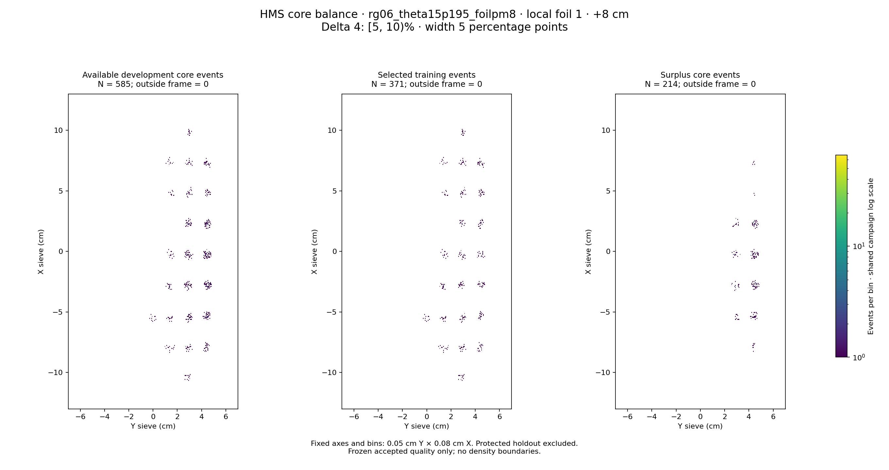

# rg06_theta15p195_foilpm8 · local foil 1 · +8 cm · delta 4

Interval [5, 10)%, width 5 percentage points.

[Full-resolution training map](../plots/rg06_theta15p195_foilpm8_foil1_delta4_training.png) · [Full-resolution training cloud](../plots/rg06_theta15p195_foilpm8_foil1_delta4_training_cloud.png)

| rungroup | foil | xscol | yscol | available | q_hole | hole_cap | capacity | quota | actual_selected | surplus | qa_low | blocked |
|---|---|---|---|---|---|---|---|---|---|---|---|---|
| rg06_theta15p195_foilpm8 | 1 | 0 | 4 | 0 | 13 | 19 | 0 | 0 | 0 | 0 | False | False |
| rg06_theta15p195_foilpm8 | 1 | 0 | 5 | 0 | 13 | 19 | 0 | 0 | 0 | 0 | False | False |
| rg06_theta15p195_foilpm8 | 1 | 0 | 6 | 13 | 13 | 19 | 13 | 13 | 13 | 0 | False | False |
| rg06_theta15p195_foilpm8 | 1 | 1 | 4 | 0 | 13 | 19 | 0 | 0 | 0 | 0 | False | False |
| rg06_theta15p195_foilpm8 | 1 | 1 | 5 | 13 | 13 | 19 | 13 | 13 | 13 | 0 | False | False |
| rg06_theta15p195_foilpm8 | 1 | 1 | 6 | 19 | 13 | 19 | 19 | 19 | 19 | 0 | False | False |
| rg06_theta15p195_foilpm8 | 1 | 1 | 7 | 28 | 13 | 19 | 19 | 19 | 19 | 9 | False | False |
| rg06_theta15p195_foilpm8 | 1 | 2 | 4 | 10 | 13 | 19 | 10 | 10 | 10 | 0 | False | False |
| rg06_theta15p195_foilpm8 | 1 | 2 | 5 | 13 | 13 | 19 | 13 | 13 | 13 | 0 | False | False |
| rg06_theta15p195_foilpm8 | 1 | 2 | 6 | 30 | 13 | 19 | 19 | 19 | 19 | 11 | False | False |
| rg06_theta15p195_foilpm8 | 1 | 2 | 7 | 46 | 13 | 19 | 19 | 19 | 19 | 27 | False | False |
| rg06_theta15p195_foilpm8 | 1 | 3 | 4 | 0 | 13 | 19 | 0 | 0 | 0 | 0 | False | False |
| rg06_theta15p195_foilpm8 | 1 | 3 | 5 | 17 | 13 | 19 | 17 | 17 | 17 | 0 | False | False |
| rg06_theta15p195_foilpm8 | 1 | 3 | 6 | 34 | 13 | 19 | 19 | 19 | 19 | 15 | False | False |
| rg06_theta15p195_foilpm8 | 1 | 3 | 7 | 60 | 13 | 19 | 19 | 19 | 19 | 41 | False | False |
| rg06_theta15p195_foilpm8 | 1 | 4 | 4 | 0 | 13 | 19 | 0 | 0 | 0 | 0 | False | False |
| rg06_theta15p195_foilpm8 | 1 | 4 | 5 | 14 | 13 | 19 | 14 | 14 | 14 | 0 | False | False |
| rg06_theta15p195_foilpm8 | 1 | 4 | 6 | 37 | 13 | 19 | 19 | 19 | 19 | 18 | False | False |
| rg06_theta15p195_foilpm8 | 1 | 4 | 7 | 58 | 13 | 19 | 19 | 19 | 19 | 39 | False | False |
| rg06_theta15p195_foilpm8 | 1 | 5 | 4 | 0 | 13 | 19 | 0 | 0 | 0 | 0 | False | False |
| rg06_theta15p195_foilpm8 | 1 | 5 | 6 | 32 | 13 | 19 | 19 | 19 | 19 | 13 | False | False |
| rg06_theta15p195_foilpm8 | 1 | 5 | 7 | 54 | 13 | 19 | 19 | 19 | 19 | 35 | False | False |
| rg06_theta15p195_foilpm8 | 1 | 6 | 4 | 0 | 13 | 19 | 0 | 0 | 0 | 0 | False | False |
| rg06_theta15p195_foilpm8 | 1 | 6 | 5 | 9 | 13 | 19 | 9 | 9 | 9 | 0 | True | False |
| rg06_theta15p195_foilpm8 | 1 | 6 | 6 | 17 | 13 | 19 | 17 | 17 | 17 | 0 | False | False |
| rg06_theta15p195_foilpm8 | 1 | 6 | 7 | 21 | 13 | 19 | 19 | 19 | 19 | 2 | False | False |
| rg06_theta15p195_foilpm8 | 1 | 7 | 4 | 0 | 13 | 19 | 0 | 0 | 0 | 0 | False | False |
| rg06_theta15p195_foilpm8 | 1 | 7 | 5 | 10 | 13 | 19 | 10 | 10 | 10 | 0 | False | False |
| rg06_theta15p195_foilpm8 | 1 | 7 | 6 | 16 | 13 | 19 | 16 | 16 | 16 | 0 | False | False |
| rg06_theta15p195_foilpm8 | 1 | 7 | 7 | 23 | 13 | 19 | 19 | 19 | 19 | 4 | False | False |
| rg06_theta15p195_foilpm8 | 1 | 8 | 4 | 0 | 13 | 19 | 0 | 0 | 0 | 0 | False | False |
| rg06_theta15p195_foilpm8 | 1 | 8 | 5 | 0 | 13 | 19 | 0 | 0 | 0 | 0 | False | False |
| rg06_theta15p195_foilpm8 | 1 | 8 | 6 | 11 | 13 | 19 | 11 | 11 | 11 | 0 | False | False |
| rg06_theta15p195_foilpm8 | 1 | 8 | 7 | 0 | 13 | 19 | 0 | 0 | 0 | 0 | False | False |
