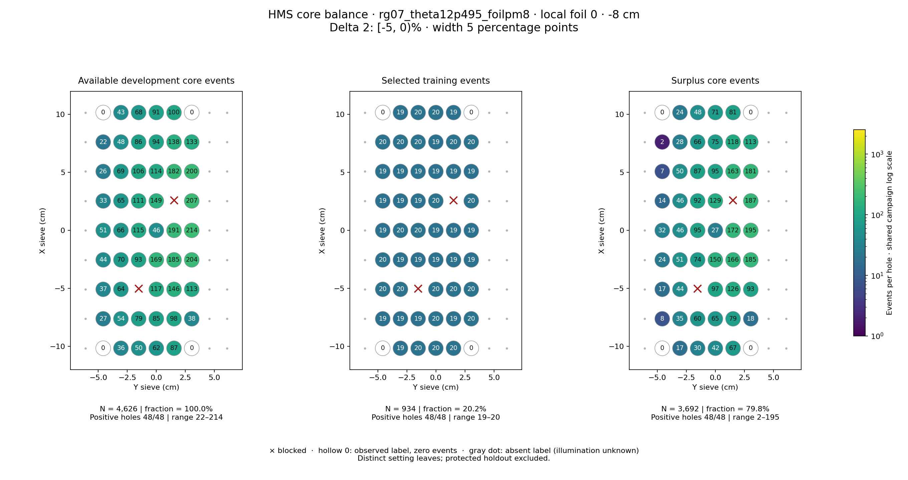
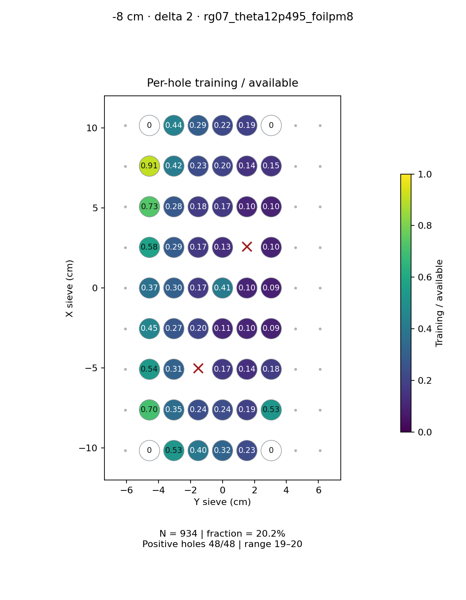
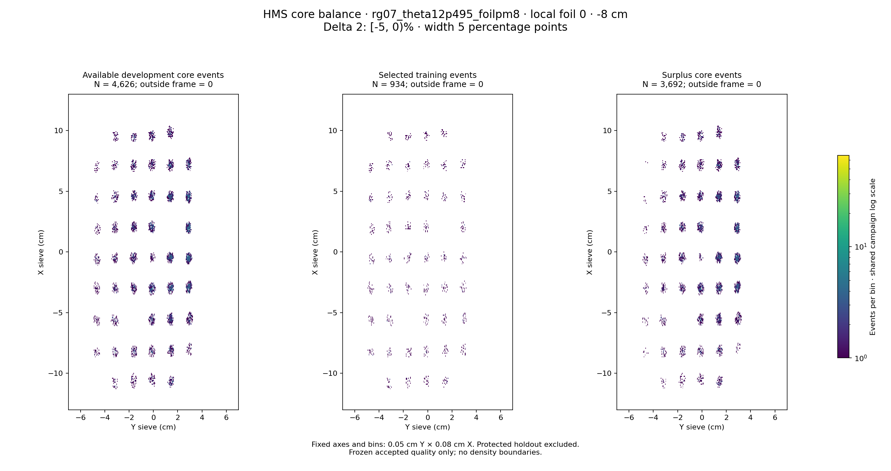

# rg07_theta12p495_foilpm8 · local foil 0 · -8 cm · delta 2

Interval [-5, 0)%, width 5 percentage points.

[Full-resolution training map](../plots/rg07_theta12p495_foilpm8_foil0_delta2_training.png) · [Full-resolution training cloud](../plots/rg07_theta12p495_foilpm8_foil0_delta2_training_cloud.png)

| rungroup | foil | xscol | yscol | available | q_hole | hole_cap | capacity | quota | actual_selected | surplus | qa_low | blocked |
|---|---|---|---|---|---|---|---|---|---|---|---|---|
| rg07_theta12p495_foilpm8 | 0 | 0 | 1 | 0 | 50.75 | 76 | 0 | 0 | 0 | 0 | False | False |
| rg07_theta12p495_foilpm8 | 0 | 0 | 2 | 36 | 50.75 | 76 | 36 | 19 | 19 | 17 | False | False |
| rg07_theta12p495_foilpm8 | 0 | 0 | 3 | 50 | 50.75 | 76 | 50 | 20 | 20 | 30 | False | False |
| rg07_theta12p495_foilpm8 | 0 | 0 | 4 | 62 | 50.75 | 76 | 62 | 20 | 20 | 42 | False | False |
| rg07_theta12p495_foilpm8 | 0 | 0 | 5 | 87 | 50.75 | 76 | 76 | 20 | 20 | 67 | False | False |
| rg07_theta12p495_foilpm8 | 0 | 0 | 6 | 0 | 50.75 | 76 | 0 | 0 | 0 | 0 | False | False |
| rg07_theta12p495_foilpm8 | 0 | 1 | 1 | 27 | 50.75 | 76 | 27 | 19 | 19 | 8 | False | False |
| rg07_theta12p495_foilpm8 | 0 | 1 | 2 | 54 | 50.75 | 76 | 54 | 19 | 19 | 35 | False | False |
| rg07_theta12p495_foilpm8 | 0 | 1 | 3 | 79 | 50.75 | 76 | 76 | 19 | 19 | 60 | False | False |
| rg07_theta12p495_foilpm8 | 0 | 1 | 4 | 85 | 50.75 | 76 | 76 | 20 | 20 | 65 | False | False |
| rg07_theta12p495_foilpm8 | 0 | 1 | 5 | 98 | 50.75 | 76 | 76 | 19 | 19 | 79 | False | False |
| rg07_theta12p495_foilpm8 | 0 | 1 | 6 | 38 | 50.75 | 76 | 38 | 20 | 20 | 18 | False | False |
| rg07_theta12p495_foilpm8 | 0 | 2 | 1 | 37 | 50.75 | 76 | 37 | 20 | 20 | 17 | False | False |
| rg07_theta12p495_foilpm8 | 0 | 2 | 2 | 64 | 50.75 | 76 | 64 | 20 | 20 | 44 | False | False |
| rg07_theta12p495_foilpm8 | 0 | 2 | 3 | 0 | 50.75 | 76 | 0 | 0 | 0 | 0 | False | True |
| rg07_theta12p495_foilpm8 | 0 | 2 | 4 | 117 | 50.75 | 76 | 76 | 20 | 20 | 97 | False | False |
| rg07_theta12p495_foilpm8 | 0 | 2 | 5 | 146 | 50.75 | 76 | 76 | 20 | 20 | 126 | False | False |
| rg07_theta12p495_foilpm8 | 0 | 2 | 6 | 113 | 50.75 | 76 | 76 | 20 | 20 | 93 | False | False |
| rg07_theta12p495_foilpm8 | 0 | 3 | 1 | 44 | 50.75 | 76 | 44 | 20 | 20 | 24 | False | False |
| rg07_theta12p495_foilpm8 | 0 | 3 | 2 | 70 | 50.75 | 76 | 70 | 19 | 19 | 51 | False | False |
| rg07_theta12p495_foilpm8 | 0 | 3 | 3 | 93 | 50.75 | 76 | 76 | 19 | 19 | 74 | False | False |
| rg07_theta12p495_foilpm8 | 0 | 3 | 4 | 169 | 50.75 | 76 | 76 | 19 | 19 | 150 | False | False |
| rg07_theta12p495_foilpm8 | 0 | 3 | 5 | 185 | 50.75 | 76 | 76 | 19 | 19 | 166 | False | False |
| rg07_theta12p495_foilpm8 | 0 | 3 | 6 | 204 | 50.75 | 76 | 76 | 19 | 19 | 185 | False | False |
| rg07_theta12p495_foilpm8 | 0 | 4 | 1 | 51 | 50.75 | 76 | 51 | 19 | 19 | 32 | False | False |
| rg07_theta12p495_foilpm8 | 0 | 4 | 2 | 66 | 50.75 | 76 | 66 | 20 | 20 | 46 | False | False |
| rg07_theta12p495_foilpm8 | 0 | 4 | 3 | 115 | 50.75 | 76 | 76 | 20 | 20 | 95 | False | False |
| rg07_theta12p495_foilpm8 | 0 | 4 | 4 | 46 | 50.75 | 76 | 46 | 19 | 19 | 27 | False | False |
| rg07_theta12p495_foilpm8 | 0 | 4 | 5 | 191 | 50.75 | 76 | 76 | 19 | 19 | 172 | False | False |
| rg07_theta12p495_foilpm8 | 0 | 4 | 6 | 214 | 50.75 | 76 | 76 | 19 | 19 | 195 | False | False |
| rg07_theta12p495_foilpm8 | 0 | 5 | 1 | 33 | 50.75 | 76 | 33 | 19 | 19 | 14 | False | False |
| rg07_theta12p495_foilpm8 | 0 | 5 | 2 | 65 | 50.75 | 76 | 65 | 19 | 19 | 46 | False | False |
| rg07_theta12p495_foilpm8 | 0 | 5 | 3 | 111 | 50.75 | 76 | 76 | 19 | 19 | 92 | False | False |
| rg07_theta12p495_foilpm8 | 0 | 5 | 4 | 149 | 50.75 | 76 | 76 | 20 | 20 | 129 | False | False |
| rg07_theta12p495_foilpm8 | 0 | 5 | 5 | 0 | 50.75 | 76 | 0 | 0 | 0 | 0 | False | True |
| rg07_theta12p495_foilpm8 | 0 | 5 | 6 | 207 | 50.75 | 76 | 76 | 20 | 20 | 187 | False | False |
| rg07_theta12p495_foilpm8 | 0 | 6 | 1 | 26 | 50.75 | 76 | 26 | 19 | 19 | 7 | False | False |
| rg07_theta12p495_foilpm8 | 0 | 6 | 2 | 69 | 50.75 | 76 | 69 | 19 | 19 | 50 | False | False |
| rg07_theta12p495_foilpm8 | 0 | 6 | 3 | 106 | 50.75 | 76 | 76 | 19 | 19 | 87 | False | False |
| rg07_theta12p495_foilpm8 | 0 | 6 | 4 | 114 | 50.75 | 76 | 76 | 19 | 19 | 95 | False | False |
| rg07_theta12p495_foilpm8 | 0 | 6 | 5 | 182 | 50.75 | 76 | 76 | 19 | 19 | 163 | False | False |
| rg07_theta12p495_foilpm8 | 0 | 6 | 6 | 200 | 50.75 | 76 | 76 | 19 | 19 | 181 | False | False |
| rg07_theta12p495_foilpm8 | 0 | 7 | 1 | 22 | 50.75 | 76 | 22 | 20 | 20 | 2 | False | False |
| rg07_theta12p495_foilpm8 | 0 | 7 | 2 | 48 | 50.75 | 76 | 48 | 20 | 20 | 28 | False | False |
| rg07_theta12p495_foilpm8 | 0 | 7 | 3 | 86 | 50.75 | 76 | 76 | 20 | 20 | 66 | False | False |
| rg07_theta12p495_foilpm8 | 0 | 7 | 4 | 94 | 50.75 | 76 | 76 | 19 | 19 | 75 | False | False |
| rg07_theta12p495_foilpm8 | 0 | 7 | 5 | 138 | 50.75 | 76 | 76 | 20 | 20 | 118 | False | False |
| rg07_theta12p495_foilpm8 | 0 | 7 | 6 | 133 | 50.75 | 76 | 76 | 20 | 20 | 113 | False | False |
| rg07_theta12p495_foilpm8 | 0 | 8 | 1 | 0 | 50.75 | 76 | 0 | 0 | 0 | 0 | False | False |
| rg07_theta12p495_foilpm8 | 0 | 8 | 2 | 43 | 50.75 | 76 | 43 | 19 | 19 | 24 | False | False |
| rg07_theta12p495_foilpm8 | 0 | 8 | 3 | 68 | 50.75 | 76 | 68 | 20 | 20 | 48 | False | False |
| rg07_theta12p495_foilpm8 | 0 | 8 | 4 | 91 | 50.75 | 76 | 76 | 20 | 20 | 71 | False | False |
| rg07_theta12p495_foilpm8 | 0 | 8 | 5 | 100 | 50.75 | 76 | 76 | 19 | 19 | 81 | False | False |
| rg07_theta12p495_foilpm8 | 0 | 8 | 6 | 0 | 50.75 | 76 | 0 | 0 | 0 | 0 | False | False |
