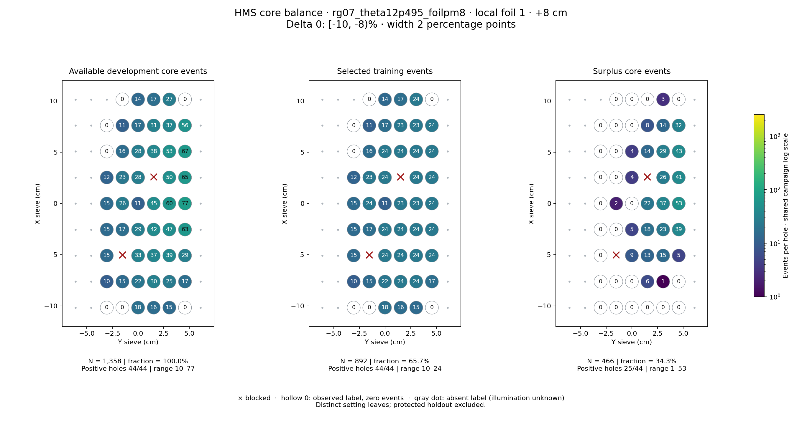
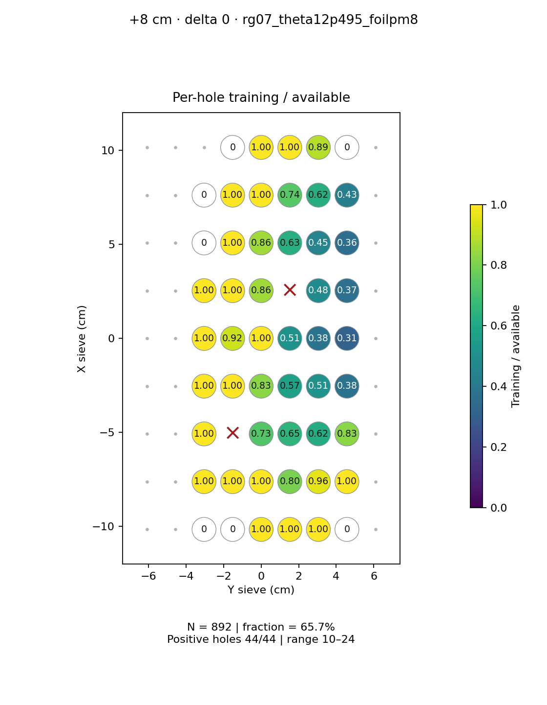
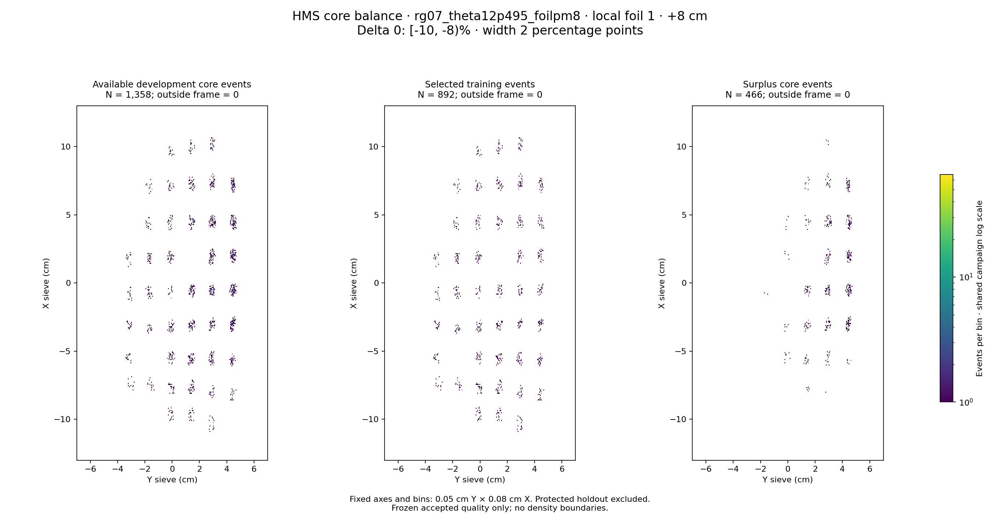

# rg07_theta12p495_foilpm8 · local foil 1 · +8 cm · delta 0

Interval [-10, -8)%, width 2 percentage points.

[Full-resolution training map](../plots/rg07_theta12p495_foilpm8_foil1_delta0_training.png) · [Full-resolution training cloud](../plots/rg07_theta12p495_foilpm8_foil1_delta0_training_cloud.png)

| rungroup | foil | xscol | yscol | available | q_hole | hole_cap | capacity | quota | actual_selected | surplus | qa_low | blocked |
|---|---|---|---|---|---|---|---|---|---|---|---|---|
| rg07_theta12p495_foilpm8 | 1 | 0 | 2 | 0 | 16 | 24 | 0 | 0 | 0 | 0 | False | False |
| rg07_theta12p495_foilpm8 | 1 | 0 | 3 | 0 | 16 | 24 | 0 | 0 | 0 | 0 | False | False |
| rg07_theta12p495_foilpm8 | 1 | 0 | 4 | 18 | 16 | 24 | 18 | 18 | 18 | 0 | False | False |
| rg07_theta12p495_foilpm8 | 1 | 0 | 5 | 16 | 16 | 24 | 16 | 16 | 16 | 0 | False | False |
| rg07_theta12p495_foilpm8 | 1 | 0 | 6 | 15 | 16 | 24 | 15 | 15 | 15 | 0 | False | False |
| rg07_theta12p495_foilpm8 | 1 | 0 | 7 | 0 | 16 | 24 | 0 | 0 | 0 | 0 | False | False |
| rg07_theta12p495_foilpm8 | 1 | 1 | 2 | 10 | 16 | 24 | 10 | 10 | 10 | 0 | False | False |
| rg07_theta12p495_foilpm8 | 1 | 1 | 3 | 15 | 16 | 24 | 15 | 15 | 15 | 0 | False | False |
| rg07_theta12p495_foilpm8 | 1 | 1 | 4 | 22 | 16 | 24 | 22 | 22 | 22 | 0 | False | False |
| rg07_theta12p495_foilpm8 | 1 | 1 | 5 | 30 | 16 | 24 | 24 | 24 | 24 | 6 | False | False |
| rg07_theta12p495_foilpm8 | 1 | 1 | 6 | 25 | 16 | 24 | 24 | 24 | 24 | 1 | False | False |
| rg07_theta12p495_foilpm8 | 1 | 1 | 7 | 17 | 16 | 24 | 17 | 17 | 17 | 0 | False | False |
| rg07_theta12p495_foilpm8 | 1 | 2 | 2 | 15 | 16 | 24 | 15 | 15 | 15 | 0 | False | False |
| rg07_theta12p495_foilpm8 | 1 | 2 | 3 | 0 | 16 | 24 | 0 | 0 | 0 | 0 | False | True |
| rg07_theta12p495_foilpm8 | 1 | 2 | 4 | 33 | 16 | 24 | 24 | 24 | 24 | 9 | False | False |
| rg07_theta12p495_foilpm8 | 1 | 2 | 5 | 37 | 16 | 24 | 24 | 24 | 24 | 13 | False | False |
| rg07_theta12p495_foilpm8 | 1 | 2 | 6 | 39 | 16 | 24 | 24 | 24 | 24 | 15 | False | False |
| rg07_theta12p495_foilpm8 | 1 | 2 | 7 | 29 | 16 | 24 | 24 | 24 | 24 | 5 | False | False |
| rg07_theta12p495_foilpm8 | 1 | 3 | 2 | 15 | 16 | 24 | 15 | 15 | 15 | 0 | False | False |
| rg07_theta12p495_foilpm8 | 1 | 3 | 3 | 17 | 16 | 24 | 17 | 17 | 17 | 0 | False | False |
| rg07_theta12p495_foilpm8 | 1 | 3 | 4 | 29 | 16 | 24 | 24 | 24 | 24 | 5 | False | False |
| rg07_theta12p495_foilpm8 | 1 | 3 | 5 | 42 | 16 | 24 | 24 | 24 | 24 | 18 | False | False |
| rg07_theta12p495_foilpm8 | 1 | 3 | 6 | 47 | 16 | 24 | 24 | 24 | 24 | 23 | False | False |
| rg07_theta12p495_foilpm8 | 1 | 3 | 7 | 63 | 16 | 24 | 24 | 24 | 24 | 39 | False | False |
| rg07_theta12p495_foilpm8 | 1 | 4 | 2 | 15 | 16 | 24 | 15 | 15 | 15 | 0 | False | False |
| rg07_theta12p495_foilpm8 | 1 | 4 | 3 | 26 | 16 | 24 | 24 | 24 | 24 | 2 | False | False |
| rg07_theta12p495_foilpm8 | 1 | 4 | 4 | 11 | 16 | 24 | 11 | 11 | 11 | 0 | False | False |
| rg07_theta12p495_foilpm8 | 1 | 4 | 5 | 45 | 16 | 24 | 24 | 23 | 23 | 22 | False | False |
| rg07_theta12p495_foilpm8 | 1 | 4 | 6 | 60 | 16 | 24 | 24 | 23 | 23 | 37 | False | False |
| rg07_theta12p495_foilpm8 | 1 | 4 | 7 | 77 | 16 | 24 | 24 | 24 | 24 | 53 | False | False |
| rg07_theta12p495_foilpm8 | 1 | 5 | 2 | 12 | 16 | 24 | 12 | 12 | 12 | 0 | False | False |
| rg07_theta12p495_foilpm8 | 1 | 5 | 3 | 23 | 16 | 24 | 23 | 23 | 23 | 0 | False | False |
| rg07_theta12p495_foilpm8 | 1 | 5 | 4 | 28 | 16 | 24 | 24 | 24 | 24 | 4 | False | False |
| rg07_theta12p495_foilpm8 | 1 | 5 | 5 | 0 | 16 | 24 | 0 | 0 | 0 | 0 | False | True |
| rg07_theta12p495_foilpm8 | 1 | 5 | 6 | 50 | 16 | 24 | 24 | 24 | 24 | 26 | False | False |
| rg07_theta12p495_foilpm8 | 1 | 5 | 7 | 65 | 16 | 24 | 24 | 24 | 24 | 41 | False | False |
| rg07_theta12p495_foilpm8 | 1 | 6 | 2 | 0 | 16 | 24 | 0 | 0 | 0 | 0 | False | False |
| rg07_theta12p495_foilpm8 | 1 | 6 | 3 | 16 | 16 | 24 | 16 | 16 | 16 | 0 | False | False |
| rg07_theta12p495_foilpm8 | 1 | 6 | 4 | 28 | 16 | 24 | 24 | 24 | 24 | 4 | False | False |
| rg07_theta12p495_foilpm8 | 1 | 6 | 5 | 38 | 16 | 24 | 24 | 24 | 24 | 14 | False | False |
| rg07_theta12p495_foilpm8 | 1 | 6 | 6 | 53 | 16 | 24 | 24 | 24 | 24 | 29 | False | False |
| rg07_theta12p495_foilpm8 | 1 | 6 | 7 | 67 | 16 | 24 | 24 | 24 | 24 | 43 | False | False |
| rg07_theta12p495_foilpm8 | 1 | 7 | 2 | 0 | 16 | 24 | 0 | 0 | 0 | 0 | False | False |
| rg07_theta12p495_foilpm8 | 1 | 7 | 3 | 11 | 16 | 24 | 11 | 11 | 11 | 0 | False | False |
| rg07_theta12p495_foilpm8 | 1 | 7 | 4 | 17 | 16 | 24 | 17 | 17 | 17 | 0 | False | False |
| rg07_theta12p495_foilpm8 | 1 | 7 | 5 | 31 | 16 | 24 | 24 | 23 | 23 | 8 | False | False |
| rg07_theta12p495_foilpm8 | 1 | 7 | 6 | 37 | 16 | 24 | 24 | 23 | 23 | 14 | False | False |
| rg07_theta12p495_foilpm8 | 1 | 7 | 7 | 56 | 16 | 24 | 24 | 24 | 24 | 32 | False | False |
| rg07_theta12p495_foilpm8 | 1 | 8 | 3 | 0 | 16 | 24 | 0 | 0 | 0 | 0 | False | False |
| rg07_theta12p495_foilpm8 | 1 | 8 | 4 | 14 | 16 | 24 | 14 | 14 | 14 | 0 | False | False |
| rg07_theta12p495_foilpm8 | 1 | 8 | 5 | 17 | 16 | 24 | 17 | 17 | 17 | 0 | False | False |
| rg07_theta12p495_foilpm8 | 1 | 8 | 6 | 27 | 16 | 24 | 24 | 24 | 24 | 3 | False | False |
| rg07_theta12p495_foilpm8 | 1 | 8 | 7 | 0 | 16 | 24 | 0 | 0 | 0 | 0 | False | False |
