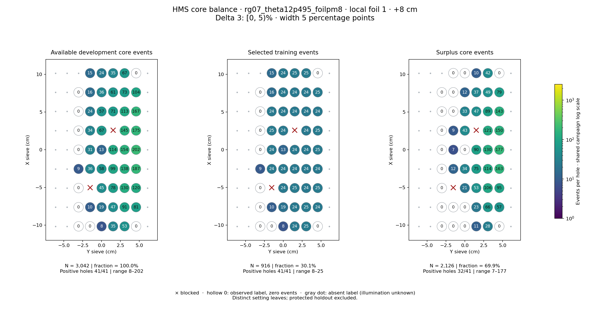
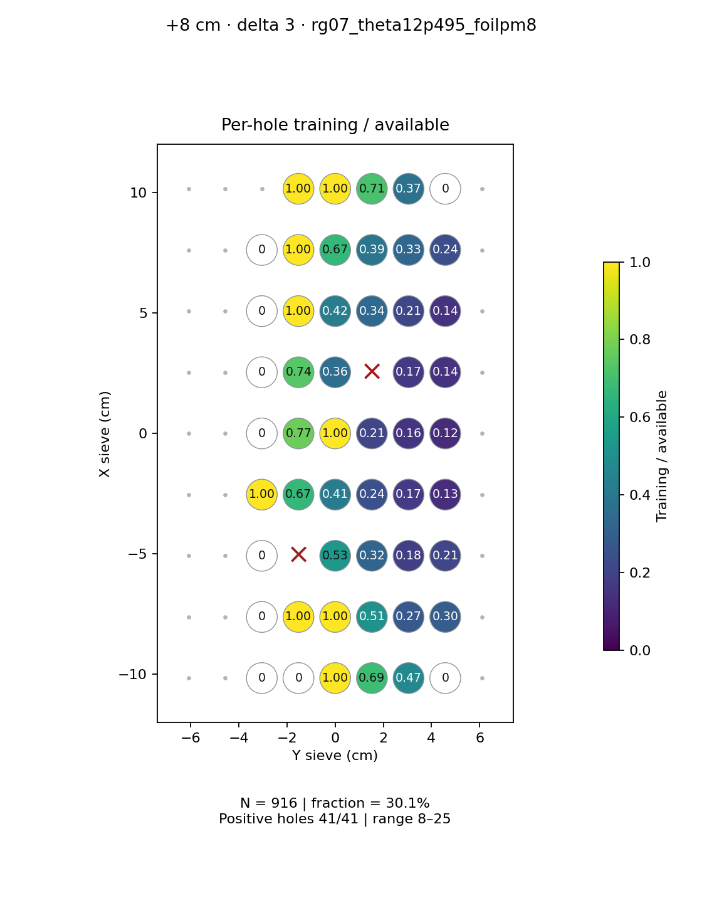
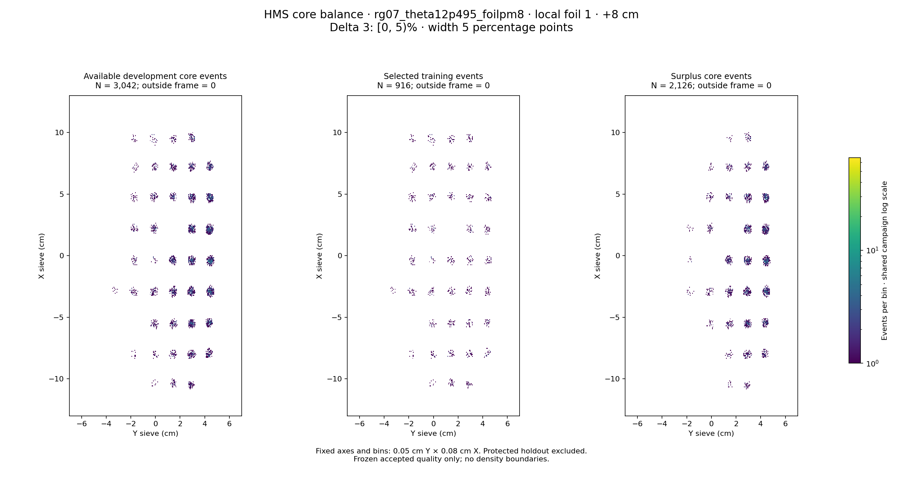

# rg07_theta12p495_foilpm8 · local foil 1 · +8 cm · delta 3

Interval [0, 5)%, width 5 percentage points.

[Full-resolution training map](../plots/rg07_theta12p495_foilpm8_foil1_delta3_training.png) · [Full-resolution training cloud](../plots/rg07_theta12p495_foilpm8_foil1_delta3_training_cloud.png)

| rungroup | foil | xscol | yscol | available | q_hole | hole_cap | capacity | quota | actual_selected | surplus | qa_low | blocked |
|---|---|---|---|---|---|---|---|---|---|---|---|---|
| rg07_theta12p495_foilpm8 | 1 | 0 | 2 | 0 | 34 | 51 | 0 | 0 | 0 | 0 | False | False |
| rg07_theta12p495_foilpm8 | 1 | 0 | 3 | 0 | 34 | 51 | 0 | 0 | 0 | 0 | False | False |
| rg07_theta12p495_foilpm8 | 1 | 0 | 4 | 8 | 34 | 51 | 8 | 8 | 8 | 0 | True | False |
| rg07_theta12p495_foilpm8 | 1 | 0 | 5 | 35 | 34 | 51 | 35 | 24 | 24 | 11 | False | False |
| rg07_theta12p495_foilpm8 | 1 | 0 | 6 | 53 | 34 | 51 | 51 | 25 | 25 | 28 | False | False |
| rg07_theta12p495_foilpm8 | 1 | 0 | 7 | 0 | 34 | 51 | 0 | 0 | 0 | 0 | False | False |
| rg07_theta12p495_foilpm8 | 1 | 1 | 2 | 0 | 34 | 51 | 0 | 0 | 0 | 0 | False | False |
| rg07_theta12p495_foilpm8 | 1 | 1 | 3 | 10 | 34 | 51 | 10 | 10 | 10 | 0 | False | False |
| rg07_theta12p495_foilpm8 | 1 | 1 | 4 | 19 | 34 | 51 | 19 | 19 | 19 | 0 | False | False |
| rg07_theta12p495_foilpm8 | 1 | 1 | 5 | 47 | 34 | 51 | 47 | 24 | 24 | 23 | False | False |
| rg07_theta12p495_foilpm8 | 1 | 1 | 6 | 91 | 34 | 51 | 51 | 25 | 25 | 66 | False | False |
| rg07_theta12p495_foilpm8 | 1 | 1 | 7 | 81 | 34 | 51 | 51 | 24 | 24 | 57 | False | False |
| rg07_theta12p495_foilpm8 | 1 | 2 | 2 | 0 | 34 | 51 | 0 | 0 | 0 | 0 | False | False |
| rg07_theta12p495_foilpm8 | 1 | 2 | 3 | 0 | 34 | 51 | 0 | 0 | 0 | 0 | False | True |
| rg07_theta12p495_foilpm8 | 1 | 2 | 4 | 45 | 34 | 51 | 45 | 24 | 24 | 21 | False | False |
| rg07_theta12p495_foilpm8 | 1 | 2 | 5 | 78 | 34 | 51 | 51 | 25 | 25 | 53 | False | False |
| rg07_theta12p495_foilpm8 | 1 | 2 | 6 | 130 | 34 | 51 | 51 | 24 | 24 | 106 | False | False |
| rg07_theta12p495_foilpm8 | 1 | 2 | 7 | 120 | 34 | 51 | 51 | 25 | 25 | 95 | False | False |
| rg07_theta12p495_foilpm8 | 1 | 3 | 2 | 9 | 34 | 51 | 9 | 9 | 9 | 0 | True | False |
| rg07_theta12p495_foilpm8 | 1 | 3 | 3 | 36 | 34 | 51 | 36 | 24 | 24 | 12 | False | False |
| rg07_theta12p495_foilpm8 | 1 | 3 | 4 | 58 | 34 | 51 | 51 | 24 | 24 | 34 | False | False |
| rg07_theta12p495_foilpm8 | 1 | 3 | 5 | 99 | 34 | 51 | 51 | 24 | 24 | 75 | False | False |
| rg07_theta12p495_foilpm8 | 1 | 3 | 6 | 138 | 34 | 51 | 51 | 24 | 24 | 114 | False | False |
| rg07_theta12p495_foilpm8 | 1 | 3 | 7 | 187 | 34 | 51 | 51 | 24 | 24 | 163 | False | False |
| rg07_theta12p495_foilpm8 | 1 | 4 | 2 | 0 | 34 | 51 | 0 | 0 | 0 | 0 | False | False |
| rg07_theta12p495_foilpm8 | 1 | 4 | 3 | 31 | 34 | 51 | 31 | 24 | 24 | 7 | False | False |
| rg07_theta12p495_foilpm8 | 1 | 4 | 4 | 13 | 34 | 51 | 13 | 13 | 13 | 0 | False | False |
| rg07_theta12p495_foilpm8 | 1 | 4 | 5 | 114 | 34 | 51 | 51 | 24 | 24 | 90 | False | False |
| rg07_theta12p495_foilpm8 | 1 | 4 | 6 | 154 | 34 | 51 | 51 | 24 | 24 | 130 | False | False |
| rg07_theta12p495_foilpm8 | 1 | 4 | 7 | 202 | 34 | 51 | 51 | 25 | 25 | 177 | False | False |
| rg07_theta12p495_foilpm8 | 1 | 5 | 2 | 0 | 34 | 51 | 0 | 0 | 0 | 0 | False | False |
| rg07_theta12p495_foilpm8 | 1 | 5 | 3 | 34 | 34 | 51 | 34 | 25 | 25 | 9 | False | False |
| rg07_theta12p495_foilpm8 | 1 | 5 | 4 | 67 | 34 | 51 | 51 | 24 | 24 | 43 | False | False |
| rg07_theta12p495_foilpm8 | 1 | 5 | 5 | 0 | 34 | 51 | 0 | 0 | 0 | 0 | False | True |
| rg07_theta12p495_foilpm8 | 1 | 5 | 6 | 145 | 34 | 51 | 51 | 24 | 24 | 121 | False | False |
| rg07_theta12p495_foilpm8 | 1 | 5 | 7 | 175 | 34 | 51 | 51 | 25 | 25 | 150 | False | False |
| rg07_theta12p495_foilpm8 | 1 | 6 | 2 | 0 | 34 | 51 | 0 | 0 | 0 | 0 | False | False |
| rg07_theta12p495_foilpm8 | 1 | 6 | 3 | 24 | 34 | 51 | 24 | 24 | 24 | 0 | False | False |
| rg07_theta12p495_foilpm8 | 1 | 6 | 4 | 57 | 34 | 51 | 51 | 24 | 24 | 33 | False | False |
| rg07_theta12p495_foilpm8 | 1 | 6 | 5 | 71 | 34 | 51 | 51 | 24 | 24 | 47 | False | False |
| rg07_theta12p495_foilpm8 | 1 | 6 | 6 | 113 | 34 | 51 | 51 | 24 | 24 | 89 | False | False |
| rg07_theta12p495_foilpm8 | 1 | 6 | 7 | 167 | 34 | 51 | 51 | 24 | 24 | 143 | False | False |
| rg07_theta12p495_foilpm8 | 1 | 7 | 2 | 0 | 34 | 51 | 0 | 0 | 0 | 0 | False | False |
| rg07_theta12p495_foilpm8 | 1 | 7 | 3 | 16 | 34 | 51 | 16 | 16 | 16 | 0 | False | False |
| rg07_theta12p495_foilpm8 | 1 | 7 | 4 | 36 | 34 | 51 | 36 | 24 | 24 | 12 | False | False |
| rg07_theta12p495_foilpm8 | 1 | 7 | 5 | 61 | 34 | 51 | 51 | 24 | 24 | 37 | False | False |
| rg07_theta12p495_foilpm8 | 1 | 7 | 6 | 73 | 34 | 51 | 51 | 24 | 24 | 49 | False | False |
| rg07_theta12p495_foilpm8 | 1 | 7 | 7 | 104 | 34 | 51 | 51 | 25 | 25 | 79 | False | False |
| rg07_theta12p495_foilpm8 | 1 | 8 | 3 | 15 | 34 | 51 | 15 | 15 | 15 | 0 | False | False |
| rg07_theta12p495_foilpm8 | 1 | 8 | 4 | 24 | 34 | 51 | 24 | 24 | 24 | 0 | False | False |
| rg07_theta12p495_foilpm8 | 1 | 8 | 5 | 35 | 34 | 51 | 35 | 25 | 25 | 10 | False | False |
| rg07_theta12p495_foilpm8 | 1 | 8 | 6 | 67 | 34 | 51 | 51 | 25 | 25 | 42 | False | False |
| rg07_theta12p495_foilpm8 | 1 | 8 | 7 | 0 | 34 | 51 | 0 | 0 | 0 | 0 | False | False |
